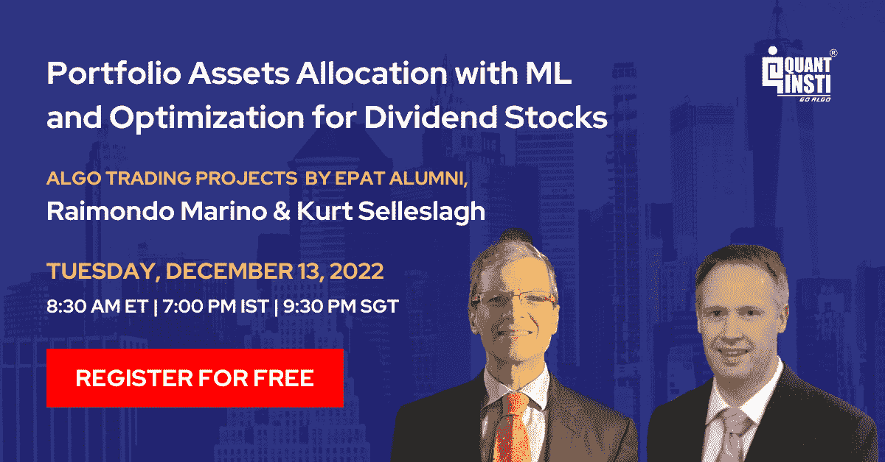
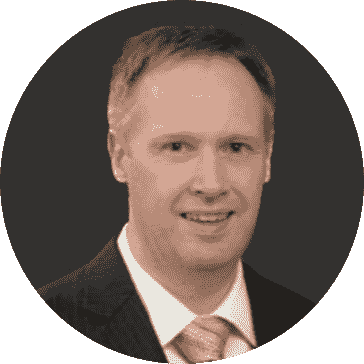
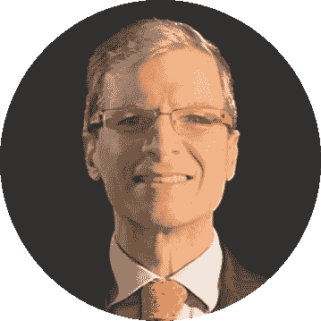

# [ALGO 交易项目]ML 的投资组合资产分配和红利股的优化

> 原文：<https://blog.quantinsti.com/portfolio-assets-allocation-optimization-dividend-stocks-epat-projects-13-december-2022/>

<figure class="kg-card kg-image-card kg-width-wide"></figure>

* * *

**[<input name="Register Free!" type="button" value="Register Free!" style="
  background-color: #92c94a;
  padding: 12px 20px;
  border-radius: 5px;
  color: #fff;
  font-size: 18px;
">](https://www.quantinsti.com/portfolio-assets-allocation-optimization-dividend-stocks-epat-projects-13-december-2022)T4】**

* * *

## 关于演示文稿

我们两位尊敬的 EPAT 校友的 EPAT 项目演讲:来自意大利米兰的 Raimondo Marino 的“组合资产分配:机器学习开发的实用和可扩展框架”和来自新加坡的 Kurt Selleslagh 的“股息股票的组合优化”。

### 项目 1:组合资产分配:机器学习开发的实用和可扩展框架

开发了基于传统和机器学习模型的投资组合分配框架，以设计和评估不同的投资组合技术，如等权重投资组合(EWP)、逆波动性投资组合(IVP)、分级风险平价(HRP)和分级等风险贡献(HERC)。通常情况下，在为不同资产分配权重时，ML 技术优于传统技术，因此，通过更好的多样化提供了更好的表现和更大的风险降低。其想法是设计一个市场中性(长/短)的资产组合，定期进行再平衡，每次再平衡时选择不同的资产。

多空组合再平衡时选择资产的标准是横截面动量策略。然后，使用不同的投资组合技术，对资产领域进行非均衡和标准化的权重分配。这个过程之后是向量化回测，其目标是评估不同技术的性能。

最后，对最佳投资组合进行了蒙特卡洛模拟，以在定期投资组合再平衡期间适当确定投资金额。具体来说，模拟了两个指标:最终财富和最大提款。此外，由于 HRP 和 HERC 是无监督学习领域中的最大似然技术，因此没有参数优化。通过这种方式，我们避免了过度拟合的风险。一切都是通过 python 类完成的，这些类允许从开发环境到生产环境的快速平稳的过渡。用于提高代码效率的另一项技术是使用多处理 python 模块，该模块允许在对数千种不同的参数组合执行回测时使用并行计算(多个 CPU)。

### 项目 2:分红股票的投资组合优化

这个项目将投资组合优化的概念扩展到支付股息的股票。然而，我们不仅要优化净价回报，更重要的是还要优化股息率。

我们寻求实现有吸引力的定期股息收入流(4%或更高)，同时获得正价格回报(投资资本无损失)。

通过最优投资组合选择，我们寻求在股息率和价格回报两方面都跑赢基准指数(或 ETF)的派息股(和 REITS)。

* * *

## 关于演示者

**Kurt Selleslagh(香港交易及结算所有限公司项目经理)**

<figure class="kg-card kg-image-card"></figure>

Kurt 在金融市场拥有超过 27 年的经验。在他的职业生涯中，他曾在香港交易及结算所有限公司、渣打银行、纽约泛欧交易所和菲律宾证券交易所等知名交易所和机构担任过各种职务，如项目经理、业务项目经理、质量保证测试主管、Scrum Master、业务分析师和顾问。

他对金融市场、产品(尤其是衍生品)、资产类别(股票、外汇、大宗商品、利率)、系统和监管环境有着广泛的了解。Kurt 处理前台、电子交易、交易后处理(中台和后台)、风险管理、CCP 清算、场外清算、交易和风险管理的量化方法以及算法交易等领域的精深知识。

Kurt 还在区块链、项目管理、云基础设施、金融工程、Python 编程和算法交易等金融科技领域拥有众多知名认证。他热衷于在金融服务行业推动和交付新的计划，包括基础设施解决方案、新产品、平台实施和流程改进。

**雷蒙多·马里诺(人工智能&大数据工程师-自由职业者)**

<figure class="kg-card kg-image-card"></figure>

雷蒙多·马里诺(Raimondo Marino)是一名职业自由职业者，为意大利中小型公司担任人工智能工程师。通过人工智能应用，他为公司内不同的公司职能部门提供端到端的解决方案(使用云服务从开发到生产):营销、人力资源、销售、生产等。

他还是一个热情的(字面意思是“疯狂的”)量化交易者，相信将机器学习技术与统计和概率结合起来设计卓越交易系统的功效。此前，他在电信行业工作了 20 多年，主要从事业务营销和基础管理。

雷蒙多拥有那不勒斯大学(意大利)电子工程硕士学位、米兰 SDA Bocconi 大学(意大利)工商管理硕士(MBA)学位和哥伦比亚商业高管教育(美国)机器学习和人工智能研究生学位。他 53 岁，已婚，有一个 7 岁的女儿。

* * *

本次活动将于:
*2022 年 12 月 13 日星期二
东部时间上午 8:30 | IST 时间晚上 7:00 |新加坡时间晚上 9:30*

* * *

**[<input name="Register Free!" type="button" value="Register Free!" style="
  background-color: #92c94a;
  padding: 12px 20px;
  border-radius: 5px;
  color: #fff;
  font-size: 18px;
">](https://www.quantinsti.com/portfolio-assets-allocation-optimization-dividend-stocks-epat-projects-13-december-2022)T4】**