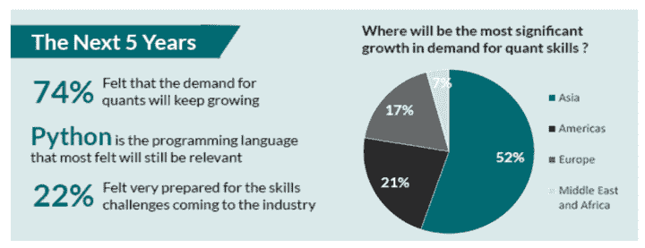

# 一个 Quant 挣多少工资？

> 原文：<https://blog.quantinsti.com/salary-quants-really-earn/>

由[查尼卡·塔卡](https://www.linkedin.com/in/chainika-bahl-thakar-b32971155/)

在美国，一般来说，量化专业人士的薪酬在 13 万美元左右(据 Indeed 的数据)。尽管定量分析师的经验、工作角色和专业知识在决定确切薪水时很重要，但定量分析师通常收入颇丰。这篇博客会让你更深入地了解定量分析师的工资以及他们在哪里工作。

给你一个量化交易影响的例子，Man 集团的 AHL 维度计划是一个在量化交易者帮助下的 51 亿美元的对冲基金。

让我们通过这篇博客了解更多关于定量分析师及其薪酬方面的信息，这篇博客包括:

*   什么是 quant？
*   [关于 quant 工资的一切](#all-about-the-quant-salary)
*   [成为量化交易者的技巧](#skills-for-becoming-a-quant-trader)
*   [quant 的工作职责](#the-job-responsibility-of-a-quant)
*   [quant 在哪里就业？](#where-do-quants-get-employed)
*   [宽客的未来](#future-of-quants)
*   [与算法交易员的坦诚对话](#a-candid-conversation-with-an-algorithmic-trader)

* * *

## 什么是 quant？

简单地说，定量分析师掌握三个领域的知识，即:

*   金融
*   数学
*   编程语言(Python，C++等。)

因此，定量分析师应用数学和统计方法的知识(如数字或量化技术)来解决金融和风险管理问题。quant 应用上述领域的知识来满足任何与交易相关的要求。

例如，为了识别和规避交易某一特定股票的风险，定量分析师将计算风险发生的概率以及所涉及的风险量的可能性。然后，quant 将创建解决方案的计算机算法，以自动方式执行解决方案。

* * *

## 关于定量工资的一切

现在让我们来看看不同地区/国家的定量分析师的平均工资。

| **国家** | **平均基本工资/年** |
| 美国 | $137,475 |
| 印度 | **₹**1600 万 |
| 单位 K | £82,298 |
| 加拿大 | c 74 766 美元 |
| 新加坡 | 122，500 新元 |
| 香港 | 407，920 港元 |
| 澳大利亚 | 115 498 美元 |

请注意，这是根据领先的门户网站(如 Indeed、LinkedIn、Payscale 和 Glassdoor)计算的平均基本工资。

此外，重要的是在这里提到，因为大多数人开始作为新生，他们得到的好处，加入奖金和利润分享，这是不包括在基本工资。因此，实际工资更高。

此外，你的技能越好、越相关，潜在公司雇佣你的机会就越大。成为一名定量分析师需要你的努力，但是从职业的角度来看，结果会更有回报。

因此，即使是业余交易者，你也一定可以爬上梯子，有一天成为专业的量化分析师！

***注:薪资数字可能因公司、角色、经历和其他因素而异。*T3】**

* * *

## 成为量化交易者的技巧

我们刚刚提到了增加你被公司聘为定量分析师机会的相关技能。但是，那些[相关技能](/top-skills-nailing-quant-trader-interview/)是什么呢？

让我们在这里简要地看一下每项技能:

*   编程——要成为量化分析师，你必须掌握编程技能。Python 是最受欢迎的计算机语言，被 quants 使用的最多。
*   概率和统计——交易的一个关键部分是很好的概率和统计知识。基本统计学、时间序列、多元分析等。用于制定战略和风险管理。
*   市场和经济——对市场和经济如何运作的良好了解有助于量化分析师在行业中生存。
*   分析性思维——个人的分析性思维和运用强有力的推理解决问题的能力发挥着重要作用。

因此，这些是成为量化分析师最重要的技能。根据 quant 域中每个角色的工作职责，使用技能。

* * *

## 定量分析师的工作职责

作为一名新生，量化分析师将和其他量化分析师一起在团队中工作，创建交易相关的模型或策略。

通常，量化员的工作职责要求个人执行以下任务:

*   交易庞大的投资组合。
*   分析数百千兆字节的数据，以确定微观行为模式(在微秒时间框架内),并在此类信号下进行交易。
*   同时，在交易时，分析跨时间和跨资产的信息，以构建宏观信号。
*   借助算法创建自动交易信号。
*   交易时进行风险管理。
*   发现并模仿逻辑，从而自动设置交易者每天交易的数百个参数或条件。

但是随着你的晋升，你将能够处理更多的事情。让我们看看量化分析师的各种工作角色，如下所示:

*   初级分析师
*   [量化分析师](/quantitative-analyst/)
*   定量研究分析师
*   高级定量分析师

***注意:工作职责可能因公司、角色、经历和其他因素而异。**T3】*

* * *

## quants 在哪里就业？

这个问题的简单答案就是，量子基金！

在我们开始讨论什么是量化基金之前，有必要提一下，有抱负的个人需要通过[量化面试](https://quantra.quantinsti.com/course/quant-interview-questions-preparation)才能开始做量化基金。

乍一看，你可能会想——量化基金有什么大不了的？

它一定是我们今天拥有的众多选择中的又一个，比如指数基金、共同基金等等。但是深入研究，你会发现量化基金正在缓慢但肯定地在这个行业站稳脚跟。

如果你看看美国市场，两个大牌是文艺复兴科技和两个适马。虽然复兴科技拥有 1300 亿美元的 aum[⁽⁾](https://en.wikipedia.org/wiki/Renaissance_Technologies)(2021 年 4 月)，但据报道，两西格马管理着 580 亿美元的 aum[⁽⁾](https://en.wikipedia.org/wiki/Two_Sigma)(2020 年 1 月)。

因此，在多元化时代，量化基金创造了寻求相对结构化基金的投资者的需求。这也增加了对数量已经很少的定量分析师的需求。

虽然大多数基金公司肯定会将利润分享作为薪酬方案的一部分，但也有无数的量化分析师建立了自己的算法交易平台。

* * *

## 定量分析师的未来

在金融领域，尤其是交易领域，定量分析师受到追捧是有原因的。

过去，手工交易者使用技术分析工具和基本面分析来衡量股票是否值得投资。随着时间的推移，建立了复杂的数学模型来评估交易的盈利能力。

在寻求开发一个避免人类情绪的合理交易策略的过程中，这些模型变得越来越复杂，越来越难以实施。这就是程序员的作用所在，他们为模型开发算法。

随着时间的推移，人们意识到我们不需要三个不同的人来完成这项任务，因为一个训练有素的专业人员可以很容易地单独完成。

展望未来，在未来五年内，据预测，对定量分析师的需求将大幅增长。这可以从下图中看出。

<figure class="kg-card kg-image-card kg-width-full kg-card-hascaption">

<figcaption>Source: [FitchLearning](https://www.fitchlearning.com/rise-demand-quant-professionals-harnessing-new-skills-future)</figcaption>

</figure>

* * *

## 与算法交易员的坦诚对话

让我们看看我们从与一位成功的算法交易者的坦诚对话中获得的有趣而有用的信息。交易员本人的提问和回答如下:

### 如何搭建 algo 艾格书桌？

算法交易是一个过程，使用一套指令以人类不可能的数量和速度下单购买或出售脚本。这组指令基于各种市场指标，如价格、时间、数量和任何其他用户偏好。

algo 交易的好处在于它消除了人工干预，从而使交易没有情绪和直觉。

一个典型的算法系统的架构需要三个主要组件

*   市场数据处理器
*   战略模块
*   订单路由器

顾名思义，市场数据处理器接收市场数据并存储它。数学模型中的交易策略被输入到策略模块。它也是市场和交易者之间的接口。

订单路由器或管理器将订单发送回交易所进行买卖。

要建立一个 [algo desk](/tag/trading-desk-setup/) ，作为一名经纪人，你需要确定你的协同位置，将服务器放在离交易所很近的地方，在对系统进行回溯测试和验证后，将你的策略输入到你的系统中，有一个良好的互联网连接，我认为你可以开始了！

### 你建议进入这个领域的步骤是什么？

嗯，第一步也是最重要的一步是建立一个坚实的基础。学习一些编程技巧，把握市场。擅长数字总是有帮助的。

从探索统计学和计量经济学等核心学科开始。像欧内斯特·陈的《量化交易》或拉里·哈里斯的《交易与交换》这样的书可以详细说明如何建立一个“合适的”算法交易系统。

当你完成了上面提到的步骤后，就开始着手战略建设、建模技术和统计工具。

掌握各种交易策略范例，如统计套利、执行策略、买卖价差。在 [Quantra](https://quantra.quantinsti.com/) 、Udemy 和 Udacity 上有一些免费的在线课程，非常适合试水。对于认真的学习者，还有其他付费的高级课程。

### 哪些是交易者常用的编程语言？

就高频交易(HFT)而言，C++仍然是最受欢迎的语言。原因是与其他语言相比，C++中的内存泄漏和相关错误要少得多。

Python 已经成为编码策略和回溯测试的主要方式，因为它更容易掌握，并且有良好的科学库支持，如 [Numpy](/python-numpy-tutorial-installation-arrays-random-sampling/) 和 [Pandas](/python-pandas-tutorial/) 。

今天，许多论坛讨论用 Python 程序编码的投资和交易策略。

### 散户如何参与算法交易？

与传统的交易终端相比，设置成本肯定是偏高的。获得协同定位可能是一件昂贵的事情。

根据最近的统计数据，华尔街近 70-80%的交易是使用算法执行的，主要是由大型机构投资者和对冲基金执行的。

然而，随着基于网络的平台的出现，零售参与者的情况正在发生变化。对于不太关心延迟的人来说，它非常管用。除此之外，像 Interactive Brokers 这样的公司为零售客户提供 API 和软件包，这样交易者就可以对他们的策略和交易进行编码。

一旦你掌握了它，它就像一个简单的 Gmail 帐户。你登录你的账户，测试你的策略，执行[回溯测试](https://quantra-blueshift.quantinsti.com/)，优化后，在实时市场交易。

也强烈推荐纸上交易或在模拟器上测试。

### 印度算法交易的生态系统如何？考虑到算法交易的利基类别和高技能从业者的参与，公司是否愿意选择算法交易？

SEBI 于 2008 年允许算法交易。在 8 年的时间里，近 50%或更多的交易是基于算法的。这说明了它的受欢迎程度。

印度交易所很好地适应了这种变化，积极参与者稳步增加。fii 和国内基金都使用 Algo 路线下单。

### 交易的未来是什么样子的？

实际上，交易的未来似乎很有希望。很明显，自动化是驱动世界的未来。无论是在哪个领域，自动化正在从传统道路上进行一场结构性转变，这同样适用于股票市场。在美国市场，70-80%的交易量是通过自动化系统进行的。

像印度这样的新兴市场正在见证该领域的指数级增长。当然，市场每天都在成熟，所以交易成本会在某一点后降低。

一个典型的例子是:汽车工业，在引进机器人后，最初人们认为该行业由于资本成本高而难以为继。

### 一个初学者在涉足这个领域时应该记住哪些事情？

最重要的一点是，光有好的交易策略是不够的，还要有竞争优势。

它可以是具有颠覆性的创新想法，也可以是低佣金或你可以进入的那种市场，但如果你想成功，你必须有一个杀手级的提议。像对待任何常规业务一样对待它，你必须制定策略来智胜竞争对手。

对于新手来说，弄清楚这个行业的细微差别是很重要的。

### 如果我想进一步了解这个领域，我下一步应该做什么？

最好的方法是找专家和领域权威来交谈，讨论你的疑惑。尝试互联网上免费提供的工具和资源。做好接受新知识和发展新技能的准备！

这些只是交易者自己回答的几个问题。你怎么想的，你对如何成为一名量化分析师或建立自己的办公桌有什么疑问吗？你可以在下面留言，我们会尽快回复。

* * *

### 结论

成为量化分析师不仅回报丰厚，而且非常有趣，因为量化分析师为高度专业的公司工作，有一些额外津贴。

毫无疑问，量化分析师的成功之旅需要大量的努力和奉献。但是，一旦你进入量化基金或者投行做量化师，职业范围是巨大的！

如果你想了解更多关于 quant 的知识，你必须通过我们的 [algo 交易课程](https://www.quantinsti.com/epat)学习算法交易。你将能够获得成为成功的量化交易者所需的必要技能，如编程、统计、数据分析和建模等。

此外，EPAT 是一个深入的学习经历，因为它是一个成熟的计划，因此，将帮助您学习所需的概念细节。

我们祝您在 quant 之旅中一切顺利！

* * *

*<small>免责声明:股票市场的所有投资和交易都涉及风险。在金融市场进行交易的任何决定，包括股票或期权或其他金融工具的交易，都是个人决定，只能在彻底研究后做出，包括个人风险和财务评估以及在您认为必要的范围内寻求专业帮助。本文提到的交易策略或相关信息仅供参考。</small>T3】*