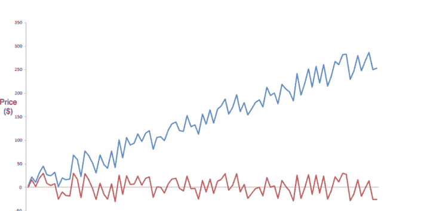
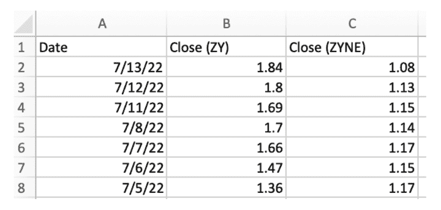
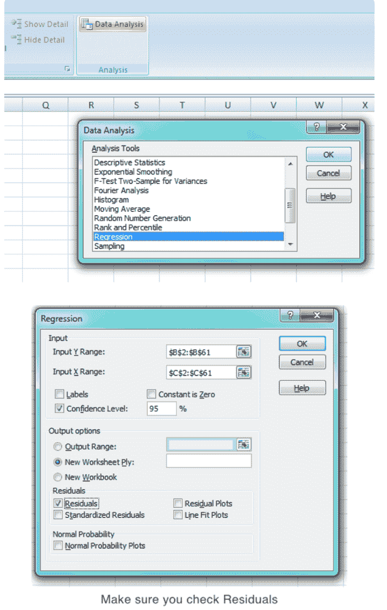
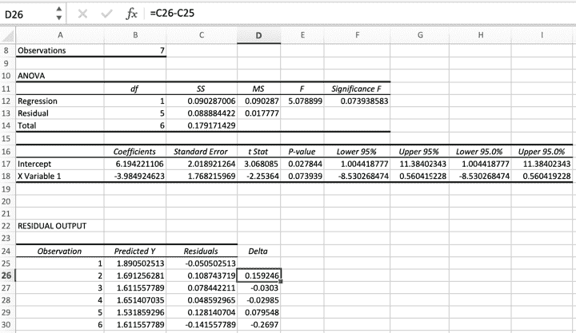
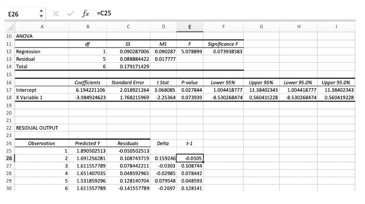
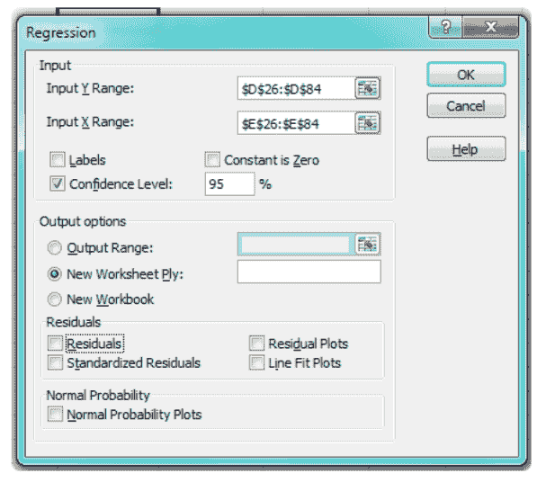
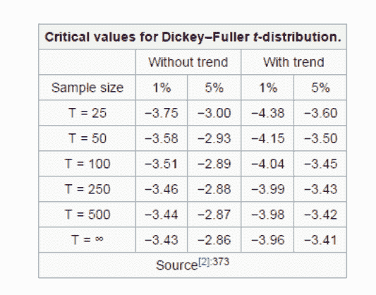
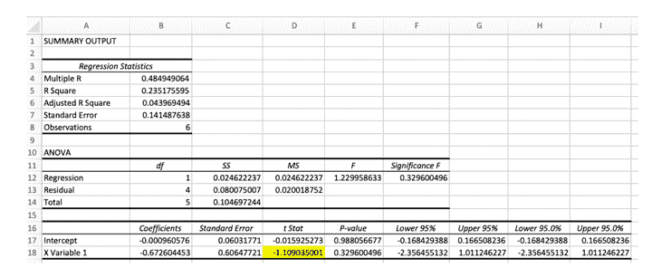

# 配对交易策略的扩展 Dickey Fuller (ADF)检验

> 原文：<https://blog.quantinsti.com/augmented-dickey-fuller-adf-test-for-a-pairs-trading-strategy/>

由[查尼卡·塔卡](https://www.linkedin.com/in/chainika-bahl-thakar-b32971155/)

增强的 Dickey Fuller 测试，用“ADF”表示，用于找出哪些股票可以在 pairs 交易策略中配对。为了使策略有效，重要的是找到一对共同整合的股票。

检验协整的统计计算是用扩展的 Dickey Fuller 检验完成的。在这篇博客中，我们将讨论配对交易策略的 ADF 测试。

本博客涵盖:

*   [什么是配对交易策略？](#what-is-a-pairs-trading-strategy)
*   [扩展的 Dickey Fuller 测试中使用的基本术语](#essential-terms-used-in-the-augmented-dickey-fuller-test)
    *   [平稳时间序列](#stationary-time-series)
    *   [非平稳时间序列](#non-stationary-time-series)
    *   [单位根](#unit-root)
*   [什么是 ADF 测试？](#what-is-adf-testing)
*   [ADF 测试在 pairs 交易中检查什么？](#what-does-the-adf-test-check-in-pairs-trading)
*   [DF 测试和 ADF 测试的区别](#difference-between-df-test-and-adf-test)
*   [增强的迪基富勒测试的工作](#working-of-the-augmented-dickey-fuller-test)
*   [ADF 测试公式](#formula-of-adf-test)
*   [ADF 测试的计算](#calculation-of-adf-test)
*   [使用 Excel 进行 ADF 测试](#adf-test-using-excel)
*   [使用 Python 进行 ADF 测试](#adf-test-using-python)
*   [ADF 测试的优势](#advantages-of-adf-testing)
*   [ADF 测试的缺点](#disadvantages-of-adf-testing)

* * *

## 什么是配对交易策略？

结对交易策略的起源可以追溯到 20 世纪 80 年代初。该策略最初是由著名投资银行和金融公司摩根士丹利的股票市场技术分析师和研究人员制定的。

为了实施[配对交易](/pairs-trading-basics/)策略，你需要技术和统计分析技能。结对交易策略基本上要求两只股票或证券进行协整，这样它们就可以被视为一对进行交易。

因此，正相关是必要的。

在证券显示协整之后，从这一对股票中，你在一只股票中输入多头头寸，在另一只股票中输入空头头寸。头寸基于股票的当前市场价格及其标准差。

* * *

## 扩充的 Dickey Fuller 测试中使用的基本术语

### 平稳时间序列

平稳性是指时间序列的统计特性，即均值、方差和协方差不随时间变化，这意味着时间序列没有单位根。

在平稳性的情况下，交易信号是在假设两只股票的价格最终都将回到均值的情况下产生的。因此，我们可以利用价格在短时间内偏离均值的优势。

### 非平稳时间序列

具有单位根的时间序列是非平稳的，并且其均值、方差和协方差会随时间发生变化。由于时间序列的非平稳性，无法产生交易信号。

下面，您可以看到一个资产图，它是一个具有确定趋势的非平稳时间序列，由**“蓝色”**曲线表示，其去趋势平稳时间序列由**“红色”**曲线表示。

<figure class="kg-card kg-image-card kg-card-hascaption">

<figcaption>Stationary and non stationary</figcaption>

</figure>

### 单位根

单位根是时间序列的一个特征，它使时间序列成为非平稳的。从技术上讲，单位根存在于下式中α= 1 的时间序列中。

$$Y_{t} =\alpha y_{t-1} + \beta X_{e} + \epsilon $$

其中，Yt 是时间序列在时间‘t’的值，Xe 是外生变量(单独的解释变量，也是时间序列)。

* * *

## 什么是 ADF 测试？

扩展的迪基-富勒检验(ADF)是对[迪基-富勒](https://quantra.quantinsti.com/glossary/Dickey-Fuller-Test) (DF)单位根的修改。

Dickey-Fuller 使用 T 统计和 F 统计的组合来检测[时间序列](/time-series-analysis/)中单位根的存在。

成对交易中的 ADF 检验用于检查两只股票之间的协整关系(单位根的存在)。

如果时间序列中存在单位根，则意味着时间序列是非平稳的，股票之间不存在协整关系。因此，股票不能一起交易。

或者，如果零假设被拒绝，股票显示协整；这意味着时间序列是平稳的，股票可以交易。

* * *

## ADF 测试在 pairs 交易中检查什么？

在 pairs 交易策略中进行 ADF 测试的主要目的是确保策略中考虑的股票对是否是稳定的。

因此，对于在 pairs 交易策略中交易的股票对，要求时间序列是平稳的。平稳的时间序列可以做出有效而精确的预测。

此外，稳定的时间序列意味着这两只股票是**协整的**，可以通过生成交易信号一起交易。

* * *

## DF 测试和 ADF 测试的区别

以下是迪基-富勒测验和扩展迪基-富勒测验(ADF 测验)的区别。

### 迪基-富勒试验

Dickey-Fuller 检验是一种统计检验，用于确定数据中是否存在单位根，即时间序列是平稳的还是非平稳的。这项测试是由罗伯特·迪基和托马斯·富勒在 1979 年发明的。

### 扩充迪基-富勒试验

扩展的 Dickey-Fuller 检验是标准 Dickey-Fuller 检验的扩展，它也检查时间序列中的平稳性和非平稳性。

与 Dickey Fuller 测试的主要区别在于，扩展的 Dickey Fuller 测试也可以应用于大量的时间序列模型。大型时间序列模型可能更复杂，因此，DF 检验被修改为 ADF 检验。此外，ADF 测试对有缺失值的数据进行测试。

### 要点

*   这两种测试的主要区别在于，ADF 用于更大规模的时间序列模型，这些模型可能更复杂。
*   ADF 测试是 DF 的替代方法，因为即使在数据中有[缺失值](/data-preprocessing/)时也可以使用。

* * *

## 扩展的迪基-富勒试验的工作原理

现在，让我们来看看一个扩展的迪基-富勒试验的工作原理。我们将从假设开始，并推进到计算及其在 Excel 和 Python 中的工作。

### 假设

扩充的 Dickey-Fuller 检验基于两个假设:

1.  零假设表明时间序列中存在一个单位根，并且是非平稳的。
2.  另一个假设是时间序列中不存在单位根，并且是平稳的或趋势平稳的。

* * *

## ADF 检验公式

让我们先来看看迪基富勒测试的公式(这是扩大的迪基富勒测试的起源)，那就是:

$$y_{t} = c + \beta_{t} + \alpha Y_{t-1} + \phi\Delta Y_{t-1} + e_{t}$$

其中，
**yt** =时间 t 时时间序列中的值或 1 个时间序列的滞后
**δyt**=时间(t-1)时序列的第一个差值

现在，我们将看到增强的 Dickey Fuller 测试的公式，它如下:

$$y_{t} = c + \beta_{t} + \alpha Y_{t-1} + \phi\Delta Y_{t-1} + \phi_{2}\Delta Y_{t-2} .. + \phi_{p}\Delta Y_{t-p}$$

您可以看到 ADF 的公式与 DF 的公式相同，唯一的区别是增加了表示更大时间序列的差分项。

* * *

## ADF 测试的计算

该测试最容易通过重写模型来执行:

$$Y_{t} - Y_{t-1} = (\phi1 - 1)Y_{t-1} + \phi2Y_{t-2} + \phi3Y_{t-3} + \varepsilon t$$ $$Y_{t} - Y_{t-1} = (\phi1 - 1)Y_{t-1} + (\phi2 + \phi3)Y_{t-2} + \phi3(Y_{t-3} - Y_{t-2}) + \varepsilon t$$ $$Y_{t} - Y_{t-1} = (\phi1 + \phi2 + \phi3-1) Y_{t-1} + (\phi2 + \phi3)(Y_{t-2} - Y_{t-1}) + \phi 3(Y_{t-3} - Y_{t-2}) + \varepsilon t$$ $$Y_{t} = \pi Y_{t-1} + c_{1} Y_{t-1} + c_{2} Y_{t-2} + \varepsilon t$$

在哪里，

$$\pi = \phi1 + \phi2 + \phi3 - 1 = -\phi(1)$$ $$c_{1} = -(\phi2 + \phi3)$$ $$c_{2} = - \phi3$$

假设(1) = 0 再次对应于

**H0 : π = 0 HA : π < 0**

H0 的 t 检验被称为扩展的迪基-富勒(ADF)检验。

* * *

## 使用 Excel 进行 ADF 测试

让我们在 excel 表格中看到 ADF 测试的一步一步的工作。

### 第一步:获取想要对其执行 ADF 测试的两只股票的数据

在这个例子中，我选择了两只股票 Zymergen Inc(纳斯达克代码:ZY)和 Zynerba Pharmaceuticals Inc(纳斯达克代码:ZYNE ),这两只股票都属于制药行业，都在美国证券交易所“纳斯达克”上市。

另外，我在这里使用的观察值是 60。

请看下图，了解每只股票的收盘价数据是如何在 excel 表格中并排显示的。

<figure class="kg-card kg-image-card kg-width-full kg-card-hascaption">

<figcaption>Data for two stocks</figcaption>

</figure>

### 第二步:使用一组观察值对两只股票进行线性回归

确保您还请求输出残差。

***注意*:** 当在一个 pairs 交易策略中运行这个时，你必须每天运行 ADF 测试，以确保零假设被拒绝(零假设=有一个单位根)。

下面是如何在 excel 表格中完成的。

<figure class="kg-card kg-image-card kg-width-full kg-card-hascaption">

<figcaption>Linear regression on two stocks</figcaption>

</figure>

我们将使用-3.98 的 X 可变系数作为套期保值比率。

### 第三步:计算“Delta”列中残差之间的差值

<figure class="kg-card kg-image-card kg-width-full kg-card-hascaption">

<figcaption>Difference between residual and delta</figcaption>

</figure>

### 步骤 4:计算下一列的 t-1 残差

<figure class="kg-card kg-image-card kg-width-full kg-card-hascaption">

<figcaption>Calculation of t-1 residual</figcaption>

</figure>

### 步骤 5:对 Delta 和 t-1 列执行线性回归

<figure class="kg-card kg-image-card kg-width-full kg-card-hascaption">

<figcaption>Linear regression</figcaption>

</figure>

### 步骤 6:比较 t 检验统计量和临界值

为了拒绝存在单位根的零假设，在这种情况下，t 统计量必须小于临界值。ADF 测试的临界值有自己的分布，下面是一些临界值的快照:

<figure class="kg-card kg-image-card kg-width-full kg-card-hascaption">

<figcaption>Critical values (Source: Wikipedia)</figcaption>

</figure>

<figure class="kg-card kg-image-card kg-width-full kg-card-hascaption">

<figcaption>t-stat</figcaption>

</figure>

*   我们将使用临界值-2.89，因为我们只有不到 100 个观察值
*   t-stat 是-1.109。
*   因此，零假设被拒绝，我们可以说，对的数据是协整的。

* * *

## 使用 Python 进行 ADF 测试

现在，让我们看看如何使用 Python 对与上述相同的股票对进行 ADF 测试。