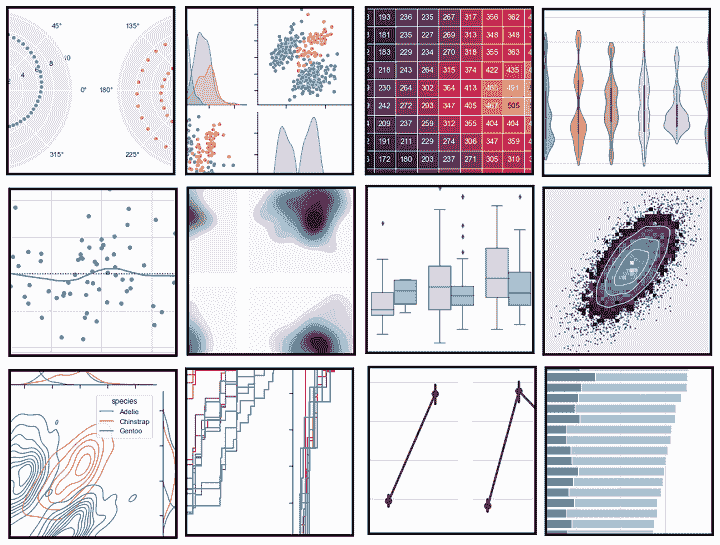
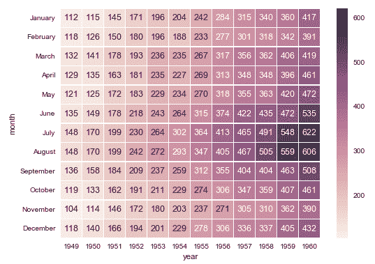

# 使用 Python Seaborn 创建热图

> 原文：<https://blog.quantinsti.com/creating-heatmap-using-python-seaborn/>

由[乌迪莎·阿洛克](https://www.linkedin.com/in/udisha-alok)和[米林德·帕拉德卡](https://www.linkedin.com/in/milind-paradkar-b37292107?authType=NAME_SEARCH&authToken=x7bC&locale=en_US&trk=tyah&trkInfo=clickedVertical%3Amynetwork%2CclickedEntityId%3A451572955%2CauthType%3ANAME_SEARCH%2Cidx%3A1-1-1%2CtarId%3A1482167933077%2Ctas%3Amilind%20paradkar)

在这篇博客中，我们将学习使用 Seaborn Python 包来创建热图，交易者可以用它来跟踪市场。

我们的博客路线图是:

*   [面向 Python 数据可视化的 Seaborn】](#seaborn-for-python-data-visualization)
*   什么是热图？
*   [金融领域热图的使用案例](#use-cases-for-heatmaps-in-finance)
*   [创建热图的逐步 Python 代码](#step-by-step-python-code-for-creating-heatmaps)
    -[显示股票单日价格变化百分比](#display-the-single-day-percentage-price-changes-of-stocks)-[显示股票价格变化之间的相关性](#display-the-correlation-among-the-price-changes-of-stocks)
*   [用于绘制热图的其他 Python 库](#other-python-libraries-for-plotting-heatmaps)

在我们之前的博客中，我们讨论了使用散景的 Python 中的[数据可视化。现在我们把目光转向 Python 中另一个很酷的数据可视化包。](/python-data-visualization-using-bokeh/)

* * *

## 用于 Python 数据可视化的 Seaborn

[Seaborn](http://seaborn.pydata.org/) 是基于 [Matplotlib](/python-matplotlib-tutorial/) 的数据可视化库。它为绘制有吸引力的统计图提供了一个高级接口。

Seaborn 构建在 Matplotlib 之上，其图形可以使用 Matplotlib 工具进一步调整，并使用任何 Matplotlib 后端进行渲染，以生成出版物质量的图形。

可以使用 Seaborn 创建的地块类型包括:

*   分布图
*   回归图
*   分类图
*   矩阵图
*   时间序列图
*   热图

绘图函数对包含整个数据集的 [Python](https://quantra.quantinsti.com/course/python-for-trading) 数据框和数组进行操作，并在内部执行必要的聚合和统计模型拟合以生成信息图。一些例子可以在[这里](http://seaborn.pydata.org/examples/index.html#example-gallery)找到。

<figure class="kg-card kg-image-card kg-width-full kg-card-hascaption">

<figcaption>Source: Seaborn.pydata.org</figcaption>

</figure>

* * *

## 什么是热图？

热图是数据的二维图形表示，矩阵中包含的各个值用颜色表示。

Seaborn 包允许创建带注释的热图，可以根据创建者的要求使用 Matplotlib 工具进行调整。

<figure class="kg-card kg-image-card kg-width-full kg-card-hascaption">

<figcaption>Annotated Heatmap: [Source](http://seaborn.pydata.org/_images/spreadsheet_heatmap.png)</figcaption>

</figure>

* * *

## 金融业热图的使用案例

如前所述，热图是变量的矩阵表示，根据值的强度进行着色。因此，它为比较各种实体提供了一个极好的可视化工具。

它易于创建和定制，解释起来也很直观。因此，在处理金融中的多种资产时，它被广泛使用。

热图提供强大可视化功能的一些重要使用案例包括:

*   比较价格变化、回报等。各种资产
*   检查多只股票之间的相关性

由于热图为我们提供了一种简单的工具来理解两个实体之间的相关性，因此它们可以用于可视化机器学习模型的特征之间的相关性。这可以通过消除高度相关的特征来帮助特征选择。

* * *

## 创建热图的分步 Python 代码

现在让我们看看其中的几个用例，看看我们如何为它们创建 Python 代码。

### 显示股票单日价格变化百分比

我们将为在印度国家证券交易所(NSE)上市的 30 家制药公司的股票创建一个 Seaborn 热图。Seaborn 热图将显示股票代码及其单日价格变化百分比。

我们整理了医药股所需的市场数据，并构建了一个逗号分隔值(CSV)文件，该文件由股票代码及其在 CSV 文件前两列中各自的价格变化百分比组成。

由于我们的列表中有 30 家制药公司，我们将创建一个 6 行 5 列的热图矩阵。此外，我们希望 Seaborn 热图以降序显示股票的价格变化百分比。

为此，我们在 CSV 文件中按降序排列股票，并添加两列来表示热图中每只股票在 X & Y 轴上的位置。

**步骤 1 -导入所需的 Python 包**

我们导入以下 Python 包: