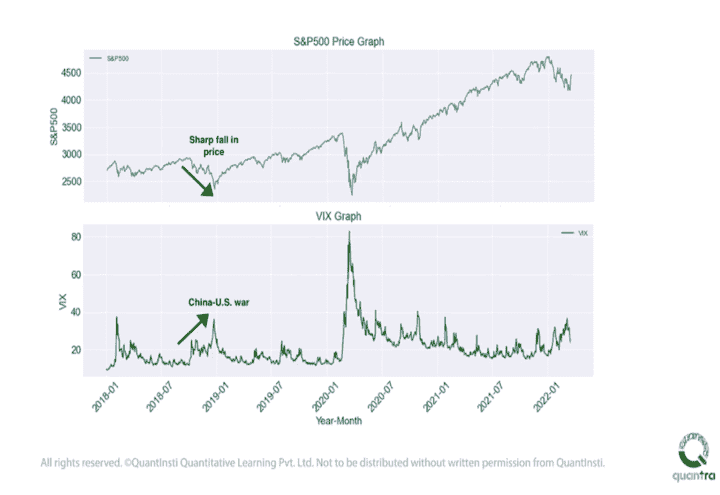
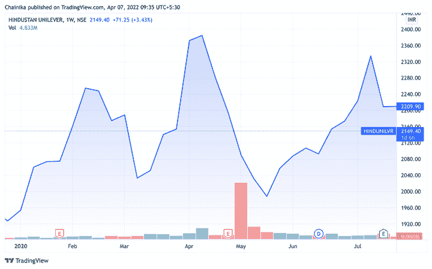
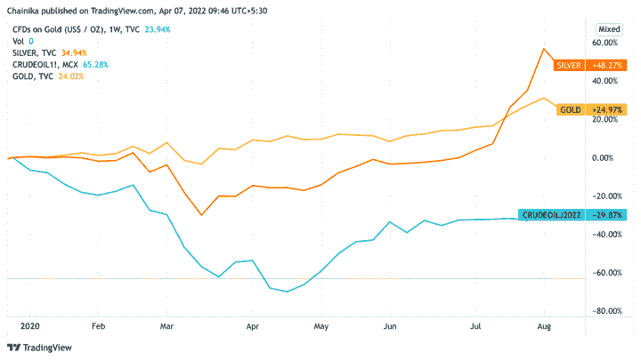

# 危机时期如何交易:类型、计划和策略

> 原文：<https://blog.quantinsti.com/trading-crisis/>

由[查尼卡·塔卡](https://www.linkedin.com/in/chainika-bahl-thakar-b32971155/)

对于金融市场上的任何交易者来说，危机时刻都是艰难的。因为有不同类型的危机，如自然灾害、人为灾害等。在每一种类型中，某一特定行业或一组行业比其他行业受影响更大。

这一点在新冠肺炎时期很明显，因为一些行业，如酒店、航空等。受到了严重的影响。相反，由于对消费品的需求增加，快速消费品做得很好。

让我们通过这篇博客了解更多关于危机时期的交易，因为它涵盖了:

*   什么是危机？
*   [影响金融市场的危机类型](#types-of-crises-that-impact-financial-markets)
*   [过去危机的时间表及其对贸易的影响](#a-timeline-of-crisis-and-their-effect-on-trade-in-the-past)
*   如何为潜在的市场崩盘做准备？
*   在金融危机期间，你如何从交易中获得良好的回报？
*   哪些股票在金融危机中表现出色？
*   为什么黄金能抵御衰退或危机？
*   金融危机期间，大宗商品价格会发生什么变化？

* * *

## 什么是危机？

从全球的角度来看，危机听起来就像是一种严重的情况，影响到很多人、部分、社区、行业等。

地震、海啸等自然灾害。往往会导致危机。然而，过去也有一些人为危机的例子，如大衰退严重打击了世界经济。

* * *

## 影响金融市场的危机类型

让我们看看以下各种类型的危机:

### 天灾

顾名思义，它们是地球自然过程的结果。例如，在卡特里娜飓风(2005 年)期间，股票市场[崩盘](https://www.benzinga.com/analyst-ratings/analyst-color/18/09/12356627/how-the-stock-market-typically-reacts-to-major-hurrican)。

### 技术危机

这是由技术结构故障和/或处理或操作技术/机器的人为错误引起的事件。例如，闪电崩盘(2010 年)的原因之一被认为是美国交易所价格报告中的技术故障。

### 谣言

这些是由个人或团体在社区、国家或全球范围内编造或伪造的事件。这种谣言会对行业产生影响。例如，2013 年 4 月有一个关于美国总统奥巴马先生在白宫爆炸中受伤的谣言。

### 人为的灾难

恐怖袭击等人为灾难也在很大程度上冲击着金融市场。例如，在 9/11 恐怖分子的自杀活动中，恐怖分子撞上了美国的世界贸易中心，造成了如此大的影响，以至于股票市场关闭了一周。

* * *

## 危机时间表及其对过去市场的影响

当任何危机发生时，市场都害怕最坏的情况，股票也随之暴跌。

但历史证明，过一段时间后，乐观情绪会回归，价格会反弹回原来的水平。一旦市场最终开始对基本面因素做出反应，而不是感知到的暂时动荡，危机对市场的影响就开始消退。事后看来，市场似乎经常反应过度，跌幅过大，但随后很快就恢复了。

证明这一点的一些众所周知的事件如下:

*   1929 年华尔街崩盘
*   【1989 年 13 日星期五(小车祸)
*   1987 年黑色星期一
*   [20 世纪 90 年代初的经济衰退](https://en.wikipedia.org/wiki/Early_1990s_recession)
*   [网络泡沫 2000 年](https://en.wikipedia.org/wiki/Dot-com_bubble)
*   [2007-08 年的金融危机](https://en.wikipedia.org/wiki/Financial_crisis_of_2007%E2%80%932008)
*   [2010 年的闪电崩盘](https://en.wikipedia.org/wiki/2010_flash_crash)
*   【2020 年新冠肺炎崩盘

* * *

## 如何为潜在的市场崩盘做准备？

在危机中为有利回报让路的一个方法是，分析波动期是否在意料之中，并提前做好准备。衡量崩盘是否即将来临的一个极其可靠的方法是通过 VIX 波动率指数。

让我们看看下面的例子，VIX 在过去是如何成为波动指标的:

<figure class="kg-card kg-image-card kg-width-full kg-card-hascaption">

<figcaption>VIX indicator during crisis</figcaption>

</figure>

正如你在上面的图像中所看到的，VIX 图表显示了中美贸易战情景下的峰值。与此同时，S&P500 股价图显示其股票价格大幅下跌。

* * *

## 如果市场崩盘即将来临，该怎么办？

金融市场是由基于新闻、推特等的情绪等因素驱动的。当预期市场崩盘时，会给交易者带来恐惧和不确定性。此时，新闻和社交媒体的更新会对交易策略的决策产生巨大的影响。

在为市场崩盘做准备时，一些常用的[策略](https://quantra.quantinsti.com/learning-track/algorithmic-trading-for-quants)是:

### 卖空

卖空股票或卖空股票指数期货是在预期的熊市中获得有利回报的一个好方法。卖空者借入他们并不拥有的股票以便卖出，希望以后以更低的价格买回。

### 选项策略

使用期权策略是为熊市做准备的另一种方式，例如当市场下跌时，买入价值上升的看跌期权，或者卖出价格为零的 T2 看涨期权，以防到期时没有钱。

### 债券和商品市场

[债券](https://quantra.quantinsti.com/glossary/Bond)和[商品市场](/algo-trading-commodity-markets-webinar-13-february-2020/)也可以在预期的熊市场景中使用，因为这两个市场的价格通常会在市场崩溃时上涨。

### 对冲

[对冲](https://quantra.quantinsti.com/glossary/Hedging)是一种旨在抵消潜在损失的投资策略。对冲市场价格风险意味着通过锁定价格来保护自己免受价格不利变动的影响。这是通过在对冲信贷风险的同时，利用对冲合约来对冲你所持有的自然头寸来实现的。

可以使用[衍生产品](https://quantra.quantinsti.com/glossary/Derivative)进行套期保值，因为在大多数情况下，衍生产品与其相应基础产品之间的关系是明确定义的。其他金融工具如保险、[期货合约](https://quantra.quantinsti.com/glossary/Futures)、[掉期](https://quantra.quantinsti.com/glossary/Swap)、[期权](https://quantra.quantinsti.com/glossary/Option)以及多种类型的[场外](https://quantra.quantinsti.com/glossary/OTC-Over-The-Counter)产品被用于对冲。

注意:QuantInsti 不建议遵循任何特定的策略。这些信息完全是为了教育目的。

然而，许多投资者被限制卖空，或者无法进入衍生品市场。即使他们这样做了，他们也可能在情绪上或认知上对卖空有偏见。

此外，如果市场不跌反涨，并发出追加保证金通知，卖空者可能会被迫弥补头寸损失。此外，[交易所交易基金](/exchange-traded-funds/)的股东也对市场进行多空投资。

### 谣言的影响

这里需要注意的是，在危机或动荡时期，最大的风险是谣言。谣言会使你的投资走向错误的方向，因此，损失是不可避免的。

例如，如果媒体描绘了一个错误的场景，你的交易就会被误导。这可能会导致市场崩溃。通过相信消息仅来自可靠来源来减轻此类欺诈或风险是极其重要的。

* * *

## 在金融危机期间，你如何从交易中获得良好的回报？

有几个步骤可以将金融危机对你投资组合的影响降到最低。

### 投资组合多样化

最重要的一步是确保你的投资组合多元化(即分散投资于多个领域，包括股票、债券、现金、房地产、衍生品、贵金属等)。).

你也可以将一小部分储蓄用于更安全的投资，如定期存单和国债。

### 及时分析

据观察，每一次，市场反应过度，下跌太多，然后很快恢复。例如，随着新冠肺炎的影响开始消退，股票(包括酒店、航空等行业。)开始看到复苏。

作为投资者，你不应该因为害怕失去财富而考虑恐慌性抛售。及时的分析可以帮助你做出明智的决定，避免以后以更高的价格回购投资组合。

### 价值投资

同样，价值投资有助于这种情况。价值投资策略主要集中于投资那些交易价格远低于其真实价值的股票。

简而言之，价值投资有助于降低风险，因为我们只在价值股的当前价格远低于其真实价值时投资价值股。这种真实价值和购买价格的差异也被称为“安全边际”。

* * *

推荐阅读:[投资组合&风险管理](/tag/portfolio-risk-management/page/2/)

* * *

## 哪些股票在金融危机中表现出色？

没有人知道最好的股票是什么，但是一些商品如黄金在危机中表现更好。但是，如果你看到我们讨论过的例子，每一次危机都有不同的表现，在每一种情况下哪些股票表现强劲。

例如，在新冠肺炎期间，[快速消费品部门](https://economictimes.indiatimes.com/industry/cons-products/fmcg/with-worst-covid-19-woes-behind-fmcg-sector-optimistic-about-2021/articleshow/79823372.cms)表现良好。因此，这完全取决于金融危机的类型。

让我们看一个印度斯坦联合利华的例子。观察 HINDUNILVR 的价格是如何在新冠肺炎情景中大幅下跌的。以下是 2020 年 3 月至 2020 年 4 月的图表:

<figure class="kg-card kg-image-card kg-width-full kg-card-hascaption">

<figcaption>Trading in crisis - Hindustan Unilever prices</figcaption>

</figure>

上图显示了 HINDUNILVR 最初是如何受到新冠肺炎危机的影响，但随后，其股价加速上涨。

* * *

建议观察:[危机时期应该买股票](https://www.youtube.com/watch?v=QjDPYe6VKBw)

**注意-上面的视频描述了内容所有者的观点。QuantInsti 不建议交易任何特定的股票。**

* * *

## 为什么黄金被认为是抗衰退或抗危机的？

黄金是一种通常被认为不受经济衰退影响的商品。这是因为:

*   黄金是一种在危机情况下可以从一个国家转移到另一个国家的商品。因此，黄金的价值可以从一种货币转换成另一种货币。
*   据观察，在经济衰退期间，当股市崩盘时，黄金价格通常会上涨。由于黄金的价值增加，这表明黄金具有负贝塔值，这意味着黄金价值与股票指数相反。

* * *

## 金融危机期间，大宗商品价格会发生什么变化？

对商品价格的影响的结果是不确定的，但取决于形势或危机类型。例如，在原油和白银价格上涨的战争场景中，油价会全面上涨。

让我们借助乌克兰-俄罗斯战争场景中的一个例子来找出同样的答案。以下是原油、白银和黄金这三种商品的价格状况:

<figure class="kg-card kg-image-card kg-width-full kg-card-hascaption">

<figcaption>Commodities' prices during Ukraine-Russia war</figcaption>

</figure>

上图显示了三种商品的价格都处于历史最高水平。相比之下，原油价格正处于顶峰，而黄金和白银的价格趋势却没有那么高。因此，可以看出，商品价格上涨，但崩溃最初发生。

让我们看看另一个时间线，即新冠肺炎疫情。在这种情况下，价格也是先降后升。在这个时间线上，与黄金和原油相比，白银的价格更高。让我们看看当时的图表是什么样的:

<figure class="kg-card kg-image-card kg-width-full kg-card-hascaption">

<figcaption>Commodities' prices during COVID-19</figcaption>

</figure>

* * *

### 结论

危机时刻可能充满情绪，比如对交易者的恐惧。这种情绪会影响交易策略，但是，如果危机从一开始就被预测和计划好，情况会好得多。

在这篇博客中，我们讨论了危机对金融市场的影响，以及如何提前做好准备。在危机期间，交易最重要的一步是始终检查可靠的来源，以了解金融市场的实际情况。

如果你想为危机时刻做好准备，建议你也开始学习算法交易。与金融市场中的手工交易相比，这种当代实践可以让你保持领先。你可以利用算法在危机中保持你的决定不带任何情绪。此外，与人工交易相比，算法为你提供了更快速、更可靠的行动。

* * *

*<small>免责声明:股票市场的所有投资和交易都涉及风险。在金融市场进行交易的任何决定，包括股票或期权或其他金融工具的交易，都是个人决定，只能在彻底研究后做出，包括个人风险和财务评估以及在您认为必要的范围内寻求专业帮助。本文提到的交易策略或相关信息仅供参考。</small>T3】*