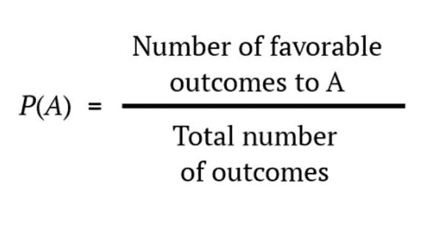

# 交易概率

> 原文：<https://blog.quantinsti.com/probability-trading/>

由巴维卡·巴拉尼

交易中有可能用到概率吗？怎么会有人这么做？这个全面的指南为你提供了概率概念及其在交易中的应用的深入知识。通过各种例子，它讨论了概率，并解释了为什么你需要有一个关于它如何工作的好主意。

本文分为以下几个部分:

*   [什么是概率？](#what-is-probability)
*   [概率公式](#probability-formula)
*   [概率的应用](#application-of-probability)
*   [概率的两个性质](#two-properties-of-probability)
*   [概率的类型](#types-of-probability)
    *   [主观概率](#subjective-probability)
    *   [客观概率](#objective-probability)
*   什么是概率分布？
    *   [离散随机变量的离散概率分布](#discrete-probability-distribution-for-discrete-random-variables)
    *   [连续随机变量的概率分布](#probability-distribution-for-continuous-random-variables)
    *   [使用 Python 的正态分布](#normal-distribution-using-python)

* * *

## 概率是什么？

概率是对包含不确定因素的事件和结果的研究。举个例子，抛硬币涉及到不确定性，投资股市也是如此。

概率是一种工具，你可以用它来处理这种不确定性，做出更好的投资决策。收益公布后，股票价格有相当大的波动。

如果你知道股票价格上涨或下跌的概率，那不是更好吗？
你可以做出更好的决定，你从交易中获利的机会也会增加。

例如，Snapchat 股票在财报公布后上涨的概率是 80%，下跌的概率是 20%。所以，如果你买了这只股票，有 80%的概率你会盈利，有 20%的概率你会亏损。有了这些信息，你会更有信心购买股票，因为你有优势。

现在我们了解了什么是概率，以及它如何帮助你做出更好的决定。这个概率怎么算？

* * *

## 概率公式

你让 100 名分析师就他们对 Snapchat 股价走势的分析进行投票。

*   100 位分析师中有 80 位认为价格会上涨，20 位认为价格会下跌。
*   所以，如果 A 是股价上涨的事件，那么事件 A 的概率是 80/100，即 0.8 或 80%。

任何事件 A 的概率通过以下公式计算:

<figure class="kg-card kg-image-card"></figure>

* * *

## 概率的应用

当你想到概率的应用时，你首先想到的是什么？很可能你的第一个想法是抛硬币或掷骰子。让我们不要仅仅局限于这些事件。

当太阳从东方升起，在西方落下时，有些事情总是会发生。这种情况每天都有 100%的可能性发生，或者我们可以说这是一个特定的事件。

如果不确定性出现了怎么办？

比方说，你想打赌巴塞罗那和皇家马德里的下一场比赛哪个队会赢。

*   因为两个队都很强，你不确定该赌哪个队
*   您已经了解到比赛将在巴塞罗那的主场进行
*   巴塞罗那队赢得主场比赛的可能性更大。

现在，你会赌哪个队？可能是巴塞罗那，如果你不偏向任何球队的话。这是一个你可以利用概率做出更好决策的例子。

* * *

## 概率的两个性质

当您计算任何事件的概率时，您必须确保计算的概率满足两个属性，这两个属性共同构成了它的定义:

A)任何事件发生的概率 A 是一个介于 0 和 1 之间的数，即 0 ≤ P(A) ≤ 1。
0 表示不可能发生的事件，如在六面骰子上掷出 7，1 表示该事件一定会发生，如太阳从东方升起。

b)任何一组互斥且穷尽的事件的概率之和等于 1。

你可能想知道，什么是互斥和穷举事件？

让我们举一个例子，在受推特影响的市场情绪发生变化后，特斯拉股票的价格发生了变化。在一个时间点上有三种可能的结果。价格要么会上涨，要么会下降，要么会保持不变，这些事件不可能同时发生。

这种事件称为互斥事件。当所有可能的结果都包括在内，并且你没有错过任何事件发生的可能性，那么这样的事件被称为穷举事件。

因此，如果价格上涨的概率是 0.9 或 90%，价格下跌的概率是 0.06 或 6%，价格保持不变的概率是 0.04 或 4%，那么您可以观察到这些概率位于 0 和 1 之间，所有概率之和等于 1。

* * *

## 概率的类型

既然我们已经了解了什么是概率以及它是如何计算的，那么让我们来深入研究不同类型的概率。理解这一点很重要，因为它可以帮助你做出自己的决定。

概率可以大致分为两类:

*   主观概率
*   客观概率

### 主观概率

主观概率是一种基于个人或主观判断的概率。因人而异。

例如，在 2008 年金融危机期间，没有多少人押注房地产市场下跌。但是那些这样做的人，在全球经济遭受损失的时候，却从中获得了巨大的利润。

预测撞车的人的观点是主观的，这一事件发生的概率因人而异。

### 客观概率

另一方面，客观概率不会因人而异。可以通过实验和观察来计算。

估计事件发生概率的最常见方法之一是通过分析历史数据，因为我们倾向于相信过去发生的事情将在未来继续发生。

让我们借助苹果股票的假设场景来理解这一点。

您已经观察到，每年新 iPhone 发布后，苹果股票价格都会上涨。因此，今年价格也很有可能上涨。

这就是所谓的客观概率，因为它是通过历史分析和观察推导出来的，而不是你个人的偏见和意见。

推断只有几种可能结果的事件的概率似乎很容易，对吗？但是如果一个事件有 100 种可能的结果呢？

在这种情况下，很难做出任何推论，也很难在现实生活中运用这些推论做出实质性的决定。

概率分布解决了这个问题。随着实验和场景变得越来越复杂，使用发行版是一种有效的解决方案。

* * *

## 什么是概率分布？

概率分布是一种统计函数，它描述了随机变量在给定范围内的所有可能值和可能性。

让我们用一个例子来分解这个定义。你想记录亚马逊股票 100 天的日收益。这里，随机变量是日收益率。范围从 0 到 100 天不等。

您以表格形式记录回报。通过分布，你可以分析股票的平均回报，以及回报与平均回报的分散程度。当你想知道所有可能的结果，以及哪种结果最有可能发生时，这是很有用的。

从统计学上来说，我们用 x 这样的随机变量来表示，这个随机变量取 x 的特定值的可能性用 p(x)来表示。

你需要知道随机变量的类型，这样你才能更好地分析你的数据集。随机变量的类型决定了概率分布。

有两种类型的随机变量:

*   离散随机变量
*   连续随机变量

让我们了解每种类型的概率分布:

### 离散随机变量的离散概率分布

当你抛硬币或做出买卖或持有股票的交易决定时，你的答案是离散值。这两个是离散分布的例子，因为没有中间值。

假设你想计算连续两天市场上涨或下跌的概率，假设每天市场上涨或下跌的概率相等。为了简单起见，我们将忽略没有变化的可能性。

您将获得以下一组结果。这里，“R”表示上升，“F”表示下降。

| **结果** | **可能的组合** | **概率** |
| 1 上升 | 乡邮投递路线 | ¼ = 0.25 |
| 一升一降 | 射频或射频 | = 0.5 |
| 2 跌倒 | 消防 | ¼ = 0.25 |

我们有四种可能的结果。大盘连续 2 天上涨，这是四种可能结果中的一种。所以这个事件的概率是 or 0.25。同样，我们可以计算出大盘连续两天下跌的概率。

下一个可能的结果是，市场第一天下跌，第二天上涨，反之亦然。这产生了两种可能的结果。这个事件的概率是 2/4 或者 0.5。

因此，对于该事件，离散值创建了离散概率分布。

### 连续随机变量的概率分布

当一只股票的回报在一个特定的范围内发生变化时，在两个值之间有无限多的其他有效值。这是因为精确的测量可以达到任何小数值。例如，一只股票的收益是一个连续的随机变量。

### 使用 Python 的正态分布

我们以亚马逊股票为例。可以从[雅虎财经](https://finance.yahoo.com/quote/AMZN?p=AMZN&.tsrc=fin-srch)下载历史数据。对于我们的数据集，我们将使用 python 中的以下代码。