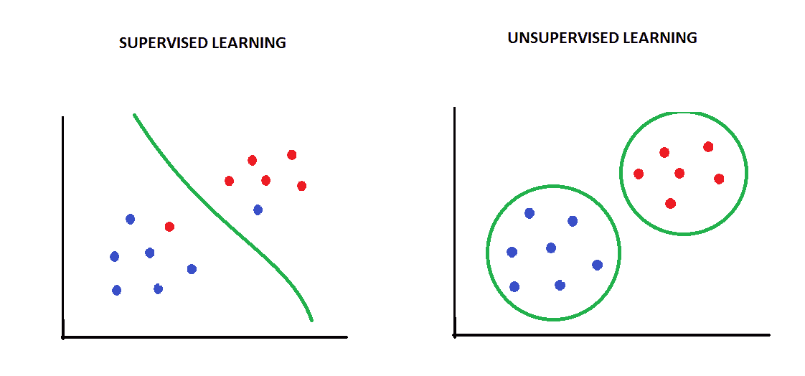

# 交易的无监督学习介绍

> 原文：<https://blog.quantinsti.com/unsupervised-learning/>

由阿舒托什·戴夫

在之前的博客中，我们详细研究了线性回归等监督学习算法。在这篇博客中，我们来看看什么是无监督学习，以及它与有监督学习有何不同。

然后，我们继续讨论投资和交易中无监督学习的一些用例。我们特别探索了两种无监督的技术——k-means 聚类和 PCA，并给出了 Python 中的例子。

**内容**

*   [什么是无监督学习？](#what-is-unsupervised-learning)
*   [监督与非监督学习](#supervised-vs-unsupervised-learning)
*   [我们什么时候使用无监督算法？](#when-do-we-use-unsupervised-algorithms)
*   [聚类算法](#clustering-algorithms)
*   [聚类的概念](#concept-of-clustering)
*   [K 均值聚类算法](#k-means-clustering-algorithm)
*   [降维](#dimensionality-reduction)
*   [降维概念](#concept-of-dimensionality-reduction)
*   [主成分分析](#principal-component-analysis)
*   [其他类型的无监督算法](#other-types-of-unsupervised-algorithms)
*   [无监督学习的挑战](#challenges-in-unsupervised-learning)

* * *

## 什么是无监督学习？

<figure class="kg-card kg-image-card"></figure>

顾名思义，“无人监督”的学习发生在没有监督者或老师，学习者自己学习的时候。

例如，想象一个孩子第一次看到并品尝一个苹果。她记录水果的颜色、质地、味道和气味。下一次她看到一个苹果时，她知道这个和前一个苹果是相似的物体，因为它们具有非常相似的特征。

她知道这和橘子很不一样。但是，她仍然不知道它在人类语言中被称为什么，即“苹果”,因为没有标签的知识。

这种学习中标签不存在(在没有老师的情况下)，但学习者仍然可以自己学习模式，这种学习被称为无监督学习。

在[机器学习算法](/trading-using-machine-learning-python/)的背景下，当算法从没有任何相关响应的简单示例中学习并自行确定数据模式时，就会发生无监督学习。

在下一节中，我们将讨论这种类型的学习与机器学习中另一种类型的流行学习算法(即监督学习算法)有何不同。

* * *

## 监督与非监督学习

顾名思义，监督学习中的学习是在监督下进行的，即当算法从训练数据中预测样本值时，它会被告知该预测是否正确。

这是可能的，因为我们将正确的值存储为“标签”/“目标变量”，这些值将与输入数据一起传递给算法。常见的监督学习任务是分类和[回归](https://quantra.quantinsti.com/course/trading-with-machine-learning-regression)的任务。

在分类任务中，标签是样本所属的正确类别，而在回归中，因变量(Y)的实际值用作比较预测的基准。然后，该算法可以调整其参数，以实现更高的预测精度。

因此，监督学习的主要目标是建立一个稳健的预测模型。

另一方面，在无监督学习中，我们只传递输入数据，没有标签。无监督模型寻求发现数据中潜在的或隐藏的结构或分布，以便了解更多关于数据的信息。

换句话说，无监督学习是指我们只有输入数据，没有相应的输出变量，主要目标是从输入数据本身学习更多或发现新的见解。

无监督算法的一个常见示例是聚类算法，它根据机器检测到的模式对数据进行分组。

例如，让我们考虑这样一种情况，其中我们有一些基于两个输入特征 X1 和 X2 的数据点。

*   如果我们希望我们的算法将数据分类/归类到两个已知的类别，我们将使用监督的[分类算法](https://quantra.quantinsti.com/course/trading-machine-learning-classification-svm)。
*   另一方面，如果我们希望算法告诉我们数据是如何构造的，我们将使用无监督聚类算法。

<figure class="kg-card kg-image-card kg-width-full"></figure>

* * *

## 我们什么时候使用无监督算法？

无监督学习在以下条件下使用:

*   我们没有产出/目标数据。
*   我们并不确切知道我们在寻找什么，而是希望机器在数据中发现模式/见解。机器发现的见解可以用来解决各种挑战。
*   我们希望从数据中只过滤出必要的信息(与原始数据相比，它的维度更低)，并使用它来训练监督学习模型。

在接下来的两节中，我们将看看两种流行的无监督算法，即聚类和维数约简，它们在这些情况下对我们有所帮助。

* * *

## 聚类算法

### 聚类的概念

聚类是无监督学习领域中最流行的任务之一。这里，基本的假设是相似的数据点倾向于属于相似的组(称为聚类)，这由它们与局部质心的距离来确定。

因此，聚类使我们能够找到并分析有机形成的组，即基于数据本身，而不是在查看数据之前定义组。

有不同的聚类算法，如 K-means 聚类、[层次聚类](/hierarchical-clustering-python/)、DBSCAN、OPTICS 等。，它根据自己对数据点之间相似性的定义对数据进行分组。

在下一小节中，我们将看一个 K-means 聚类的例子，这是一种广泛使用的聚类算法。它创建了“K”个相似的数据点聚类。

### k-均值聚类算法

当我们有未标记的数据(即，没有定义的类别或组的数据)时，使用 K-means 聚类。该算法在数据中查找组/聚类，组的数量由变量“k”表示(因此得名)。

该算法迭代地工作，以基于所提供特征的相似性将每个观察值分配给 k 个组中的一个。

K-means 算法的输入是数据/特征(Xis)和“K”值(要形成的聚类数)。

的步骤可以概括为:

*   该算法从随机选择“K”个数据点作为“质心”开始，其中每个质心定义一个聚类。
*   在该步骤中，每个数据点被分配给由质心定义的聚类，使得该数据点和该聚类的质心之间的距离最小。
*   在这一步中，通过取上一步中分配给该聚类的所有数据点的平均值来重新计算质心。

该算法在步骤(ii)和(iii)之间迭代，直到满足停止标准，例如达到预定义的最大迭代次数或者数据点停止改变聚类。

### 使用 Python 代码进行交易或投资的 K 均值聚类示例

通常，交易者和投资者希望根据某些特征的相似性对股票进行分组。

例如，希望进行配对交易策略交易的交易者，在该策略中，她同时持有两只相似股票的多头和空头头寸，理想情况下，她希望浏览所有股票，并找到在行业、部门、市值、波动性或任何其他特征方面彼此相似的股票。

现在考虑一个场景，一个交易者基于两个特征对 12 家美国公司的股票进行分组/聚类:

*   股本回报率(ROE) =净收入/股东权益总额，以及
*   股票的贝塔系数

投资者和交易者使用净资产收益率来衡量公司相对于股东权益的盈利能力。高净资产收益率当然是投资一家公司的首选。另一方面，贝塔系数代表股票相对于整个市场(由标准普尔 500 或 DJIA 等指数代表)的波动性。

手动检查每一只股票，然后进行分组是一个繁琐而耗时的过程。相反，可以使用聚类算法，如 k-means 聚类算法，根据一组给定的特征对股票进行分组/聚类。

下面我们用 Python 实现一个 K-means 算法对这些股票进行聚类。我们首先使用以下命令导入必要的库并获取所需的数据: