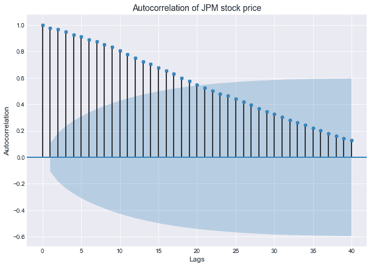
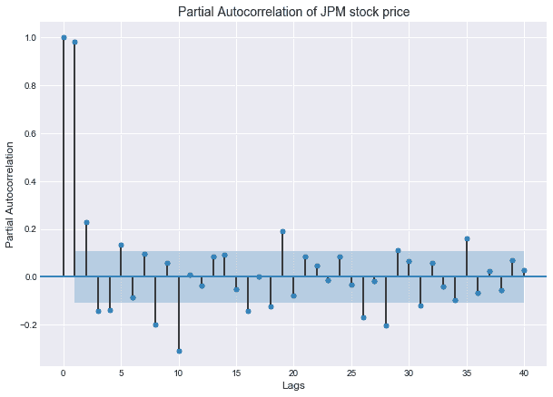
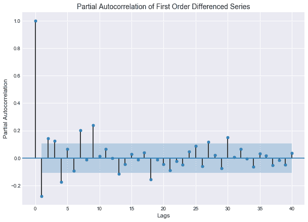

# 自回归:模型、自相关和 Python 实现

> 原文：<https://blog.quantinsti.com/autoregression/>

由[萨特雅普里雅·乔德里](https://www.linkedin.com/in/satyapriya-chaudhari-73976b16a/)

时间序列建模是预测基于时间的数据的未来值的一个非常强大的工具。基于时间的数据是在不同时间戳(时间间隔)观察到的数据，称为时间序列。这些时间间隔可以是规则的，也可以是不规则的。基于模式、趋势等。在过去的数据中观察到，时间序列模型预测下一个时间段的值。

时间序列模型根据过去的数据分析和训练模型，以做出未来的预测。有许多时间序列模型可用于进行这些预测。在本文中，您将了解一个这样的模型，自回归模型或 AR 模型。

涵盖了以下主题:

*   [自回归模型](#autoregression-model)
*   [2 阶自回归模型和推广到 p 阶的模型](#autoregression-models-of-order-p)
*   [自相关&偏自相关](#autocorrelation-partial-autocorrelation)
*   [自相关函数(ACF)图&偏自相关函数(PACF)图](#autocorrelation-function-acf-plot-partial-autocorrelation-function-pacf-plot)
*   [用 Python 可视化 ACF 图和 PACF 图](#visualising-acf-plot-and-pacf-plot-in-python)
*   [自回归模型的局限性](#limitations-of-autoregression-models)
*   [自回归模型的 Python 实现](#python-implementation-of-autoregression-models)

* * *

## 自回归模型

在学习什么是自回归之前，我们先回忆一下什么是回归模型。

回归模型是一种统计技术，用于估计因变量(y)和自变量(X)之间的关系。因此，在使用回归模型时，您需要处理两个变量。

例如，你有美洲银行(简称 BAC)的股价和摩根大通(简称 JPM)的股价。

*   现在你想根据 BAC 的股票价格来预测 JPM 的股票价格。
*   这里，JPM 的股票价格将成为因变量，y 和 BAC 的股票价格将成为自变量 x
*   假设 X 和 Y 之间存在线性关系，估计 X 和 Y 之间关系的回归模型具有以下形式

$$y = mX + c$$

其中 m 是方程的斜率，c 是常数。

现在，让我们假设你只有一系列数据，比如说，JPM 的股票价格。代替使用第二个时间序列(BAC 的股票价格)，JPM 的股票价格的当前值将基于 JPM 的过去股票价格来估计。设任意时间点 t 的观测值记为 y <sub>t</sub> 。你可以用下面的回归模型估计任意点 t，y <sub>t</sub> 的值和任意点(t-1)，y <sub>t-1</sub> 的值之间的关系。

$$AR (1) = y_t = 𝚽_1y_{t-1}+c$$

其中𝚽 <sub>1</sub> 是模型的参数，c 是常数。这是一阶自回归模型。术语“自回归”是指一个变量对其过去值的回归。

和线性回归模型一样，自回归模型假设 y <sub>t</sub> 和 y <sub>t-1</sub> 之间存在线性关系。这被称为**自相关**。稍后，您将会了解到更多这方面的内容。

让我们看看自回归模型的其他阶。

* * *

## p 阶自回归模型

在上面的例子中，您看到了 y <sub>t</sub> 的值是如何使用一个过去的值(滞后项)y <sub>t-1</sub> 来估计的。您可以使用多个过去的项来预测时间 t 的值。让我们看看当模型中使用两个滞后值时模型的形式。

$ $ ar(2)= y _ t = 𝚽_1y_{t-1}+ 𝚽_2y_{t-2}+c$$

其中𝚽 <sub>1</sub> 和𝚽 <sub>2</sub> 是模型的参数，c 是常数。这是二阶自回归模型。这里，假设 y <sub>t</sub> 与其过去的两个值相关，并预测为过去两个值的线性组合。

这个模型可以推广到如下的 p 阶。

$ $ ar(p)= y _ t = 𝚽_1y_{t-1}+ 𝚽_2y_{t-2}+...+ 𝚽_py_{t-p+c}$$

𝚽在哪里；(p = 1，2，...，p)是模型的参数，c 是常数。这是 p 阶的自回归模型。这里，y <sub>t</sub> 被假设为与其过去的 p 值相关，并被预测为过去 p 值的线性组合。

有许多方法可以用来计算参数𝚽<sub>p</sub>

一些常用的技术是普通最小二乘法和尤尔-沃克方程。从数学上确定这些系数并不复杂，超出了本文的范围。稍后，您将学习如何使用 Python 中的` **statsmodel** `库来估计这些参数。

*你一定在想，如何确定自回归模型的阶 p？*

请记住，在学习 AR (1)模型时，您已经遇到了一个术语- **自相关**。这是自回归模型中一个非常重要的概念，也用于确定自回归模型的阶 p。让我们看看怎么做。

* * *

## 自相关和部分自相关

正如您已经看到的，自回归模型根据过去的值预测当前值。这意味着模型假设[时间序列](/time-series-analysis/)的过去值正在影响其当前值。这被称为自相关。

换句话说，自相关只不过是一个相关系数。但是这里的相关性不是用两个变量来衡量的。它是在连续的时间间隔内用其自身的滞后值在时间序列之间测量的。

顾名思义，自相关就是与自身相关。有时，自相关也被称为序列相关或滞后相关。

就像相关系数一样，自相关也衡量变量的当前值与其过去值之间的关联程度。自相关的值介于-1 和+1 之间。

*   -1 表示完全负自相关，
*   +1 表示完美的正自相关，并且
*   0 表示没有自相关。

因为自相关测量数据的当前值和过去值之间的关系，所以它在测量数据的随机性方面非常有用。可以使用**自相关函数(ACF)** 图检测数据的随机性。

在研究偏相关之前，你可以看看下面关于自相关的视频。

[https://www.youtube.com/embed/oGS7YitoZDA](https://www.youtube.com/embed/oGS7YitoZDA)

让我们了解一下什么是偏自相关。

偏相关是变量与其滞后值之间的条件相关性。这意味着，时间序列的当前值 y <sub>t</sub> 与其滞后值 y <sub>t-h</sub> 之间的偏相关将是 y <sub>t</sub> 和 y <sub>t-h</sub> 之间的条件相关，取决于 t 和 t-h 之间的所有滞后项，即 y <sub>t-1</sub> ，y <sub>t-2</sub> ，...，y <sub>t-h+1</sub> 。这意味着，与自相关值不同，部分自相关值控制其他滞后阶数并忽略它们的影响。

使用**偏自相关函数(PACF)** 图来识别自回归模型的阶。

现在让我们继续前进，探索 ACF 图和 PACF 图。

* * *

## 自相关函数(ACF)图和偏自相关函数(PACF)图

自相关函数图是不同滞后值的自相关图。r <sub>1</sub> 衡量变量与其第一滞后值的相关性，即 y <sub>t</sub> 和 y <sub>t-1</sub> 。同样，r <sub>2</sub> 测量变量与其第二滞后值之间的相关性，即 y <sub>t</sub> 和 y <sub>t-2</sub> 。诸如此类。

ACF 图将绘制 r <sub>0</sub> ，r <sub>1</sub> ，r <sub>2</sub> 的值，...对应于相应的滞后阶数 0、1、2…这些值用置信带绘制，有助于我们确定某个值是否具有统计显著性。在 Python 中可视化 ACF 图时，也说明了这一点。

请注意，r <sub>0</sub> 是变量与其自身之间的相关性，因此将始终等于 1。

ACF 图是数据随机性的良好指标。对于非随机数据，至少一个滞后项的自相关值在统计上是显著的(显著非零)。然而，这不是随机性的唯一度量。所有滞后项的零自相关不一定意味着随机数据，反之亦然。

就像自相关函数图一样，偏自相关函数图是不同滞后项的偏自相关图。它们还标有一个置信带，帮助我们识别显著的滞后项，然后成为自回归模型的阶。你可以阅读更多关于[自相关和自协方差](/autocorrelation-autocovariance/)

接下来你将学习如何在 Python 中可视化 ACF 和 PACF 图。

* * *

## 用 Python 可视化 ACF 图和 PACF 图

为了可视化这些图，我们将使用 yfinance 库下载摩根大通 2019 年 1 月至 2020 年 4 月的股价数据。

您可以分别使用 statsmodels 库中的 [plot_acf](https://www.statsmodels.org/stable/generated/statsmodels.graphics.tsaplots.plot_acf.html) 和 [plot_pacf](https://www.statsmodels.org/stable/generated/statsmodels.graphics.tsaplots.plot_pacf.html) 方法绘制 ACF 和 PACF 图。

<figure class="kg-card kg-image-card kg-width-full kg-card-hascaption">

<figcaption>Fig. 1\. ACF plot of J.P. Morgan stock price</figcaption>

</figure>

从上面的图中，您可以看到滞后 0 处的自相关值为 1(因为它是变量与其自身的相关性)。您看到的蓝色区域是置信带，滞后 20 之前的自相关位于该蓝色区域之外。

这意味着直到滞后 20 的值在统计上是显著的，也就是说，它们影响当前价格。此外，随着滞后项的增加，自相关逐渐接近零。这意味着我们走得越远，相关性就越小。

<figure class="kg-card kg-image-card kg-width-full kg-card-hascaption">

<figcaption>Fig. 2\. PACF plot of J.P. Morgan stock price</figcaption>

</figure>

从上图可以看出，滞后 1、2、3、4 等在置信带(蓝色区域)之外，因此具有统计学意义。

最后，你将学习估计自回归模型的参数。但在此之前，我们先看看有没有挑战。

* * *

## 自回归模型的局限性

需要注意的非常重要的一点是，自回归模型假设基础数据来自平稳过程。平稳时间序列是这样一种时间序列，其统计特性(如均值和方差)与观察到的时间点无关。你可以在这里阅读更多关于平稳性的内容[。](/stationarity/)

由于现实生活中的大部分时间序列是非平稳的，如果不对数据进行变换，AR 模型就不能用于这些时间序列。

* * *

## 自回归模型的 Python 实现

因为 AR 模型只能用于平稳数据，所以让我们首先检查 JPM 股票价格是否平稳。您可以使用 statsmodels 库中的 [**adfuller 方法**](https://www.statsmodels.org/stable/generated/statsmodels.tsa.stattools.adfuller.html) 来检查这一点。

下面代码的输出是

```
p-value: 0.21
```

由于 p 值大于 0.05，时间序列不是平稳的。让我们计算级数的一阶差分，再次测试平稳性。

下面代码的输出是

```
p-value: 0.00
```

由于 p 值小于 0.05，时间序列是平稳的。现在，您可以对转换后的序列应用自回归模型。但在此之前，让我们使用变换序列上的 PACF 图来找到 AR 模型的阶数。

<figure class="kg-card kg-image-card kg-width-full kg-card-hascaption">

<figcaption>Fig. 3\. PACF plot of first ordered differenced series</figcaption>

</figure>

从上面的图可以看出，滞后 1，2，3，4 等。在置信带(蓝色区域)之外，因此具有统计学意义。此外，该图表明，我们可以拟合差分序列的一阶自回归模型。

您可以使用 statsmodel 库中的 [**ARIMA**](https://www.statsmodels.org/devel/generated/statsmodels.tsa.arima_model.ARIMA.html) 方法来拟合模型。

下面代码的输出是

<figure class="kg-card kg-image-card kg-width-full"></figure>

从上面的输出中，您可以看到拟合的模型是

$ $ AR(1)= y _ t = 113.42+0.99 * y _ { t-1 } $ $

类似地，您可以替换上面代码中的 p 值，并拟合不同阶的 AR 模型。

* * *

### 结论

自回归是时间序列分析中最常用的工具之一。自回归模型的工作原理是，任何时间序列在任何给定时间点的值都与其过去的值相关。

在这篇博客中，你已经了解了自回归模型的结构、顺序和局限性。Python 中的 statsmodel 库有一个叫做 ARIMA 的方法。ARIMA 方法可用于拟合具有适当参数的 AR 模型。

时间序列分析中另一个非常常用的模型是移动平均模型。自回归模型与移动平均模型一起构成了自回归移动平均(ARMA)模型。

不仅是 ARMA 模型，自回归也是许多其他时间序列模型的基础。要了解更多关于时间序列分析和各种时间序列模型的信息，请查看我们的课程[交易的金融时间序列分析](https://quantra.quantinsti.com/course/financial-time-series-analysis-trading)。

*<small>免责声明:股票市场的所有投资和交易都涉及风险。在金融市场进行交易的任何决定，包括股票或期权或其他金融工具的交易，都是个人决定，只能在彻底研究后做出，包括个人风险和财务评估以及在您认为必要的范围内寻求专业帮助。本文提到的交易策略或相关信息仅供参考。</small>T3】*