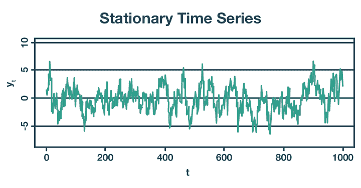
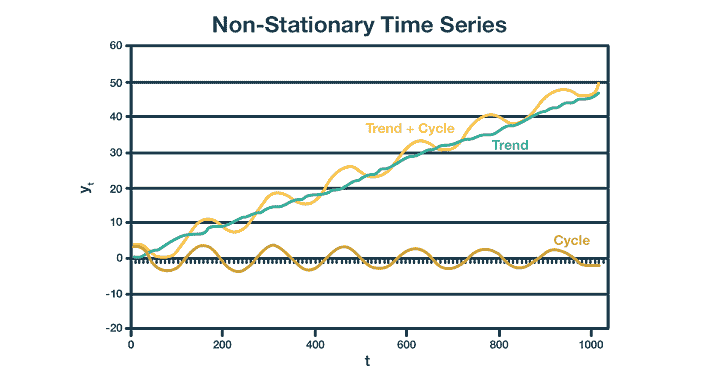
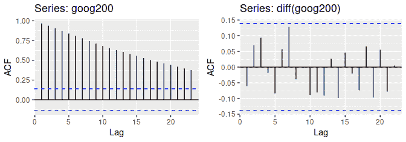
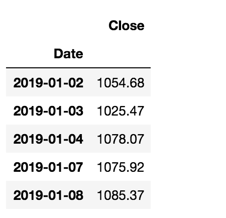
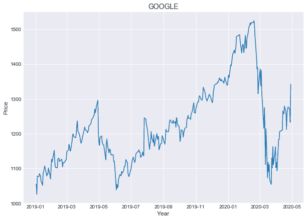
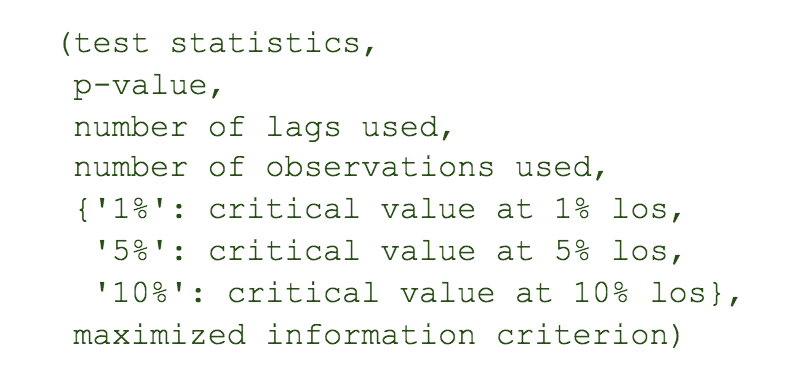
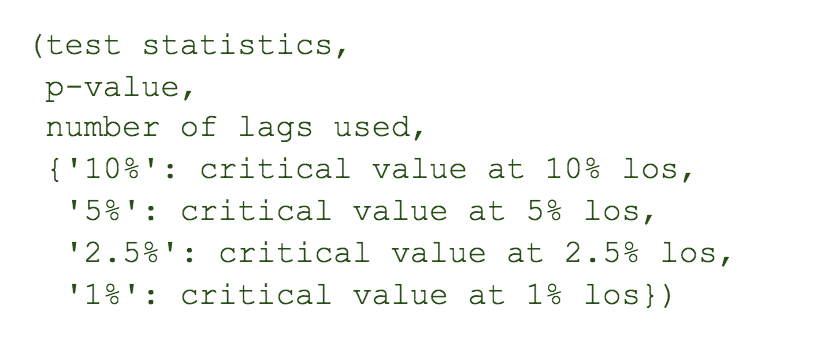
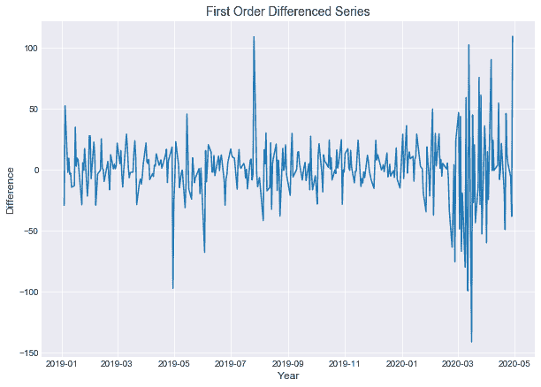

# 用 Python 解释时间序列分析中的平稳性

> 原文：<https://blog.quantinsti.com/stationarity/>

由[萨特雅普里雅·乔德里](https://www.linkedin.com/in/satyapriya-chaudhari-73976b16a/)

在处理时间序列数据时，你会经常遇到两个术语——平稳时间序列和非平稳时间序列。平稳性是时间序列分析的关键要素之一。

在这个博客中，你会读到以下主题。

*   [平稳性的定义](#definition-of-stationarity)
*   [平稳时间序列和非平稳时间序列](#stationary-time-series-and-non-stationary-time-series)
*   [平稳性的重要性](#importance-of-stationarity)
*   [平稳性的类型](#types-of-stationarity)
*   [检测平稳性](#detecting-stationarity)
*   [将非平稳序列转化为平稳序列](#transforming-a-non-stationary-series-into-a-stationary-series)

让我们从理解什么是平稳过程开始。

## **平稳性的定义**

在[维基百科](https://en.wikipedia.org/wiki/Stationary_process)中定义，平稳过程是“其无条件联合概率分布不随时间推移而改变的过程。”

这意味着一个平稳过程的分布在不同的时间点看起来是一样的。因此，平稳过程的参数，如均值和方差，在一段时间内保持不变。

如果你有一个过程，假设有一百个值。您从 1 到 30 或 30 到 50 或 50 到 100 的数值中取样。为了使这个过程稳定，不同样本的平均值和其他统计特性应该大致相同。

平稳性是[时间序列分析](/time-series-analysis/)中的关键组成部分之一。*停下来想想为什么？*我们将在观察平稳和非平稳时间序列后回到这个问题上。

* * *

## **平稳时间序列和非平稳时间序列**

一种时间序列，其统计特性，如均值、方差等。在一段时间内保持不变，称为平稳时间序列。

换句话说，平稳时间序列是其统计特性独立于观察时间点的序列。一个平稳的时间序列有一个恒定的方差，它总是返回到长期均值。

<figure class="kg-card kg-image-card kg-width-full kg-card-hascaption">

<figcaption>Fig.1: Stationary Time Series</figcaption>

</figure>

统计特性随时间变化的时间序列称为非平稳时间序列。因此，具有趋势或季节性的时间序列本质上是非平稳的。这是因为趋势或季节性的存在会影响任何给定时间点的均值、方差和其他属性。

<figure class="kg-card kg-image-card kg-width-full kg-card-hascaption">

<figcaption>Fig. 2: Non-Stationary Time Series</figcaption>

</figure>

让我们总结一下平稳时间序列和非平稳时间序列的区别。

| **平稳时间序列** | **非平稳时间序列** |
| 平稳时间序列的统计特性与被观察的时间点无关。 | 非平稳时间序列的统计特性是观测时间的函数。 |
| 平稳时间序列的均值、方差和其他统计量保持不变。因此，平稳序列分析的结论是可靠的。 | 非平稳时间序列的均值、方差等统计量随时间而变化。因此，从非平稳序列分析中得出的结论可能会产生误导。 |
| 固定时间序列总是恢复到长期平均值。 | 非平稳时间序列不会回复到长期均值。 |
| 平稳的时间序列不会有趋势、季节性等。 | 趋势和季节性的存在使得一个序列是非平稳的。 |

* * *

## **平稳性的重要性**

记得我们留了一个问题，“*为什么平稳性是时间序列分析的关键成分之一？*

在你回答这个问题之前，如果一个过程不是静态的，会发生什么？

是的，从非平稳过程中得出的推论是不可靠的，因为它的统计特性会随着时间不断变化。在执行分析时，您通常会对平均值、方差等的期望值感兴趣。

但是，如果这些参数是不断变化的，通过在一段时间内求平均值来估计它们将是不准确的。因此，平稳数据更容易分析，使用非平稳数据做出的任何预测都是错误和误导的。

正因为如此，许多应用于时间序列分析的统计程序都假设基本的时间序列数据是平稳的。

这种假设是必要的，因为大多数时间序列预测方法预测时间序列的统计特性在未来将保持与过去相同。

让我们转到平稳性的类型。

* * *

## **平稳性的类型**

不同类型的平稳性如下。

*   **严格平稳性** -这意味着任何矩(如期望值、方差、三阶和更高阶矩)的无条件联合分布在一段时间内保持不变。这种类型的系列在现实生活实践中很少见到。
*   **一阶平稳性** -这些序列在一段时间内有一个平均常数。任何其他统计数据(如方差)都可能在不同的时间点发生变化。
*   **二阶平稳性(也叫弱平稳性)** -这些时间序列在一段时间内具有恒定的均值和方差。系统中的其他统计数据可以随时间自由变化。这是现实生活中最常见的系列之一。
*   **趋势平稳性** -这些数列是有趋势的数列。当从系列中去除这种趋势时，会留下一个固定的系列。
*   **差分平稳性** -这些序列是需要一次或多次差分才能变得平稳的序列。我们将在本文的后面详细研究这个问题。

* * *

## **检测平稳性**

由于许多分析工具和统计测试假设时间序列是平稳的，因此确定给定的序列是否由平稳过程生成是非常重要的。下面是一些同样的方法。

**可视化**

检查给定数据是否来自平稳序列的最常用方法是简单地绘制数据或其函数。现在让我们看看这些技术如何帮助我们识别平稳性。

*   ******看数据-****** 平稳和非平稳序列都有一些性质，可以很容易地从数据的绘图中检测出来。例如，在一个平稳序列中，数据点将总是以恒定的方差返回到长期均值。在非平稳序列中，数据点可能显示某种趋势或季节性。让我们参考一下网站上的一系列情节，[预测:Hyndman & Athanasopoulos 著，2018](https://otexts.com/fpp2/stationarity.html) 。

<figure class="kg-card kg-image-card kg-width-full kg-card-hascaption">

<figcaption>Fig. 3: Examples of Time Series Data</figcaption>

</figure>

图:时间序列数据的九个示例

*从上图的九个图中，你认为哪些是平稳序列？*

系列(b)是固定的。你可以在这里查看解释[。这种方法仅用于初步了解数据，并不完全可靠。](https://otexts.com/fpp2/stationarity.html)

*   ******看自相关函数图-****** 让我们从上面看序列(a)和序列(b)的 ACF 图。在这里你将了解什么是[自协方差和自相关](/autocorrelation-autocovariance/)函数。

<figure class="kg-card kg-image-card kg-width-full kg-card-hascaption">

<figcaption>Fig. 4: ACF Plots</figcaption>

</figure>

图:

来源:[hynd man 著《预测:原理与实践》& Athanasopoulos，2018](https://otexts.com/fpp2/stationarity.html) 。

你已经知道数列(a)是非平稳的，数列(b)是平稳的。

从上面两个图中你观察到了什么？

在第一个图中，滞后 1 的 ACF 值非常高，接近 1，并且下降非常缓慢。这是非平稳序列的情况。然而，在第二个图中，对于平稳序列，滞后 1 的 ACF 值非常小，并且很快下降到零。

因此，对于平稳序列，滞后 1 的 ACF 值较大且为正。而对于非平稳序列，则接近于零。对于非平稳序列，ACF 的值相对较快地下降到零。

让我们看另一个例子。我们将读取 2019 年 1 月至 2020 年 4 月 yfinance.com 的谷歌股价数据，并可视化该系列。

<figure class="kg-card kg-image-card kg-width-full"></figure>

<figure class="kg-card kg-image-card kg-width-full kg-card-hascaption">

<figcaption>Fig. 5: Google Stock Price Series</figcaption>

</figure>

*你对以上系列有什么看法？它是静止的吗？*

没有。该系列的数据在不同层面显示出不同的趋势。因此，它似乎不是静止的。

您了解了如何直观地检查数据的平稳性。让我们转到另一种技术来分析数据是否是稳定的。

**汇总统计**

你已经知道一个平稳的时间序列有一个恒定的均值、方差等。久而久之。因此，像均值和方差这样的汇总统计数据有助于估计时间序列是否是平稳的。

您可以将数据划分为随机的时间段，并分析不同时间段的汇总统计数据。如果不同分区的均值和方差非常接近，则该序列是平稳的。

如果不同分区的均值和方差之间存在显著差异，则该序列不是平稳的。

让我们把上面看到的谷歌价格数据分成两半，分析统计数据。

上述代码的输出是

<figure class="kg-card kg-image-card"></figure>

你可以看到两个均值和两个方差的值有很大的不同。这再次表明该序列不是平稳的。

您比较了不同数据分区的汇总统计数据的平稳性。检查序列平稳性的一种更可靠、更方便的方法是对数据进行不同的统计检验，以检查它们是否来自平稳过程。

**统计测试**

许多参数和非参数检验可用于检查序列的平稳性。让我们看看几个参数测试及其 Python 实现。

*   **增强的迪基-富勒测试-**[增强的迪基-富勒测试](/augmented-dickey-fuller-adf-test-for-a-pairs-trading-strategy/)是最流行的检验平稳性的测试之一。它测试了下面的假设。
*   零假设，H0:时间序列不是平稳的。
*   另一个假设，H1:时间序列是平稳的。

您可以使用 **statsmodels** 库中的 **adfuller** 方法在 Python 中执行这个测试，并比较测试统计值或 p 值。

*   如果 p 值小于或等于 0.05，或者检验统计量的绝对值大于临界值，则拒绝 H0，得出时间序列是平稳的结论。
*   如果 p 值大于 0.05 或者检验统计量的绝对值小于临界值，你就不能拒绝 H0，并得出时间序列不是平稳的结论。

让我们看看如何用 Python 实现这一点。

结果以元组的形式返回。你可以在下面的格式中看到结果。

<figure class="kg-card kg-image-card kg-width-full"></figure>

代码的输出如下所示。

<figure class="kg-card kg-image-card kg-width-full"></figure>

可以看到，p 值大于 0.05。你未能拒绝零假设并得出时间序列不是平稳的结论。

或者，您可以将 ADF 测试统计数据与临界值进行比较。由于 ADF 检验统计量的绝对值小于临界值的绝对值，你无法拒绝零假设并得出时间序列不是平稳的结论。

*   科维亚特科夫斯基-菲利普斯-施密特-申检验- 另一个非常常用的平稳性检验是 KPSS 检验。这里要注意的非常重要的一点是，KPSS 的解释与 ADF 测试完全相反，因此这些测试不能互换使用。在解释这些测试时需要非常小心。KPSS 测试测试以下假设。
*   零假设，H0:时间序列是平稳的。
*   另一个假设，H1:时间序列不是平稳的。

您可以使用 **statsmodels** 库中的 **kpss** 方法在 Python 中执行这个测试，并比较测试统计值或 p 值。由于假设与 ADF 测试中看到的相反，对 p 值的解释也是相反的。

*   如果 p 值小于或等于 0.05，或者检验统计量的绝对值大于临界值，则拒绝 H0，得出时间序列不是平稳的结论。
*   如果 p 值大于 0.05，或者检验统计量的绝对值小于临界值，则不能拒绝 H0，不能得出时间序列是平稳的结论。

让我们看看如何用 Python 实现这一点。

结果以元组的形式返回。你可以在下面的格式中看到结果。

<figure class="kg-card kg-image-card kg-width-full"></figure>

代码的输出如下所示。

<figure class="kg-card kg-image-card kg-width-full"></figure>

可以看到，p 值小于 0.05。你拒绝零假设，并得出结论，时间序列不是平稳的。这与 ADF 测试获得的结果一致。

除了这些参数检验，还有其他半参数和非参数检验也可用于检查序列的平稳性。这些测试超出了本文的范围。

* * *

## **将非平稳序列转化为平稳序列**

由于平稳序列易于分析，可以通过**差分的方法将非平稳序列转化为平稳序列。**实际上，为了使用时间序列预测模型，需要将非平稳序列转换为平稳序列。

在这种方法中，数列中连续项的差计算如下。

<figure class="kg-card kg-image-card kg-width-full"></figure>

让我们计算谷歌价格系列的差异，并绘制结果。

<figure class="kg-card kg-image-card kg-width-full kg-card-hascaption">

<figcaption>Fig. 6: First Order Differenced Series</figcaption>

</figure>

让我们对差分序列进行 ADF 检验，检查序列是否平稳。

上述代码的输出是

<figure class="kg-card kg-image-card kg-width-full"></figure>

可以看到，p 值小于 0.05。你拒绝零假设，并得出结论，时间序列是平稳的。

因此，谷歌价格系列是一个**差异平稳**系列。Google 价格系列的一阶差导致了平稳系列。

* * *

**建议读数**

*   [关于时间序列的一切](/time-series-analysis/)
*   [增强的迪基-富勒试验](/augmented-dickey-fuller-adf-test-for-a-pairs-trading-strategy/)

* * *

可以看下面关于平稳性的视频了解更多。

[https://www.youtube.com/embed/bXr1LmBY8yo](https://www.youtube.com/embed/bXr1LmBY8yo)

* * *

## **结论**

平稳性是时间序列分析的关键要素之一。平稳的时间序列独立于被观察的时间点。时间序列中的大多数预测模型都假设基础时间序列是平稳的。因此，为了使预测可靠，时间序列必须是平稳的。

您可以使用不同的技术来检查给定的时间序列是否是平稳的。金融市场中的大多数时间序列数据远非平稳，因此在进行预测之前必须将其转换为平稳序列。

要了解更多关于平稳和非平稳时间序列数据，以及各种时间序列分析模型，请查看我们的课程[交易的金融时间序列分析](https://quantra.quantinsti.com/startCourseDetails?cid=172&section_no=1&unit_no=1#course_type=paid&unit_type=Video)。

* * *

*<small>免责声明:股票市场的所有投资和交易都涉及风险。在金融市场进行交易的任何决定，包括股票或期权或其他金融工具的交易，都是个人决定，只能在彻底研究后做出，包括个人风险和财务评估以及在您认为必要的范围内寻求专业帮助。本文提到的交易策略或相关信息仅供参考。</small>T3】*