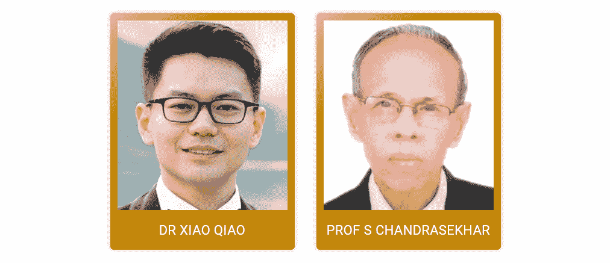

# 人工智能和新闻情感在金融中的应用[研究报告]

> 原文：<https://blog.quantinsti.com/research-presentations-29-september-2020/>

* * *

[https://www.youtube.com/embed/FE76PQFJytU?rel=0](https://www.youtube.com/embed/FE76PQFJytU?rel=0)

### **议题 1:肖乔博士的信用风险建模**

深度学习可以用来定价和校准信用风险模型。深度[神经网络](https://quantra.quantinsti.com/course/neural-networks-deep-learning-trading-ernest-chan)可以高度准确地学习结构和简化模型。对于复杂的信用风险模型，其封闭形式的解决方案不可用，深度学习提供了概念上简单且更有效的替代解决方案。

肖博士提出了一种结合深度学习和无迹卡尔曼滤波器的方法来校准历史数据上的信用风险模型，其简化模型的 R 平方达到 98.5%，结构模型的 R 平方达到 95%。

* * *

[https://www.youtube.com/embed/n_iN8sQhIns?rel=0](https://www.youtube.com/embed/n_iN8sQhIns?rel=0)

### **主题 2:钱德拉塞卡教授的长期企业估值预测**

该演讲侧重于预测使用先进的机器学习和自然语言处理技术的公司的长期企业价值。与市值相比，企业价值提供了更好的公司估值。市值的主要焦点是股东价值，而企业价值取决于长期债务和手头现金。

为了获得 EV，我们将增加长期债务市值，并扣除手头现金。在滚动的基础上预测长达 6 个月的长期企业价值将有助于投资者、评级公司获得其投资增长的长期视图，也有助于管理风险。

* * *

**2020 年 9 月 29 日星期二**

美国东部时间上午 8:30 | IST 时间下午 6:00 |新加坡时间晚上 8:30

* * *

## ****【10 年多机构】****

正如人们所说，知识是人生最大的礼物。在庆祝我们成立 10 周年之际，我们策划了这个系列来感谢我们的社区。我们从心底里感谢你，感谢你多年来在我们的旅途中给予我们的爱和支持！

* * *

## **演讲者简介**

<figure class="kg-card kg-image-card kg-width-full"></figure>

### **肖乔博士**

**(帕拉康科技联合创始人)**

肖是帕拉康科技公司的联合创始人。他的研究兴趣包括资产定价、金融计量经济学、投资、商品和回报可预测性。他的研究被《福布斯》、《CFA 协会》和《机构投资者》报道。

他是《投资组合管理杂志》和《全球商品应用研究文摘》的编辑委员会成员。他在芝加哥大学获得了金融学博士学位，在那里他是诺贝尔奖获得者尤金·法玛的助教。

### 钱德拉塞卡教授

**(IFIM 商学院商业分析主任)**

钱德拉塞卡教授自 2013 年 11 月起担任 IFIM 商学院高级教授兼商业分析主任。他在新德里 FORE 管理学院担任了大约 14 年的主任教授。

在此之前，他在勒克瑙的印度管理学院工作了大约十年(1988-1998)，担任计算机和信息系统领域的教授。他拥有坎普尔 IIT 大学的电子工程学士学位、计算机科学硕士学位和美国佐治亚大学的定量与信息系统博士学位。

* * *