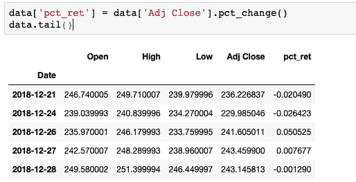
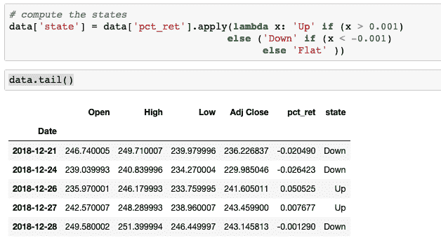
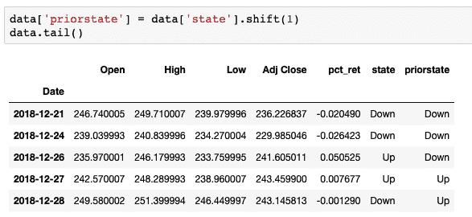
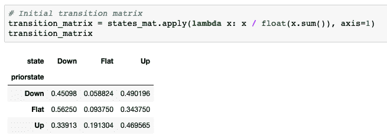
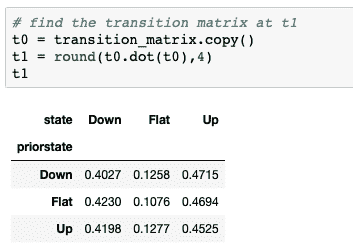
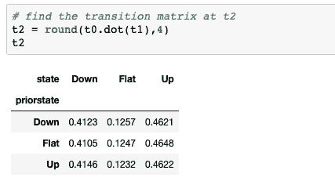
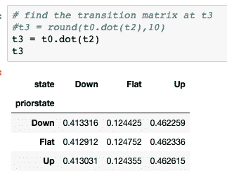
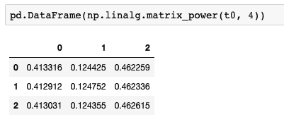

# 马尔可夫模型-简介

> 原文：<https://blog.quantinsti.com/markov-model/>

马里奥·比萨

在本帖中，我们将了解马尔可夫模型，并回顾两个最著名的**马尔可夫模型**，即**马尔可夫链**，这是理解马尔可夫模型和**隐马尔可夫模型(HMM)** 的基础，隐马尔可夫模型在预测领域，特别是在交易领域被广泛研究。

在本帖中，我们将尝试回答以下问题:

*   [什么是马尔可夫模型？](#what-markov-model)
*   [马尔可夫模型有什么用？](#markov-model-use)
*   马尔可夫模型是如何工作的？
*   [什么是隐马尔可夫模型？](#hidden-markov-model)
*   [马尔可夫模型和隐马尔可夫模型有什么区别？](#difference)

我们还将看到如何用 Python 实现其中的一些想法，作为实验的基础。

## **T3】**

马尔科夫模型是由俄罗斯数学家安德烈·安德烈耶维奇·马尔科夫(1856-1922)开发的一套数学程序，由于他对诗歌的热爱，他最初分析了元音和辅音的交替。

在 E. Seneta [1]为庆祝 1906 年 Markov 工作发表 100 周年而写的论文[2][3]中，您可以了解更多关于 Markov 的生活和他的许多关于概率的学术著作，以及 Markov 链的数学发展，Markov 链是最简单的模型，也是其他 Markov 模型的基础。

在 20 世纪 60 年代末和 70 年代初，Leonard E. Baum 和他的同事研究、开发和扩展了马尔可夫技术，创建了新的模型，如隐马尔可夫模型(HMM) [4]。

## **T3】**

现在，马尔可夫模型被用于几个科学领域，试图解释依赖于其当前状态的随机过程，也就是说，它们描述了不完全随机和独立的过程。它们也不受特定输入对应精确输出的方程组的支配。

确定性模型试图精确地解释过程的行为，而概率或随机模型试图通过概率来确定随机独立过程的行为。相比之下，马尔可夫模型试图解释依赖于当前事件而不依赖于先前事件的随机过程，因此它是概率或随机模型的特例。

当我们有一个状态完全可观测的动态系统时，我们使用马尔可夫链模型，如果系统的状态只是部分可观测的，我们使用隐马尔可夫模型。

例如，动态系统可以是具有某一频率的价格流，该频率可以是分钟、小时、天或周，或者具有不确定的频率，例如分笔成交点，其具有可观察的状态，例如价格上升、下降或不变，尽管它也可以是价格流或某一价格数字。当我们看到马尔可夫链是如何工作的时候，我们会详细介绍。

马尔可夫模型使用一个向量和矩阵系统，其输出给出了给定当前状态的预期概率，或者换句话说，它描述了可能的替代输出与当前状态的关系。

## **T3】**

先来天真的描述一下最简单的模型，马尔可夫链是如何工作的。在这篇文章中，我们将关注 Python 中的一些实现思想，但我们不会停留在公式和数学发展上。

建议感兴趣的读者阅读 Lawrence R. Rabiner [6]撰写的关于隐马尔可夫模型和语音识别中的选定应用的教程，以获得关于马尔可夫链和 HMM 的数学基础的坚实基础。

利用马尔可夫链，我们打算建立一个动态系统的模型，这个系统的可观测状态和有限状态以最简单的形式在离散时间内演化。我们可以将其描述为一组有限状态随时间的转移。

我们举一个简单的例子来建立一个马尔可夫链。假设我们有一系列的间谍价格，我们希望对行为进行建模，以预测未来的价格。

为此，我们需要时间 t 内每个可能状态的频率分布。由此，我们可以生成一个转移矩阵或概率矩阵，该矩阵可以迭代地乘以原始转移矩阵，这允许我们扩展时间内模型的行为，并知道时间 t+1 内状态的概率。

当转移矩阵达到平衡矩阵时，即当时间 t+k 中的矩阵乘以原始转移矩阵不改变可能状态的概率时，马尔可夫链达到其极限。

让我们看看复制标准普尔 500 指数的间谍 ETF 的 2018 年价格。

<figure class="kg-card kg-image-card kg-width-full"></figure>

第一件事是确定我们想要建模和分析的状态。在这个例子中，我们将简单地考虑价格是上升、下降还是保持不变。

总而言之，我们的三种可能状态是:

1.  上涨:今天的价格比昨天的价格上涨了。
2.  下降:与昨天的价格相比，今天的价格下降了
3.  持平:价格与前一日持平。

为了获得我们的数据框架中的状态，第一个任务是计算每日回报，尽管应该记住对数回报通常更适合正态分布。

<figure class="kg-card kg-image-card kg-width-full"></figure>

然后，我们根据返回来识别可能的状态。平坦状态可以被定义为一个范围，因此认为向上/向下是最小的运动。

<figure class="kg-card kg-image-card kg-width-full"></figure>

我们对分析前一天的价格到今天的价格的转换感兴趣，所以我们需要添加一个具有前一状态的新列。

<figure class="kg-card kg-image-card kg-width-full"></figure>

利用当前状态和先前状态，我们可以构建频率分布矩阵。

<figure class="kg-card kg-image-card kg-width-full"></figure>

这里我们已经得到了跃迁的频率分布，这允许我们在时间 t0 建立初始概率矩阵或跃迁矩阵。

<figure class="kg-card kg-image-card kg-width-full"></figure>

这将是 t0 时的转移矩阵，我们可以通过将此转移矩阵乘以自身来构建马尔可夫链，以获得 t1 时的概率矩阵，这将允许我们进行一天的预测。

<figure class="kg-card kg-image-card kg-width-full"></figure>

如果我们继续将 t1 时获得的转移矩阵乘以 t0 时的原始转移矩阵，我们就获得了 t2 时的概率。

<figure class="kg-card kg-image-card kg-width-full"></figure>

将我们在 t2 中获得的转移矩阵乘以 t0 中的原始转移矩阵，我们获得时间 t3 中的概率，以此类推，直到我们找到概率不变的平衡矩阵，因此我们不能继续发展预测。

<figure class="kg-card kg-image-card kg-width-full"></figure>

有趣的是，您可以通过将初始转移矩阵提高到“n”天来获得相同的结果。

<figure class="kg-card kg-image-card kg-width-full"></figure>

为了找出平衡矩阵，我们可以迭代这个过程，直到概率不再变化。

<figure class="kg-card kg-image-card"></figure>

通过这个例子，我们已经以一种简化的方式看到了马尔可夫链是如何工作的，尽管有必要分析一下 Python 中实现马尔可夫链的不同库。

## **T3】**

隐马尔可夫模型(HMM)是由鲍姆和佩特里[4]在 1966 年提出的，可以被描述为一个嵌入另一个潜在隐链的马尔可夫链。

可以在 Rabiner 的论文[6]中研究 HMM 的数学发展，并且在论文[5]和[7]中研究了如何使用 HMM 在股票市场中进行预测。

* * *

在 [**这篇博客**](https://blog.quantinsti.com/intro-hidden-markov-chains/) 中，我们深入解释了隐马尔可夫链的概念，并演示了如何构建隐马尔可夫模型。

另外，查看一下 **[这篇文章](https://blog.quantinsti.com/introduction-monte-carlo-analysis/)** 讲的是蒙特卡罗方法，马尔可夫链蒙特卡罗(MCMC)。

如果你想在隐马尔可夫模型的帮助下发现一个市场机制，那么看看这个 EPAT 项目的**。**

* * *

## ****T3】****

**正如我们所见，马尔可夫模型是一个数学工具的集合，用来建立概率模型，其当前状态依赖于以前的状态。**

**这是马尔可夫链的初始视图，后来扩展到另一组模型，如 HMM。**

**HMM 是马尔可夫链的一种发展，它考虑了不能直接观察到但影响模型行为的状态。**

**所以，我们学习了马尔可夫链和隐马尔可夫模型(HMM)。我真的很感激你在下面的评论区对这篇文章的任何评论。请随意分享这篇文章的链接。我还在下面提供了 Python 代码作为可下载文件。**

****参考文献:****

*   **[1]塞内塔，尤金。(2006).马尔可夫和马尔可夫链的创建。**
*   **[2] A.A. Markov,《大数定律对相依量的扩展》(俄文版),《消息报》Fiz。-马特姆。Obsch。喀山大学，(第二辑。)，第 15 卷(1906 年)，第 135-156 页**
*   **[3] A.A. Markov，将大数定律扩展到相互依赖的量上。[2]的英译本。**
*   **[4]鲍姆、伦纳德·e 和特德·佩特里。1966.有限状态马氏链概率函数的统计推断。数理统计年鉴 37:1554–63。**
*   **[5] Nguyen，Nguyet。2018.股票交易的隐马尔可夫模型。**
*   **[6]劳伦斯·拉宾纳，1989 年。隐马尔可夫模型及其在语音识别中的应用。**
*   **[7]哈桑、拉菲尔和纳特、拜昆思。2005.基于隐马尔可夫模型的股票市场预测:一种新方法。**

***<small>免责声明:本文提供的所有数据和信息仅供参考。QuantInsti 对本文中任何信息的准确性、完整性、现时性、适用性或有效性不做任何陈述，也不对这些信息中的任何错误、遗漏或延迟或因其显示或使用而导致的任何损失、伤害或损害负责。所有信息均按原样提供。</small>***

* * *

****文件下载中:**马尔可夫模型工作原理- Python 代码**