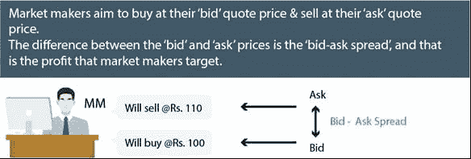
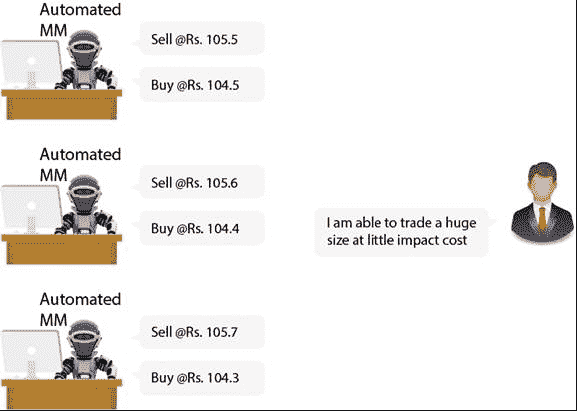
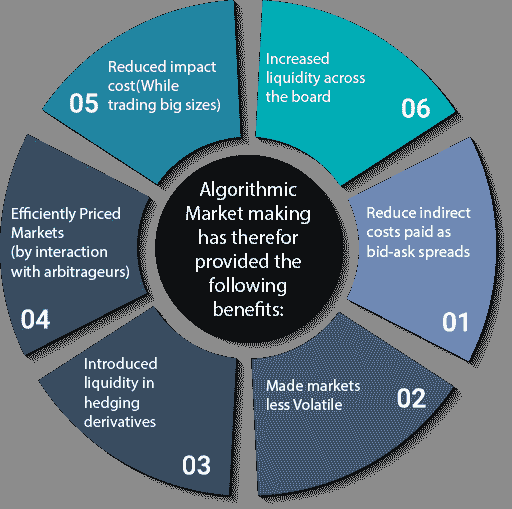

# 做市:策略，算法交易，技术和更多

> 原文：<https://blog.quantinsti.com/market-making/>

由[查尼卡·塔卡](https://www.linkedin.com/in/chainika-bahl-thakar-b32971155/)，[尼廷·塔帕](https://www.linkedin.com/in/nitin-thapar-b0661565/) & [米林德·帕拉德卡](https://www.linkedin.com/in/milind-paradkar-b37292107/)

在当今瞬息万变的市场中，市场参与者扮演着极其重要的角色。在做市过程中，交易所交易结构中的关键市场参与者是做市商。

在过去的几年里，你一定见证了金融市场的急剧积极转变，这主要是因为最近科技的飞速发展。自从技术出现以来，交易以极高的速度进行。

说到技术，提到[算法交易](/algorithmic-trading/)是必须的。通过[算法交易](https://quantra.quantinsti.com/course/getting-started-with-algorithmic-trading),(股票的)买卖每秒钟都在快速发生。

《算法交易简介*》一书的作者爱德华·莱希克(Edward Leshik)和简·克拉勒(Jane Cralle)用下面的话写下了对算法交易的解释，*

> *“按照复杂性排序，市场排在宇宙、人脑和人类免疫系统之后，位列第四。”*

*回到本文的核心，让我们详细了解一下做市。*

**   谁是做市商？什么是做市？*   [做市商怎么赚？做市商赚多少？](#how-do-the-market-makers-earn-how-much-do-market-makers-make)*   [做市商会亏钱吗？](#can-market-makers-lose-money)*   为什么做市很重要？*   [做市和价格波动](#market-making-and-price-volatility)*   [做市和影响成本](#market-making-and-impact-cost)*   [算法做市及其好处](#algorithmic-market-making-and-its-benefits)*   [自动化交易如何实现做市](#how-automated-trading-enables-market-making)
    *   [更快的做市响应时间](#faster-response-time-for-market-making)
    *   [做市的可扩展性](#scalability-in-market-making)
    *   [24x7 做市可用性](#24x7-availability-for-market-making)*   [经纪人和做市商的区别](#difference-between-a-broker-and-a-market-maker)*

 ** * *

## 谁是做市商？什么是做市？

做市商是指在当前市场情况下以最佳出价买入，同时以最佳出价卖出的人。通过这种方式，他们沉迷于金融市场的两个方面。

因此，通过这样做，他们做了一个市场，这显示在市场上的最后股票价格。尽管做市商根据当前的市场形势进行买卖，但他们避免在极端波动的情况下进行交易。

因此，每个做市商都通过显示特定数量证券的买卖报价来发挥作用。

**做市商策略** -一旦收到买家的订单，做市商就出售自己库存的股票并完成订单。而且，这个过程增加了市场的流动性。因此，它被称为做市策略。

**做市要点摘自** [**经济时报**](https://economictimes.indiatimes.com/wealth/invest/who-are-market-markers/articleshow/63441595.cms) **:**

*   做市商是由证券交易所指定的会员公司，为股票注入流动性和交易量。
*   每个做市商显示保证数量的股票的买入和卖出报价。
*   一旦收到买家的订单，做市商立即出售自己持有的股票或库存，以完成订单。
*   做市商通过被允许在市场上提供双向报价来补偿风险，双向报价由一起报价的买入和卖出价格组成，差价就是利润。
*   做市商的框架减少了执行交易所需的时间和股票交易的成本，允许大量股票交易。

好了。让我们来看看做市商是如何盈利的，他们从盈利中赚了多少。

* * *

## 做市商怎么赚？做市商赚多少？

通常，做市商通过收取高于买入价的卖出价来获利。这种差异被称为“价差”。

价差补偿做市商在这种交易中继承的风险，这种风险可以是相对于做市商的交易位置的价格运动。

例如，做市商可以以每股 100 美元(要价)的价格购买 1000 股 IBM 股票，然后以 100.05 美元(买入价)的价格卖给买方。

买卖价格之间的差额只有 0.05 美元，但是到了第[天交易第](https://quantra.quantinsti.com/course/day-trading-strategies)天，每天交易数百万股，他设法赚了一大笔钱，抵消了价格对他不利的风险。

<figure class="kg-card kg-image-card"></figure>

现在，根据 Glassdoor 的数据，做市商的年收入大约在 66，658 美元到 95，648 美元之间。

让我们在文章中找出做市商最终是否会赔钱。

* * *

## 做市商会亏钱吗？

如上所述，做市商可能面临的主要风险是从卖方手中购买证券后，在出售给买方之前，证券价值的下降。

做市商始终是知情交易者所做交易的交易对手，以防市场出现任何波动；做市商经常被错误的头寸套牢。

<figure class="kg-card kg-image-card"></figure>

做市商的另一个致命风险是没有最新的信息。简而言之，只有当做市商能够快速接收和响应信息时，他们才能管理风险并生存下来。否则，市场地位可能在几秒钟内对他们不利，这可能导致损失。

<figure class="kg-card kg-image-card"></figure>

因此，强有力的市场必须有强有力的做市商，在不遭受巨大损失的情况下生存。

好了，现在让我们来看看为什么做市被认为对市场和投资者如此重要。

* * *

## 为什么做市很重要？

一般来说，做市商通过维持金融市场的运作效率来帮助金融市场。这使得做市对金融市场非常重要。如果我们去掉做市商，市场上就不会有很多交易发生。

这就是做市商成为市场基础设施不可或缺的一部分的原因。而且，预计只要我们交易金融资产，他们的影响就会持续下去。

现在，让我们看看做市商如何帮助应对价格波动和冲击成本:

### 做市和价格波动

回到讨论的主题，做市商也有助于减少价格波动，从而导致资产的公平定价。

例如，任何给定的资产都有最佳买价和最佳卖价之差，这就是所谓的买卖价差。这里需要注意的是，市场中的低流动性导致了巨大的买卖价差。现在，为了消除买卖价差的扩大，做市商介入并向市场提供流动性。

请参见下面的例子，了解通过人工做市商进行的连续交易的价格差异将远远高于通过自动做市商进行的交易。因此，资产价格波动性降低。此外，未来我们将理解自动做市商如何比人工做市商更有效率。

<figure class="kg-card kg-image-card"></figure>

### 做市和影响成本

由于做市商通过与交易所 API(包括做市商算法)集成的编程执行来运行，这提高了他们的效率。因此，它会带来更好的利润，因为强大的 API 有助于做市商获得可靠的运行时间和一致的流动性。

随着自动化使市场变得容易，订单变得很厚。即使是大订单的执行价格也接近公平价格，因此影响成本和波动性更低。

<figure class="kg-card kg-image-card"></figure>

* * *

## 算法做市及其好处

算法做市的总体积极影响可以总结如下:

<figure class="kg-card kg-image-card kg-card-hascaption">

<figcaption>Benefits of Making Markets with Algorithms</figcaption>

</figure>

因此，使用算法做市提供了以下好处:

*   作为买卖差价支付的间接成本减少
*   降低市场波动性
*   在对冲衍生产品中引入流动性
*   有效定价的市场(通过与套利者的互动)
*   降低冲击成本(交易大尺寸时)
*   流动性全面增加

现在让我们向前看，了解自动交易在做市中的作用。

* * *

## 自动化交易如何实现做市

由于[自动化系统](/algorithmic-trading-system)在检测&对风险导向事件的反应方面比人更有效率，据观察，自动化系统极大地帮助了做市商。

事实上，为了提高效率，做市商应该能够根据市场事件立即调整报价。但是人类只能以特定的速度工作，这个速度比自动化系统的速度要慢得多。

可能有几个这样的事件需要做市商迅速做出反应，以便能够从中获利。

例如，这是其中的两个事件:

*   金融工具价格的变化，以及
*   做市商累积的交易头寸

由于自动化系统可以比人类更准确地处理风险，因此它们可以为做市商提供更好的报价。

当使用自动系统做市时，你会得到:

*   更快的做市响应时间
*   做市的可扩展性
*   做市的 24x7 可用性

### 更快的做市响应时间

使投资者能够对冲的衍生品定价通常涉及耗时的数学计算。虽然人类可以花几分钟，但自动化系统非常快，可以在微秒内完成这些计算。因此，它们的响应时间要快得多。因此，[股市数学](/algorithmic-trading-maths/)是一个需要学习的重要概念。

<figure class="kg-card kg-image-card"></figure>

### 做市的可扩展性

说到可扩展性，虽然人类交易员只能跟踪少数几个工具的活动，但自动化系统可以同时处理数千个工具。此外，自动化交易系统为更多的金融工具提供了流动性。

<figure class="kg-card kg-image-card"></figure>

### 做市的 24x7 可用性

我们这里指的是字面意义上的 24x7 可用性，因为机器不需要任何休息。因为机器可以一直工作，而且没有任何错误，所以它们更快也更精确。

<figure class="kg-card kg-image-card"></figure>

接下来，让我们看看券商和做市商之间的区别。

* * *

## 经纪人和做市商的区别

众所周知，在金融市场中，有许多市场参与者以他们自己的方式扮演着重要的角色。

然而，做市商和经纪人是两种不同点的参与者，尽管他们都有助于金融市场。由于他们经常与做市商混淆，我们将看到他们的不同点。

经纪人是代表投资者(客户)买卖股票的个人。它们受到监管，需要在金融业监管局(FINRA)注册。

为了帮助您更容易理解经纪商和做市商之间的区别，我们将主要区别点归纳如下:

| **经纪人** | **做市商** |
| 经纪人代表投资者买卖股票。 | 做市商通过买卖股票在市场上提供流动性。 |
| 经纪人为客户提供买卖证券、股票、共同基金等的有利可图的报价。 | 做市商根据市场上的买卖差价来报价。 |
| 经纪人可以是个人也可以是公司。 | 做市商通常是大型银行或金融机构。 |
| 经纪人是客户和金融市场的中介。 | 做市商就像金融市场上的批发商一样买卖证券。 |
| 经纪人不反映市场需求和供给，因为他们不定价。 | 根据他们设定的价格，做市商反映市场需求和供给。 |
| 他们提供各种服务，如咨询、研究、投资建议等等。 | 做市商不为客户提供服务，相反，他们为投资者创造市场。 |
| <small>表格:经纪人和做市商的区别</small> |

厉害！通读这篇文章后，你一定对做市有了相当的了解。接下来是结论，让我们简要地看一下到目前为止我们都讲了些什么。

* * *

## 结论

我们学习了所有关于做市策略、做市商以及做市商如何赚钱和赚多少钱的知识。

在做市策略中，做市商从两个方面进行操作，即在市场中买入和卖出。这样他们不仅创造了市场，还通过以略高于市场价的价格销售来赚取利润。

之后，我们发现了自动化在使做市商变得更强大方面的作用，做市商的相关性，以及经纪人和做市商之间的区别。

太好了！我们将称之为你努力做市场的一个完美开端。

如果你希望学习根据均值回归理论识别交易机会，并创建不同的均值回归策略，Quantra 的 Python 课程中的[均值回归策略是 quant 交易者的必备课程，由 Ernest P Chan 博士提供。一定要去看看。](https://quantra.quantinsti.com/course/python-mean-reversion-strategies-ernest-chan)

* * *

*<small>免责声明:本文提供的所有数据和信息仅供参考。QuantInsti 对本文中任何信息的准确性、完整性、现时性、适用性或有效性不做任何陈述，也不对这些信息中的任何错误、遗漏或延迟或因其显示或使用而导致的任何损失、伤害或损害负责。所有信息均按原样提供。</small>**