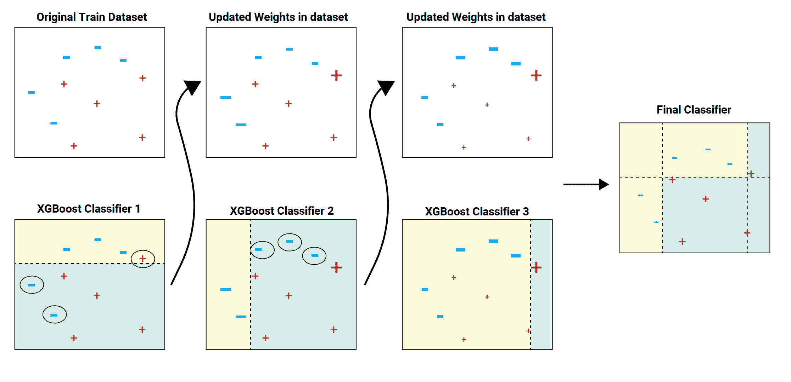
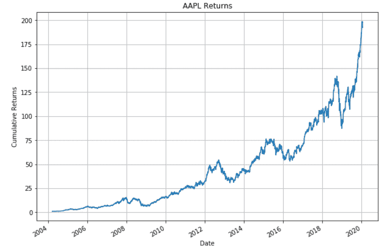
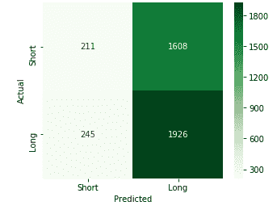
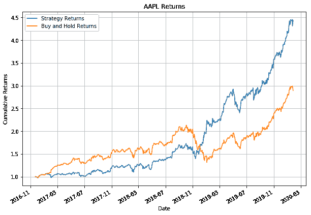
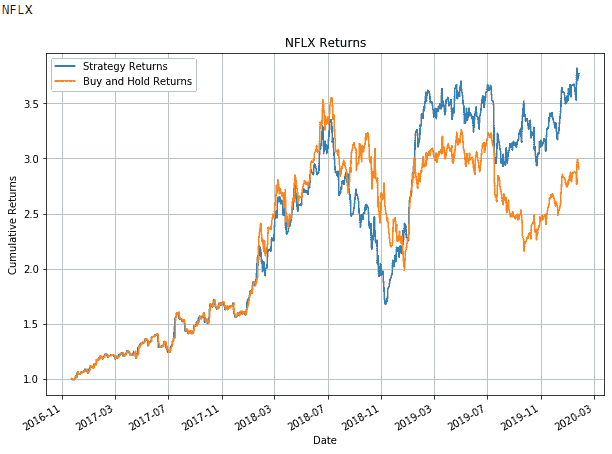
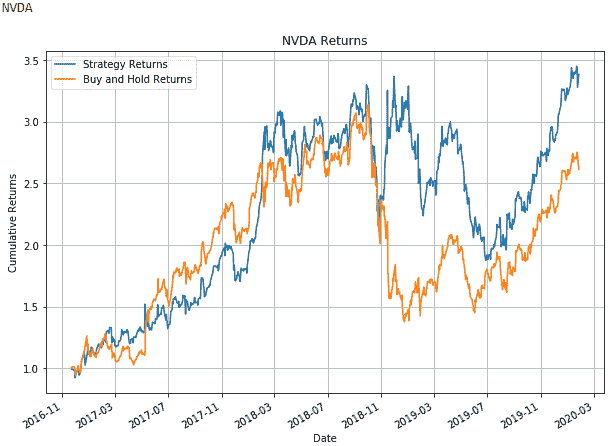
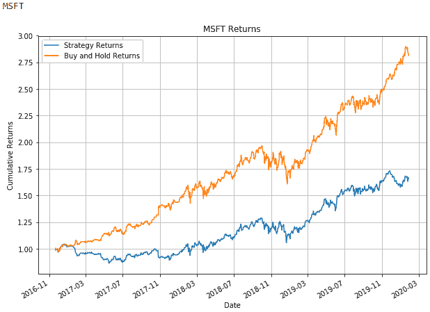
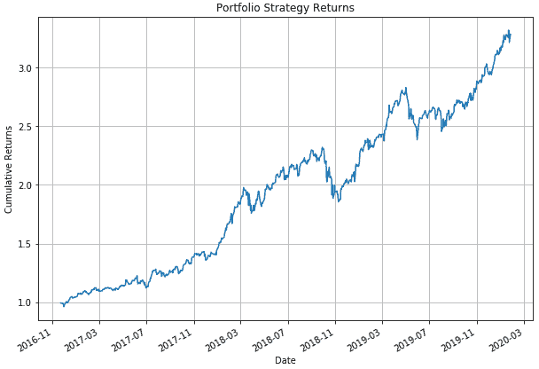
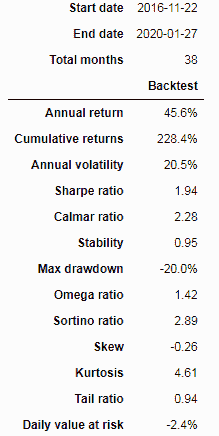
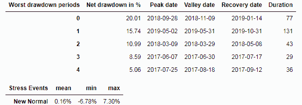

# Python 中的 XGBoost 简介

> 原文：<https://blog.quantinsti.com/xgboost-python/>

作者:伊桑·沙阿，编译:雷希特·帕查内卡

啊！XGBoost！这是机器学习爱好者和竞赛获胜者的首选武器。据说开发 XGBoost 是为了提高计算速度，优化模型性能。

当我们修补 XGBoost 的特性和参数时，我们决定建立一个由五家公司组成的投资组合，并在其上应用 XGBoost 模型来创建交易策略。这是我们得到的。这五家公司是苹果、亚马逊、网飞、英伟达和微软。


那真的很体面。想想看，我们甚至没有尝试优化它。

让我们看看如何在本文中实现 XGBoost 模型。我们将涵盖以下内容:

*   [XGBoost 是什么？](#What-XGBoost)
*   [XGBoost 为什么这么好？](#Why-XGBoost)
*   [XGBoost 特性重要性](#XGBoost-feature-importance)
*   [如何在 anaconda 中安装 XGBoost？](#Install-XGBoost-Anaconda)
*   [Python 中的 Xgboost](#XGBoost-python)

## XGBoost 是什么？

Xgboost 代表极限梯度增强，是在梯度增强的框架上发展起来的。我喜欢这个声音，极端！实际上，听起来更像超级跑车而不是 ML 车型。

但这正是它所做的，提高常规梯度推进模型的性能。

XGBoost 使用了一种更有规律的模型形式化来控制过拟合，这给了它更好的性能。

*   *XGBoost 的作者陈天琦*

让我们分解一下名字来了解 XGBoost 是做什么的。

### 什么是助推？

顺序集成方法，也称为“增强”，创建一系列模型，试图纠正序列中在它们之前的模型的错误。第一个模型建立在训练数据上，第二个模型改进第一个模型，第三个模型改进第二个模型，依此类推。



在上面的图像示例中，训练数据集被传递到分类器 1。黄色背景表示分类器预测了连字符，蓝色背景表示它预测了加号。分类器 1 模型错误地预测了两个连字符和一个加号。这些用圆圈突出显示。这些不正确预测的数据点的权重增加并被发送到下一个分类器。也就是分类器 2。分类器 2 正确地预测了分类器 1 不能预测的两个连字符。但是分类器 2 也犯了一些其他的错误。这个过程继续，我们有一个组合的最终分类器，它正确地预测所有的数据点。

可以添加分类器模型，直到正确预测了训练数据集中的所有项目，或者添加了最大数量的分类器模型。要训练的分类器模型的最佳最大数量可以使用超参数调整来确定。

在这里停一下。也许你不知道什么是序列模型。让我们一步一步来。

### 简而言之，机器学习

早些时候，我们习惯于编码某种逻辑，然后将输入给计算机程序。该计划将使用逻辑，即算法，并提供一个输出。所有这些都很棒，但是随着我们理解的增加，我们的程序也在增加，直到我们意识到对于某些问题语句，有太多的参数需要编程。

然后一些聪明的人说，我们应该给计算机(机器)一个样本集的问题和解决方案，然后让机器学习。

在开发机器学习的算法时，我们意识到我们可以将机器学习问题粗略地分为两个数据集，分类和回归。简单来说，分类问题可以是给定一张动物的照片，我们试图将它归类为狗或猫(或其他一些动物)。相比之下，如果我们要预测一个城市的温度，这将是一个回归问题，因为温度可以说是连续的值，如 40 度、40.1 度等。

太好了！然后我们转向[决策树模型](https://quantra.quantinsti.com/course/decision-trees-analysis-trading-ernest-chan)，贝叶斯，聚类模型等等。所有这些都很好，直到我们遇到另一个障碍，当我们只使用一个模型时，某些问题陈述的预测率令人沮丧。除此之外，对于决策树，我们意识到我们必须忍受模型中的偏差、方差和噪声。这引出了另一个好主意，我们把模型结合起来怎么样，我的意思是，两个脑袋比一个好，对吗？这被称为[整体学习](/ensemble-methods-bagging-boosting/)。但是在这里，我们可以使用一个以上的模型来创建一个合奏。梯度推进就是集成学习的一种方法。。

### 什么是梯度增强？

在结合模型时的梯度增强中，使用梯度下降来最小化损失函数。从技术上讲，损失函数可以说是一个误差，即预测值与实际值之间的差异。当然，误差越小，机器学习模型越好。

梯度推进是一种方法，在这种方法中，创建新模型来预测先前模型的残差或误差，然后将它们相加在一起以做出最终预测。

XGBoost 模型的目标如下:

obj = L+ω

其中 L 是控制预测能力的损失函数，ω是控制简单性和过拟合的正则化分量

需要优化的损失函数(L)可以是回归的均方根误差、二元分类的对数损失或多类分类的对数损失。

正则化分量(ω)取决于树叶的数量和在树集合模型中分配给树叶的预测分数。

它被称为梯度提升，因为它使用梯度下降算法来最小化添加新模型时的损失。梯度推进算法支持回归和分类预测建模问题。

如果你想了解梯度下降，那么你可以在这里阅读。

好了，我们已经了解了机器学习是如何从简单模型进化到模型组合的。不知何故，人类无法长时间满足，随着问题陈述变得越来越复杂，数据集越来越大，我们意识到我们应该更进一步。这就引出了 XGBoost。

## XGBoost 为什么这么好？

XGBoost 是用 C++编写的，考虑到计算时间，它真的很快。XGBoost 的伟大之处在于它可以很容易地导入 python 中，并且由于 sklearn 包装器，我们也可以使用 python 包中使用的相同参数名。

虽然实际的逻辑解释起来有些冗长，但是 xgboost 的一个主要特点是它能够并行化 boosting 算法的树构建组件。这导致处理时间大幅增加，因为我们可以使用更多的 CPU 内核，甚至还可以利用云计算。

虽然机器学习算法支持调整，并可以与外部程序一起工作，但 XGBoost 具有内置的正则化和交叉验证参数，以确保偏差和方差保持在最低水平。内置参数的优点是它导致更快的实现。

让我们在下一节讨论一个这样的实例。

## Xgboost 特性重要性

简而言之，特征就是我们用来预测目标变量的变量。有时候，我们不满足于仅仅知道我们的机器学习模型有多好。我想知道哪个特征更有预测能力。。了解特性的重要性可以帮助我们，原因有很多。下面让我们列举几个:

*   如果我知道某个特性比其他特性更重要，我会更加关注它，并尝试看看是否可以进一步改进我的模型。
*   运行模型后，我会看看删除一些特征是否会改进我的模型。
*   最初，如果数据集很小，那么在我们设计系统时，运行模型所花费的时间不是一个重要的因素。但是，如果策略很复杂，并且需要运行大型数据集，那么运行模型所需的计算资源和时间就成为一个重要因素。

XGBoost 的好处是它包含了一个计算特性重要性的内置函数，我们不必担心在模型中对它进行编码。

下面给出了稍后在 XGBoost python 代码部分使用的示例代码:

```
from xgboost import plot_importance
# Plot feature importance
plot_importance(model)
```


好了，在我们继续写代码之前，让我们确保我们的系统上都有 XGBoost。

## 如何在 anaconda 中安装 XGBoost？

Anaconda 是一个 python 环境，它使我们编写 python 代码变得非常简单，并处理与代码相关的任何细节。因此，我指定了在 Anaconda 中安装 XGBoost 的步骤。它实际上只是一行代码。

您可以简单地打开 Anaconda 提示符并输入以下内容

Anaconda 环境将下载所需的安装文件并为您安装。它看起来会像下面这样。


这就是全部了。厉害！现在我们来看真实的东西，即 XGBoost python 代码。

## Python 中的 Xgboost

在我们深入研究 XGBoost 机器学习模型之前，让我先总结一下。我们正在使用过去 16 年来美国科技股(如苹果、亚马逊、网飞、英伟达和微软)的股票数据，并训练 XGBoost 模型来预测第二天的回报是正还是负。

我们以可下载的 python 笔记本的形式包含了代码，供您以后使用。附在博客最后。

为了更好地理解该模型，我们将 XGBoost python 代码分成以下几个部分

1.  导入库
2.  定义参数
3.  创建预测值和目标变量
4.  将数据分为训练和测试
5.  初始化 xgboost 机器学习模型
6.  训练数据集中的交叉验证
7.  训练模型
8.  特征重要性
9.  预测报告

### 导入库

我们在评论里写了库的用途。例如，由于我们使用 XGBoost python 库，我们将导入相同的库，并将# Import XGBoost 编写为注释。

```
# Import warnings and add a filter to ignore them
import warnings
warnings.simplefilter('ignore')
# Import XGBoost
import xgboost
# XGBoost Classifier
from xgboost import XGBClassifier
# Classification report and confusion matrix
from sklearn.metrics import classification_report
from sklearn.metrics import confusion_matrix
# Cross validation
from sklearn.model_selection import KFold
from sklearn.model_selection import cross_val_score
# Pandas datareader to get the data
from pandas_datareader import data
# To plot the graphs
import matplotlib.pyplot as plt
import seaborn as sn
# For data manipulation
import pandas as pd
import numpy as np
```

太好了！所有库都已导入。现在我们进入下一部分。

### 定义参数

我们已经定义了我们将在这个博客中使用的股票列表、开始日期和结束日期。

```
# Set the stock list
stock_list = ['AAPL', 'AMZN', 'NFLX', 'NVDA','MSFT']
# Set the start date and the end date
start_date = '2004-1-1'
end_date = '2020-1-28'
```

为了让事情变得有趣，我们将在苹果、亚马逊、网飞、英伟达和微软等公司上使用 XGBoost python 模型。创建预测值和目标变量

我们定义了一个预测值列表，模型将从中挑选出最佳预测值。这里，我们将不同时间段的百分比变化和标准偏差作为预测变量。

目标变量是第二天的收益。如果第二天的收益是正的，我们把它标为 1，如果是负的，我们把它标为-1。你也可以尝试用三个标签来创建目标变量，比如 1，0 和-1，分别代表 long，no position 和 short。

现在让我们看看代码。

```
# Create a placeholder to store the stock data
stock_data_dictionary = {}
for stock_name in stock_list:
# Get the data
df = data.get_data_yahoo(stock_name, start_date, end_date)
# Calculate the daily percent change
df['daily_pct_change'] = df['Adj Close'].pct_change()
# create the predictors
predictor_list = []
for r in range(10, 60, 5):
df['pct_change_'+str(r)] = df.daily_pct_change.rolling(r).sum()
df['std_'+str(r)] = df.daily_pct_change.rolling(r).std()
predictor_list.append('pct_change_'+str(r))
predictor_list.append('std_'+str(r))
# Target Variable
df['return_next_day'] = df.daily_pct_change.shift(-1)
df['actual_signal'] = np.where(df.return_next_day > 0, 1, -1)
df = df.dropna()
# Add the data to dictionary
stock_data_dictionary.update({stock_name: df})
```

在我们继续讨论 XGBoost python 模型的实现之前，让我们先画出存储在字典中的 Apple 的每日收益，看看是否一切正常。

```
# Set the figure size
plt.figure(figsize=(10, 7))
# Access the dataframe of AAPL from the dictionary 
# and then compute and plot the returns
(stock_data_dictionary['AAPL'].daily_pct_change+1).cumprod().plot()
# Set the title and axis labels and plot grid
plt.title('AAPL Returns')
plt.ylabel('Cumulative Returns')
plt.grid()
plt.show()
```

您将获得如下输出:



看起来很准确。

### 将数据分为训练和测试

由于 XGBoost 毕竟是一个机器学习模型，我们将把数据集分成测试集和训练集。

```
# Create a placeholder for the train and test split data
X_train = pd.DataFrame()
X_test = pd.DataFrame()
y_train = pd.Series()
y_test = pd.Series()
for stock_name in stock_list:
# Get predictor variables
X = stock_data_dictionary[stock_name][predictor_list]
# Get the target variable
y = stock_data_dictionary[stock_name].actual_signal
# Divide the dataset into train and test
train_length = int(len(X)*0.80)
X_train = X_train.append(X[:train_length])
X_test = X_test.append(X[train_length:])
y_train = y_train.append(y[:train_length])
y_test = y_test.append(y[train_length:])
```

### 初始化 xgboost 机器学习模型

我们将初始化分类器模型。我们将设置两个超参数，即 max_depth 和 n _ estimators。这些设置在较低的一侧，以减少过度拟合。

```
# Initialize the model and set the hyperparameter values
model = XGBClassifier(max_depth=2, n_estimators=30)
model
```

输出如下所示:


好了，我们现在将在列车组上执行[交叉验证](/cross-validation-machine-learning-trading-models/)以检查准确性。

### 训练数据集中的交叉验证

```
# Initialize the KFold parameters
kfold = KFold(n_splits=5, random_state=7)
# Perform K-Fold Cross Validation
results = cross_val_score(model, X_train, y_train, cv=kfold)
# Print the average results
print("Accuracy: %.2f%% (%.2f%%)" % (results.mean()*100, results.std()*100))
```

输出如下所示:


精度略高于半分。这可以通过超参数调整和将相似的股票组合在一起来进一步改善。我会把优化的部分留给你。如果您有任何疑问，请随时发表评论。

### 训练模型

我们将使用 fit 方法来训练 XGBoost 分类器。

#符合模型

```
model.fit(X_train, y_train)
```

您会发现输出如下:


### 特征重要性

我们绘制了 7 大特征，并根据其重要性进行了分类。

```
# Plot the top 7 features
xgboost.plot_importance(model, max_num_features=7)
# Show the plot
plt.show()
```


那很有趣。XGBoost python 模型告诉我们，pct_change_40 是其他特性中最重要的特性。因为我们提到我们只需要 7 个特性，所以我们收到了这个列表。这里有一个有趣的想法，你为什么不增加数字，看看其他功能如何叠加，当涉及到他们的 f 分数。也可以删除不重要的特征，然后重新训练模型。这会增加模型的准确性吗？我让你来验证。

不管怎样，我们继续前进！

### 预测和分类报告

```
# Predict the trading signal on test dataset
y_pred = model.predict(X_test)
# Get the classification report
print(classification_report(y_test, y_pred))
```


坚持住！我们快到了。让我们看看 XGBoost 现在告诉我们什么:

那很有趣。与短边相比，长边的 f1 分数更强大。我们可以修改模型，使之成为只做多策略。

让我们尝试另一种方式来描述 XGBoost 的性能。

### 混淆矩阵

```
array = confusion_matrix(y_test, y_pred)
df = pd.DataFrame(array, index=['Short', 'Long'], columns=[
'Short', 'Long'])
plt.figure(figsize=(5, 4))
sn.heatmap(df, annot=True, cmap='Greens', fmt='g')
plt.xlabel('Predicted')
plt.ylabel('Actual')
plt.show()
```

输出如下所示:



但是这告诉我们什么呢？这是一个简单的矩阵，显示了 XGBoost 准确与否地预测了多少次“买入”或“卖出”。例如，在预测“Long”时，XGBoost 预测正确 1926 次，而错误 1608 次。

另一种解释是 XGBoost 倾向于预测“长”而不是“短”。

### 个股表现

让我们看看基于 XGBoost 的策略回报如何与正常的每日回报相比较，即买入并持有策略。我们将绘制一张我们之前提到的所有公司的策略回报和每日回报的对比图。代码如下:

```
# Create an empty dataframe to store the strategy returns of individual stocks
portfolio = pd.DataFrame(columns=stock_list)
# For each stock in the stock list, plot the strategy returns and buy and hold returns
for stock_name in stock_list:
# Get the data
df = stock_data_dictionary[stock_name]
# Store the predictor variables in X
X = df[predictor_list]
# Define the train and test dataset
train_length = int(len(X)*0.80)
# Predict the signal and store in predicted signal column
df['predicted_signal'] = model.predict(X)
# Calculate the strategy returns
df['strategy_returns'] = df.return_next_day * df.predicted_signal
# Add the strategy returns to the portfolio dataframe
portfolio[stock_name] = df.strategy_returns[train_length:]
# Plot the stock strategy and buy and hold returns
print(stock_name)
# Set the figure size
plt.figure(figsize=(10, 7))
# Calculate the cumulative strategy returns and plot
(df.strategy_returns[train_length:]+1).cumprod().plot()
# Calculate the cumulative buy and hold strategy returns
(stock_data_dictionary[stock_name][train_length:].daily_pct_change+1).cumprod().plot()
# Set the title, label and grid
plt.title(stock_name + ' Returns')
plt.ylabel('Cumulative Returns')
plt.legend(labels=['Strategy Returns', 'Buy and Hold Returns'])
plt.grid()
plt.show()
```










这很有趣，不是吗？你怎么看待这种比较？请在评论中告诉我们你的观察或想法，我们会很乐意阅读。

### 投资组合的绩效

我们非常享受这一切，以至于我们不能停留在个人层面。因此，我们想，如果我们平等地投资所有公司，并按照 XGBoost python 模型行事，会发生什么。让我们看看会发生什么。

```
# Drop missing values
portfolio.dropna(inplace=True)
# Set the figure size
plt.figure(figsize=(10, 7))
# Calculate the cumulative portfolio returns by assuming equal allocation to the stocks
(portfolio.mean(axis=1)+1).cumprod().plot()
# Set the title and label of the chart
plt.title('Portfolio Strategy Returns')
plt.ylabel('Cumulative Returns')
plt.grid()
plt.show()
```



请记住，这些是累积收益，因此它应该会让你对 XGBoost 模型的性能有所了解。

如果您想要关于测试集的更详细的反馈，请尝试下面的代码。

```
import pyfolio as pf
pf.create_full_tear_sheet(portfolio.mean(axis=1))
```

虽然生成的输出有些冗长，但我们还是附加了一个快照





唷！那是一个长的。但是我们希望你能理解像 XGBoost 这样的增强模型是如何帮助我们产生信号和创建交易策略的。

## 结论

我们从基础开始，即机器学习算法的出现及其下一个层次，即集成学习。我们学习了提升树以及它们如何帮助我们做出更好的预测。我们最终来到 XGBoost 机器学习模型，以及它如何优于常规的 boosted 算法。然后，我们浏览了一个简单的 XGBoost python 代码，并根据代码创建的交易信号创建了一个投资组合。在这之间，我们还列出了特性的重要性以及 XGBoost 中包含的某些参数。

如果你想对机器学习交易策略的完整生命周期进行循序渐进的培训计划，那么你可以参加[机器学习策略开发和实时交易](https://quantra.quantinsti.com/learning-track/machine-learning-strategy-development-live-trading)学习课程，并接受 Ernest P. Chan 博士、Terry Benzschawel 和 QuantInsti 等专家的指导。

<small>免责声明:本文中提供的所有数据和信息仅供参考。QuantInsti 对本文中任何信息的准确性、完整性、现时性、适用性或有效性不做任何陈述，也不对这些信息中的任何错误、遗漏或延迟或因其显示或使用而导致的任何损失、伤害或损害承担任何责任。所有信息均按原样提供。</small>

点击下载按钮获取我们在博客中使用的代码。