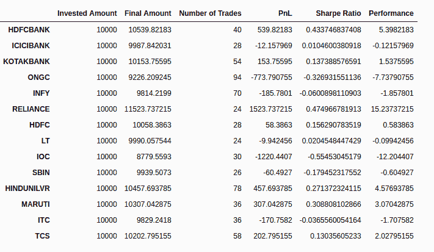

# 基于隐马尔可夫模型的市场状态检测

> 原文：<https://blog.quantinsti.com/market-regime-detection-hidden-markov-model-project-fahim/>

从无数影响市场和经济的新闻和事件中找出金融市场的行为是具有挑战性的。**市场机制**在这个项目中，EPATian Fahim Khan 解释了如何借助隐藏的**马尔可夫模型**来检测市场机制。

这个博客还提供了 Fahim 的完整项目，数据文件和 HMM 文件的下载格式。

本文是作者在 QuantInsti 提交的算法交易高管课程([【EPAT】](https://www.quantinsti.com/epat))的最后一个项目。请务必查看我们的[项目页面](/tag/epat-trading-projects/)，看看我们的学生正在构建什么。

## 关于作者

<figure class="kg-card kg-image-card kg-width-full"></figure>

法希姆·汗是一名居住在印度孟买的 EPATian 人。他拥有电子工程学位，目前正在 WorldQuant 大学攻读硕士学位。

法希姆目前是 TCS 的助理顾问。他对**机器学习和深度学习**有兴趣。他喜欢探索新的技术和领域。作为一名业余爱好者，他目前正在探索如何在金融和算法交易中利用 ML/DL 技能集。

## 项目摘要

由于政府政策、负面新闻、监管环境和其他宏观经济 effects.的变化，量化交易者发现金融市场的频繁行为始终是一个挑战这样的时期被称为市场体制。

这些不同的制度通过它们的均值、方差、协方差、[自相关和自协方差](/autocorrelation-autocovariance/)的变化导致资产回报的调整。这影响了依赖平稳性的时间序列方法的 effectiveness。

很明显，我们需要发现这些政权，effectively.这有助于优化[量化交易策略](https://quantra.quantinsti.com/course/quantitative-trading-strategies-models)的部署，并调整其中的参数。

在这里，我使用隐藏的市场模型来检测市场机制，并相应地调整所使用的策略。

## **所需数据**

我从 Zerodha 获取了以下股票的 120 天的日内数据。

*   NIFTY50
*   hdfc 银行
*   icici 银行
*   科塔银行
*   ONGC
*   INFY
*   信赖
*   HDFC
*   书信电报(letter message)
*   国际奥林匹克委员会
*   SBIN
*   HINDUNILVR
*   马鲁蒂
*   国际茶叶委员会(International Tea Committee)
*   交通管制站（trafficcontrolstation）

使用 HMM 检测市场状况时，获取日内数据以获得更好的结果总是明智的。

## 程序

由于主要重点是检测市场机制，我使用了移动平均线策略。正如在 HMM 的情况下，我们只能有部分可观察的数据，非常仔细地选择我们的可观察数据变得非常重要。

对于移动平均策略，我选择了日收益率作为可观察变量。我们也可以将日标准差、日波动率作为可观察变量。

该项目分为以下模块(抽象而非 pythonic 化):

### 1.回溯测试代码

在这个模块中，我创建了一个简单的回溯测试框架。使用它，我们可以:

*   跟踪交易
*   能够做的事情，如计算交易价格后，在经纪业务的因素(我拿 Zerodha 利率为例)
*   另外，看看模拟买卖订单的代码
*   根据预算等，检查可以购买的股份数量。
*   它还提供回测统计数据，如夏普比率、PnL、性能等。
*   其他自定义统计数据可以添加到这里。

回溯测试类中的代码被用作策略类的父类。

创建了另一个类，它负责维护我们想要运行回溯测试策略的每个符号的组合细节。在这里，我们可以找出哪个符号在我们的回溯测试策略中表现良好，我们可以在实时交易中关注这些符号。

### 2.HMM 模型

将数据分为训练数据和测试数据，并分成适当大小的部分，这一点很重要。因为我只有 120 天的日间数据，所以我很难得到 70:30 的比率，所以我决定把它分成 50:50 的比率。

请注意，数据量越大，结果越好。

如果你有大量的数据，我建议你使用 70:30 的分割，这是可以优化的。

HMM 模型是使用 python 的 **hmmlearn** 包实现的。从这个包中，我们选择了类 **GaussianHMM** 来创建一个隐马尔可夫模型，其中发射是一个高斯分布。这意味着基于后续回报的值，这是一个可观察的变量，我们将确定隐藏的变量，在我们的情况下，这将是高或低的低波动性制度。

非常仔细地选择可观察变量是很重要的，因为这个变量模型是合适的。

在移动平均策略中，可观察变量是日收益率，但我们也可以使用:

*   标准差，
*   波动性，
*   远期波动率(对于期权)等。

这个模块，基本上，给了我们最好的制度或无制度的顺序。该模块生成的模型保存在 **pickle 文件**中。

### 3.战略执行和比较

这里我们创建了两个类，它们是回溯测试模块中的类的子类。

*   在第一个方案中，我们在没有来自 HMM 模型的状态输入的情况下运行移动平均策略。
*   在第二个例子中，我们使用了 HMM 模型中关于政权的预测。

在这两种情况下，都只使用测试数据来运行策略。训练数据仅用于训练高斯 HMM。这是为了在两种情况之间进行比较。

在运行第一个普通移动平均策略类并生成统计数据后，我们加载在高斯 HMM 模块中创建的模型。然后，我们迭代测试数据返回，并不断将它们追加到一个列表中。然后，我们使用已经训练好的 HMM 模型，根据这个列表预测政权。

根据预测，我们做出决定。

*   如果我们没有头寸，波动率预测显示为高，我们继续不持有头寸。
*   如果我们没有头寸，波动率预测显示低，并且有一个平均交叉，我们买入并做多。
*   如果没有交叉，我们继续没有立场。
*   如果我们有一个头寸，波动性预测很高，我们卖出并结束我们的头寸。

对于其他情况也是如此。

<figure class="kg-card kg-image-card kg-width-full kg-card-hascaption">

<figcaption>Figure 1: Moving average strategy - without HMM</figcaption>

</figure>

<figure class="kg-card kg-image-card kg-width-full kg-card-hascaption">

<figcaption>Figure 2: Moving average strategy - with HMM</figcaption>

</figure>

我们可以看到，有一堆证券在没有使用 HMM 的情况下表现良好，如 KOTAKBANK、HINDUNILVR 和 RELIANCE。但是我们的利润不是负的。只是我们赚的利润少了一点。

现在，如果我们比较安全性 ONGC、INFY、lt、SBIN 的结果。我们可以看到，对于使用 HMM 的策略，损失大幅减少。事实上，其中一家亏损的证券公司正为我们带来利润。

如果你看到了全局，我们可以得出结论，HMM 策略可能会给你带来一点点利润，但它会让你在政权更迭期间免受重大损失。我们可以将 HMM 与任何风险管理策略结合使用。

## 项目的局限性

我们比较的结果只是 120 天的日间数据。实际上，我们可以使用一个更大的数据集来观察 HMM 在风险管理策略中的表现。

## 项目的进一步范围

我们可以做很多事情来改进 HMM 模型。我以后会努力做到以下几点:

1.  使用 HMM 运行不同的策略，如[均值回复](https://quantra.quantinsti.com/course/python-mean-reversion-strategies-ernest-chan)，配对交易。
2.  将可观察变量更改为标准差、波动性等
3.  使用大数据集优化训练和测试数据分割。

* * *

如果你想学习算法交易的各个方面，那就去看看算法交易(EPAT) 的[高管课程。课程涵盖统计学&计量经济学、金融计算&技术和算法&定量交易等培训模块。EPAT 教你在算法交易中建立一个有前途的职业所需的技能。](https://www.quantinsti.com/epat/)

免责声明:就我们学生所知，本项目中的信息是真实和完整的。所有推荐均由学生或 QuantInsti**提供，不做任何保证。学生和 quantin STI***否认对这些信息的使用负有任何责任。本项目中提供的所有内容仅供参考，我们不保证通过使用该指南您将获得一定的利润。*T15】**

* * *

****下载中的文件:****

*   **完整的项目- PDF 文件**
*   **所有数据文件-每日和当天**
*   **HMM 模型文件夹**