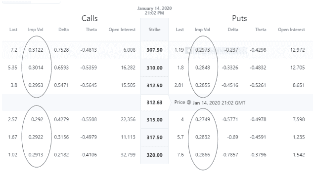
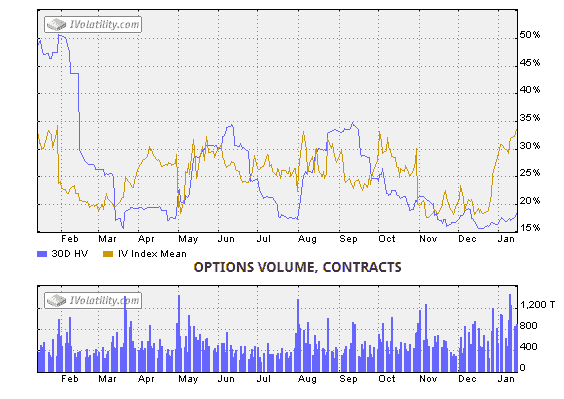

# 隐含波动率:什么，为什么&如何！

> 原文：<https://blog.quantinsti.com/implied-volatility/>

由[普尼特·南迪](https://www.linkedin.com/in/punit-nandi-bb46a5120/)

> “当长期趋势失去动力时，短期波动性往往会上升。”*——乔治·索罗斯*

这句话听起来很有趣，很吸引人，但是你怎么知道市场对波动的预期是什么呢？此外，有没有一种方法来计算未来的波动性，这将有助于我们在期权交易领域建立多头或空头头寸？听起来很有趣，对吧！！

好了，我们已经得到了你所有的关于“期权交易中的隐含波动率”的问题。用于描述从期权被市场参与者购买之日到其到期日的预期市场波动性的术语被称为“隐含波动性(IV)”。但是在我们进入隐含波动率的特殊和明显的特征之前，让我们看一下这篇文章的子主题。

*   [理解隐含波动率](#Understanding)
*   [数学背后 IV](#Math)
*   [使用 python 计算 IV](#Calculating)
*   [影响期权 IV 的因素](#Factors)
*   [静脉注射的用途](#Uses)
*   [口译四](#Interpreting)
*   [使用 IV 的交易策略](#Trading)

## 理解隐含波动率

在我们深入了解隐含波动率的基础知识之前，你应该知道期权交易的基础知识。

我们将首先简要介绍波动性。

### 波动性:

波动性是金融市场最重要的支柱之一。简而言之，波动性是指金融资产价格的上下波动。这些变动是由几个因素造成的，包括需求和供给、情绪、公司行为、贪婪和恐惧等。

现在我们知道了波动性是什么，让我们现在来理解隐含波动性的真正含义！！

### 什么是隐含波动率？

隐含波动率(IV)是期权市场预期未来波动率的度量。本质上，隐含波动率过去和现在都被认为是 Black-Scholes-Merton 模型(一个流行的期权定价模型)的组成部分，它代表与基础资产相关的未来波动率。

但是，你知道吗，它并不是市场上唯一可用的波动性指标。历史波动率和已实现波动率是市场中其他不同类型的波动率指标。

#### 历史波动

历史波动率表示基础资产价格在过去一段时间内的偏离或变化。通常，历史波动率以一年为周期计算，即 252 个交易日。交易员用它来比较基础资产的当前波动水平和历史波动水平。每当当前和历史波动之间有差距时，交易者就根据机会建仓。然而，历史波动率的问题是，它是一个向后看的指标，这意味着它是基于过去的回报，而不是最可靠的波动形式。

#### 已实现波动率

另一方面，已实现波动率是未来将发生的实际波动率。对于过去发生的波动，称为历史波动，对于未来发生的波动，称为已实现波动。

那么，我们为什么要在期权市场中使用隐含波动率呢？

在考虑了市场预期后，隐含波动率的值已被考虑在内。市场预期可能是重大市场事件、法院裁决、高层洗牌等。本质上，与历史波动率相比，隐含波动率是一种更好的估计未来波动率的方法，历史波动率仅基于过去的回报。

## 数学背后的 IV

我们现在将向前推进，理解隐含波动率背后的数学原理，以及如何计算期权隐含波动率。

计算 IV 并不像看起来那么简单。为了计算看涨或看跌期权的隐含波动率，我们首先需要理解 BSM 模型背后的数学原理。就本文的目的而言，我们不会深究 BSM 模型的概念，但我们肯定会对什么是 BSM 模型有一个概述，以便隐含波动率的计算看起来相似且易于理解。

### 布莱克·斯科尔斯·默顿模型:

Black-Scholes-Merton 模型是交易者在交易欧式期权时最常用的期权定价模型。它有两个独立的公式来计算看涨期权和看跌期权。

计算买入期权的参数有:

*   ST-基础资产的现货价格(当前价格)
*   k–标的资产的执行价格
*   r-无风险利率(连续复利)
*   σ–基础资产回报的波动性
*   t-t——到期时间(年)
*   n——正态分布的累积分布函数

看涨期权的定价:


看跌期权的定价:


看起来有点复杂吧？不要担心，一旦你输入参数值，它就像任何其他简单的方程。

例如:如果参数如下:

现货价格(St): 300 执行价格(K): 250 无风险利率(r) = 5%到期时间(T-t) = 0.5 年(6 个月)看涨价格= 57.38

我们如何找到具有上述参数的看涨期权的隐含波动率？我们就简单的用**迭代**或者试错的方法。

使用 15%的 IV 可以得到 56.45 的买入期权价格，使用 25%可以得到 59 的买入价格。

从上述试错法可以清楚地看出，IV 是 15 - 25%范围内的值。20 呢？。它给我们的买入价格是 57.38！！同样的技术也可以用于相应的看跌期权。一旦你掌握了这种技术，那就太容易了！

## 使用 python 计算 IV

好了，现在我们知道了隐含波动率的概念，为什么不创建一个计算器来计算期权的 IV 呢？毕竟学到的知识要实际应用！！

我们将使用 python 创建一个隐含波动率计算器，以方便计算期权的 IV。

Python 代码:

```
## Let us first import all the required libraries for IV Calculation.
# Data manipulation
import numpy as np
import pandas as pd
import datetime
import mibian

# We will now use the mibian library to calculate the implied volatility.
##The syntax for the variable values is in the format as mentioned below :
# BS([UnderlyingPrice, StrikePrice, InterestRate, Daystoexpiration],callPrice=x)

# Python code :
c = mibian.BS([145.65, 145, 5, 30], callPrice=3.89)

# Input Code :
c.impliedVolatility
```

输入代码的输出:

```
18.24951171875
```

这意味着看涨期权的隐含波动率为 18.249%(近似值)

这不是很简单吗？！Python 计算复杂的数学模型如 Black-Scholes-Merton 公式非常快速简单。同样的机制也可以用来计算看跌期权隐含波动率。

## 影响市场隐含波动率的因素

让我们来看看影响期权交易中隐含波动率的某些因素:

**供给和需求** -随着基础资产需求的增加，隐含波动率也增加，期权价格也增加！当然，这种现象在需求低的时候正好相反。随着需求下降，高 IV 倾向于向平均 IV 值移动，同时供应开始稳定。一旦市场预期开始下降，这一切就会发生，并导致期权价格下降。

**到期时间** -到期时间，更好地称为 theta，衡量期权到期的剩余时间，直接影响期权的 IV。例如，如果到期时间很短，IV 通常会较低。然而，如果期权的到期时间比通常情况下相对较长，IV 就会很高。逻辑上也说得通！怎么会？由于到期时间很长，标的资产的价格更有可能向执行价格移动，这对期权卖方来说风险太大。为了补偿卖方承担的风险，期权价格相对高于平时，IV 也是如此。

**市场状况** -大多数基础资产直接受到市场情绪或上市机构未来将发生的事件的影响。收益公告、法院裁决、高层管理人员变动等是导致高 IV 期权的一些市场事件，因为市场不确定基础资产可能移动的方向。

## 静脉注射的用途

隐含波动率在期权市场上被交易者频繁使用，原因多种多样。下面列出了静脉注射的各种用途:

**预测波动率** -隐含波动率被交易员用来了解基础资产的预期波动率范围。例如，让我们考虑一个看涨期权，其标的资产目前的交易价格为 100 美元，执行价格为 103 美元，溢价为 5 美元。如果此类看涨期权的**隐含波动率**为 20%，则标的资产的预期范围为高于当前交易价格 20%和低于当前交易价格 20%。这告诉我们，下限应该是 100 = 100 - 20 = 80 的 100 - 20%。上限在 100+100 的 20% = 100+20 = 120。这种情况下隐含波动率的范围是 80 - 120。

**对冲现金头寸** -交易员经常需要对冲头寸，以降低与初始或主要头寸相关的风险。如果期权的当前 IV 相对低于年化 IV 或全年 IV，交易者可以以低溢价购买期权，并等到 IV 增加。随着 IV 的增加，期权费的价值也会增加，因此期权合约的总价值也会上升！

**卖出期权**——与套期保值相反，期权卖方(option sellers)在 IV 较高时卖出期权，从而为他们所承担的风险赚取高额溢价。这里的问题是，对于他们销售的保险(期权),到期时间不断减少。经过一段相当长的时间后，交易对期权卖方有利。

**基于事件的交易** -每当有关于上市公司的收益或法庭裁决的消息时，IV 通常很高。当未来可能不确定时，就会发生这种情况。在这种情况下，有见识或有经验的交易者会围绕隐含波动率制定期权策略。例如，交易者使用[日历价差策略](/calendar-spread-options-trading-strategy/)，多头或空头价差策略从高 IV 中获利。

**在布莱克-斯科尔斯-默顿(BSM)模型中的用法:**隐含波动率是 BSM 模型中的一个关键参数。随着隐含波动率或市场对波动率的预期增加，期权价格也会增加。这在隐含波动率和期权价格之间建立了直接关系。因此，IV 构成了 Black Scholes Merton 模型的一个内在性质。

## 口译四

可视化和解释隐含波动率的方法不止一种，我们将具体研究每一种方法。

**数据表** -嗯，可视化静脉注射号码的最基本方法是通过数据表格式。现在，在期权市场，它被称为期权链。以下是美国股票的期权链:苹果(股票代码:AAPL)



**来源****:**[](https://in.investing.com/equities/apple-computer-inc-options)****(**注:期权数据每天更新，因此您将能够在给定的链接上看到当天的期权价格)**

 **从上图可以清楚地看出，相同执行价格的隐含波动率对于看涨期权和看跌期权是不同的。此外，对于不同的执行价格，隐含波动率随着市场预期的变化而波动。注:隐含波动率不是一个基于方向的参数，因此它仅表示基础资产未来可能变动的价格范围。不同执行价格的看跌期权和看涨期权的隐含波动率的这种变化以“[波动率微笑](/volatility-smile-origin-implications/)”和波动率偏斜为特征。当 OTM 和 ITM 看涨或看跌期权的隐含波动率(IV)最高，而 ATM 期权的隐含波动率(IV)最低时，就会出现波动率微笑。在波动率偏斜的情况下，不同的执行价格对相同的标的资产具有不同的隐含波动率。

这两种解释都用于期权市场，以便更好地可视化。下面，我们已经从看涨期权执行价格和隐含波动率相对提到了波动率偏态的例子。


**图表** -好了，现在我们已经理解并解释了期权链数据表中的隐含波动率，我们将通过图表来可视化隐含波动率，并从图表中解释 IV 水平。



资料来源:IVolatility.com

在图表中，我们有过去一年的隐含以及 30 天的历史波动数据。

市场参与者使用历史隐含波动率水平来衡量对 IV 的理解，例如，3 个月前 IV 在哪里，以及今天基于机会的交易在什么水平。

交易者还使用历史和隐含波动率的过去趋势来了解 HV 和 IV 一起是高于还是低于以前的时期。如果你今天开始交易期权，这是你衡量隐含波动率水平的首选工具。如前所述，隐含波动率水平在特定时间点的高低取决于多种因素。

**隐含波动率(IV)等级** - IV 等级是计算过去一年或 52 周隐含波动率的另一种流行方法。它是用来计算当前 IV 水平与年化水平相比是高还是低的。有一个特殊的公式来计算 IV 等级，下面提到:

(当前 IV - 52 周低 IV / 52 周高 IV - 52 周低 IV) * 100

例如:让我们考虑一下第四章图表部分提到的苹果公司(股票代码:AAPL)的例子。目前静脉注射率为 32.5%，52 周最低静脉注射率为 18%。52 周高 IV 是 34%。所以让我们来算一下:

32.5% - 18% / 34% - 18% = 14.5% / 16% = 90.625%.

解释 IV 等级也很容易。直观上，IV 等级是指当前 IV 和 52 周低点 IV i 之间的差异。在这种情况下，它是 90.625%。这意味着 IV 目前比平时高，由于 IV 高，交易者会有兴趣卖出期权。高 IV 意味着高期权价格，因此对期权卖方非常有利。购买具有高 IV 的期权的期权购买者由于在稍后的时间点 IV 的降低而面临损失。

隐含波动率(IV)百分位数 - IV 百分位数是另一种看待或解释 IV 的有趣方式。IV 百分位数仅指当前 IV 低于当前 IV 百分比值的天数，与总交易日数相比，即 252 个交易日。

IV 百分位=当前 IV 下的交易天数/一年内的交易天数。

例如:如果当前 IV (30%)下的天数为 100。交易日数为 252。IV 百分位= 100/252 = 39.68 百分位(近似值)。

下面是日期为 2019 年 11 月 26 日的印度股票的数据表，其中包含用于可视化 IVR 和 IVP 的 IV 排名和 IV 百分位！

| **符号** | **ⅳ级** | **第四百分位** | **隐含波动率** |
| 塔塔通信 | Eighty-six point nine nine | Ninety-eight point four seven | Forty-eight point two |
| 苏珊？苏珊 | Ninety-three point one seven | Ninety-eight point five four | One hundred and eighty-four point one three |
| 国家图书馆 | Seventy-three point seven four | Ninety-six point six five | Sixty-one point one eight |
| CGPOWER | Eighty-one point one two | Ninety-six point four | One hundred and six point two nine |
| BOSCHLTD | Seventy-eight point one six | Eighty-seven point nine four | Thirty-six point six five |
| 雷蒙德（男子名） | Seventy-one point six three | Ninety-five point four three | Forty-seven point three three |
| 想法 | Seventy-three point zero four | Ninety-six point two seven | One hundred and sixty-seven point five one |
| NBCC | Seventy-two point zero five | Ninety-eight point seven four | Ninety point four three |
| 工业基准黑(industrial reference black) | Seventy-one point four three | Ninety-three point five three | Eighty-seven point three eight |
| TV18BRDCST | Ninety-seven point one | Ninety-seven point eight four | Eighty point one five |
| 捷达航空公司 | One hundred | One hundred | Four hundred and eighty-three point seven three |

让我们以两种股票为例，即塔塔通信有限公司(TATACOMM)和苏司兰能源有限公司(Suzlon)，推导出与隐含波动率相关的 IVP 概念。TATACOMM 的隐含波动率(IV)为 48.2 %，而 SUZLON 的隐含波动率为 184.13%。鉴于两种股票期权的 iv 之间存在巨大差距，从逻辑上看，IVP 也应该有巨大差异。然而，在现实中，塔塔通讯的 IVP 是 98.47，而苏司兰是 98.54，只有 0.07 个百分点的差别！

这意味着，即使塔塔通信的 IV 为 48.2%，它仍处于与苏司兰相似的最高水平之一。因此，在使用 IV 进行期权交易之前，你应该知道一个期权的历史 IV 值是多少，以及它目前的位置。这正是隐含波动率百分位数的应用变得至关重要的地方，它有助于我们确定当前 IV 值与过去一年(252 个交易日)IV 值的比较。

**历史 IV 与已实现波动率** -从历史上看，IV 有一个大部分大于已实现波动率的趋势。市场预期不断波动，这意味着它们总是高于或低于基础资产的已实现波动率值。在下面的例子中，我们展示了道琼斯指数隐含波动率和已实现波动率(实际发生的波动率)之间的比较，以形象化相同的概念。蓝线代表已实现波动率，黄线代表隐含波动率。由于市场预期的波动，隐含波动率大多高于实际波动率。


## 使用 IV 的交易策略

鉴于隐含波动率和期权价格之间存在正相关关系，交易者使用隐含波动率作为他们策略的关键参数。这可能包括基本期权策略，如多头价差、空头价差和[备兑买入策略](https://quantra.quantinsti.com/course/options-trading-strategies-python-basic)。隐含波动率的使用也可以在使用[远期波动率](https://quantra.quantinsti.com/course/options-trading-strategies-python-intermediate)的交易策略或期权定价中看到。此外，高级期权策略如铁鹰和[改进的蝴蝶策略](https://quantra.quantinsti.com/course/options-trading-strategies-python-advanced)涉及隐含波动率的使用。

## 结论

最后，我们来到了本文的结尾。我们学习了隐含波动率的概念，为什么使用它，以及它是如何在期权交易中使用的。我们理解了 Black - Scholes-Merton 模型，并通过重复公式学习了如何计算 IV。我们还学习了如何使用 python 计算 IV。总而言之，现在你知道了隐含波动率，你知道 IV 作为期权交易参数的重要性。然而，由于期权交易需要风险管理和完善的策略执行思维，从这篇文章中学到的知识可以作为交易期权的补充工具！

<small>免责声明:股票市场的所有投资和交易都有风险。在金融市场进行交易的任何决定，包括股票或期权或其他金融工具的交易，都是个人决定，只能在彻底研究后做出，包括个人风险和财务评估以及在您认为必要的范围内寻求专业帮助。本文提到的交易策略或相关信息仅供参考。</small>**