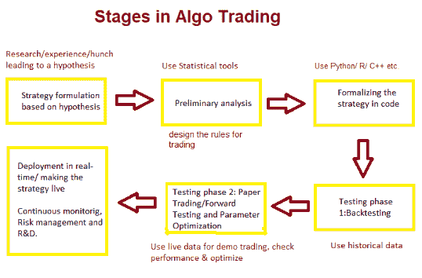

# 算法交易:它是什么，如何开始，策略，等等

> 原文：<https://blog.quantinsti.com/algorithmic-trading/>

由[查尼卡·塔卡](https://www.linkedin.com/in/chainika-bahl-thakar-b32971155/)

算法交易简单地说就是帮助以自动化方式执行交易指令的过程。它比手工交易更有利，因为它提供了更多的交易利润。这都归功于它更快更准确！

根据 Research and Markets 发布的“2018-2022 年全球算法交易市场”[报告](https://www.globenewswire.com/news-release/2018/06/18/1525672/0/en/Global-Algorithmic-Trading-Market-2018-2022-with-Citadel-Optiver-Tower-Research-Capital-Two-Sigma-Investments-Virtu-Financial-Dominating.html)，如果数据可信，全球算法交易市场规模预计将从 2019 年的 111 亿美元增长到 2024 年的 188 亿美元，CAGR 增长率为 11.1%。此外，它正被广泛使用，并不断扩大其在新兴市场的影响力。

在此，本文旨在让您全面了解以下内容:

*   [算法交易是什么，为什么？](#what-and-why-of-algorithmic-trading)
*   [从人工交易到算法交易的转变](#the-transformation-from-manual-to-algorithmic-trading)
*   [算法交易是什么时候开始的？](#when-did-algorithmic-trading-start)
*   [交易频率:HFT、MFT、LFT](#frequencies-of-trading-hft-mft-lft )
*   [Algo 交易策略](#algo-trading-strategies)
*   [算法交易工资](#algorithmic-trading-salaries)
*   印度有什么规章制度？
*   [如何学习算法交易](#how-to-learn-algorithmic-trading)
*   [算法交易的工作流程](#the-workflow-of-algorithmic-trading)
*   [如何建立自己的算法交易业务？](#how-to-build-your-own-algorithmic-trading-business)

## 算法交易是什么，为什么？

简单来说，[算法交易是将交易策略转换成计算机代码](https://www.quantinsti.com/epat)的过程，计算机代码以自动、快速和准确的方式买卖(进行交易)股票。由于自动化交易方式更快、更准确，它现在受到青睐，并正在迅速扩大其在新兴市场的影响力。

从技术上讲，有几种数学算法在根据当前市场数据做出交易决策，然后在金融市场发送并执行订单。这种方法使交易不受任何情绪的影响(如恐惧、贪婪等)。)因为执行每笔交易的决定都是由计算机以系统的方式做出的。

例如，如果苹果(AAPL)股票的当前市场价格低于 200 天的平均价格，则该算法购买该股票。相反，如果当前市场价格高于 200 天平均价格，它将出售苹果(AAPL)股票。

好了，让我们向前看，大致了解一下交易是如何开始的，以及它是如何从手工交易转变为基于算法的交易的。

## 从人工交易到算法交易的转变？

现在，你对什么是算法交易以及它如何胜过传统/人工交易有了一个公平的想法。但是，在过去没有自动化的时代，交易是什么样的呢？

**推荐阅读:**

### 过去时代的交易和现在的交易！

传统交易是在算法交易出现之前就存在的。在过去的时代，人们习惯于通过电话进行人工交易，也可以通过计算机进行电子交易。

回到过去，当自动化交易的概念还没有被引入时，交易者会从市场上收集数据，进行分析，并根据这些数据做出交易决策。

因此，从历史上看，曾经有人类交易员会根据市场数据做出买卖股票的决定。

在一段时间内，对更快、更可靠(不受人类情绪影响)和准确的方法的需求导致了算法交易的发明。

你可以在这里阅读算法交易的优势。现在，让我们进一步理解算法交易到来后发生了什么。

### 算法交易对传统交易者有影响吗？

谈到算法交易优于传统交易，但很明显，通过算法交易更快，更准确，没有人为错误。

根据 2019 年[经济时报](https://economictimes.indiatimes.com/markets/stocks/news/will-the-rapid-rise-in-algo-trading-leave-traditional-traders-behind/articleshow/70616353.cms)的一项发现，算法交易是金融市场的未来，也是在明天的市场中表现良好的先决条件。此外，算法交易被认为对传统交易者没有威胁。这是因为，为了更好地做市和确保金融市场的稳定，总是需要人为干预。

既然现在你知道了自动化接管之前的交易是什么样子，接下来你会知道人工交易是从什么时候开始的，算法交易是在哪一年取代它的。

## 算法交易是什么时候开始的？

回到过去，[传统交易](/growth-future-algorithmic-trading/)始于四个世纪前，大约在 1602 年，荷兰东印度公司开始了这种交易。而且，直到 20 世纪 80 年代末和 90 年代，算法交易(完全电子化的交易执行)才开始在金融市场出现。

到 1998 年，美国证券交易委员会(SEC)授权电子交易所，为计算机化的高频交易(HFT)铺平了道路。因为 HFT 执行交易的速度比人快 1000 倍，所以它变得很普遍。

[高频交易](/automated-market-making-overview/) (HFT)是一种自动化交易，我们将在后面看到对它的解释。

虽然算法交易是执行交易的一个概念，但它在股票市场上运作的频率(速度)有不同的水平。

## 交易频率:HFT，MFT，LFT

现在，交易(买卖股票)有一个特定的速度水平。这个速度决定了每秒钟产生的利润数量。

下面，让我们来看一下这三种交易类型，每一种都基于它的频率或速度。

**高频交易(HFT)** -这种类型的[交易](https://quantra.quantinsti.com/course/day-trading-strategies)导致高速交易，即在几秒钟内执行大量订单。因此，它使证券交易在市场上每一毫秒都成为可能，从而获得高额利润。这种类型的交易是[一种低延迟交易](https://en.wikipedia.org/wiki/Low_latency_(capital_markets))实践，这意味着交易发生得比竞争对手更快，以响应市场事件，提高盈利能力。

**深刻的见解**

*   高频交易越来越受欢迎，因为交易所为公司提供激励措施，以增加市场的流动性。
*   这有助于增加市场的流动性，也有助于消除小的买卖价差。
*   在印度，HFT 占该国金融业的三分之一，而且增长迅速，这使得它极有可能在印度进一步飙升。

**中频交易(MFT)** -中频交易需要几分钟到一天的时间进行交易，因此比高频交易慢。它的等待时间(进行交易所需的时间)比 HFT 高。

**低频交易(LFT)**——低频交易发生在一天到几周内，是最慢的交易类型。因此，等待时间(进行交易所需的时间)比 HFT 和 MFT 高得多。

在美国和其他发达国家，2013 年高频交易占股票的近 [70%。](/history-algorithmic-trading-hft/)

坚持住！我们还没有到达终点。因为算法交易需要策略来做出最有利可图的决定，所以有各种各样的策略，每种策略基于不同的市场条件。

## 算法交易策略

算法交易策略是进行最有利可图的算法交易的几种方法。虽然每个策略不同，但相同的是进行算法交易的程序。每种方法的思路都是从从交易所检索真实市场数据开始，然后根据预定义的规则或逻辑生成交易订单。交易订单包含所有规格，如类型、边和数量。

每种策略都以其预先定义的方式工作，让交易者准确执行算法来进行交易。

为了更好地理解，请看一下最流行的策略及其解释:

1.  [做市策略](/market-making/)
2.  套利策略
3.  统计策略
4.  [动量策略](https://quantra.quantinsti.com/course/momentum-trading-strategies)
5.  基于情绪的交易策略
6.  [机器学习交易策略](https://quantra.quantinsti.com/course/introduction-to-machine-learning-for-trading)

### 做市策略:

这种策略有助于增加市场的流动性。做市商，通常是大型机构，为大量买卖交易订单提供便利。做市商是大型机构背后的原因是有大量的证券参与其中。因此，由单个中介来促成所需的交易量可能是不可行的。

在这个过程中，做市商买卖特定公司的证券。每个做市商都通过显示特定数量证券的买卖报价来发挥作用。一旦收到买家的订单，做市商就从自己的库存中卖出股票并完成订单。因此，它确保了金融市场的流动性，使投资者和交易者的买卖更加简单。这总结了做市商对于充分交易是极其重要的。

### 套利策略:

这种策略意味着利用金融工具或资产在两个不同市场的错误定价。[套利策略](/statistical-arbitrage/)的一个例子是，一项资产在一个市场上以特定价格交易，但在另一个市场上以高得多的价格交易。因此，如果你之前以较低的价格购买了该资产，那么你可以在价格较高的市场上出售该资产。这样，你最终会在没有任何风险的情况下获得利润。

因此，在这种情况下，你可以同时对一项资产进行多项交易以获取利润，而不会因为价格不平等而带来任何风险。

### 统计套利策略:

基于[均值回归假设](/mean-reversion-strategies-introduction-building-blocks/)，统计套利算法通常是成对工作的。这种策略期望从基于资产预期价值的一项或多项资产的统计错误定价中获利。

统计套利的一个例子是配对交易，我们观察一对股票价格之间的比率或价差，它们是协整的。如果价差超出预期范围，那么你买入下跌的股票，卖出表现优异的股票，期望价差会回到正常水平。统计套利可以处理根据许多因素分类的投资组合中的一百只或更多的股票，并且可以从分析&执行的角度完全自动化。

### 动量策略:

这些策略通过观察市场的现有趋势从市场波动中获利。因此，它寻求高买高卖，以使股票投资有利可图。

现在，让我们了解价值投资和动量投资之间的关系。

说到价值投资，每当偏离均值或平均值时，它就试图回归均值或平均值。这是动量投资发生的时候，因为它发生在均值回归发生之前的时间间隙(在 Quantra 课程中详细学习[均值回归策略](https://quantra.quantinsti.com/course/python-mean-reversion-strategies-ernest-chan))。

当价格偏离均值时，市场上的其他交易者会做出大量情绪化的决定，所以动量是有效的。因此，收益是由于他人的行为偏差和情感错误而产生的。

这里唯一棘手的部分是趋势可能会迅速逆转并破坏动量收益，这使得这些策略高度不稳定。所以正确安排买卖，避免损失是非常必要的。这可以通过适当的风险管理技术来实现，这些技术可以适当地监控投资，并在不利的价格变动情况下采取保护措施。

我们已经在关于[算法交易策略&范例](/algorithmic-trading-strategies/)的文章中讨论过[基于动量的交易](https://quantra.quantinsti.com/course/day-trading-strategies)策略。

### 基于情绪的交易策略:

情绪交易策略包括在由多头或空头驱动的市场中建仓。情绪交易策略可以是基于动量的，即跟随一致意见或市场情绪，如果是牛市，我们就高投资高卖出，反之亦然。

情绪交易策略甚至可以是逆势或均值回归，即与市场情绪相反。反向投资者从以下理论中获利:当证券存在某种群体行为时，它会导致某种可利用的错误定价(对已经普遍上涨的证券定价过高),在大牛市之后，证券价格会因回调而下跌，反之亦然。

### 机器学习交易策略

机器学习意味着研究计算机系统根据市场数据做出交易决策所遵循的算法和特定模式集。源于对“模式识别”的研究，它强调了这样一个事实，即计算机无需专门编程就能学习。现在必须明确的是，人类开发/初始化软件，然后，AI(人工智能)在一段时间内随机应变。所以这意味着总是需要人工干预。这里的好处是，基于机器学习的模型可以高速分析大量数据，并沉迷于自身的改进。这比由数据科学家或定量分析师构建的传统基本计算机模型要简单得多。

这里我简单地提到了贝叶斯网络，因为它是一种机器学习。这种类型可以用来预测市场趋势。进一步解释，它考虑到一个事件，并在此基础上，预测/分析事件的概率或可能的原因。此外，这有助于理解和了解特定事件的可能原因，因此，这些原因可以帮助预测市场趋势，如前所述。

这都是关于不同的策略，在此基础上可以建立算法和进行交易。如果你想在算法交易领域发展事业，你可以先看看每个国家提供的量化分析师的平均工资。

## Algo 交易工资

算法交易最近取得了成功，如果你期待开始自己的算法交易生涯，你脑海中的一个主要问题一定是“薪水”。

下面，我提到了每个国家特定的平均定量工资列表:

| 国家 | 平均基本工资 |
| 美国 | $112,816 |
| 印度 | 卢比 1,036,126 |
| 英国 | £63,029 |
| 加拿大 | 76 768 美元 |
| 新加坡 | 94，817 新元 |
| 香港 | 636，632 港元 |
| 澳大利亚 | 105，851 美元 |

来源:的确，LinkedIn、Payscale 和 Glassdoor

通过这种方式，你一定对每个国家的 Quant 平均工资有了一个大致的概念。要找到更多关于这个话题的信息，你可以参考博客[一个量化分析师挣多少工资？](/salary-quants-really-earn/#salary)

好极了。薪水不错，现在看看当涉及到法律问题时，一个定量分析师能做些什么。

## 印度有什么规章制度？

监管机构印度证券交易委员会(SEBI)出台了一些法规和合规性，以确保交易的透明度和安全性。大宗商品市场监管机构远期市场委员会(FMC)于 2015 年 12 月与 SEBI 合并。它为印度市场的算法交易列出了一些**极其重要的合规要求**。

你可以在下面阅读它们:

**审计要求** -所有 HFT 公司需要通过半年度审计，审计只能由交易所网站上列出的交易所选任系统审计师(CISA 认证)进行。对于审计需求，您需要维护订单、交易、控制参数等的日志。在过去的几年里。现在您必须知道，控制参数是印度交易所特别需要的，以了解所下订单的策略是否得到验证。

**与执行相关的** -以下是与订单执行相关的某些合规性。首先，它坚持认为所有的订单都必须按照交易所的规定贴上唯一的标识。其次，新订单只有在对之前未执行的订单进行核算后才能执行。对算法的任何修改都要得到交易所的批准，系统应该有足够的检查，以便在出现循环或失控的情况下终止执行。

**特定商品市场**——有一定的风险控制措施，如每日价格区间、最大订单量、[头寸](https://quantra.quantinsti.com/course/position-sizing-trading)限额等。这是应该遵守的。此外，市价订单和 IOC(立即或取消)订单将不被下单，只能下单限价订单。迷你和微型合约不接受算法交易。此外，所有订单都应通过位于印度的会员服务器和经批准的 id 发送。这些系统不能与印度境外的任何系统或 ID 有任何链接。会员必须确保他们的策略将流动性引入市场，并应提交一份解释该策略的文件。成员还应维护上述规定的所有日志，确保定期审计，并获得对现有战略的任何变更的批准。

好吧！现在你已经清楚了算法交易的许多重要方面，让我们继续前进，探索更多！

## 如何学习算法交易？

根据[算法交易](https://quantra.quantinsti.com/course/getting-started-with-algorithmic-trading)上的在线课程数量，有几个展示的课程，但是找到适合你个人需求的课程是最重要的。现在，向一群市场专家学习显然对你最有利。要做到这一点，你需要确定你的目标已经设定，并在此基础上研究知识。简而言之，你的目标和课程应该完全同步，这样才不会在不必要的信息上浪费哪怕一丁点时间。

此外，还有一个精心设计的平台来锻炼你的知识，以便在现场市场中适当地使用这些知识。

**推荐阅读:**
[学习算法交易:循序渐进指南](/learn-algorithmic-trading/)

### 课程

谈到算法交易课程，Quantinsti 提供了世界上第一个经过验证的[算法交易课程](https://www.quantinsti.com/epat) EPAT(算法交易的执行程序)以及一系列通过 Quantra 自定进度的[算法交易课程](https://quantra.quantinsti.com/courses)。

算法学习跟踪为你提供了一个可供选择的目标列表。每个目标都为你提供了一套有组织的信息丰富的课程，这些课程应该能满足你的目的。Quantinsti 在网页上的学习路线为您提供了从基础知识到高级知识的降序课程。

在这里，你可以看到 Quantra 网页上关于算法交易的课程列表。

EPAT 给了你一个关于算法交易的更详尽的见解，以防你是一个初学者，并希望更深入地理解每一个术语。

### 书

有几本关于算法交易的书，这些书对于理解诸如“交易/交换如何在市场中发生”等细节很重要，并进一步探究市场参与者、交易方法、流动性、价格发现、交易成本等。

阅读博客，**关于算法交易的必备书籍，获得下面提到的每个相关阅读的详细概要:**

*   **拉里·哈里斯的《交易与交换:从业者的市场微观结构》**
*   **[玛琳·奥哈拉的市场微观结构理论](https://www.amazon.com/Market-Microstructure-Theory-Maureen-OHara/dp/0631207619/ref=sr_1_1?ie=UTF8&qid=1484641074&sr=8-1&keywords=Market+Microstructure+Theory+by+Maureen+O%E2%80%99Hara)**
*   **欧内斯特·陈博士的《算法交易:获胜策略及其基本原理》**
*   **巴里·约翰逊的《算法交易和 DMA:直接交易策略介绍》**
*   **Dominick Salvatore，Derrick Reagle 编写的 Schaum 统计学和计量经济学大纲**
*   **[Ruey Tsay 对金融时间序列的分析](https://www.amazon.com/Analysis-Financial-Time-Ruey-Tsay/dp/0470414359/ref=sr_1_1?ie=UTF8&qid=1484641279&sr=8-1&keywords=Analysis+of+Financial+Time+Series+by+Ruey+S+Tsay)**
*   **约翰·j·墨菲的《金融市场技术分析:交易方法和应用综合指南》**
*   **[约翰·C·赫尔的期权、期货和其他衍生品](https://www.amazon.com/Options-Futures-Other-Derivatives-9th/dp/0133456315/ref=sr_1_1?ie=UTF8&qid=1484641389&sr=8-1&keywords=Options%2C+Futures%2C+and+Other+Derivatives++by+John+C.+Hull)**
*   **[动态套期保值:纳西姆·尼古拉斯·塔勒布管理普通和奇异期权](https://www.amazon.com/Dynamic-Hedging-Managing-Vanilla-Options/dp/0471152803/ref=sr_1_1?ie=UTF8&qid=1484641420&sr=8-1&keywords=Dynamic+Hedging%3A+Managing+Vanilla+and+Exotic+Options+by+Nassim+Taleb)**

**上面提到的课程和书籍一定会提高你在算法交易领域不同领域的知识和专业技能。**

## **算法交易的工作流程**

**说到“对工作流程的理解”，这个概念解释了每笔交易是如何在幕后使用算法进行的。简单地说，算法系统的工作原理是从交易所接收数据，然后在此基础上进行交易。**

**历史上，**手动交易**曾经很流行，交易者需要手动收集数据，并通过电话下单以执行交易。这需要花费大量的时间和精力，因此，由于没有多少交易可以进行，因此也就没有多少利润可言**

**现在，随着**算法交易**的出现，从收集市场数据到下单执行交易的整个过程已经自动化。**

**下面是一个量化分析师如何实施算法交易的简图:**

<figure class="kg-card kg-image-card">****</figure>

**所以，上图显示了一个量化分析师是如何实现算法交易的。**

**在**的第一步**，你将需要做研究或获得一些经验，从而得出一个假设。这就是你如何根据你设定的假设来制定策略。**

**然后在**第二步**，借助初步的分析和统计工具的使用，为交易设计规则。**

**在**第三步**中，使用其中一种语言，即 Python/R/C++，用编码语言将策略形式化。这样做是为了让系统/计算机化的交易平台用它能理解的语言来理解策略。**

**现在，在**第四步**中，测试阶段 1 通过回溯测试完成，其中考虑了历史价格信息。在这种情况下，使用历史数据来测试该策略，以了解如果您在过去使用该策略，该逻辑会有多好。通过这种方式，可以测试策略的性能。此外，根据结果，你有机会优化策略及其参数。**

**然后，**第五步**是测试阶段 2，在该阶段中，在真实环境中测试策略。在这方面，你不需要投入实际的钱，但它仍然为你提供了一个非常准确和精确的结果。因此，有了这一点，人们可以期望得到在实际环境中也可能出现的结果。唯一的缺点是，这是一个耗时的活动，但你可以通过使用他/她的经纪人提供的功能来做到这一点。或者，你也可以开发你的框架来测试游戏。**

**第六步涉及到在真实环境中的部署，这需要管理多个方面，这在回溯测试中通常不被考虑。**

**在功能上，需要管理以下方面:**

*   **订单管理**
*   **风险管理**
*   **货币/基金管理**
*   **资产多样化**
*   **[投资组合管理](https://quantra.quantinsti.com/course/portfolio-management-machine-learning)**
*   **用户管理**
*   **滑移**

**从技术上讲，需要管理以下几个方面:**

*   **与代理 API 建立连接。**
*   **使用代理连接传递买/卖订单**
*   **与数据 API 建立连接(如果数据供应商不同于代理)**
*   **使用数据 API 连接访问实时和历史数据**

## **如何建立自己的算法交易业务？**

**为了建立你自己的算法交易业务，你需要一些安排来使你的业务成功。虽然寻求知识来建立一个成功的企业是你实现目标的第一步，但是还有一系列其他的先决条件。**

**举几个例子，一个成功的算法交易业务需要硬件和软件形式的领域知识、熟练的资源、技术和基础设施。**

**此外，您还需要确保合规性和法规得到定期执行，以保持透明度、安全性和顺畅的工作流程。上述是你可能期待开始的任何生意的先决条件。**

**要进一步阅读和深入挖掘这个话题，请参考博客[建立一个算法交易台](/setting-up-an-algo-trading-desk/)。这个博客提供了对“如何着手建立你自己的成功的算法交易业务/交易台”的深入理解，以达到同样的成功。**

**我们整理了一些最受欢迎的由专家撰写的关于算法交易的博客。**

### **结论**

**最后但并非最不重要的是，算法交易业务肯定会为您提供一个先进的交易和盈利系统，并已成为一种相当受欢迎的交易方式。此外，如前所述，随着其对新兴市场的影响越来越大，据连贯市场观察估计，其 CAGR 将在 2018 年至 2026 年间达到 10.1%。**

**因此，有了适当的知识，规则的遵守和法规，算法交易平台是最快的，安全的和最有利可图的。**

**免责声明:股票市场的所有投资和交易都有风险。在金融市场进行交易的任何决定，包括股票或期权或其他金融工具的交易，都是个人决定，只能在彻底研究后做出，包括个人风险和财务评估以及在您认为必要的范围内寻求专业帮助。本文提到的交易策略或相关信息仅供参考。**