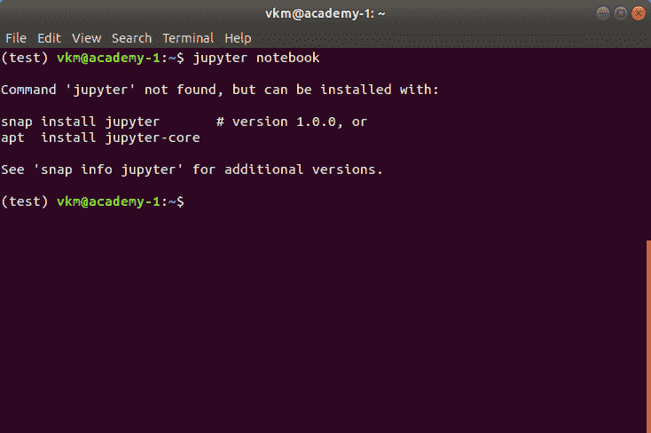
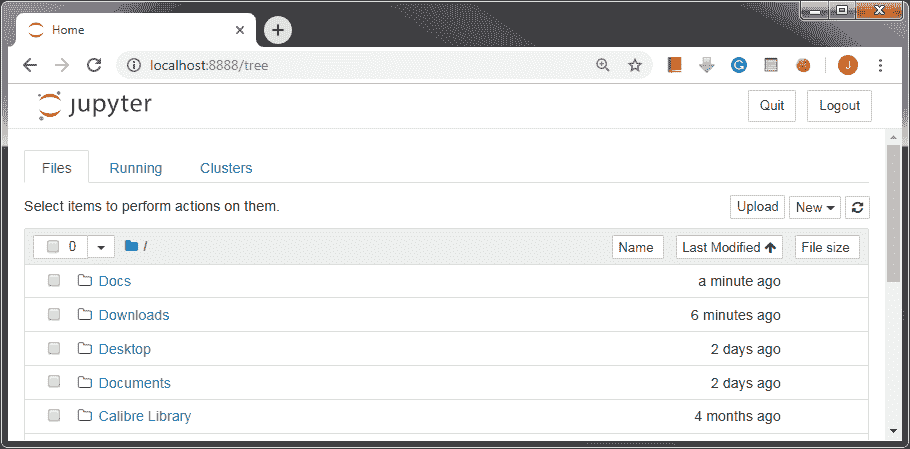
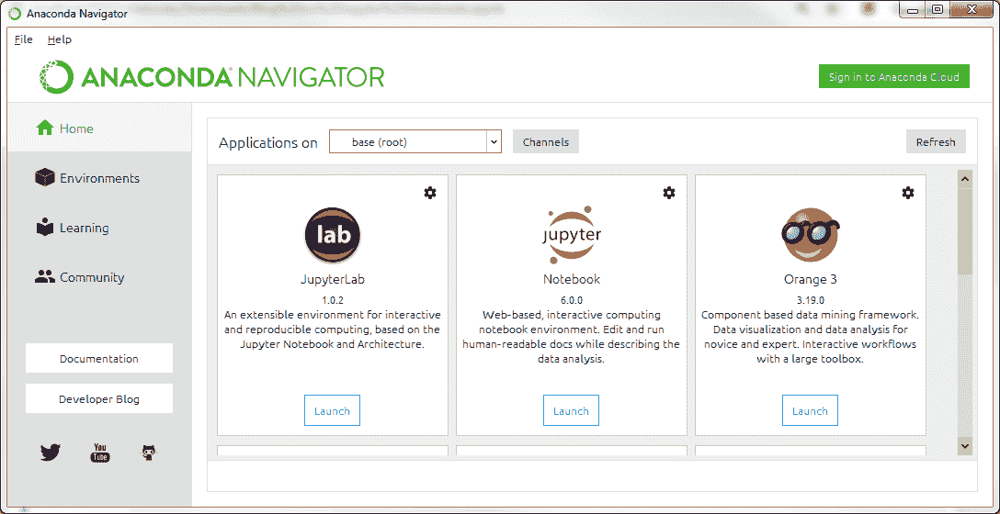
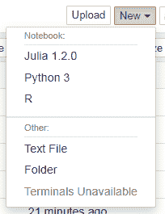
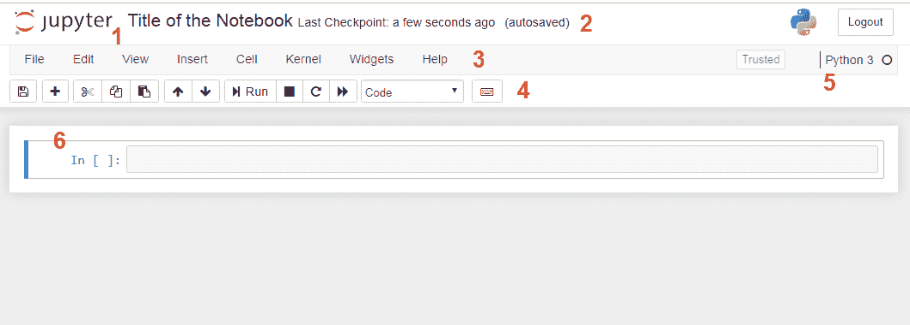

# Jupyter 笔记本教程:安装，组件和魔术命令

> 原文：<https://blog.quantinsti.com/jupyter-notebook-tutorial-installation-components-magic-commands/>

杰伊·帕尔马

这篇关于 Jupyter 笔记本(以前称为 IPython 笔记本)的文章不需要任何先决知识，也不假定您熟悉该框架。这篇博客是一篇介绍性文章，我将主要回答以下问题:

*   [什么是 Jupyter 笔记本？](#what)
*   [如何安装 Jupyter 笔记本环境？](#install)
*   [如何运行或打开 Jupyter 笔记本？](#run)
*   [Jupyter 笔记本有哪些不同的组件？](#components)
*   Jupyter 笔记本中的单元格是什么？
*   [如何用 Markdown 语言写作？](#markdown)
*   [朱庇特笔记本里有哪些神奇的命令？](#commands)
*   [如何下载分享 Jupyter 笔记本？](#share)

阅读本博客后，你将能够:

*   安装 Jupyter 笔记本环境
*   打开木星笔记本电脑
*   了解各种组件
*   下载并分享木星笔记本

除了上面的问题，你还将在 Jupyter 笔记本上学习 Markdown 语言的写作。先从第一个问题开始。

### Jupyter 笔记本是什么？

如果你是学生，你必须使用课堂笔记本来记各种课堂笔记；如果你是商务人士，你可能会使用书写板来记下重要的笔记，无论是为了自己的目的还是为了向他人演示。

记录在学生笔记本上的典型内容可以是各种格式的文本，如**粗体**和*斜体*，或者是表格、数学方程式，或者是手绘图像等创造性的东西。不要忘了，如果是程序员的笔记本，里面也会包含很多编程代码。

现在，你想继续这种在网上一个地方写所有这些东西的做法。朱庇特笔记本来拯救我们了。它是一个基于网络的平台，允许你在一个地方编写各种格式的叙述性文本，包括表格或图像，用各种编程语言编写方程和代码。

除此之外，Jupyter notebook 还允许你编写 LaTeX 代码，包含 HTML 代码，嵌入一个 YouTube 视频。我稍后会谈到如何做到这一点，但首先让我们看看它的[官方文档](https://jupyter.org/documentation)是怎么说的:

> Jupyter Notebook 是一个开源的 web 应用程序，允许您创建和共享包含实时代码、等式、可视化和叙述性文本的文档。用途包括数据清理和转换、数值模拟、统计建模、数据可视化、机器学习等等。

为了了解 Jupyter 笔记本的外观，请务必观看下面由 Quantra 制作的视频，该视频提供了关于它的简短描述:

[https://www.youtube.com/embed/uWhN3tEYxZI?rel=0](https://www.youtube.com/embed/uWhN3tEYxZI?rel=0)

您也可以参考以下列表，直观了解 Jupyter 笔记本的外观:

*   [支持向量分类器](https://github.com/goquantra/introduction-to-machine-learning-for-trading/blob/master/section-4/unit-8-notebook-support-vector-classifier-strategy.ipynb)
*   [贸易分析](https://github.com/QuantInsti/EPAT/blob/master/Statistical%20Arbitrage/Trade%20Analysis.ipynb)
*   [太阳医药 Vs HDFC 银行](https://github.com/QuantInsti/quantrautil/blob/master/Sun%20Pharma%20Vs%20HDFC%20Bank.ipynb)

背景: *Jupyter 笔记本*是 Jupyter 项目的两个方面之一，该项目开始开发跨数十种编程语言的交互式计算的开源、开放标准。另一个是 *JupyterLab* ，这是 Jupyter 笔记本界面的高级版本。然而，两者都以相似的方式运行。

现在你对 Jupyter 笔记本有了一个概念，让我们来看看它的安装过程。

### 如何安装 Jupyter 环境？

`jupyter notebook`

如果上述命令失败，您可以继续阅读本节。否则，您可以安全地跳过这一步，继续下一节。如果该命令失败，并且您得到类似(不确切)如下所示的错误，请继续阅读本节以了解安装过程。



可以在工作站上安装 Python 的两种流行方法。他们是

1.  使用 Anaconda 发行版安装 Python
2.  安装原始 Python

虽然 Jupyter 运行许多编程语言的代码，但 Python 是安装 Jupyter 笔记本的一个要求。

### 使用 anaconda 安装 jupiter 笔记本

如果您已经使用 Anaconda 发行版安装了 Python，就可以开始了。Anaconda 发行版包括 Python、Jupyter Notebook 和其他科学界常用的软件包。

如果您没有安装任何版本的 Python，建议您使用 Anaconda 发行版来安装 Python。安装 Python 应该很简单。

*   首先，下载 Anaconda 发行版的最新版本。
*   其次，安装 Anaconda 的下载版本。

嘭！您已经安装了 Jupyter 笔记本。要检查安装是否成功，并运行 Jupyter 记事本，请在 Anaconda 提示符或命令提示符(Windows)或终端(Mac/Linux)中运行以下命令。

`jupyter notebook`

如果在运行上面的命令时出现错误(这是不应该发生的)，请尝试下面的方法。

### 使用 pip 安装 jupiter 笔记本

当你直接从它的[官网](https://www.python.org/)安装 Python 时，它的标准库中并不包含 Jupyter Notebook。在这种情况下，您需要使用 pip 安装 Jupyter Notebook。流程如下:

1.  打开新的命令提示符(Windows)或终端(Mac/Linux)
2.  执行以下命令安装 jupiter notebook

`python -m pip install jupyter`

或者如果你用的是 Python 3

`python3 -m pip install jupyter`

或者干脆就是

`pip install jupyter`

恭喜你，你已经安装了 Jupyter 笔记本！继续经营下去。

### 如何运行或打开 Jupyter 笔记本？

在您的计算机上安装了 Jupyter 笔记本后，您就可以运行笔记本服务器了。

如果你正在从头开始阅读这篇文章，那么你可能已经知道如何运行 Jupyter 笔记本。然而，如果你跳过了前面的章节，直接跳到这里，下面提到的步骤显示了如何运行 Jupyter 笔记本。

首先，在您的工作站上打开一个新的命令提示符(Windows)或终端(Mac/Linux ),然后执行以下命令:

`jupyter notebook`

在执行上述命令时，终端或命令提示符将打印一些关于正在加载的 Jupyter 笔记本的信息。它可能看起来像下面的快照所示。请注意，每个工作站打印的信息会有所不同。


让航站楼保持原样开放。然后，它将使用命令提示符或终端中提到的 URL 打开默认的 web 浏览器。

当笔记本在您的浏览器中打开时，您将看到*笔记本主页*，如下图所示。这将列出笔记本服务器启动目录中的笔记本文件和子目录。



如果您使用的是 Python 的 Anaconda 发行版，您可以打开下面显示的  (使用开始菜单(Windows)、应用程序文件夹(Mac)或软件文件夹(Linux))，它允许您使用点击来打开 Jupyter 笔记本。



Navigator 应用程序打开后，您可以单击笔记本对话框中的 Launch 按钮来启动 Jupyter 笔记本应用程序。单击启动按钮后，您将看到我们之前看到的主页。

现在，让我们了解 Jupyter 环境是如何工作的，不过我不会从技术角度讲。由于 Jupyter Notebook 是一个 web 应用程序，它在服务器-客户机架构上工作。当您执行命令`jupyter notebook`时，Jupyter 软件在执行该命令的控制台中本地启动服务器，在 web 浏览器中打开的 Jupyter 笔记本主页作为客户端工作。无论您执行什么操作，即创建或上传新笔记本，还是保存现有笔记本，您正在使用的客户端笔记本都将与运行在控制台/命令行中的服务器保持通信。

为了让笔记本流畅运行，我们需要保持命令提示符或终端打开，即使它已经打开了主页。如果关闭它，您正在使用的笔记本将无法与本地服务器通信，因此，您所做的任何工作都不会保存在永久内存中。

下一步是学习 Jupyter 软件的各种组件。

### Jupyter 笔记本有哪些不同的组件？

我假设你是按照本文的时间顺序。如果是这样，那么你已经学会了什么是 Jupyter 笔记本，如何安装，如何运行和打开它。如果没有，那么我会建议你浏览它们以获得一个整体的画面。尽管如此，如果你已经熟悉这些部分，继续学习。

在这一节中，我将解释 Jupyter 软件的各种组件。当您启动 Jupyter 笔记本应用程序时，您将看到主页。让我们开始探索吧。下面显示的是您之前看到的主页的快照，但是为每个组件都指定了编号，以便于我们学习。


以下是快照中显示的每个编号点的描述。

1.  Jupyter 服务器运行在这个 URL 上。如果您在本地主机上运行 Jupyter，这将是您启动 Jupyter 软件时控制台中显示的相同 URL。
2.  *文件*选项卡列出了主文件夹中的目录和文件，主文件夹通常是登录到计算机的用户的主目录。
3.  *运行*选项卡显示所有打开的笔记本列表。当你开始一个新的笔记本或打开一个现有的笔记本时，一个内核将被附加到它上面。所有这些正在运行的内核都将列在该选项卡下。
4.  如果您想打开现有的 Jupyter 笔记本(以。ipynb 扩展名)，它需要在“文件”选项卡中列出。如果没有列出，您需要使用*上传*按钮来上传，这将打开一个文件浏览器供您加载文件。
5.  *退出*和*注销*按钮允许你注销和关闭服务器。当您退出时，所有打开的笔记本都将关闭，并且服务器将关闭。
6.  *新建*按钮允许您创建新的笔记本、文本文件、文件夹或终端。下面的快照显示了您可以用 Python、Julia 和 R 语言创建一个笔记本。您创建的笔记本将与各自的内核相关联。当你按照上一节的方法安装 Jupyter 环境时，很有可能你的内核只有一个选项，那就是 Python。为了添加新的语言，你可以参考。



您可以通过单击相应的语言名称来创建新的笔记本。无论您选择哪种语言，您创建的新笔记本都将具有相同的外观。不同之处在于附加在它上面的内核。如果我在打开的下拉菜单中点击 *Python 3* ，将会创建一个附加了 Python 内核的新笔记本。下面的快照显示了空的 Jupyter 笔记本。*(明显没有数字:p)*



新创建的笔记本具有各种组件，如下所述:

1.  *标题*是笔记本的名称。您设置的标题将成为笔记本的文件名，扩展名为*。ipynb* 代表 *IPython 笔记本*。
2.  *检查点*向您显示笔记本上次保存的时间。
3.  *菜单栏*列出了各种菜单，允许你下载笔记本(多种格式)，打开一个新的笔记本，编辑笔记本，定制标题，操作单元格，轻推内核，访问帮助等等。
4.  *快捷栏*列出了常用的快捷方式，如*保存*保存笔记本、*添加单元格*、*剪切*、*复制*操作单元格、*向上*和*向下*导航单元格、*运行*执行单元格等等。您添加到 Jupyter 的任何扩展都将在此栏上有其快捷方式。我们将在本文的后半部分了解什么是扩展。
5.  *内核*显示了当前与笔记本相关的内核。在我们的例子中，内核是 *Python 3* 。内核旁边的圆圈表示内核的状态。空心圆表示它准备好接受输入并运行单元。当内核正在执行代码或处理任何事情时，它会变成固态。
6.  一个*单元*是笔记本的一部分，所有神奇的事情都发生在这里。下一节将详细解释这些单元。

### Jupyter 笔记本中的单元格是什么？

您编写的任何文本或代码都将放入单元格中。电池是任何 Jupyter 笔记本的组成部分。单元格有两种工作模式:*命令*和*编辑*模式，主要有三种:*编码*、*降价*和*原始 NBConvert* 。

*命令*模式允许你操作单元格。也就是说，您执行的操作与整个细胞有关。命令模式由带有蓝色指示的单元格周围的灰色边框表示，如下图所示。


当单元格处于命令模式时，您可以执行的一些操作(及其快捷键)如下:

*   *插入*一个新的单元格-键在`A`中插入一个新的单元格在上面，而`B`在当前单元格下面插入一个新的单元格。
    *   当插入新单元时，默认情况下，它将是代码类型单元。我们一会儿会看各种类型。
*   *合并*现有单元格- `Shift-M`允许合并选中的单元格，或者将当前单元格与当前单元格下的单元格合并。
*   *复制*单元格- `C`复制选中的单元格。
*   *剪切*细胞- `X`剪切选中的细胞。
*   *粘贴*单元格-使用`Shift-V`粘贴单元格。
*   *删除*现有单元格-按`D`，`D`删除当前单元格。小心这条捷径。
*   *更改*单元格类型——快捷键`Y`将单元格类型更改为*代码* , `M`将单元格类型更改为*降价*,`R`将单元格类型更改为*原始*。
*   将单元格转换成标题——Jupyter 笔记本中有六种标题类型。这仅适用于*降价*单元类型。标题 1 是最大标题，标题 6 是最小标题。`1`、`2`、`3`、`4`、`5`、`6`用于将单元格类型更改为各自的标题大小。
*   *在现有单元格中查找并替换*-按`F`打开查找并替换对话框。
*   *保存*并标记笔记本的*检查点*——使用`Shift-S`保存笔记本。
*   *切换*单元格中的行号-按`L`切换当前单元格中的行号。
*   *切换*一个单元格的输出- `O`允许你切换当前单元格的输出。
*   *中断内核*——按键`I`，`I`中断内核。也就是说，如果内核正在执行某个进程，它就会停止。
*   *滚动*笔记本- `Space`向下滚动笔记本，`Shift-Space`向上滚动笔记本。
*   *进入*编辑模式-按`return`键将单元格的模式变为编辑模式。

上面提到的快捷键只在*命令*模式单元中有效。Jupyter 笔记本电池支持的另一种模式是*编辑*模式。此模式特别允许您编辑单元格的内容并使用它。您可以通过按下`return`键或在单元格内点击鼠标进入单元格的编辑模式。当单元格处于*编辑*模式时，单元格周围的边框变为绿色，如下图所示。


一旦单元格处于*编辑*模式，您就可以开始编写代码或文本。以下是单元格处于*编辑*模式时可以执行的一些操作。

*   *代码自动完成*-使用`Tab`键使用该设施。它仅适用于代码类型单元格。在 markdown 单元格中，它将简单地放置制表符。
*   code - Jupyter 笔记本的*缩进*固有地在需要时执行缩进。但是，如果您想要手动更改缩进，请使用`Ctrl-]`来缩进代码类型单元格中的代码。在 markdown 单元格中，它将根据 tab 键的规范插入空格。
*   *代码的删除*——任何时候你想删除代码，使用`Ctrl-[`来完成。在 markdown 单元格中，此快捷方式的工作方式类似于`Shift-Tab`并删除内容。
*   *注释*一段代码——使用`Ctrl-/`注释一段代码。在 markdown 单元格中，此快捷方式不起任何作用。
*   *执行一个单元格*——一旦你在单元格中写了代码或者文本，你需要执行它来处理你写的内容。有三种主要方法可以做到这一点。
    *   *运行当前单元格并选择下一个单元格* -使用`Shift-Enter`执行该操作。
    *   *运行选定的单元格* -使用`Ctrl-Enter`运行选定的单元格或当前单元格。
    *   *运行当前单元格并插入新单元格* -按`Alt-Enter`执行当前单元格并在当前单元格下插入新单元格。
*   *分割一个单元格* -使用快捷键`Ctrl-Shift-Minus`在光标处将当前单元格分割成两个独立的单元格。
*   *进入命令模式*——使用`Ctrl-M`或按`Esc`键退出编辑模式，进入命令模式。

到目前为止，您已经多次遇到过*代码*和*降价*单元类型。如果你不知道这两者，现在我将详细解释它们。我将只讨论这两种类型；在这篇文章中，我不会涉及 *Raw NBConvert* 类型。

Jupyter 笔记本电池可以有多种类型。常用的类型有*代码*和*降价*。代码类型单元格允许您编写实时编程代码。也就是说，您可以在其中执行任何类型的编程。一旦您运行或执行一个代码单元格，Jupyter notebook 将在单元格下方显示输出。这显示在下面的快照中。


相反，无论在 markdown 单元格中写了什么，都会在单元格中打印出来，如下所示:


上面的快照中有两个单元格。编号为 4 的第一个单元格是代码单元格，它允许在我们使用 Python 内核笔记本时绑定 Python 代码。下一个单元格是写正常文本的 markdown 单元格。

可以看出，代码单元格有一个与之相关的编号，而降价单元格没有任何编号。对代码单元格进行编号有两方面的帮助:首先，它显示了代码执行的顺序，其次，它允许我们直观地区分代码单元格和降价单元格。现在您已经了解了单元格及其工作原理的基础，让我们看看如何使用 markdown。

### Jupyter 笔记本里 Markdown 怎么写？

正是降价功能为 Jupyter 环境带来了交互性。Markdown 单元格不仅允许您编写文本，还允许您格式化文本、添加超链接和包含 HTML 代码。此外，它还允许您定义有序和无序列表、插入图像和表格、添加数学方程、用 LaTex 编写等等。它甚至允许您在文本中编写编程代码，而不会丢失任何语法。

一旦有了 markdown 单元格(可以在命令模式下使用快捷键`M`将 code 单元格转换成 markdown 单元格)，就可以开始按照自己想要的方式书写文本了。下面提到的是降价单元格支持的功能。

### 标题

要创建标题，请使用散列符号`#`后跟一个空格和标题。这样会创建一个标题或一级标题。如果您想创建子标题，请使用`##`后跟一个空格和子标题。该笔记本允许创建多达六个级别的标题。每个等级都有相同数量的`#`标记，如下所示:

`# Heading 1` -标题
`## Heading 2` -标题
`### Heading 3` -副标题
`#### Heading 4` -标题四级
`##### Heading 5` -标题五级
`###### Heading 6` -标题六级

### 强调

你可以用`*`或`_`将文本*变成斜体*。

| 投入 | 输出 |
| --- | --- |
| `*This is italic text.*` | 这是斜体文本。 |
| `_This is italic text._` | 这是斜体文本。 |

你可以用`**`或`__`将文本**加粗为**。

| 投入 | 输出 |
| --- | --- |
| `**This is italic text.**` | 这是斜体文本。 |
| `__This is italic text.__` | 这是斜体文本。 |

### 单一空间字体

如果您想引用文本中的一些代码、文件名或文件路径，您可以使用等宽字体来区分普通文本和`monospace`字体。您可以用单引号将文本括起来。(`)

`This is written in monospace fonts.`

### 换行

您可以使用 HTML 换行符标签`<br>`在一行中插入回车来换行。

### Font Color

您可以通过使用 HTML 字体标签及其*颜色*属性来改变文本的颜色。例如，要将文本着色为蓝色，可以使用以下代码:

`<font color='blue'>The color of this text is blue.</font>`

上述代码的输出如下所示:

这篇课文的颜色是蓝色的。

改变`font`标签的颜色属性来改变文本颜色。记住，并不是所有的降价文本都使用字体标签。因此，请仔细复习。

### 引用

使用大于号`>`后跟一个空格来键入或插入块引号。输出将缩进，左边有一条灰色水平线。例如，行`> Jupyter makes life easy!`的输出如下:

> Jupyter 让生活变得简单！

### 无序列表

您可以使用减号或破折号`-`后跟一个项目名称来创建一个无序列表。下一次发生在下一行。

`- Item 1`
`- Item 2`
T2】

要创建子列表，遵循相同的过程；然而，有了缩进。能否创建如下所示的列表:

*   项目 1
    *   项目 1.1
    *   项目 1.2
        *   项目 1.2.1
*   项目 2
    *   项目 2.1
    *   项目 2.2

在 Jupyter 中，第一级列表项通常有实心圆，下一级有实心方块，后续级有空心圆。

### 有序列表

可以通过手动指定项目编号来创建有序列表，例如`1`，后跟点和空格，最后是项目名称。要创建子列表，过程是相同的。

1.  第一章
    1.  第 1.1 节
2.  第二章
    1.  第 2.1 节
    2.  第 2.2 节

### 水平线

您可以使用三个星号`***`创建一条水平线。

* * *

### 超链接

您可以将任何普通文本转换为超链接，方法是用方括号将它括起来，然后用括号将实际链接括起来。举个例子，

`[QuantInsti's Blog]([https://blog.quantinsti.<wbr>com](https://blog.quantinsti.com))`

会导致

[QuantInsti 的博客](/)

### 形象

在 markdown 单元格中插入图像的格式与超链接的格式非常相似。唯一不同的是它在内容前加了前缀`!`。首先是感叹号，然后是方括号中的图像名称，最后是括号中的 URL。如下所示:

`)`

或者，您可以使用 HTML 图像标签来插入图像，如下所示:

`cloudfront.net/production/<wbr>images/header-logo-green.png](https://dt99qig9iutro.cloudfront.net/productiimg/header-logo-green.png)" alt="QuantInsti's Logo">`

两者都会产生以下结果:


### 几何形状

通过使用十进制参考数，UTF-8 几何形状可以包含在 Jupyter 笔记本中。使用以下格式插入任何形状。

`&#reference_number;`

可以插入一个黑色圆圈，如下所示:

●

### 编程代码

您可以在文本中嵌入编程代码，使用三个反勾号，后跟编程语言名称，并以三个反勾号结尾。下面是文本中嵌入的 Python 代码示例。

```
```python
def func(x):
 return x**2
```

```

类似地，可以编写另一种语言的编程代码。例如，下面的代码是针对 Javascript 的。

```
```javascript
console.log('Hello World!')
```

```

### 乳胶方程

借助 MathJax，您可以在 markdown 单元格中内联或单独包含数学表达式。要内联输入，等式用`$`括起来。要在新的一行上单独打印方程，用`$$`将它们括起来。例如，计算平均值的公式可以写成

`$$\mu = \frac{1}{n}\sum_{i=1}^{n} x_i $$`

这会导致以下结果:


内联方程可以写成`$x_t = \phi x_{t-1} + \epsilon_t$`,其结果为


你可以参考[这个](https://math.meta.stackexchange.com/questions/5020/mathjax-basic-tutorial-and-quick-reference)线程，它列出了可以在 markdown 单元格中使用的各种 LaTeX 命令。

### 桌子

您可以在减价单元格中创建表格，如下所示:

```
|This|is|
|-|-|
|a|table|
```

列由竖线`|`分隔，行被写入新的一行。生成上表，如下所示:

| 这 | 是 |
| --- | --- |
| a | 桌子 |

### 朱庇特笔记本里有哪些神奇的命令？

Jupyter 笔记本软件带有一系列内置命令，在使用时增加了交互性。在 Jupyter 环境中它们被称为魔法命令。这些命令依赖于您正在使用的解释器或内核。要查看哪些魔术命令可用，您可以在代码单元格中运行以下魔术命令:

`%lsmagic`

这些神奇的命令以`%`值为前缀。以下是一些常用的魔术命令及其功能:

*   命令会定期自动保存您的笔记本。T1
*   将当前工作目录更改为作为参数给出的新目录。
*   `%clear`和`%cls`命令清除当前单元的输出。
*   `%env`允许您列出所有环境变量以及设置特定环境变量的值。
*   `%history`显示以前执行的魔法命令的历史。T1
*   `%ls`列出当前目录的内容。T1
*   `%matplotlib`允许您在笔记本内绘制图表。T1
*   `%notebook`命令增加了绘制图表时的交互性。
*   `%pdb`允许你调试代码。这个神奇的命令是 Python 调试器的 Jupyter 版本。
*   使您能够列出并安装 Jupyter 环境中所有可用的软件包。T1
*   `%who`列出全局范围内的所有变量。T1
*   `%load`从外部脚本插入代码。T1
*   `%run`允许你运行 Python 代码。T1
*   `%time`显示单元格执行所用的时间。

如果您使用的是 Anaconda Python，那么上面提到的神奇命令应该没有任何问题。否则，您可能需要安装以下软件包:

*   ipython-sql
*   cython

### Jupyter 笔记本如何下载分享？

作为一名程序员，您经常希望将自己完成的工作与其他同事分享。记住这一点，Jupyter 环境允许您下载多种格式的文件，如 HTML 文件(。html)、LaTeX 文件(。tex)、GitHub 风味降价文件(。md)、PDF 文件(。pdf)、重构文件(。rst)，以此类推。文件菜单中的*下载为*选项允许您以自己选择的格式下载笔记本，如下所示:


当你下载一个笔记本的时候，无论它是什么状态都会被下载。这是已执行单元的输出，任何可能的输出错误都是真实的。因此，准备一个可以共享的笔记本是很重要的。为此，您可以执行以下步骤:

1.  进入*单元格*菜单，选择*所有输出*选项，最后选择*清除*选项。此操作将清除所有单元格的输出。
2.  接下来，进入*内核*菜单，选择*重启&运行所有*选项。该操作将重启内核并执行所有单元。

执行上述步骤后，确保笔记本处于您希望与其他人共享的状态。

除了将笔记本导出到您的本地工作站，您还可以在 GitHub Gists 上创建、列出和加载它。Gists 是一种在云上分享你的工作的方式。你可以在这里找到更多信息[。](https://github.com/mozilla/jupyter-notebook-gist)

此外，您还可以使用为多个用户提供 Jupyter 笔记本的 [JupyerHub](https://github.com/jupyterhub/jupyterhub) 。换句话说，它是多用户服务器上笔记本电脑的托管平台。

此外，您可以使用 [nbviewer](https://github.com/jupyter/nbviewer) 将 Jupyter 笔记本呈现为静态网页。像 [RISE](https://github.com/damianavila/RISE) 和 [nbpresent](https://github.com/Anaconda-Platform/nbpresent) 这样的平台可以让你将 Jupyter 笔记本转换成幻灯片。

## 最后的想法

我希望这份 Jupyter 笔记本入门指南为您提供了基础。在这篇由多个部分组成的文章中，首先，我开始解释 Jupyter 笔记本，它的安装过程，在您的工作站上本地运行等等。接下来，在这个过程中，你也接触到了 Jupyter 笔记本的各种组件和键盘快捷键。然后，你学会了用低价语言写作。在那之后，你在朱庇特笔记本上学习了各种魔法指令。最后，您学习了如何下载和共享 Jupyter 笔记本。

感谢阅读。

有许多人可能是 Python 或编程的新手，或者从未创建过任何交易策略。如果你是这两种技能的初学者，学习曲线可能会很陡。然而，你可以通过在这里注册来逐步建立所需的技能，并定期练习我们课程中给出的实践学习练习:[人人算法交易](https://quantra.quantinsti.com/learning-track/algorithmic-trading-for-everyone)。

如果你想学习算法交易的各个方面，那就去看看我们的[算法交易(EPAT )](https://www.quantinsti.com/epat/) 高管课程。课程涵盖统计学&计量经济学、金融计算&技术和算法&定量交易等培训模块。EPAT 旨在让你具备成为成功交易者的正确技能。[现在报名](https://www.quantinsti.com/epat/)！

*免责声明:本文中提供的所有数据和信息仅供参考。QuantInsti 对本文中任何信息的准确性、完整性、现时性、适用性或有效性不做任何陈述，也不对这些信息中的任何错误、遗漏或延迟或因其显示或使用而导致的任何损失、伤害或损害承担任何责任。所有信息均按原样提供。*