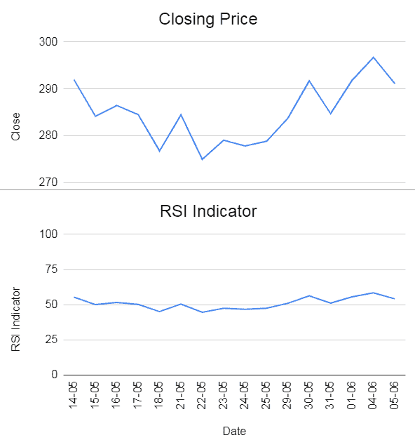
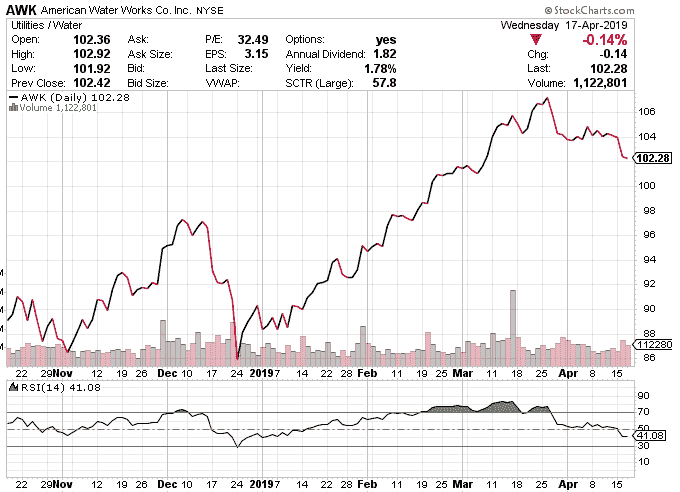
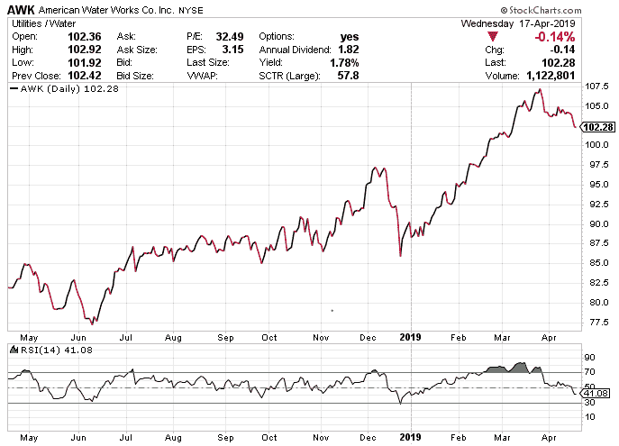
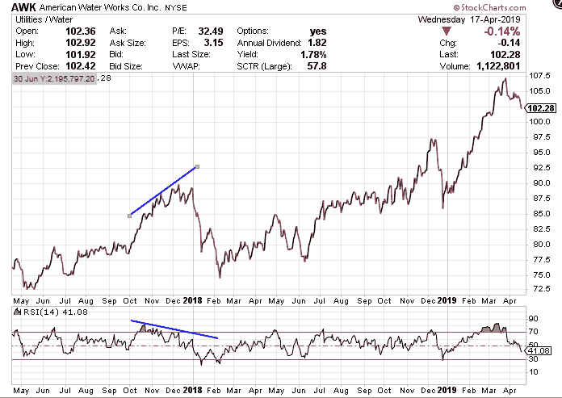
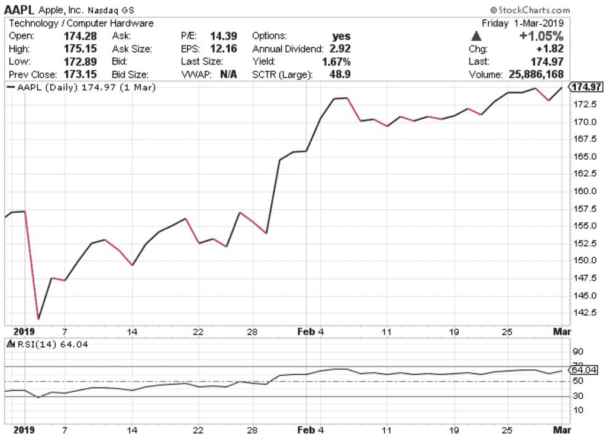
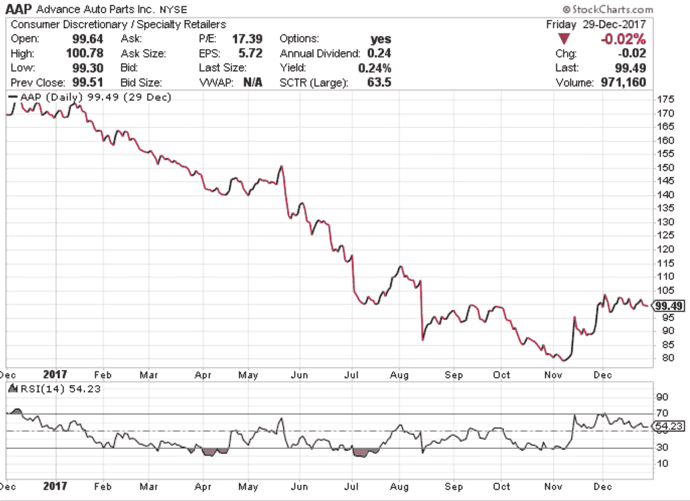
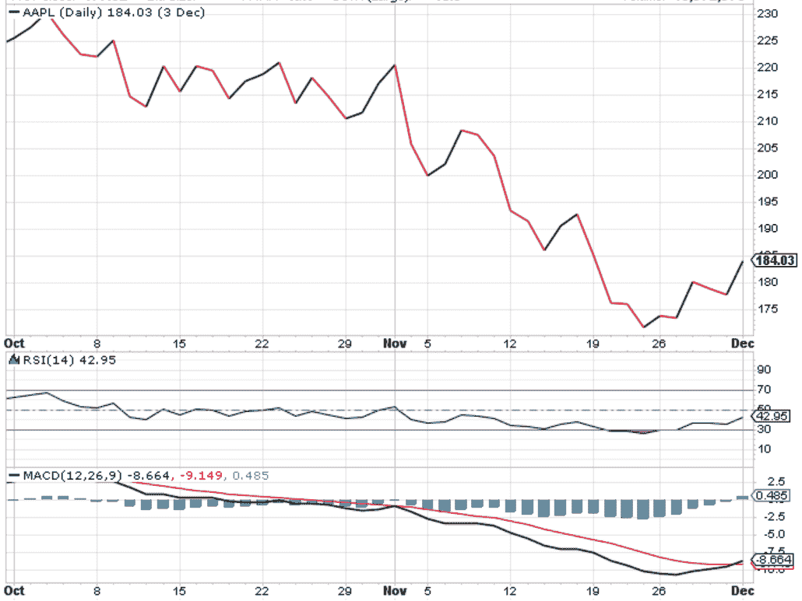

# RSI 指标:股票、公式、计算和策略

> 原文：<https://blog.quantinsti.com/rsi-indicator/>

以[重香重香](https://www.linkedin.com/in/rekhit/)

相对强弱指数(RSI)指标，顾名思义，告诉我们资产的相对强弱。换句话说，RSI 告诉我们股票相对于自身的表现如何。RSI 被认为是一个强大的技术指标，可以用来分析市场，也是交易者武器库的重要组成部分，因为它可以帮助他们在选择市场时机时做出更好的决定。当然，像其他[指标](https://www.quantinsti.com/blog/indicators-build-trend-following-strategy)一样，使用多个指标总是明智的，因为这有助于我们避免局限和过度依赖一个指标。

因此，在这篇博客中，除了理解 RSI 指标，我们还将看看它的局限性以及何时使用它们。我们将在这篇博客文章中讨论以下几点:

*   [RSI 图、公式和示例](#formula)
*   [基于 RSI 指标的策略](#strategy)
*   [相对强度指数和 MACD 之间的差异](#difference)

If you already know how to find the RSI indicator values, jump to the RSI based strategies [here](#strategy).

### **借助示例进行 RSI 计算**

Let’s understand how to calculate and graph the RSI indicator now. While you can easily calculate the RSI indicator value with the python code, for explanation purposes we will do it manually.

| **日期** | **Close**(1) | **Change**(2) | **Gain**(3) | **Loss**(4) | **Avg Gain**(5) | **Avg Loss**(6) | **RS**(7) | **14-day RSI**(8) |
| 24-04 | Two hundred and eighty-three point four six |  |  |  |  |  |  |  |
| 25-04 | Two hundred and eighty point six nine | -2.77 | Zero | Two point seven seven |  |  |  |  |
| 26-04 | Two hundred and eighty-five point four eight | Four point seven nine | Four point seven nine | Zero |  |  |  |  |
| 27-04 | Two hundred and ninety-four point zero eight | Eight point six | Eight point six | Zero |  |  |  |  |
| 30-04 | Two hundred and ninety-three point nine | -0.18 | Zero | Zero point one eight |  |  |  |  |
| 01-05 | Two hundred and ninety-nine point nine two | Six point zero two | Six point zero two | Zero |  |  |  |  |
| 02-05 | Three hundred and one point one five | One point two three | One point two three | Zero |  |  |  |  |
| 03-05 | Two hundred and eighty-four point four five | -16.70 | Zero | Sixteen point seven |  |  |  |  |
| 04-05 | Two hundred and ninety-four point zero nine | Nine point six four | Nine point six four | Zero |  |  |  |  |
| 07-05 | Three hundred and two point seven seven | Eight point six eight | Eight point six eight | Zero |  |  |  |  |
| 08-05 | Three hundred and one point nine seven | -0.80 | Zero | Zero point eight |  |  |  |  |
| 09-05 | Three hundred and six point eight five | Four point eight eight | Four point eight eight | Zero |  |  |  |  |
| 10-05 | Three hundred and five point zero two | -1.83 | Zero | One point eight three |  |  |  |  |
| 11-05 | Three hundred and one point zero six | -3.96 | Zero | Three point nine six |  |  |  |  |
| 14-05 | Two hundred and ninety-one point nine seven | -9.09 | Zero | Nine point zero nine | Three point one three | Two point five two | One point two four | Fifty-five point three seven |
| 15-05 | Two hundred and eighty-four point one eight | -7.79 | Zero | Seven point seven nine | Two point nine one | Two point nine | One | Fifty point zero seven |
| 16-05 | Two hundred and eighty-six point four eight | Two point three | Two point three | Zero | Two point eight six | Two point six nine | One point zero six | Fifty-one point five five |
| 17-05 | Two hundred and eighty-four point five four | -1.94 | Zero | One point nine four | Two point six six | Two point six four | One point zero one | Fifty point two |
| 18-05 | Two hundred and seventy-six point eight two | -7.72 | Zero | Seven point seven two | Two point four seven | Three | Zero point eight two | Forty-five point one four |
| 21-05 | Two hundred and eighty-four point four nine | Seven point six seven | Seven point six seven | Zero | Two point eight four | Two point seven nine | One point zero two | Fifty point four eight |
| 22-05 | Two hundred and seventy-five point zero one | -9.48 | Zero | Nine point four eight | Two point six four | Three point two seven | Zero point eight one | Forty-four point six nine |
| 23-05 | Two hundred and seventy-nine point zero seven | Four point zero six | Four point zero six | Zero | Two point seven four | Three point zero three | Zero point nine | Forty-seven point four seven |
| 24-05 | Two hundred and seventy-seven point eight five | -1.22 | Zero | One point two two | Two point five four | Two point nine | Zero point eight eight | Forty-six point seven one |
| 25-05 | Two hundred and seventy-eight point eight five | One | One | Zero | Two point four three | Two point seven | Zero point nine | Forty-seven point four five |
| 29-05 | Two hundred and eighty-three point seven six | Four point nine one | Four point nine one | Zero | Two point six one | Two point five | One point zero four | Fifty-one point zero five |
| 30-05 | Two hundred and ninety-one point seven two | Seven point nine six | Seven point nine six | Zero | Two point nine nine | Two point three two | One point two nine | Fifty-six point two nine |
| 31-05 | Two hundred and eighty-four point seven three | -6.99 | Zero | Six point nine nine | Two point seven eight | Two point six six | One point zero five | Fifty-one point one two |
| 01-06 | Two hundred and ninety-one point eight two | Seven point zero nine | Seven point zero nine | Zero | Three point zero nine | Two point four seven | One point two five | Fifty-five point five eight |
| 04-06 | Two hundred and ninety-six point seven four | Four point nine two | Four point nine two | Zero | Three point two two | Two point two nine | One point four | Fifty-eight point four one |
| 05-06 | Two hundred and ninety-one point one three | -5.61 | Zero | Five point six one | Two point nine nine | Two point five three | One point one eight | Fifty-four point one seven |

#### 第一步:收盘价

We will take the closing price of the stock for 30 days. The closing price is mentioned in column (1).

#### 第二步:收盘价的变化

We then compare the closing price of the current day with the previous day’s closing price and note them down. Thus, from the table, for 25-04, we get the change in price as (280.69 - 283.46) = -2.77.

同样，对于 26-04，价格变化=(当前收盘价-前收盘价)= (285.48 - 280.6) = 4.79。然后，我们将在“变更(2)”一栏中列出结果。用这种方法，我们计算了价格的变化。

#### 第三步:得失

We will now create two sections depending on the fact the price increased or decreased, with respect to the previous day’s closing price.

如果价格上涨，我们在“收益”栏中记下差额，如果是亏损，我们在“亏损”栏中记下差额。

例如，在 2004 年 6 月 26 日，价格上涨了 4.79 英镑。因此，该值将记录在“增益”栏中。

如果你看 25-04 年的数据，价格下降了 2.77。现在，虽然值在“变化”栏中写为负数，但我们没有提到“损失”栏中的负号。而且只写成 2.77。以这种方式，用于列“增益(3)”和“损耗(4)”的表格被更新。

#### 第四步:平均得失

In the RSI indicator, to smoothen the price movement, we take an average of the gains (and losses) for a certain period.

虽然我们称之为平均值，但还是需要一点解释。对于前 14 个周期，它是值的简单平均值。

为了解释它，我们将查看平均增益栏。

因此，在该表中，前 14 个值将是从(25-04)到(14-05)，即(0.00+4.79+8.60+0.00+6.02+1.23+0.00+9.64+8.68+0.00+4.88+0.00+0.00+0.00)/14 = 3.13。

现在，由于我们更加强调最近的值，对于下一组值，我们使用下面的公式，

```
[(Previous avg. gain)*13)+ current gain)]/14.
```

因此，对于(15-05)，我们将计算平均增益为[(3.13*13)+0.00]/14 = 2.91。

同样，我们也将计算平均损失。

基于这些公式，该表针对“平均增益(5)”和“平均损耗(6)”列进行更新。

#### 步骤 5:计算 RS

Now, to make matters simple, we add a column called “RS” which is simply, (Avg Gain)/(Avg Loss). Thus, for 14-05, RS = (Avg Gain)/(Avg Loss) = 3.13/2.52 = 1.24.

以这种方式，用于列“RS (7)”的表被更新。在下一步中，我们最终计算出 RSI 值。

#### 步骤 RSI 的计算

```
RSI = [100 - (100/{1+ RS})].
```

For example, for (14-05),

RSI =[100-(100/{ 1+RS })]=[100-(100/{ 1+1.24 })]= 55.37。

以这种方式，表格被更新。

这是我们得到 RSI 值的方法。RSI 指标图总是根据收盘价创建的。例如，如果我们考虑上表中的 RSI 值，图表应该如下:



虽然这里提到的 RSI 公式被普遍接受，但我们可以根据平均损益值的权重对公式进行某些修改。众所周知，随着数据点数量的增加，RSI 指标可以更好地衡量市场。在你开始做交易决定之前，某些来源推荐至少 250 个数据点。

RSI 指标受欢迎的原因之一是因为它的值总是在 0 到 100 之间。这使得阅读和形成关于资产的观点变得容易。此外，人们普遍认为，低于 30 的数值表明“超卖”，而高于 70 的数值表明“超买”。

然而，这并不像看起来那么简单，如果我们试图仅仅基于这个因素进入和退出市场，我们将无法有效地交易，因为在许多情况下，这个建议可能会失败。你可以在下图中看到，从 3 月 19 日到 4 月 25 日，收盘价甚至在进入超买区后还在继续上涨。



记住这一点，让我们试着看看几个基于 RSI 指标的策略。

### **RSI 策略**

#### **作为趋势指标的 RSI**

RSI works as a reference when you want to gauge if the market is going through a [bullish or bearish](https://quantra.quantinsti.com/course/trading-using-options-sentiment-indicators) trend. While the general assumption that an indicator above 70 indicates overbought and below 30 indicates oversold holds true for most of the cases, there are others who insist that it can be held true for values above 66.6 and below 33.3 as well.

如果 RSI 收盘高于 66.6，但低于该值，不应该认为趋势已经逆转，你应该立即做空股票。相反，我们寻找图表，只要它保持在 33.3 以上，我们就可以说市场仍然看涨资产。

你可以在下图中看到，RSI 指标在 2018 年 7 月越过超买区，从那以后，价格继续上涨，表明牛市。



同样，如果 RSI 跌破 33.3，上涨但没有越过 66.6 关口(或假设的 70)，我们可以得出市场看跌的结论。

然而，人们不应将此作为购买(或出售)相关资产的唯一指标。我们将进入下一个话题来了解全貌。

#### **RSI 作为支撑和阻力**

As we have understood how to set up the RSI [trend indicator](/indicators-build-trend-following-strategy/), we can see that as the number of periods of gains increases when compared to the number of periods of losses, the RSI values will keep increasing. Thus, it gives a strong indication of a longer-term trend than the closing prices where the daily price fluctuations could show us a different story.

就像收盘价一样，我们可以使用 RSI 指标值来绘制支撑位和阻力位的趋势线，因此，在 RSI 值中可以很容易地观察到这一趋势的突破。你可以在下图中看到 RSI 和收盘价是如何突破的。


这里的交易是正确识别突破是可持续很长一段时间，还是一个错误的信号。

#### **相对强弱和背离**

RSI indicator can also be used to predict a divergence in the trend before the price trend actually reverses.

例如，如果价格线正在走高，但 RSI 指标由于资产的相对强度与前一时期的增长相比有所减弱而下跌，则通常可以发现背离。

例如，让我们说，价格收盘高于前几天，但收益并不像同期的平均收益那样可观。然后，RSI 会以低于前一天的价格收盘。在这方面，我们可以得到一个信号，即市场将在几天后检查价格，并据此进行交易。你可以在下图中看到，RSI 呈下降趋势，而价格持续上涨。最终，收盘价也会下降。



同样的道理，当收盘价已经下跌了一段时间，但 RSI 开始走高，这意味着价格将回升。

#### **RSI 双底信号和双顶信号**

As we have discussed in the section on Bollinger Bands, we can identify the double bottom and double top pattern using the RSI indicator too. The gist of the double bottom pattern identification is as follows.

1.  RSI 指标收于 30 以下，之后上涨至 30 关口以上。
2.  它再次向南，但收盘时高于 30，然后再次大幅上涨。

This is seen as a “W” formation on the chart. Traders usually use this pattern as a confirmation that the market is headed for the bullish direction. You can see in the following graph that the RSI indicator breached the 30 barriers on 2 Jan before rising up sharply and then closed below, but above the 30 barriers on 7 Jan. It then rose again and continued to rise throughout the month of January and February which indicates a bullish run. 

类似于双底，双顶的形态形成如下:

1.  RSI 指标突破 70 水平，然后再次跌破 70 水平。
2.  它再次上升，但收盘低于 70，然后再次急剧下降。

This is seen as an “M” formation on the price chart. Traders usually use this pattern as a confirmation that the market is headed for the bearish direction. You can see in the graph given below, the RSI level breaches 70 on Dec '17\. Later, it falls below the 70 thresholds and while it does rise higher, it does not cross the 70 thresholds again and then starts dropping, indicating a bearish run which lasts a year. 

#### **RSI 和 MACD 策略**

We have long understood that using a sole indicator as the basis for your trading decisions can be disastrous if we fail to read or there is a false signal generated by the indicator. The smart investor uses 2 or more indicators to identify a positive (or negative) signal and enters the market accordingly. With this factor, we use RSI and MACD to identify signals which can be used to trade profitably. To understand MACD and how to calculate it, you can refer to this [article.](https://www.quantinsti.com/blog/moving-average-trading-strategies/#macd)

**为什么我们一起使用 RSI 和 MACD 指标？**

我们一起使用 RSI 和 MACD 的原因是，由于它们比较资产价格行为的固有性质，它们是互补的。

在这个策略中，当 RSI 和 MACD 都显示资产超卖时，我们进入交易，当任何一个指标给我们一个价格已经进入超买区的信号时，我们退出交易。



你可以在上面的图表中看到，MACD 越过中线下方，表明下降趋势，但我们会等到 2018 年 11 月 RSI 突破 70 关口，但随后急剧下降。这里，我们有两个指标可能告诉我们，市场正在走向熊市，毫无疑问，我们可以看到收盘价一直下降到 2018 年 11 月底。因此，我们可以在 11 月做空该股，因为我们看到 RSI 指标在再次上涨前跌破 30，我们可以退出该头寸。

### **相对强弱指标和 MACD 指标的差异**

While we did mention that RSI indicators and MACD indicators have certain similarities, they have a different approach towards it. While RSI indicators consider the ratio of the gains and losses compared to the previous day, MACD is essentially a moving average of the price.

因此，我们应该小心，不要期望 RSI 和 MACD 会在特定的时间点给出相同的信号。

### **RSI 的局限性**

1.  RSI 的基本属性表明 70 以上的水平超买，这在强牛市中可能被证明是错误的，在这种情况下，公司发展迅速，并向股东公布良好的回报。在这种情况下，RSI 可以长时间保持在 70 以上，这对卖空者来说是灾难性的。熊市也是类似的情况，RSI 可以保持在 30 以下，并且在很长一段时间内不会超过该水平。
2.  RSI 也会给出错误的信号。有些时候，背离被指出，但股票继续其趋势。

Thus, it is always said that we should use the RSI with one or more indicators which will give us a holistic view of the market and help us extract maximum information from the price action of a particular asset.

### **结论**

In summary, once we know how to plot the RSI indicator, it is relatively easy to read it and form an opinion on the asset with the help of the RSI indicator graph. While a general level of 70 indicates overbought and 30 being oversold exists in the market, we have seen that it can be detrimental to rely on this bit of information entirely.

Hence we try to use different strategies on the basis of RSI indicators to give us the necessary confidence to time the market profitably. We also saw that it is always better to use one or more indicator to help us in making more educated guesses in the market.

算法交易策略入门包将帮助你使用能够适应实时市场条件的技术指标创建量化交易策略。

### **建议阅读:**

*   [布林线](https://www.quantinsti.com/blog/bollinger-bands)
*   [使用均线交叉交易漂亮的期权](https://www.quantinsti.com/blog/moving-average-crossover-trade-nifty-options)

<small>*免责声明:股票市场的所有投资和交易都涉及风险。在金融市场进行交易的任何决定，包括股票或期权或其他金融工具的交易，都是个人决定，只能在彻底研究后做出，包括个人风险和财务评估以及在您认为必要的范围内寻求专业帮助。本文提到的交易策略或相关信息仅供参考。*T3】</small>