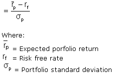
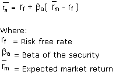
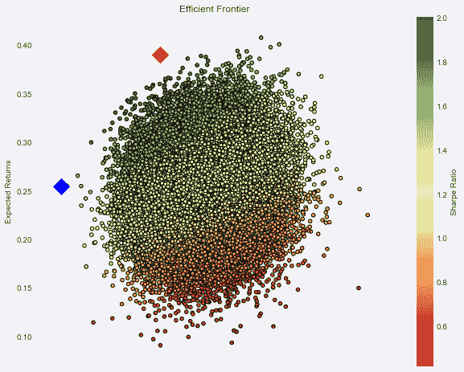
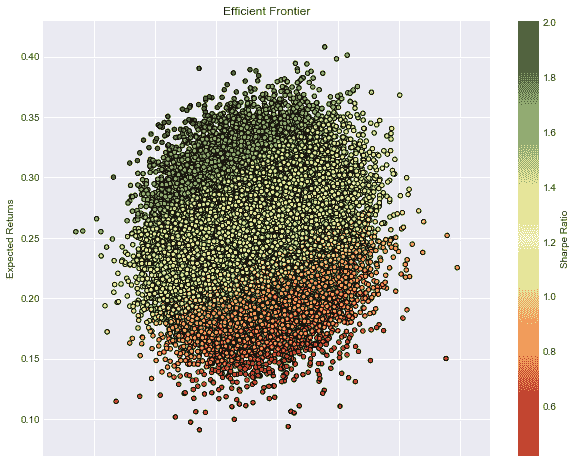

# 使用资本资产定价和 Fama-French 三因素模型的现代投资组合管理[EPAT 项目]

> 原文：<https://blog.quantinsti.com/modern-portfolio-capital-asset-pricing-fama-french-three-factor-model/>

本文是作者提交的最后一个项目，作为他们在 QuantInsti 的算法交易(EPAT)高管课程的一部分。请务必查看我们的[项目页面](https://www.quantinsti.com/category/project-work-epat/)，看看我们的学生正在构建什么。

### **关于作者**

[***Krishnan Ramchandran***](https://www.linkedin.com/in/krishnan-ramachandran-251b8193/)*在 BFSI 地区和资本市场的全球交付管理方面拥有丰富的专业知识。作为一名工程师和 MBA 学位持有人，他加入 EPAT 是为了提高自己对资本市场的定量分析知识。他的经验包括与华尔街公司合作，领导美国和印度的交易所以及全球 ICSDs。*

[***Sadagopan Viravalli***](https://www.linkedin.com/in/sadagopan-viravalli-5921961/)*是一名管理会计师，在金融服务、公共服务、电信、高科技和公用事业行业拥有超过 22 年的咨询经验。作为一个后 EPAT 时代的人，他渴望在国内和国际市场交易，与领先的投资银行/对冲基金合作，同时制定并执行量化策略。*

### **项目**

QuantInsti 的 EPAT 课程向我们介绍了现代投资组合理论(MPT)、Fama-French 三因素模型、资本资产定价模型(CAPM)、有效边界(EF)和多重量化技术。这一学习帮助我们理解了量化金融技术在投资组合管理中的相关性和应用，这也是我们在印度股票市场构建“我的投资组合”的动机。

我们利用 Python 中的编程从雅虎中提取数据。金融，并进行回溯测试，这有助于我们在 NSE 中获得正确的股票/脚本组合，因此，通过应用我们在量化金融技术中的知识，构建了“我的投资组合”。定义和概念引用自 Investopedia。

总之，我们在印度股票市场提出了“多股投资组合模型”方法，为大盘股、中盘股和小盘股分别设定权重，并从相应的 NSE 指数中为大盘股、中盘股和小盘股/脚本选择股票。“我的投资组合”在任何时间点都应包括约 90%的股票(即 20-25 只多股多行业股票)资金配置，以及约 10%的现金(或流动工具)，以抓住市场中可能出现的任何机会。

### **简介**

我们从事这个项目的动机有两个:

*   应用从 EPAT 课程中学到的知识，得出我们自己的投资组合模型，以及
*   为这些投资组合理论在印度股票市场的适用性和相关性提供证据

在本项目报告中，我们将了解如何对冲投资组合的理论和技术[理论](https://quantra.quantinsti.com/course/quantitative-portfolio-management)，并在此基础上了解我们通过[回溯测试](/backtesting/)Python 中的算法进行的数据挖掘/分析，最终得出我们的“我的投资组合”模型及其持续的重新平衡方法。

### **现代投资组合理论**

现代投资组合理论(MPT)是由哈里·马科维茨(Harry Markowitz)在其论文“投资组合选择”(1952 年由《金融杂志》发表)中提出的一个假设，是一种基于以下思想的投资理论:风险厌恶型投资者可以根据给定的市场风险水平构建投资组合，以优化或最大化预期回报，强调风险是更高回报的内在组成部分。它是处理金融和投资的最重要和最有影响力的经济理论之一。

也被称为“投资组合理论”或“投资组合管理理论”，现代投资组合理论表明，有可能构建一个最佳投资组合的“有效边界”，为给定水平的风险提供最大可能的预期回报。它表明，只看一只特定股票的预期风险和回报是不够的。通过投资多只股票，投资者可以获得多样化的好处，特别是降低投资组合的风险。现代投资组合理论量化了多样化的好处，也就是不要把所有的鸡蛋放在一个篮子里。

考虑一下，对于大多数投资者来说，他们购买股票的风险是回报将低于预期。换句话说，就是对平均收益的偏离。每只股票都有自己的均值标准差，现代投资组合理论称之为“风险”

不同个股的投资组合的风险将小于持有任何一只个股的固有风险(假设各种股票的风险不直接相关)。考虑一个持有两只高风险股票的投资组合:一只在下雨时有回报，另一只在不下雨时有回报。包含这两种资产的投资组合总会有回报，不管是下雨还是晴天。将一种风险资产添加到另一种资产中，可以降低全天候投资组合的整体风险。

换句话说，Markowitz 表明投资不仅仅是挑选股票，而是选择正确的股票组合来分配个人的储蓄。

在更技术性的方面，现代投资组合理论(MPT)中使用了五种统计风险度量方法；阿尔法、贝塔、标准差、R 平方和夏普比率。所有这些指标都旨在帮助投资者确定潜在投资的风险回报状况。

#### **什么是阿尔法？**

阿尔法在金融中被用来衡量业绩。阿尔法(Alpha)通常被认为是投资的积极回报，它根据市场指数或基准来衡量投资的表现，市场指数或基准被认为代表了市场的整体运动。投资相对于基准指数回报的超额回报就是投资的 alpha。阿尔法用于共同基金和所有类型的投资。它通常表示为一个数字(如 3 或-5)，但这指的是衡量投资组合或基金与基准指数相比表现如何的百分比(即比基准指数好 3%或差 5%)。

阿尔法通常与贝塔结合使用，贝塔衡量波动性或风险。阿尔法也经常被称为“超额收益”或“异常收益率”

#### **什么是 Beta？**

贝塔系数(又称贝塔系数)是一种衡量证券或投资组合相对于整个市场的波动性或系统风险的指标。贝塔系数用于资本资产定价模型(CAPM)，该模型根据贝塔系数和预期市场回报计算资产的预期回报。

##### **计算贝塔**

使用回归分析计算β。贝塔代表一种证券的回报对市场波动做出反应的趋势。一种证券的贝塔系数的计算方法是，将该证券的回报率和基准回报率的协方差除以基准回报率在特定时期内的方差。

##### **使用 Beta**

仅当证券相对于基准具有较高的 R 平方值时，才应使用证券的 beta。R 平方衡量的是可以用基准指数的变动来解释的证券历史价格变动的百分比。当使用β确定系统风险的程度时，相对于其基准，具有高 R 平方值的证券将增加β测量的准确性。

##### **解读贝塔**

贝塔系数为 1 表示证券价格随市场变动。贝塔系数小于 1 意味着理论上该证券的波动性小于市场。大于 1 的 beta 表明证券的价格理论上比市场更不稳定。例如，如果一只股票的贝塔系数是 1.2，理论上它比市场波动性大 20%。

#### **什么是标准差？**

标准偏差是一组数据偏离其平均值的程度。通过确定每个数据点之间相对于平均值的变化，它被计算为方差的平方根。如果数据点距离平均值较远，则数据集中的偏差较大。

在金融学中，标准差是一种统计度量；当应用于投资的年回报率时，它揭示了该投资的历史波动性。证券的标准差越大，每个价格和均值之间的方差越大，表明价格范围越大。例如，一只波动的股票有很高的标准差，而一只稳定的蓝筹股的标准差通常很低。

#### **什么是 R 平方？**

R-squared 是一种统计方法，表示可以用基准指数的变动来解释的基金或证券变动的百分比。

##### **分解 R 平方**

r 平方值的范围从 0 到 1，通常表示为从 0 到 100%的百分比。100%的 R 平方意味着一种证券的所有变动完全可以用指数的变动来解释。介于 85%和 100%之间的高 R 平方表明该基金的表现模式与指数一致。R 平方较低的基金(70%或更低)表明该证券的表现不太像指数。更高的 R 平方值表示更有用的β值。例如，如果一只基金的 R 平方值接近 100%，但 beta 值低于 1，它最有可能提供更高的风险调整后回报。

#### **什么是夏普比率？**

[夏普比率](/sharpe-ratio-applications-algorithmic-trading/)是每单位波动率或总风险中超过无风险利率的平均回报率。从平均回报中减去无风险利率，就可以分离出与冒险活动相关的业绩。这种计算的一个直觉是，从事“零风险”投资的投资组合，比如购买美国国债(其预期回报是无风险利率)，其夏普比率正好为零。一般来说，夏普比率的值越大，风险调整后的回报就越有吸引力。夏普比率是由诺贝尔奖获得者威廉·夏普提出的。

##### **分解夏普比率**

夏普比率已经成为计算风险调整回报率最广泛使用的方法；然而，当应用于不具有正态分布预期回报的投资组合或资产时，它可能是不准确的。许多资产具有高度的峰度(“厚尾”)或负偏度。夏普比率在分析具有重大非线性风险的投资组合时也往往会失败，如期权或权证。

现代投资组合理论认为，将相关性小于 1 的资产加入多元化投资组合，可以降低投资组合的风险，而不会牺牲回报。这种多样化将有助于提高投资组合的夏普比率。

夏普比率=(平均投资组合回报率-无风险率)投资组合回报率的标准差

<figure class="kg-card kg-image-card"></figure>

### **Fama 和 French 三因素模型**

Fama 和 French 三因素模型是一种资产定价模型，它是对[资本资产定价模型(CAPM)](/capital-asset-pricing-model/) 的扩展，在 CAPM 的市场风险因素中增加了规模和价值因素。该模型考虑了价值股和小盘股定期跑赢市场的事实。通过包括这两个额外的因素，该模型调整了超出预期的趋势，这被认为是评估经理绩效的更好的工具。这三个因素是市场风险、公司规模和价值因素。

#### **分解 Fama 和 French 三因素模型**

芝加哥大学布斯商学院(University of Chicago Booth School of Business)的教授尤金·法玛(Eugene Fama)和肯尼斯·弗伦奇(Kenneth French)试图更好地衡量市场回报，通过研究发现，价值股的表现优于成长股。同样，小盘股的表现往往优于大盘股。作为一种评估工具，拥有大量小盘股或价值股的投资组合的表现将低于 CAPM 的结果，因为三因素模型针对小盘股和价值股的表现向下调整。

#### **争论三因素模型**

有很多争论是关于跑赢大盘的趋势是由于市场效率还是市场无效率。在辩论的效率方面，表现突出通常是因为价值股和小盘股因资本成本较高和业务风险较大而面临的超额风险。在低效率方面，市场参与者对这些公司的价值进行了错误定价，从而在价值调整时提供了长期超额回报。认同有效市场假说(EMH)提供的大量证据的投资者，更有可能站在效率的一边。

#### **对投资者意味着什么？**

法玛和弗伦奇很快指出，尽管价值胜过增长，小胜过大，但从长期来看，投资者必须能够安然度过特定短期时间框架内可能出现的额外短期波动和周期性表现不佳。拥有 15 年或更长时间的长期投资者将会因他们在短期内可能遭受的任何痛苦而获得回报。Fama-French 进行了一些研究来测试他们的模型，使用了数以千计的随机股票投资组合，发现当规模和价值因素与β因素结合时，他们可以解释多样化股票投资组合中高达 95%的回报。

鉴于能够解释投资组合相对于整个市场的 95%的回报，投资者可以根据他们在投资组合中承担的相对风险构建一个投资组合，在其中他们获得平均预期回报。驱动预期收益的主要因素是对市场的敏感性；对规模的敏感性，如小盘股；以及对价值股的敏感度，以市净率衡量。任何额外的平均预期回报都可能归因于未定价或非系统风险。

### **资本资产定价模型- CAPM**

资本资产定价模型(CAPM)是一种描述系统风险和资产(尤其是股票)预期收益之间关系的模型。CAPM 在金融领域被广泛用于风险证券的定价，在给定资产风险的情况下产生资产的预期回报，并计算资本成本。

#### **分解资本资产定价模型- CAPM**

在给定风险的情况下，计算资产预期回报的公式如下:

<figure class="kg-card kg-image-card"></figure>

CAPM 背后的一般思想是，投资者需要从两个方面得到补偿:货币的时间价值和风险。货币的时间价值在公式中用无风险(rf)率来表示，并补偿投资者在一段时间内的任何投资。无风险利率通常是美国国债等政府债券的收益率。

CAPM 公式的另一半代表风险，计算投资者承担额外风险所需的补偿金额。这是通过采用一种风险度量(β)来计算的，该度量将资产在一段时间内的市场回报率与市场溢价(Rm-rf)进行比较:市场回报率超过无风险利率。Beta 反映了资产相对于整体市场风险的风险程度，是资产和市场的波动性以及两者之间相关性的函数。对于股票而言，市场通常被表示为标准普尔 500，但也可以用更稳健的指数来表示。

CAPM 模型认为，证券或投资组合的预期回报率等于无风险证券的利率加上风险溢价。如果这个预期回报没有达到或超过要求的回报，那么就不应该进行投资。证券市场线绘制了所有不同风险(betas)的 CAPM 结果。

#### **资本资产定价模型的例子**

使用 CAPM 模型和以下假设，我们可以计算股票的预期回报:

无风险利率为 2%，股票的 beta(风险度量)为 2。

该期间的预期市场回报率为 10%，这意味着从预期市场回报率中减去无风险利率后，市场风险溢价为 8% (10% - 2%)。

将前面的值代入上面的 CAPM 公式，我们得到股票的预期回报率为 18%:

18% = 2% + 2 x (10% - 2%)

### 什么是有效边界？

有效边界是在给定的风险水平下提供最高预期收益或在给定的预期收益水平下提供最低风险的一组最优投资组合。低于有效边界的投资组合是次优的，因为它们不能为风险水平提供足够的回报。聚集在有效边界右侧的投资组合也是次优的，因为它们对确定的回报率有较高的风险水平。

#### **打破有效边界**

由于有效边界是弯曲的，而不是线性的，这个概念的一个关键发现是多样化的好处。构成有效边界的最优投资组合往往比次优投资组合具有更高的多样化程度，而次优投资组合的多样化程度通常较低。有效前沿的概念是由诺贝尔奖获得者哈里·马科维茨在 1952 年提出的，是现代投资组合理论的基石。

### **最优投资组合**

投资的一个假设是，更高的风险意味着更高的潜在回报。相反，承担低风险的投资者潜在回报也低。根据 Markowitz 的理论，有一个最优的投资组合可以在风险和回报之间达到完美的平衡。最优投资组合不仅仅包括潜在回报最高的证券或低风险证券。最优投资组合旨在平衡具有可接受风险程度的最大潜在回报的证券或对于给定的潜在回报水平具有最低风险程度的证券。最优投资组合所在的风险与预期收益曲线上的点被称为有效边界。

### **选择投资**

假设一个寻求风险的投资者使用有效边界来选择投资。投资者会选择位于有效边界右端的证券。有效边界的右端包括预期具有高风险和高潜在回报的证券，这适合高风险承受能力的投资者。相反，位于有效边界左端的证券适合规避风险的投资者。

### **限制**

有效边界和现代投资组合理论有许多假设可能并不完全代表现实。例如，假设之一是资产回报遵循正态分布。在现实中，证券可能经历超过三个标准差的回报，偏离平均值超过观察值的 0.03%。因此，资产收益被称为遵循一个薄尾分布或重尾分布。

此外，Markowitz 的理论假设投资者是理性的，尽可能避免风险，没有足够大的投资者来影响市场价格，投资者可以无限制地以无风险利率借入和借出资金。然而，市场包括非理性和寻求风险的投资者、可能影响市场价格的大型市场参与者，投资者不能无限制地借贷资金。

### **数据挖掘和数据分析**

Python 程序，用于计算 Beta 值(大盘股)和波动率值(中小盘股的夏普比率)及其各自的图表，回溯测试时间为 2010 年至 2017 年之间的 8 年。附上 Jupyter 文件。

**显示俏皮大盘股 Beta 值的程序输出:**

AXISBANK 的测试版。班克巴罗达的 NS = 0.487182256157。对于 BHEL，NS = 1.67070112931。对于 BPCL，NS = 1.13382747476 BETA。BHARTIARTL 的 NS = 0.957108807341。BOSCHLTD 的 NS = 2.02794355076 BETA。对于 CIPLA，NS = 0.686452429664。对于 DRREDDY，NS = 0.860547690925 BETA。盖尔的 NS = 0.140269440021。对于 GRASIM，NS = 0.71714033757 BETA。对于 HCLTECH，NS = 0.938693207929。对于 HDFCBANK，NS = -0.0548932753272 BETA。HEROMOTOCO 的 NS = 0.40897820724 BETA。对于 HINDALCO，NS = 0.38530167959。对于 HINDUNILVR，NS = 0.912377205048。对于 HDFC，NS = 0.661294530545。对于 ITC，NS = 0.708105900244。ICICIBANK 的 NS = 0.719982657942。对于 IDEA，NS = 1.25709428897 BETA。NS = 1.65109466247 BETA 适用于 INDUSINDBK。对于 INFY，NS = 0.145925058723。KOTAKBANK 的 NS = 0.320620838896 BETA。LT 的 NS = 0.311821916815 BETA，卢平的 NS = 0.830428969055 BETA。M&M 的 NS = 0.950584724663 BETA，马鲁蒂的 NS = 0.834359975543 BETA。对于 NTPC，NS = 0.50516594651。对于 ONGC，NS = 0.401236034503。对于电网，NS = 0.299660745978 BETA。对于 PNB，NS = 0.264765108639 BETA。NS = 2.86309626659 BETA 为信实。对于 SBIN，NS = 0.71447842214。SUNPHARMA 的 NS = 1.88517291688 BETA。对于 TCS，NS = 0.646032070969。对于 TATAMOTORS，NS = 0.0469196060705。对于 TATAPOWER，NS = 1.39969079663 BETA。塔塔钢铁公司的 NS = 1.36394493718。对于 TECHM，NS = 1.08812109449 BETA。对于 ULTRACEMCO，NS = 0.364238635782。对于 VEDL，NS = 0.970703462283。对于 WIPRO，NS = 1.25182933044 BETA。对于 YESBANK，NS = 0.333721019413 BETA。对于 ZEEL，NS = 0.828300147。NS = 0.155813374019

**程序输出:中小盘股波动率**

vol _ jpassociated-jpj 关联式。S7-1200 可编程控制器。S7-1200 可编程控制器。S7-1200 可编程控制器。S7-1200 可编程控制器。S7-1200 可编程控制器。S7-1200 可编程控制器。NS 1.991663 卷雨。S7-1200 可编程控制器。NS 1.829212 飞行时数。S7-1200 可编程控制器。S7-1200 可编程控制器。S7-1200 可编程控制器。S7-1200 可编程控制器。S7-1200 可编程控制器。NS 1.641093 喷气航空公司。S7-1200 可编程控制器。NS 1.637007 VOL_DELTACORP .页:1。S7-1200 可编程控制器。S7-1200 可编程控制器。ns 1.5230 vol _ trivia。-伊甸园字幕组=-翻译:S7-1200 可编程控制器。S7-1200 可编程控制器。NS 1.421684 三叉戟。NS 1.414574 飞行颗粒。S7-1200 可编程控制器。ns 1.390699 vol _gmdc 有限公司。S7-1200 可编程控制器。NS 1.358851-我...。-我...。NFL 飞行。S7-1200 可编程控制器。S7-1200 可编程控制器。S7-1200 可编程控制器。S7-1200 可编程控制器。S7-1200 可编程控制器。S7-1200 可编程控制器。S7-1200 可编程控制器。S7-1200 可编程控制器。S7-1200 可编程控制器。S7-1200 可编程控制器。NS 0.742563 VOL_SOUTHBANK(南方银行)。S7-1200 可编程控制器。S7-1200 可编程控制器。页:1。S7-1200 可编程控制器。S7-1200 可编程控制器。S7-1200 可编程控制器。页:1。S7-1200 可编程控制器。ns 0.54916 vol _ schneider。S7-1200 可编程控制器。n 0.522614 vol _ raymond。S7-1200 可编程控制器。S7-1200 可编程控制器。S7-1200 可编程控制器。S7-1200 可编程控制器。S7-1200 可编程控制器。S7-1200 可编程控制器。S7-1200 可编程控制器。ns 0.29883

一旦你得到了大盘股的贝塔值、中小盘股的夏普比率/波动率值，构建一个由大盘股、中小盘股和小盘股中的前 7-8 只股票组成的投资组合，得到大约 25 只股票的“我的投资组合”。

Python 程序考虑程序#1 中确定的股票，构建“我的投资组合”,并用夏普比率的最大值和波动率值的最小值绘制效率边界，从而得出 2 个投资组合，显示考虑 2016-2017 年过去两年回测的回报。

**投资组合中选定的股票:**

vol _ unionbank 联合银行。NS 2.170028 印度银行航班。S7-1200 可编程控制器。S7-1200 可编程控制器。S7-1200 可编程控制器。S7-1200 可编程控制器。S7-1200 可编程控制器。ns 1.52516 vol _ l & tfh。NS 1.444537 " "挥发性大的 cap vol _ jpassociated。S7-1200 可编程控制器。S7-1200 可编程控制器。S7-1200 可编程控制器。S7-1200 可编程控制器。S7-1200 可编程控制器。S7-1200 可编程控制器。NS 1.991663 卷雨。S7-1200 可编程控制器。NS 1.829212 飞行时数。S7-1200 可编程控制器。S7-1200 可编程控制器。S7-1200 可编程控制器。NS 1.710671

程序输出显示我的投资组合的 2 个投资组合的有效边界，显示投资组合的回报率，波动率和夏普比率的值。

<figure class="kg-card kg-image-card"></figure>

<figure class="kg-card kg-image-card"></figure>

**具有最大夏普比率和最小波动率的两个投资组合**

投资组合# 1

回报 0.250297 波动率 0.155174 夏普比率 1.613012 AXISBANK。NS 0.030742 银行巴罗达。挪威标准 0.029452 BHEL。NS 0.003374 HEROMOTOCO。NS 0.003664 CIPLA。NS 0.078108 DRREDDY。挪威标准 0.054943 SBIN。NS 0.025007 HCLTECH。NS 0.070226 信赖。NS 0.106834 HINDUNILVR。NS 0.101651 联合银行。印度银行。RCOM 国家标准 0.032457。NS 0.011342 GMRINFRA。NS 0.014042 JINDALSTEL。NS 0.062114 珠宝商挪威标准 0.035489 L&TFH。NS 0.068476 JPASSOCIAT。GNFC 国家标准 0.023635。NS 0.056779 PNCINFRA。NS 0.070353 STRTECH。NS 0.015912 INOXWIND。NS 0.003564

投资组合# 2

返回 0.398010 波动率 0.197242 夏普比率 2.017875 AXISBANK。NS 0.087238 银行巴罗达。NS 0.003753 BHEL。NS 0.055004 HEROMOTOCO。NS 0.016172 CIPLA。NS 0.014446 DRREDDY。国家标准 0.012755 SBIN。NS 0.075367 HCLTECH。NS 0.070347 信赖。NS 0.002490 HINDUNILVR。NS 0.009251 银联银行。印度银行。RCOM 国家标准 0.010150。NS 0.000398 GMRINFRA。NS 0.029947 JINDALSTEL。珠宝商。挪威标准 0.080285 L&TFH。NS 0.088866 JPASSOCIAT。GNFC 国家标准 0.005632。NS 0.093626 PNCINFRA。NS 0.070391 STRTECH。NS 0.105415 INOXWIND。NS 0.001390 -计算投资组合的 ALPHA 和 BETA

投资组合贝塔= 1.30107342631
投资组合阿尔法= 0.224494080754
投资组合波动率= 0.22872192192 08 96
动量= 0.2824493

-投资组合回报-

### **基于我的投资组合股票的效率前沿产出的数据分析**

我的投资组合——多种股票的组合为投资者提供了两种选择:

*   风险相对较低，回报适中，投资组合回报率为 25%，波动率为 15%，投资组合夏普比率为 1.61
*   风险相对较高，回报较高，投资组合回报率为 39%，波动率为 19%，投资组合夏普比率为 2.01

根据投资者的风险状况，他/她可以选择投资组合 1 或 2 进行投资。

### **主要发现**

总结上述步骤，量化金融技术有助于:

1.  确定大、中、小盘股的贝塔值
2.  确定这些股票的波动值
3.  用 8 年期间的股票和业绩对指数进行回溯测试
4.  帮助获得一组可以构成我的投资组合的股票(最多 25 只股票)
5.  确定篮子/投资组合中每只股票的权重
6.  基于 2 年的回溯测试，确定 2 个投资组合的效率边界
7.  根据风险状况向投资者提供选项，并围绕股票权重的基础两个投资组合的预期回报、波动性和夏普比率提供指导

量化金融为[投资组合管理](https://quantra.quantinsti.com/course/quantitative-portfolio-management)过程提供了一种科学的方法，帮助我们得出一组最优股票，并确定该最优投资组合的有效边界。

### **从效率前沿学到的东西**

1.  有效边界是在给定的风险水平下提供最高预期收益或在给定的预期收益水平下提供最低风险的一组最优投资组合。
2.  由于有效边界是弯曲的，而不是线性的，这个概念的一个关键发现是多样化的好处。构成有效边界的最优投资组合往往比次优投资组合具有更高的多样化程度，而次优投资组合的多样化程度通常较低。
3.  投资的一个假设是，更高的风险意味着更高的潜在回报。相反，承担低风险的投资者潜在回报也低。根据 Markowitz 的理论，有一个最优的投资组合可以在风险和回报之间达到完美的平衡。最优投资组合不仅仅包括潜在回报最高的证券或低风险证券。最优投资组合旨在平衡具有可接受风险程度的最大潜在回报的证券或对于给定的潜在回报水平具有最低风险程度的证券。最优投资组合所在的风险与预期收益曲线上的点被称为有效边界。
4.  假设一个寻求风险的投资者使用有效边界来选择投资。投资者会选择位于有效边界右端的证券。有效边界的右端包括预期具有高风险和高潜在回报的证券，这适合高风险承受能力的投资者。相反，位于有效边界左端的证券适合规避风险的投资者。

### **挑战/限制**

有效边界和现代投资组合理论有许多假设可能并不完全代表现实。例如，假设之一是资产回报遵循正态分布。在现实中，证券可能经历超过三个标准差的回报，偏离平均值超过观察值的 0.03%。因此，资产收益被称为遵循一个薄尾分布或重尾分布。

此外，Markowitz 的理论假设投资者是理性的，尽可能避免风险，没有足够大的投资者来影响市场价格，投资者可以无限制地以无风险利率借入和借出资金。然而，市场包括非理性和寻求风险的投资者、可能影响市场价格的大型市场参与者，投资者不能无限制地借贷资金。

### **选择投资过程中的其他考虑因素**

1.  上述选择投资/股票和构建我的投资组合的方法完全基于量化股票。然而，这将是明智的考虑基本面数据，以达到一个量化的价值投资策略。-例如，通过使用基本面数据选择符合以下标准的初始股票集，比如:P/E < 12, P/B < 2, ROE > 15%，市值> 50 亿-在符合标准后，按照 Python 程序中的步骤确定投资组合的有效边界。这将有助于挑选价值股。
2.  宏观经济因素，以帮助确定投资组合的部门分配。在我们的例子中，投资组合的选择是基于数据的回溯测试，这并没有考虑投资组合的行业分配的任何具体因素。-例如，过去 3 年，印度的原油价格持续下跌，这反过来有助于石油营销公司的发展。然而，2018 年初原油价格的突然上涨让我们认为，我们应该考虑更多的炼油公司。类似的逻辑也适用于过去 2 年遭受打击的 IT 和制药行业，但随着 2018 年前景的改善，人们可以选择增加对这些行业的部门分配。

此外，Markowitz 的理论假设投资者是理性的，尽可能避免风险，没有足够大的投资者来影响市场价格，投资者有无限的

### **实施方法(如果是现场/实际项目)**

我们在这个现场项目中构建了我的作品集，并采用了以下方法:

1.  Python 程序帮助我们根据 Beta 值确定大盘股，根据波动值确定中小盘股，以得出 25 只股票的初始集合，以及
2.  有效边界帮助我们确定两个投资组合的预期收益、波动率和夏普比率。

两个 Python 程序都已运行，程序输出已从 Spyder 获得，值已粘贴到此项目报告中。

### **结论**

量化金融技术在投资选择过程中以一种重要的方式帮助我们，从而得到一个最佳的股票投资组合。

投资组合管理理论和有效边界虽然是在 20 世纪 50 年代早期定义的，但直到今天仍然适用，量化金融技术帮助我们在这些理论的实际应用中达到印度股票市场的最优投资组合。

您可以在 Quantra 上注册[投资组合管理课程](https://quantra.quantinsti.com/course/quantitative-portfolio-management)。在本课程中，您将学习不同的投资组合管理技术，如因素投资、风险平价和凯利投资组合，以及现代投资组合理论。

如果你对了解 Fama-French 模型更感兴趣，也可以去看看 [Fama-French 五因素模型](/fama-french-five-factor-asset-pricing-model/)。

### **附录/代码**

Python 程序与本项目报告一起附在同一 ZIP 文件中，相关程序输出已纳入本报告。

### **参考书目**

EPAT 算法交易管理课程 MPT 现代投资组合理论 CAPM 资本资产定价模型 EF 有效前沿 NSE 印度国家证券交易所 EMH 有效市场假说 NIFTY NIFTY 指数是 NSE 的印度股票基准股票市场指数

我们真诚地感谢 QuantInsti 的教师和教练教给我们量化金融技术，以及我们的导师 Abhishek Kulkarni 在执行这个项目的过程中提供的指导。

免责声明:就我们学生所知，本项目中的信息是真实和完整的。所有推荐都不代表学生或 QuantInsti 的保证。学生和 QuantInsti 否认与使用这些信息有关的任何责任。本项目中提供的所有内容仅供参考，我们不保证通过使用该指南您将获得一定的利润。

### **下载中的文件:**

*   记事本文件夹- Python 代码