# Python 中的领期权交易策略

> 原文：<https://blog.quantinsti.com/collar-options-trading-strategy-python/>


由[维拉伊·巴加](https://www.linkedin.com/in/virajbhagat/)

当前的市场环境非常具有挑战性，我们需要在投资和寻找其他机会的方式上更加明智。作为交易者，人们总是在寻找那些在市场上表现良好，同时又能获得丰厚利润的资产。

横盘策略为交易者提供了一个抓住的好机会。如果交易适度看涨，但对你的价格保持谨慎，这就是颈圈期权策略实施的时候。

这就带来了一个问题，

### 什么是衣领？

颈圈，也被称为对冲包装，是一种保护性的期权交易策略。它们防止了巨大的损失，但同时也防止了巨大的收益。

股票>多头头寸>可观收益>工具领

许多人经常想知道，

### 衣领的定义是什么？

#### **或**

### **衣领的意义是什么？**

颈圈是一种期权交易策略。这是一个[备兑看涨期权](https://blog.quantinsti.com/write-covered-call-strategy-in-python/)头寸，具有额外的保护性看跌期权，将安全头寸的价值限制在两个界限之间。颈圈期权交易策略可以通过同时持有标的股票并根据持有的股票买入看跌看涨期权和卖出看涨期权来构建。人们可以通过买入标的股票，同时以低于当前价格买入看跌期权并以高于当前价格卖出看涨期权来对冲股票的潜在下跌风险。

衣领交易策略有广泛的用途。保守的投资者发现，限制利润以换取有限的损失是一种很好的交易，投资组合经理利用它来保护他们在市场中的头寸，而一些投资者则利用它来降低保护性看跌期权的价格。

### **衣领交易策略结构的组成**

1.  买 1 个 OTM 看跌期权(看跌颈圈)-下限-用于保护
2.  卖出 1 个 OTM 看涨期权(看涨期权)-上限

看涨期权和看跌期权都是场外期权，有相同的到期日，它们的数量必须相等

一般来说，价格会在两次罢工之间

**该策略在理想情况下应该是这样的:**

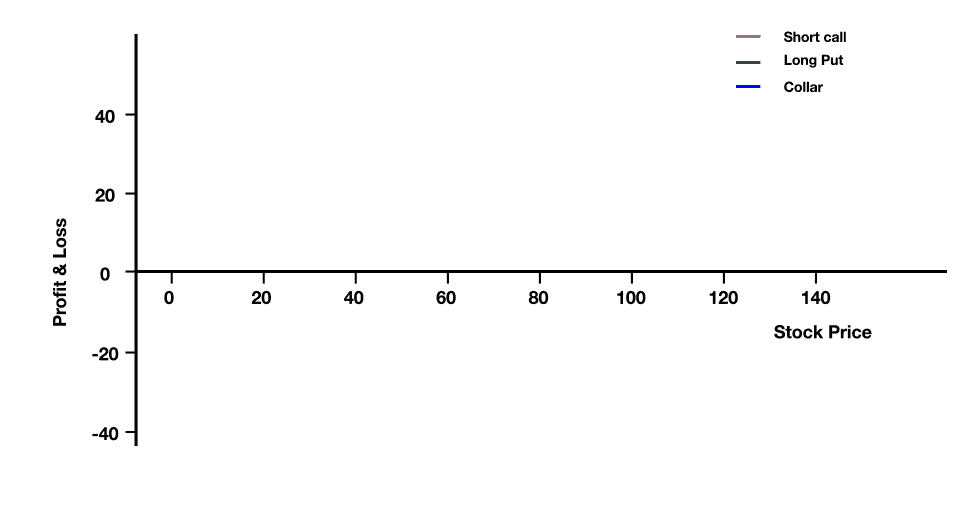

#### **计算盈亏平衡点**

*   买价-看涨期权费(你做空)+看跌期权费(你做多)
*   对于净信贷，BEP =当前股票价格-收到的净信贷
*   对于净借方，BEP =当前股票价格-支付的净借方

#### **有限的利润潜力**

*   最大值利润=看涨期权的执行价格-基础期权的购买价格
*   最大值亏损=买入价格(标的)-执行价格(长期看跌期权)

最佳回报:你希望标的价格以卖空期权的执行价格到期。

### **项圈期权策略如何运作**

#### **第一步:按现价**

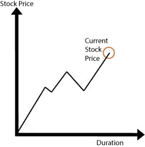

市场不稳定，波动完全出乎意料。当期权的价格上涨时，价格有可能下跌，你可能会损失利润。在这种情况下，资产需要得到保护。

#### **第二步:练习衣领选项**

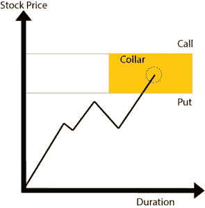

领圈期权战略就是在这种情况下实施的。你卖出的看涨期权限制了上涨空间。

### **应用衣领策略的各种场景有哪些？**

#### **情景 1:当市场看涨时**

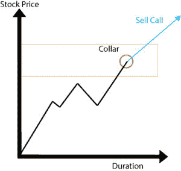

颈圈期权提供有限的利润，用于从横向移动的市场中产生月收入。这个利润可以作为买入看跌期权的收益。由于交易者拥有期权，卖出的看涨期权被认为是“备兑的”。

#### **情景二:大幅牛市**

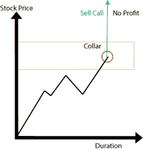

如果价格突然上涨并达到峰值，那么卖出看涨期权的价格就会上涨，导致很难在不影响市场的情况下快速卖出许多证券，从而无法实现利润。

#### **情景 3:当市场看跌时**

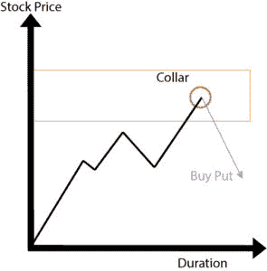

如果价格下跌，则执行看跌期权。价格随着基础资产的下跌而上涨。这里，卖出发生在使用期权的市场价值之上。因为你已经卖出了看涨期权，如果期权被转让，你就必须以执行价格卖出期权。

#### **场景 4:侧向移动**

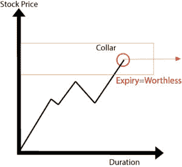

如果价格在期权到期前保持不变，并且由于两个期权的到期日相同，因此两个期权都没有实施，因此它们都变得没有价值。在这种情况下，最大的损失只是为期权支付的溢价，因为它从看涨期权中抵消了为看跌期权支付的溢价，从而使损失最小化。

### **实施领盘交易策略**

在这个例子中，我将使用 IDBI 银行有限公司(股票代号 IDBI)期权。

#### **领策略示例**

在此，我将以 IDBI 银行有限公司为例，因为该银行具备以下必备素质:

*   在横盘中表现
*   受到保护，不会向下移动
*   灵活并能适应变化

过去 1 个月的价格变动(来源——谷歌财经)

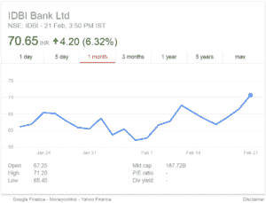

IDBI Bank Ltd .的价格有很大波动，最高为 194.65，最低为 117.05，这是根据谷歌金融的当前价值。

为了这个例子的目的；我会买 1 美元的看跌期权和 1 美元的看涨期权。

以下是 IDBI 银行有限公司截止日期为 2018 年 3 月 29 日的期权链，来源:nseindia.com

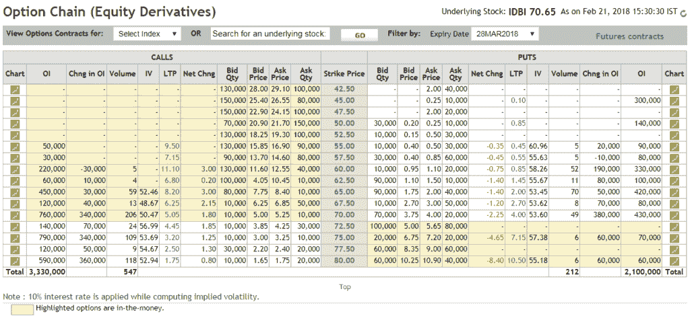

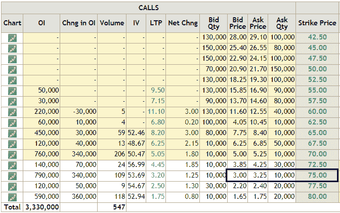

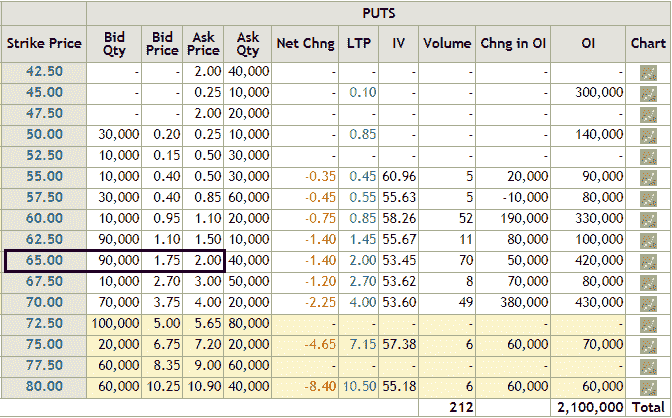

我将为行权价为 75 的看涨期权支付 3.25 印度卢比，为行权价为 65 的看跌期权支付 2.00 印度卢比。期权将于 2018 年 3 月 29 日到期，为了从中获利，IDBI Bank Ltd .的价格应在到期前大幅上涨。

发起这项交易支付的净保费将为 5.25 印度卢比。为了使这个策略达到盈亏平衡，在这个策略达到盈亏平衡之前，价格需要向下移动到 59.75 或者向上移动到 80.25。

#### **Python 中如何计算策略收益？**

现在，让我用 Python 编程代码带你看一下收益图。

```
Import libraries
import numpy as np
import matplotlib.pyplot as plt
import seaborn
```

##### **定义参数**

```
# IDBI Bank Ltd stock price
spot_price = 70.65
​
# Long put
strike_price_long_put = 65
premium_long_put = 2
​
# Short call
strike_price_short_call = 75
premium_short_call = 3.25
​
# Stock price range at expiration of the put
sT = np.arange(0,2*spot_price,1)
```

##### **电话支付**

我们定义一个函数来计算购买看涨期权的收益。该函数将 sT 作为输入，sT 是到期时股票价格、认购期权的执行价格和认购期权的溢价的可能值的范围。它返回看涨期权的收益。

```
+def call_payoff(sT, strike_price, premium):
return np.where(sT < strike_price, premium,+ premium -sT + strike_price)

payoff_short_call = call_payoff (sT, strike_price_short_call, premium_short_call)
# Plot
fig, ax = plt.subplots()
ax.spines['top'].set_visible(False) # Top border removed
ax.spines['right'].set_visible(False) # Right border removed
ax.spines['bottom'].set_position('zero') # Sets the X-axis in the center
ax.plot(sT,payoff_short_call,label='Short Call',color='r')
plt.xlabel('Stock Price')
plt.ylabel('Profit and loss')
plt.legend()
plt.show()
```

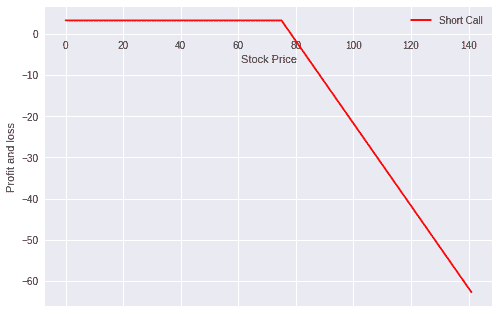

##### **放收益**

我们定义一个函数来计算购买看跌期权的收益。该函数将 sT 作为输入，sT 是到期时股票价格、看跌期权的执行价格和看跌期权的溢价的可能值的范围。它返回看跌期权的收益。

```
def put_payoff(sT, strike_price, premium):
return np.where(sT < strike_price, strike_price - sT, 0) - premium

payoff_long_put = put_payoff(sT, strike_price_long_put, premium_long_put)
# Plot
fig, ax = plt.subplots()
ax.spines['top'].set_visible(False) # Top border removed
ax.spines['right'].set_visible(False) # Right border removed
ax.spines['bottom'].set_position('zero') # Sets the X-axis in the center
ax.plot(sT,payoff_long_put,label='Long Put',color='g')
plt.xlabel('Stock Price')
plt.ylabel('Profit and loss')
plt.legend()
plt.show()
```

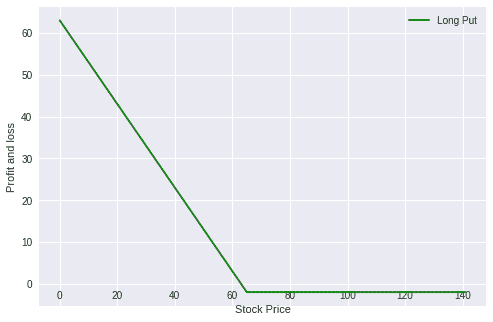

##### **衣领放线**

```
payoff_collar = payoff_short_call + payoff_long_put
​
print ("Max Profit:", max(payoff_collar))
print ("Max Loss:", min(payoff_collar))
# Plot
fig, ax = plt.subplots()
ax.spines['top'].set_visible(False) # Top border removed
ax.spines['right'].set_visible(False) # Right border removed
ax.spines['bottom'].set_position('zero') # Sets the X-axis in the center
​
ax.plot(sT,payoff_short_call,'--',label='Short Call',color='r')
ax.plot(sT,payoff_long_put,'--',label='Long Put',color='g')
​
ax.plot(sT,payoff_collar+sT-spot_price,label='Collar')
plt.xlabel('Stock Price', ha='left')
plt.ylabel('Profit and loss')
plt.legend()
plt.show()
```

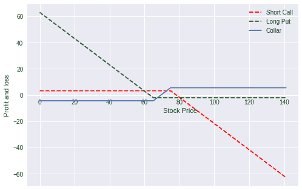

```
Max Profit: 66.25
Max Loss: -64.75
```

### **总结**

可以实现的最大利润是无限的，可能发生的最大损失是 64.75 印度卢比。使用这种策略的好处是，人们从一开始就知道预期的损失和收益。随着时间的推移，买卖期权的价值都在下降。由于卖出看涨期权，回报可能会更少、更慢，但看跌期权保证了保护。

### **下一步**

如果你想学习算法交易的各个方面，那就去看看算法交易(EPAT)的高管课程。课程涵盖统计学&计量经济学、金融计算&技术和算法&定量交易等培训模块。EPAT 让你具备成为成功交易者所需的技能。[现在报名](https://www.quantinsti.com/epat/)！

*免责声明:股票市场的所有投资和交易都有风险。在金融市场进行交易的任何决定，包括股票或期权或其他金融工具的交易，都是个人决定，只能在彻底研究后做出，包括个人风险和财务评估以及在您认为必要的范围内寻求专业帮助。本文提到的交易策略或相关信息仅供参考。*

### **下载数据文件**

*   衣领期权交易策略 Python 代码