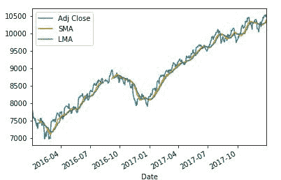

# 使用均线交叉交易漂亮的期权

> 原文：<https://blog.quantinsti.com/moving-average-crossover-trade-nifty-options/>

由 Abhishek Kulkarni

这个博客是一个循序渐进的指南，帮助你学习如何使用移动平均交叉策略来交易漂亮的期权。您还将探索和学习如何使用 Python 编程来执行交叉信号的回溯测试，以从您的交易策略中获得最佳结果。

本博客涵盖:

*   [移动平均线交叉](#moving-average-crossover)
*   均线交叉策略是如何运作的？
*   [所需软件包](#packages-required)
*   [逐步指南](#step-by-step-guide)
*   [结论](#conclusion)

* * *

## **[均线交叉](#moving-average-crossover)**

交易策略可以大致分为动量策略和均值回复策略。动量策略的原则是“趋势是朋友”，要点是高买高卖。

然而，在均值回复策略中，原则是“上升的必然下降”。这意味着当资产超卖时买入，超买时卖出。[均线](/moving-average-trading-strategies/)交叉属于前一类。

关于移动平均线交叉策略的信息太多了，有不同的名称，如“**黄金交叉**”和“**死亡交叉**”。

该策略涉及不同持续时间的移动平均线指标。

*   较短的回看窗口的平均值被称为 **SMA、**和
*   具有较长回顾窗口的那个被称为 **LMA** 。

普遍使用的 SMA-LMA 线对包括 20-40、20-60 和 50-200。SMA-LMA 图以及 Nifty looks 调整后的收盘价如下

<figure class="kg-card kg-image-card kg-width-full"></figure>

交易规则很简单。

*   当 SMA 在 LMA 上方交叉时买入资产，并且
*   当 LMA 穿过 SMA 下方时卖出资产。

* * *

## **[均线交叉策略是如何运作的？](#moving-average-crossover-strategy-working)T3】**

交叉策略被广泛用于股票交易。在本帖中，我们将探索交叉信号的[回溯测试](/vectorized-backtesting-in-excel/),以使用 Python 交易漂亮的期权。

在下列情况下，我们将购买看涨期权，而不是购买资产:

*   SMA(今日)> LMA(今日)和
*   SMA(昨日)< LMA(昨日)。

类似地，在下列情况下卖出看涨期权:

*   SMA(今天)< LMA(今天)和
*   SMA(昨日)> LMA(昨日)。

* * *

## **[所需套餐](#packages-required)**

执行此活动需要 Python 包。

<u>以下是需要的包</u> :-

*   熊猫-数据阅读器
*   NSEpy
*   熊猫
*   日期时间

* * *

***建议写着***

在我们开始之前，这里有一个免费资源列表，可以帮助您做好准备:

*   [熊猫教程](/python-pandas-tutorial/)
*   [流行的 Python 交易平台进行算法交易](/python-trading-library/)
*   [如何安装 Python 包](/installing-python-packages/)
*   [关于 Python 基础知识的免费书籍](https://www.quantinsti.com/python-basics-handbook)
*   [Python 交易免费课程](https://quantra.quantinsti.com/course/python-trading-basic)

* * *

## **[分步指导](#step-by-step-guide)**

通过下面的过程，你会明白如何使用移动平均交叉策略来交易漂亮的期权。

<u>它总共包括 7 个步骤</u>:

### **步骤 1 -导入包**

第一步，我们导入必要的 Python 包。