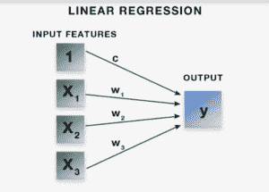
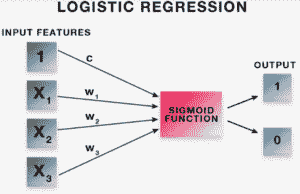
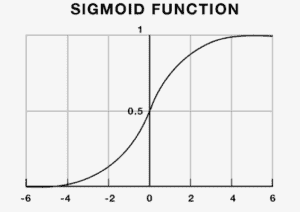
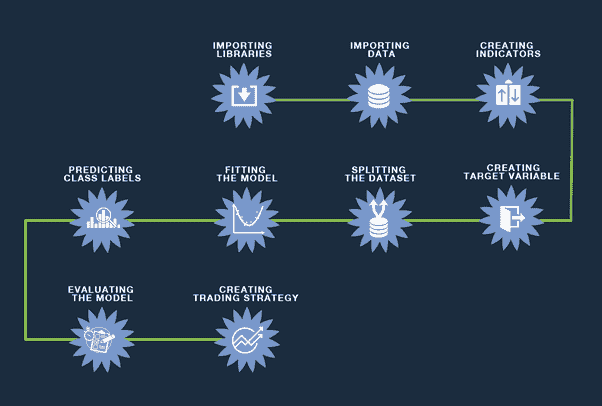
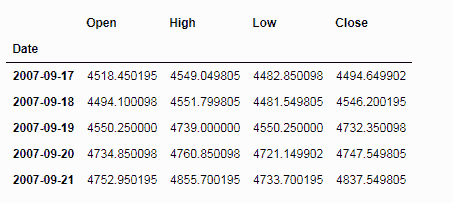
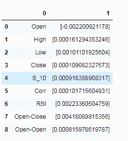
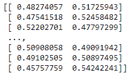
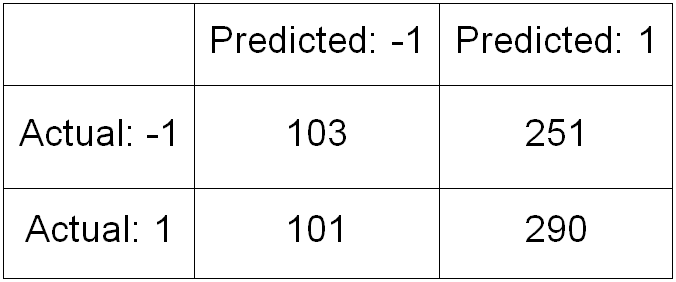
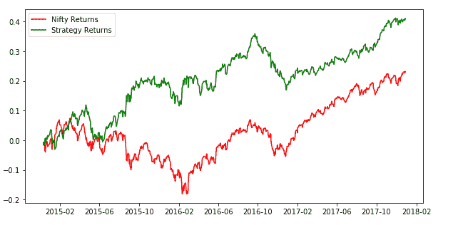

# Python 中的机器学习逻辑回归:从理论到交易

> 原文：<https://blog.quantinsti.com/machine-learning-logistic-regression-python/>

由[维布·辛格](https://www.linkedin.com/in/vibhu-singh-1b76b6105/)

在这篇博客文章中，我们将学习逻辑回归如何在交易的机器学习中工作，并将在 Python 中用逻辑回归来预测股票价格的运动。

任何[机器学习](/overview-machine-learning-trading/)任务可以大致分为两类:

1.  预期的结果已经确定
2.  预期结果尚未确定

第一个<sup>第一个</sup>数据由一个输入数据和带标签的输出组成，称为**监督学习**。第二种<sup>和</sup>方法，其中由没有标记响应的输入数据组成的数据集被称为**无监督学习**。还有另一种叫做**强化学习**的类别，试图对模型进行反馈以提高性能。

* * *

### **逻辑回归和线性回归**

逻辑回归属于监督学习的范畴；它通过使用逻辑/sigmoid 函数估计概率来衡量分类因变量与一个或多个自变量之间的关系。尽管名为“逻辑回归”，但这并不用于任务是预测实值输出的[机器学习回归](https://quantra.quantinsti.com/course/trading-with-machine-learning-regression)问题。这是一个分类问题，用于在给定一组独立变量的情况下预测二元结果(1/0，-1/1，真/假)。

逻辑回归有点类似于[线性回归](/statistics-for-basic-stock-trading-iii/)或者我们可以说它是一个广义线性模型。在线性回归中，我们基于输入变量的加权和来预测实值输出' *y'* 。




线性回归的目的是估计模型系数 c，w <sub>1</sub> ，w <sub>2</sub> ，w <sub>3</sub> 的值。w <sub>n</sub> 并以最小的平方误差拟合训练数据并预测输出 y

逻辑回归做同样的事情，但有一个额外的。与线性回归类似，逻辑回归模型计算输入变量的加权和，但它通过特殊的非线性函数(逻辑函数或 sigmoid 函数)运行结果，以产生输出 y。在这里，输出是二进制或 0/1 或-1/1 的形式。




sigmoid/logistic 函数由下式给出。

**y = 1/1+e<sup>-x</sup>T3】**

正如您在图表中看到的，这是一条 S 形曲线，当输入变量的值增加到 0 以上时，它越来越接近 1，当输入变量的值减少到 0 以下时，它越来越接近 0。当输入变量为 0 时，sigmoid 函数的输出为 0.5。



因此，如果输出大于 0.5，我们可以将结果分类为 1(或正)，如果小于 0.5，我们可以将其分类为 0(或负)。

现在，让我们考虑[预测股价](/use-decision-trees-machine-learning-predict-stock-movements/)运动的任务。如果明天的收盘价高于今天的收盘价，那么我们将买入该股票(1)，否则我们将卖出它(-1)。如果输出是 0.7，那么我们可以说有 70%的几率明天的收盘价高于今天的收盘价，归类为 1。

现在，我们对逻辑回归和 sigmoid 函数有了一个基本的直觉。我们将学习如何在 Python 中实现逻辑回归，并使用上述条件预测股票价格的走势。

* * *

### **代码概述**



* * *

#### **导入库**

我们将从导入必要的库开始。

```
# Data Manipulation
import numpy as np
import pandas as pd

# Technical Indicators
import talib as ta

# Plotting graphs
import matplotlib.pyplot as plt

# Machine learning
from sklearn.linear_model import LogisticRegression
from sklearn import metrics
from sklearn.model_selection import cross_val_score

# Data fetching
from pandas_datareader import data as pdr
import yfinance as yf
yf.pdr_override()

```

* * *

#### **导入数据**

我们将导入从 2000 年 1 月 1 日到 2018 年 1 月 1 日的 Nifty 50 数据。使用'***' pandas _ datareader*【T3 ' '从雅虎财经导入数据。**

```
df = pdr.get_data_yahoo('^NSEI', '2000-01-01', '2018-01-01')
df = df.dropna()
df = df.iloc[:,:4]
df.head()

```

让我们打印列的前五行“开仓”、“高位”、“低位”、“收盘”。



* * *

#### **定义预测值/自变量**

我们将使用 10 日均线、[相关性](/statistics-behind-pair-trading-i-understanding-correlation-and-cointegration/)、相对强弱指数(RSI)、昨日开盘价与今日开盘价之差、昨日收盘价与今日开盘价之差、开盘价、最高价、最低价、收盘价作为[指标进行预测](/pivot-point-prediction-movement/)。

```
df['S_10'] = df['Close'].rolling(window=10).mean()
df['Corr'] = df['Close'].rolling(window=10).corr(df['S_10'])
df['RSI'] = ta.RSI(np.array(df['Close']), timeperiod =10)
df['Open-Close'] = df['Open'] - df['Close'].shift(1)
df['Open-Open'] = df['Open'] - df['Open'].shift(1)
df = df.dropna()
X = df.iloc[:,:9]

```

您可以打印并检查用于进行[股票价格预测](/machine-learning-trading-predict-stock-prices-regression/)的所有预测变量。

* * *

#### **定义目标/因变量**

因变量与上面例子中讨论的相同。如果明天的收盘价高于今天的收盘价，那么我们将买入该股票(1)，否则我们将卖出它(-1)。

```
y = np.where(df['Close'].shift(-1) > df['Close'],1,-1)
```

* * *

#### **分割数据集**

我们将把数据集分成训练数据集和测试数据集。我们将使用 70%的数据进行训练，剩下的 20%进行测试。为此，我们将创建一个分割变量，以 70-30 的比例分割数据帧。 *X *列车*和’*Y*列车*为列车数据集。 *X *测试*和’*Y*测试*是测试数据集。

```
split = int(0.7*len(df))
X_train, X_test, y_train, y_test = X[:split], X[split:], y[:split], y[split:]

```

* * *

#### **用 Python 实例化逻辑回归**

我们将使用' *LogisticRegression* '函数在 Python 中实例化逻辑回归，并使用' fit '函数在训练数据集上拟合模型。

```
model = LogisticRegression()
model = model.fit (X_train,y_train)

```

* * *

#### **检查系数**

```
pd.DataFrame(zip(X.columns, np.transpose(model.coef_)))
```



* * *

#### **计算类别概率**

我们将使用' *predict_proba* '函数计算测试数据集的类的概率。

```
probability = model.predict_proba(X_test)
print probability
```



* * *

#### **预测类别标签**

接下来，我们将使用测试数据集的预测函数来预测类标签。

```
probability = model.predict_proba(X_test)
print(probability)

predicted = model.predict(X_test)

```

如果您打印'*预测的*变量，您将观察到分类器预测的是 1，而变量'*概率*的第二列中的概率大于 0.5。当第二列中的概率小于 0.5 时，则分类器预测为-1。

* * *

### **评估模型**

* * *

#### **混淆矩阵**

混淆矩阵用于描述分类模型在真实值已知的一组测试数据集上的性能。我们将使用'*混淆矩阵*'函数计算混淆矩阵。

```
print(metrics.confusion_matrix(y_test, predicted))
```


您可以将上述矩阵解释为:



* * *

#### **分类报告**

这是检验分类模型性能的另一种方法。

```
print(metrics.classification_report(y_test, predicted))
```


f1 分数告诉您与所有其他类别相比，分类器在对该特定类别中的数据点进行分类时的准确性。它是通过取精确度和召回率的调和平均值来计算的。支持度是该类中真实响应的样本数。

* * *

#### **模型精度**

我们将使用' *score* '函数计算测试数据集上的模型准确性。

```
print(model.score(X_test,y_test))
0.528
```

我们可以看到 52%的准确率。

* * *

#### **交叉验证**

我们将使用 10 重交叉验证来交叉检查模型的准确性。为此，我们将使用从' *sklearn.cross_validation* 库中导入的' *cross *val* score* 函数。

```
cross_val = cross_val_score(LogisticRegression(), X, y, scoring='accuracy', cv=10)
print(cross_val)
print(cross_val.mean())

```


精确度仍然是 52%,这意味着模型工作正常。

* * *

#### **使用模型**创建交易策略

我们将预测买入(1)或卖出(-1)的信号，并计算测试数据集的累计 Nifty 50 回报。接下来，我们将根据测试数据集中模型预测的信号计算累积策略回报。我们还将绘制累积收益图。

```
df['Predicted_Signal'] = model.predict(X)
df['Nifty_returns'] = np.log(df['Close']/df['Close'].shift(1))
Cumulative_Nifty_returns = np.cumsum(df[split:]['Nifty_returns'])

df['Startegy_returns'] = df['Nifty_returns']* df['Predicted_Signal'].shift(1)
Cumulative_Strategy_returns = np.cumsum(df[split:]['Startegy_returns'])

plt.figure(figsize=(10,5))
plt.plot(Cumulative_Nifty_returns, color='r',label = 'Nifty Returns')
plt.plot(Cumulative_Strategy_returns, color='g', label = 'Strategy Returns')
plt.legend()
plt.show()

```



* * *

### **结论**

可以观察到，Python 中的逻辑回归模型以大约 52%的准确度预测类，并产生良好的回报。现在轮到你通过改变参数来玩代码，并根据它创建一个交易策略。

想知道如何在 python 中使用机器学习进行交易？[这篇博客](/trading-using-machine-learning-python/)将解释[机器学习](https://quantra.quantinsti.com/course/trading-machine-learning-classification-svm)可以帮助新工具用一个这样的模块生成更多的 alpha。

* * *

*更新-我们注意到一些用户在从雅虎和谷歌金融平台下载市场数据时面临挑战。如果你正在寻找市场数据的替代来源，你可以使用 [Quandl](https://www.quandl.com/) 来获得同样的信息。*

*<small>免责声明:股票市场的所有投资和交易都涉及风险。在金融市场进行交易的任何决定，包括股票或期权或其他金融工具的交易，都是个人决定，只能在彻底研究后做出，包括个人风险和财务评估以及在您认为必要的范围内寻求专业帮助。本文提到的交易策略或相关信息仅供参考。</small>T3】*

* * *

## **下载中的文件:**

*   机器学习逻辑回归 Python 代码