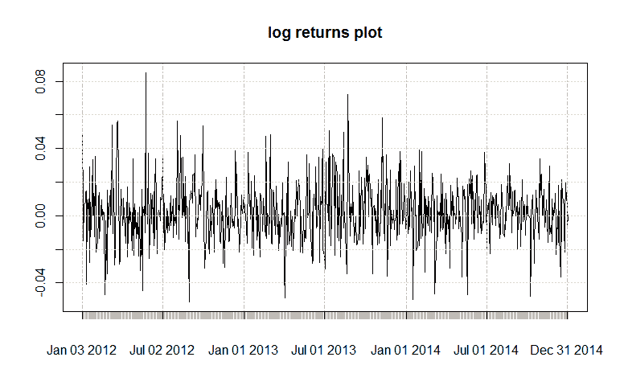
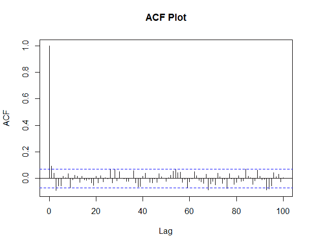
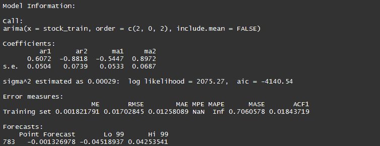
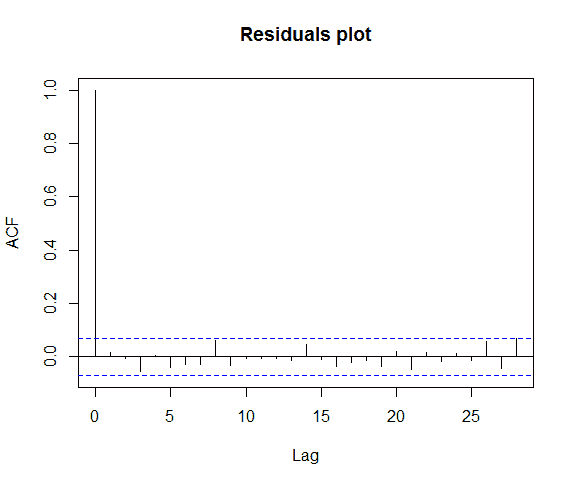
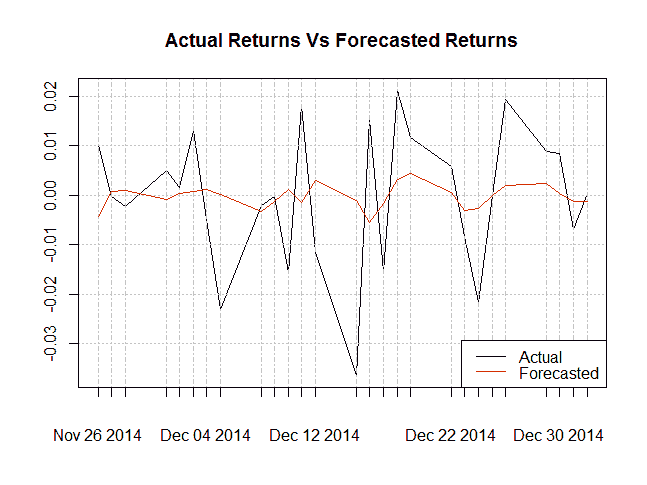
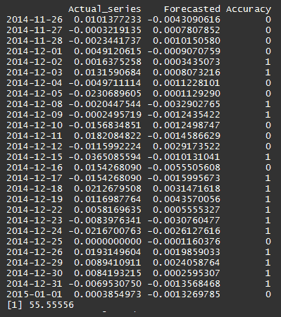

# 用 ARIMA 模型预测股票收益

> 原文：<https://blog.quantinsti.com/forecasting-stock-returns-using-arima-model/>

由[米林德·帕拉德卡](https://www.linkedin.com/in/milind-paradkar-b37292107/)

“[股价预测](https://blog.quantinsti.com/machine-learning-trading-predict-stock-prices-regression/)很难，尤其是关于未来”。你们中的许多人一定听过丹麦物理学家尼尔·玻尔的这句名言。[股价预测](https://blog.quantinsti.com/working-neural-networks-stock-price-prediction)是这篇博文的主题。在本帖中，我们将介绍流行的 ARIMA 预测模型来预测股票回报，并演示使用 R 编程的 ARIMA 建模的一步一步的过程。

### **什么是时间序列中的预测模型？**

预测包括使用变量的历史数据点预测变量的值，也可以包括在给定一个变量的值的变化的情况下预测另一个变量的变化。预测方法主要分为定性预测和定量预测。时间序列预测属于定量预测的范畴，其中将统计原理和概念应用于变量的给定历史数据，以预测同一变量的未来值。使用的一些时间序列预测技术包括:

*   自回归模型
*   移动平均模型(MA)
*   季节性回归模型
*   分布式滞后模型

### **什么是自回归综合移动平均(ARIMA)模型？**

ARIMA 代表自回归综合移动平均线。ARIMA 也被称为博克斯-詹金斯方法。Box 和 Jenkins 声称，非平稳数据可以通过对序列进行差分而变得平稳，Y<sub>t .</sub>Y<sub>t</sub>的一般模型写为:

**和<sub><sub>和<sub><sub>-</sub></sub></sub></sub>**

其中 Y <sub>t</sub> 是差分时间序列值，ϕ和θ是未知参数，ϵ是具有零均值的独立同分布误差项。这里，<sub>T3】Y<sub>t</sub>用它的过去值和误差项的当前和过去值来表示。</sub>

ARIMA 模型结合了三种基本方法:

*   自回归(AR)-在自回归中，给定时间序列数据的值根据其自身的滞后值进行回归，这在 ARIMA 模型中由“p”值表示。
*   差分(I-代表综合)-这涉及差分时间序列数据，以消除趋势，并将非平稳时间序列转换为平稳时间序列。这由 ARIMA 模型中的“d”值表示。如果 d =1，它查看两个时间序列条目之间的差异，如果 d = 2，它查看 d = 1 时获得的差异的差异，依此类推。
*   移动平均(MA)–ARIMA 模型的移动平均性质由“q”值表示，它是误差项的滞后值的数量。

这个模型叫做 Y <sub>t</sub> 的自回归综合移动平均或 ARIMA(p，d，q)。我们将按照下面列举的步骤来构建我们的模型。

**步骤 1:测试并确保稳定性**

要用 Box-Jenkins 方法对时间序列建模，该序列必须是平稳的。平稳时间序列是指没有趋势的时间序列，具有恒定的均值和方差，这使得预测值变得容易。

**平稳性测试-** 我们使用扩展的 Dickey-Fuller 单位根测试来测试平稳性。ADF 测试得出的 p 值必须小于 0.05 或 5%，时间序列才能稳定。如果 p 值大于 0.05 或 5%，您可以得出时间序列有单位根的结论，这意味着它是非平稳过程。

**差分–**为了将非平稳过程转换为平稳过程，我们应用差分方法。差分时间序列是指找出时间序列数据的连续值之间的差异。差值形成新的时间序列数据集，可以对其进行测试以揭示新的相关性或其他有趣的统计特性。

我们可以不止一次地连续应用差分方法，产生“一阶差分”、“二阶差分”等。

在进行下一步之前，我们应用适当的差分顺序(d)使时间序列平稳。

**步骤 2:p 和 q 的识别**

在这一步中，我们通过使用自相关函数(ACF)和偏自相关函数(PACF)来识别自回归(AR)和移动平均(MA)过程的适当顺序。关于 ACF 和 PACF 函数的解释，请参考我们的博客[“从时间序列开始”](https://blog.quantinsti.com/starting-time-series/)。

**识别 AR 模型的 p 阶**

对于 AR 模型，ACF 将指数衰减，PACF 将用于识别 AR 模型的阶(p)。如果我们在 PACF 的滞后 1 处有一个显著的尖峰，那么我们有一个 1 阶的 AR 模型，即 AR(1)。如果我们在 PACF 上的滞后 1、2 和 3 处有显著的尖峰，那么我们有 3 阶的 AR 模型，即 AR(3)。

**识别 MA 模型的 q 阶**

对于 MA 模型，PACF 将呈指数衰减，ACF 图将用于确定 MA 过程的顺序。如果我们在 ACF 上的滞后 1 处有一个显著的尖峰，那么我们有一个 1 阶的 MA 模型，即 MA(1)。如果我们在 ACF 上的滞后 1、2 和 3 处有显著的尖峰，那么我们有一个 3 阶 MA 模型，即 MA(3)。

**第三步:估算和预测**

一旦我们确定了参数(p，d，q ),我们就估计训练数据集上的 ARIMA 模型的准确性，然后使用拟合的模型，通过使用预测函数来预测测试数据集的值。最后，我们反复检查我们的预测值是否与实际值相符。

### **用 R 编程建立 ARIMA 模型**

现在，让我们按照解释的步骤在 r 中建立一个 ARIMA 模型。有许多软件包可用于[时间序列分析](https://blog.quantinsti.com/time-series-analysis/)和预测。我们为[时间序列分析](https://quantra.quantinsti.com/course/financial-time-series-analysis-trading)加载相关的 R 包，并从雅虎财经获取股票数据。

```
library(quantmod);library(tseries);
library(timeSeries);library(forecast);library(xts);
# Pull data from Yahoo finance 
TECHM = getSymbols('TECHM.NS', from='2012-01-01', to='2015-01-01',auto.assign = FALSE)
TECHM = na.omit(TECHM)
# Select the relevant close price series
stock_prices = TECHM[,4]
```

在下一步中，我们计算股票的对数回报，因为我们希望 ARIMA 模型预测的是对数回报，而不是股票价格。我们还使用绘图函数绘制了对数收益序列。

```
# Compute the log returns for the stock
stock = diff(log(stock_prices),lag=1)
stock = stock[!is.na(stock)]
# Plot log returns 
plot(stock,type='l', main='log returns plot')
```



接下来，我们对收益率序列数据调用 ADF 测试来检查平稳性。ADF 测试的 p 值 0.01 告诉我们该序列是平稳的。如果序列是不稳定的，我们将首先对收益序列进行差分，使其稳定。

```
# Conduct ADF test on log returns series
print(adf.test(stock))

```


在下一步中，我们修复了一个断点，该断点将用于将 returns 数据集在代码中进一步分成两部分。

```
# Split the dataset in two parts - training and testing
breakpoint = floor(nrow(stock)*(2.9/3))
```

我们截断原始的返回序列直到断点，并在这个截断的序列上调用 ACF 和 PACF 函数。

```
# Apply the ACF and PACF functions
par(mfrow = c(1,1))
acf.stock = acf(stock[c(1:breakpoint),], main='ACF Plot', lag.max=100)
pacf.stock = pacf(stock[c(1:breakpoint),], main='PACF Plot', lag.max=100)
```




我们可以观察这些图，并得出自回归(AR)阶和移动平均(MA)阶。

我们知道，对于 AR 模型，ACF 将呈指数衰减，PACF 图将用于确定 AR 模型的阶数(p)。对于 MA 模型，PACF 将指数衰减，ACF 图将用于确定 MA 模型的阶数(q)。从这些图中，我们选择 AR 阶数= 2，MA 阶数= 2。因此，我们的 ARIMA 参数将是(2，0，2)。

我们的目标是预测从断点开始的整个收益序列。我们将利用 R 中的 For 循环语句，在这个循环中，我们将预测测试数据集中每个数据点的返回。

在下面给出的代码中，我们首先初始化一个存储实际回报的序列和另一个存储预测回报的序列。在 For 循环中，我们首先基于动态断点形成训练数据集和测试数据集。

我们在训练数据集上调用 ARIMA 函数，为其指定的顺序是(2，0，2)。我们使用该拟合模型通过使用预测来预测下一个数据点。Arima 函数。该函数被设置为 99%的置信水平。可以使用置信度参数来增强模型。我们将使用模型中的预测点估计。forecast 函数中的“h”参数表示我们要预测的值的数量，在本例中，第二天返回。

我们可以使用汇总功能来确认 ARIMA 模型的结果在可接受的范围内。在最后一部分，我们将每个预测收益和实际收益分别附加到预测收益序列和实际收益序列中。

```
# Initialzing an xts object for Actual log returns
Actual_series = xts(0,as.Date("2014-11-25","%Y-%m-%d"))
# Initialzing a dataframe for the forecasted return series
forecasted_series = data.frame(Forecasted = numeric())

for (b in breakpoint:(nrow(stock)-1)) {

stock_train = stock[1:b, ]
stock_test = stock[(b+1):nrow(stock), ]
# Summary of the ARIMA model using the determined (p,d,q) parameters
fit = arima(stock_train, order = c(2, 0, 2),include.mean=FALSE)
summary(fit)
# plotting a acf plot of the residuals
acf(fit$residuals,main="Residuals plot")
# Forecasting the log returns
arima.forecast = forecast.Arima(fit, h = 1,level=99)
summary(arima.forecast)
# plotting the forecast
par(mfrow=c(1,1))
plot(arima.forecast, main = "ARIMA Forecast")
# Creating a series of forecasted returns for the forecasted period
forecasted_series = rbind(forecasted_series,arima.forecast$mean[1])
colnames(forecasted_series) = c("Forecasted")
# Creating a series of actual returns for the forecasted period
Actual_return = stock[(b+1),]
Actual_series = c(Actual_series,xts(Actual_return))
rm(Actual_return)

print(stock_prices[(b+1),])
print(stock_prices[(b+2),])

}
```

在我们进入代码的最后一部分之前，让我们检查来自测试数据集中的样本数据点的 ARIMA 模型的结果。



根据获得的系数，回归方程可以写成:

<sub>和<sub>= 0.6072*和<sub><sub>-0.8818</sub></sub>*和<sub>【t-1】</sub></sub></sub>

给出了系数的标准误差，这需要在可接受的限度内。阿凯克信息标准(AIC)评分是 ARIMA 模型准确性的一个很好的指标。AIC 分数越低，模型越好。我们还可以查看残差的 ACF 图；一个好的 ARIMA 模型的自相关低于阈值极限。预测的点回报是-0.001326978，在输出的最后一行给出。



让我们通过比较预测回报和实际回报来检验 ARIMA 模型的准确性。代码的最后一部分计算这些准确的信息。

```
# Adjust the length of the Actual return series
Actual_series = Actual_series[-1]
# Create a time series object of the forecasted series
forecasted_series = xts(forecasted_series,index(Actual_series))
# Create a plot of the two return series - Actual versus Forecasted
plot(Actual_series,type='l',main='Actual Returns Vs Forecasted Returns')
lines(forecasted_series,lwd=1.5,col='red')
legend('bottomright',c("Actual","Forecasted"),lty=c(1,1),lwd=c(1.5,1.5),col=c('black','red'))
# Create a table for the accuracy of the forecast
comparsion = merge(Actual_series,forecasted_series)
comparsion$Accuracy = sign(comparsion$Actual_series)==sign(comparsion$Forecasted)
print(comparsion)
# Compute the accuracy percentage metric
Accuracy_percentage = sum(comparsion$Accuracy == 1)*100/length(comparsion$Accuracy)
print(Accuracy_percentage)
```





如果预测回报的符号等于实际回报的符号，我们就给它一个正的准确度分数。ARIMA 模型的准确率达到 55%左右，这看起来是一个不错的数字。可以尝试运行(p，d，q)的其他可能组合的模型，或者改为使用 auto.arima 函数，该函数选择最佳参数来运行 arima 模型。

### **结论**

总之，在这篇文章中，我们介绍了 ARIMA 模型，并使用 R 编程语言将其应用于预测股票价格回报。我们还交叉检查了我们的预测结果和实际回报。在我们即将发布的帖子中，我们将介绍其他时间序列预测技术，并在 Python/R 编程语言中尝试它们。

### **下一步**

这里有一个[循序渐进的教程，让你在 R](https://blog.quantinsti.com/predictive-modeling-algorithmic-trading/) 中实现自动交易的预测建模。你可以使用预测模型浏览算法交易的历史数据。

**更新**

我们注意到一些用户在从雅虎和谷歌金融平台下载市场数据时面临挑战。如果你正在寻找市场数据的替代来源，你可以使用 [Quandl](https://www.quandl.com/) 来获得同样的信息。

*免责声明:股票市场的所有投资和交易都有风险。在金融市场进行交易的任何决定，包括股票或期权或其他金融工具的交易，都是个人决定，只能在彻底研究后做出，包括个人风险和财务评估以及在您认为必要的范围内寻求专业帮助。本文提到的交易策略或相关信息仅供参考。*