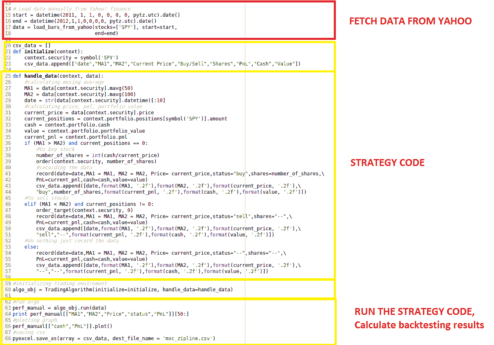
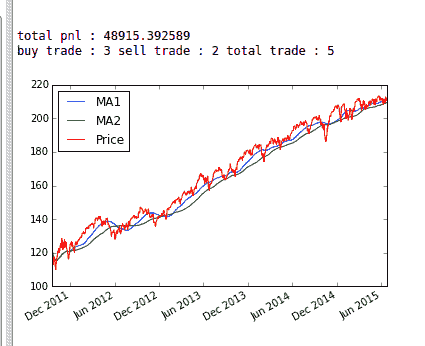

# 在 Zipline 中导入 CSV 数据进行回溯测试

> 原文：<https://blog.quantinsti.com/importing-csv-data-zipline-backtesting/>

由普里扬卡·萨赫

在我们的[上一篇关于 Python 中 Zipline 包介绍的文章](/introduction-zipline-python/)中，我们创建了一个移动交叉策略的算法。回想一下， **Zipline** 是一个用于交易应用的 Python 库，用于创建一个事件驱动的系统，该系统可以支持[回溯测试](/backtesting/)和实时交易。

在上一篇文章中，我们还学习了如何在 Zipline 上实现[移动平均交叉策略](/backtesting-in-excel/)。Zipline 中的策略代码直接从雅虎读取数据，执行回溯测试并绘制结果。我们建议您在继续学习之前，先温习一下前一篇文章中提到的一些基本概念:

1.  安装(如何在本地安装 Zipline)
2.  结构(用 Zipline 编写代码的格式)

在本文中，我们将更进一步，学习使用不同来源的数据对 Zipline 进行回溯测试。我们将学习:

*   CSV 格式 OHLC 数据的导入和回测
*   从 Google Finance 导入和使用数据进行研究/分析
*   计算并打印回测结果，如 PnL、交易数量等

这篇文章为严肃的 quants 和 DIY 算法交易者提供了指导，这些交易者希望独立地使用 Python 或 Zipline 软件包对他们的交易想法进行 T2 回溯测试和假设测试。在本帖中，我们将假设数据来自美国市场。通过对代码进行一些编辑和添加，可以使用其他市场的数据集进行分析。我们将在以后的帖子中分享相同的内容。

滑索上的部分代码——我们已经知道的



### **现有方法的问题？**

Zipline 提供了一个内置函数“loads *bars* from_yahoo()”，该函数从 yahoo 获取给定范围内的数据，并使用该数据进行所有计算。虽然很容易使用，这个功能只适用于雅虎数据。使用这个函数，我们不能对不同的数据集进行回溯测试，例如

1.  商品数据——雅虎不提供
2.  以 csv 格式创建和保存模拟数据集

到目前为止，我们一直在使用这个内置函数来加载 Python IDE 中的股票数据，并进一步使用它。为了能够在 Zipline 中读取 csv 或任何其他数据类型，我们需要了解 Zipline 是如何工作的，以及为什么导入数据的常用方法在这里不起作用！

**Zipline 接受*面板表格*中的数据。**要了解 Zipline 如何处理和理解数据，我们必须了解一点 Python 中的数据结构。

### **Panda 中的数据结构**

Pandas 基本上以三种形式构建数据:系列(1D)、数据框(2D)、面板(3D)

1.  **系列**:

它是一个一维标签数组，能够保存任何数据类型(整数、字符串、浮点数、Python 对象等)。).轴标签统称为索引。

创建系列的基本方法是调用:

s = pd。系列(数据，索引=索引)

series 接受不同种类的对象，如 Python 字典、ndarray、标量值(如 5)。

2.  **数据帧:**

它是一个带有行和列的二维标记数据结构。列可以是不同的类型或相同的类型。

它是最常用的熊猫对象之一，接受不同类型的输入，如 1D 数组的字典、列表、字典或序列；二维 numpy.ndarray 结构化或记录阵列；一系列。

3.  **面板:**

面板是一种较少使用的数据结构，但可以有效地用于三维数据。

三个轴命名如下:

1.  items: axis 0，每一项对应于其中包含的一个 DataFrame
2.  major_axis: axis 1，它是每个数据帧的索引(行)
3.  minor_axis: axis 2，它是每个数据帧的列

Zipline 只理解面板格式的数据结构。

虽然很容易导入。csv 数据在熊猫作为一个数据帧，这是不可能的，在 Zipline 直接做同样的事情。然而，我们发现了这个问题的一个迂回之处:


这是一项强大的技术，可帮助您从不同来源导入数据，例如:

*   在 zipline 中导入 CSV 格式的 OHLC 数据(我们将展示如何)
*   从雅虎以外的在线资源读取数据，这些资源与 Panda 连接(我们将展示如何连接)
*   在 Zipline 中从 Quandl 读取数据(这是留给你的一个练习！)

让我们从三个步骤开始吧！

1.  ### **Import data in python**

我们可以使用任何方法将数据作为数据帧导入，或者只是导入数据并将其转换为数据帧。这里，我们将使用两种方法来获取数据:DataReader & read_csv 函数。

#### **使用 DataReader 从 Google 读取数据**

Pandas 提供了一个 Datareader 函数，允许用户指定日期范围和来源。你可以使用雅虎、谷歌或任何其他数据源。

```
#code
pip install pandas
import pytz
from pandas.io.data import DataReader
from collections import OrderedDict
data = OrderedDict()
start_date = '9/17/2011'
end_date = '6/24/2015'
data['SPY'] = DataReader('SPY',data_source='google',start=start_date, end=end_date)
print data['SPY'].head()
type(data['SPY'])
```

这是打印前 6 行时数据帧的样子:


#### **使用 read_csv 函数导入一个 csv 文件**

Pandas 提供了另一个函数 read_csv，它从指定的位置获取 csv 文件。请注意，CSV 应该采用正确的格式，以便在 Zipline 中被策略算法调用时能够以正确的方式运行。

**CSV 文件格式:**

第一栏是“日期”栏，第二栏是“开仓”，第三栏是“高位”，第四栏是“低位”，第五栏是“收盘”，第六栏是“成交量”。任何列都不应为空或缺少值。

**读取 CSV 文件:**

```
#code
import pandas as pd
datas = OrderedDict()
data['SPY'] = pd.read_csv('SPY.csv', index_col=0, parse_dates=['Date'])
print data['SPY'].head()
type(data['SPY'])
```

请注意上面的代码:

股票的名称是“SPY ”,我们已经在保存 CSV 文件“SPY.csv”的目录中，否则您还需要指定路径。

2.  ### **Convert data frame into panel**

通过上述方法导入 Python IDE 的数据保存为 Dataframe。现在我们需要将其转换为面板格式，并修改长轴和短轴。

```
#code
panel = pd.Panel(data)
panel.minor_axis = ['Open', 'High', 'Low', 'Close', 'Volume']
panel.major_axis = panel.major_axis.tz_localize(pytz.utc)
```

Zipline 接受['开盘'，'高'，'低'，'收盘'，'成交量']数据作为短轴，以 UTC 时间格式将'日期'作为长轴。因为如果我们没有 UTC 格式的日期，我们就使用“tz_localize(pytz.utc)”来转换它。

现在“面板”是以面板格式保存的数据集“数据”。这是面板格式的外观:


3.  ### **Use this new data structure panel to run your strategy**

我们使用这个新的数据结构‘Panel’来运行我们的策略，在‘initialize’或‘handle _ data’部分没有任何变化。策略逻辑和代码保持不变。我们只是在运行策略时插入新的数据结构。

```
#initializing trading enviroment
algo_obj = TradingAlgorithm(initialize=initialize, handle_data=handle_data, capital_base = 100000.0)
#run algo
perf_manual = algo_obj.run(panel)
```

就是这样！现在，您可以轻松地在 CSV 数据文件上运行之前解释的移动交叉策略！来吧，试试看！

您可以获取 Quandl(US data)数据，并尝试在其上生成信号。

### **对滑索进行回溯测试**

在前一篇文章中，我们测试了一个简单的移动交叉策略，并绘制了每个交易日的现金和 PnL。现在，我们将计算 PnL 和整个交易期间的交易总数。

回想一下，结果会自动保存在“perf_manual”中。使用同样的方法，我们可以计算任何我们需要的性能比率或数字。

```
#code
#calculation
print "total pnl : " + str(float(perf_manual[["PnL"]].iloc[-1]))
buy_trade = perf_manual[["status"]].loc[perf_manual["status"] == "buy"].count()
sell_trade = perf_manual[["status"]].loc[perf_manual["status"] == "sell"].count()
total_trade = buy_trade + sell_trade
print "buy trade : " + str(int(buy_trade)) + " sell trade : " + str(int(sell_trade)) + " total trade : " + str(int(total_trade))
```



看起来这个策略损失了 50%以上的初始资本！

要更改初始资本和其他参数来优化您的[回溯测试 excel](/vectorized-backtesting-in-excel/) 结果，您需要相应地初始化 TradingAlgorithm()。‘资本*基数’用于定义初始现金，‘数据*频率’用于定义数据频率。例如:

```
algo_obj = TradingAlgorithm(initialize=initialize, handle_data=handle_data, capital_base = 80000.0)
```

(默认情况下，资本为 100000.0。)

通过 TradingAlgorithm()函数的[官方文档](http://www.zipline.io/_modules/zipline/algorithm.html)来尝试了解更多！

* * *

我们的下一篇文章将向您介绍 python 中的 [zipline](/introduction-zipline-python/) 包及其优点，如何安装它，并使用它来编写金融贸易的移动交叉策略。

你可以通过对历史数据进行回溯测试来提高交易成功的可能性。Quantra 的这个关于[回溯测试交易策略](https://quantra.quantinsti.com/course/backtesting-trading-strategies)的课程正是你从交易中获得最大收益所需要的。从基本步骤、数据、规则、风险管理等方面学习一切。立即注册！

* * *

重要提示:我们不建议再使用 zipline，因为这个库在过去两年中没有得到有效的管理。

* * *

<small>*免责声明:股票市场的所有投资和交易都涉及风险。在金融市场进行交易的任何决定，包括股票或期权或其他金融工具的交易，都是个人决定，只能在彻底研究后做出，包括个人风险和财务评估以及在您认为必要的范围内寻求专业帮助。本文提到的交易策略或相关信息仅供参考。*T3】</small>

注意:我们注意到一些用户在从雅虎和谷歌金融平台下载市场数据时面临挑战。如果您正在寻找市场数据的替代来源，您可以使用 [Quandl](https://www.quandl.com/) 进行同样的操作。

* * *

### **下载数据文件**

*   mac_excel_ zipline.txt