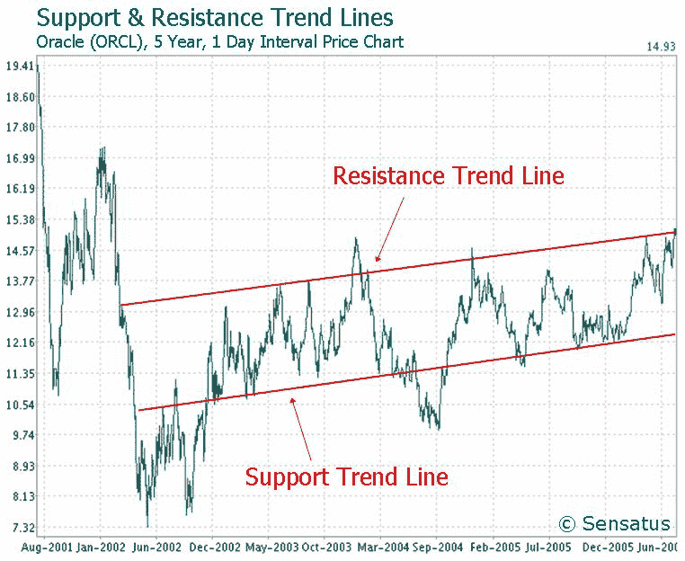
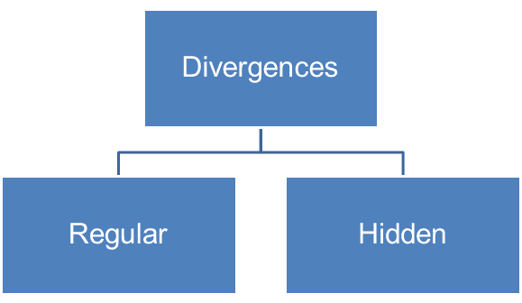
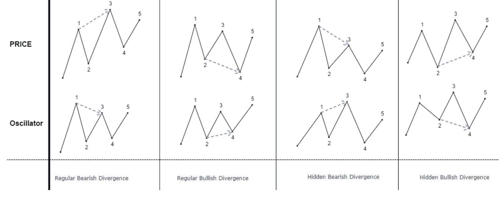
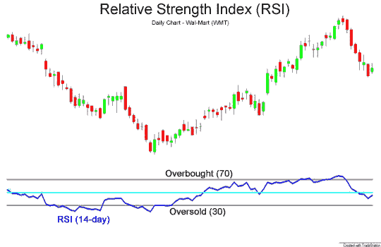
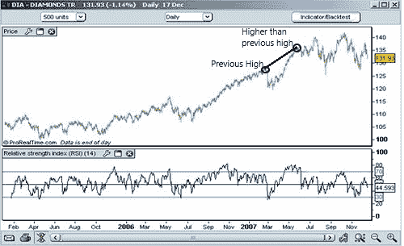
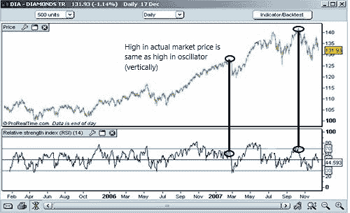
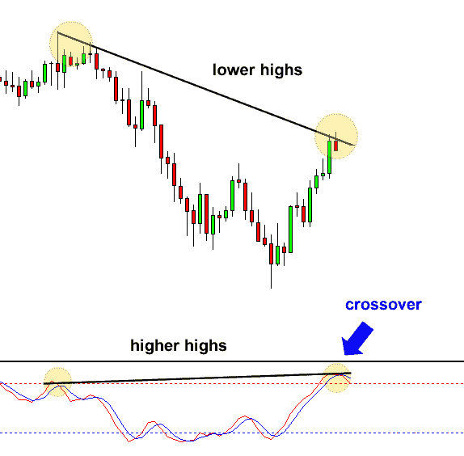
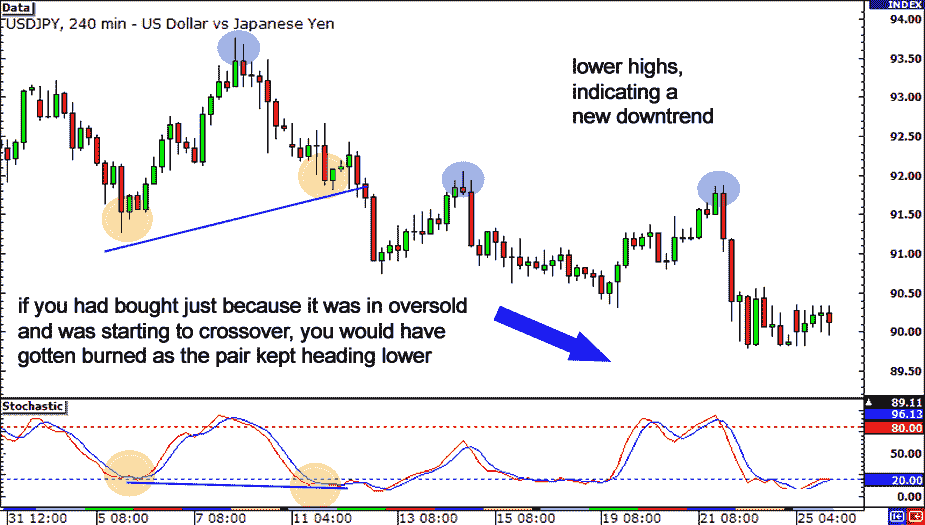
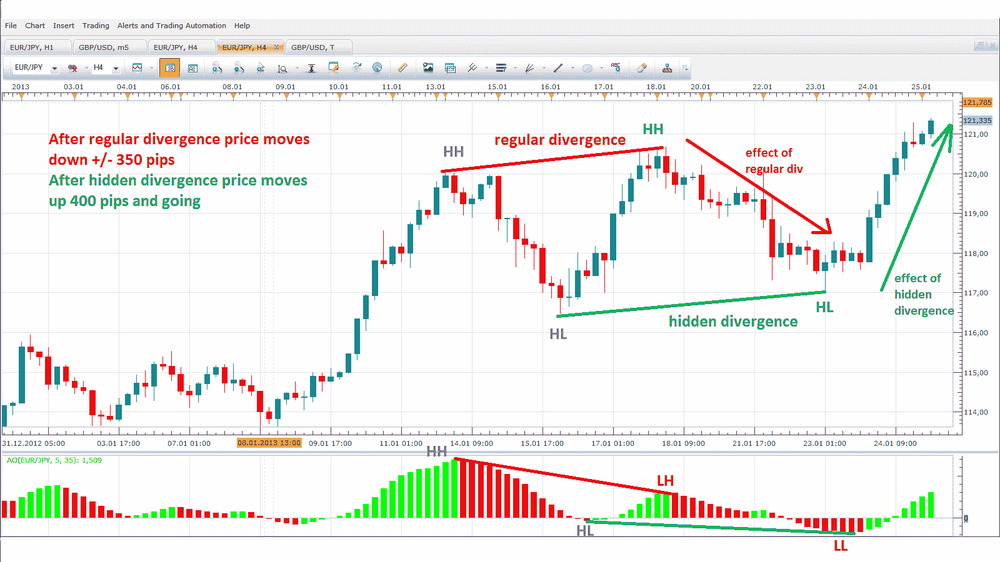

# 为什么背离交易的经验是必须的？

> 原文：<https://blog.quantinsti.com/divergence-trading/>

由[查尼卡·塔卡](https://www.linkedin.com/in/chainika-bahl-thakar-b32971155/)

在决定交易时，分歧是最重要的因素之一。但是，作为一个交易者，在做交易决定时，还有其他重要的因素需要考虑。我们将在本文前面非常简要地讨论这些因素。

虽然，有了背离交易的经验，你会理解它的实际作用，这是相当有利可图的。在这里，我们将通过所有重要的方面，如其意义，类型，指标，事实和实际证明其价值的用途。此外，还有一些订单类型可以帮助您根据自己的分析做出最佳决策。我们将讨论一切，从分析股票价格，预测它们，然后使用最相关的订单类型来执行订单。

现在，让我们深入探讨一下本文中涉及的一些基本主题，它们是:

*   [交易中的背离:含义和类型](#Divergence-Trading-Types)
*   [背离交易的指标/振荡指标](#Indicators-Trading)
*   你知道吗？(关于背离交易的有用事实)
*   [如何使用规则的和隐藏的发散？](#Regular-Hidden-Divergences)

## 交易中的分歧:意义和类型

交易中的背离意味着资产的实际价格和你所依赖的技术指标之间的不同步。[技术指标](https://en.wikipedia.org/wiki/Technical_indicator)意在帮助你估算一项资产的价格。如果价格下跌，技术指标上涨，这种不匹配被称为**正背离。**相反，如果价格上涨，技术指标下跌，这就是所谓的**负背离。**

准确地说，例如，如果一项资产的价格创出新高，而指标显示较低的低点，这就是**背离。**

发散的一个例子是下图。它表明市场(实际价格)创下新高，但不是指标。因此，指标显示背离。

<figure class="kg-card kg-image-card kg-width-wide"></figure>

来源:维基百科

在做交易决定时研究背离的主要理论是，指标/振荡指标表明实际价格可能很快发生反转。因此，背离有助于估计未来的市场价格，这样你就可以做出正确的交易决定。

但是，另一个重要的观点是，你不能把你的交易决定完全建立在背离的基础上。你还必须考虑其他重要的工具，比如[趋势线(支撑位和阻力位)](https://en.wikipedia.org/wiki/Trend_line_(technical_analysis))来确认反转。这尤其适用于指标/振荡器长期背离的情况。

<figure class="kg-card kg-image-card kg-width-full"></figure>

来源:维基百科

在上图中，你可以看到支撑趋势线和反转趋势线。

*   **支撑趋势线**简单地暗示价格水平在一段时间内稳定，资产价格不会跌破该水平。例如，在该图中，在支撑趋势线上不同的时间间隔(年)有不同的价格水平，低于该水平价格不会下跌。
*   **阻力趋势线**，另一方面，是资产价格水平在一段时间内不会超过的趋势线。例如，在上面的图像中，显示了不同年份的不同价格水平，资产价格不会超过该价格水平。

现在，让我们前进到前方的分歧类型。

背离表明潜在的看涨(价格上涨)市场或潜在的看跌(股价下跌)市场，因此，主要是这两种类型。但是，两者(看涨和看跌)都有进一步的两种类型。

这就是为什么我们将它们分为两大类，即常规(看涨和看跌)和隐藏(看涨和看跌)背离。好了，事不宜迟，让我们来讨论一下。

<figure class="kg-card kg-image-card"></figure>

### 常规发散有两种类型:

*   常规看涨背离
*   常规看跌背离

**常规看涨背离**

在常规看涨背离的情况下:

*   该指标显示更高的低点
*   实际市场价格显示更低的低点

**常规看跌背离**

在常规看跌背离的情况下:

*   指标显示较低的高点
*   实际市场价格显示更高的高点

### 隐藏的分歧有两种类型:

*   隐藏的看涨背离
*   隐藏的看跌背离

**隐藏的看涨背离**

在隐藏看涨背离的情况下:

*   指示器显示更低的低点
*   实际市场价格显示更高的低点

**隐藏的看跌背离**

在常规看跌背离的情况下:

*   指标显示更高的高点
*   实际市场价格显示较低的高点

我们试图通过下面描述趋势变化的图片来使理解变得清晰。有两行，即“价格”和“振荡指标”，每一列都有不同类型的背离，显示振荡指标与价格相反的运动或“振荡指标与价格的背离”。

每个背离都预示着潜在的价格反转。

<figure class="kg-card kg-image-card kg-width-full"></figure>

资料来源:orbex

正如你在上面的图中看到的，一个振荡指标显示了与市场实际价格趋势的背离(反向运动)。这些背离表明趋势可能逆转。

在第一列**中，当市场中的实际价格创出更高的高点，但指标创出更低的高点(下降趋势)时，注意到常规看跌背离**。

第二列显示**常规看涨背离**，因为市场中的实际价格形成较低的低点，但指标形成较高的低点(上升趋势)。

第三列显示**隐藏的看跌背离**，当市场中的实际价格创造了一个较低的高点，但振荡器创造了一个较高的高点(下降趋势)时，就会出现这种背离。

第四列显示了**隐藏的看涨背离**，当市场中的实际价格出现更高的低点，但振荡器出现更低的低点(上升趋势)时，就会出现这种背离。

由于我们已经讨论了这些类型，我们将在本文的后面了解它们的用法。

现在让我们向前看，找出背离交易的指标/振荡指标。

## 背离交易的指标/振荡指标

背离交易需要指标/振荡指标来指示资产价格的特定运动。正如我们前面提到的，指标揭示了背离，因此，交易者能够根据指标的分析做出决定。因此，当任何指标显示背离时，实际市场中可能会有价格反转的警告。当实际价格显示一个更高的高点，而指标显示一个更低的高点时，它表明市场正走向一个常规的熊市。相反，如果实际价格显示一个更低的低点，指标显示一个更高的低点，这是一个常规的牛市。我们现在将讨论最受欢迎的指标/振荡指标，它们是:

*   相对强度指数
*   随机振荡器
*   移动平均收敛发散(MACD)

### 相对强度指数

相对强度指数(RSI)是 J. Welles Wilder (1978)提出的一个著名的背离指标/振荡指标。它帮助交易者获得当前价格相对于不同资产前一天收盘价的相对强度。RSI 也有助于验证市场的进入点和退出点，也像其他指标一样显示潜在的价格反转。另外，默认情况下，RSI 是在**14 天**的时间段内计算的。

这个指标让你知道什么时候买入资产，什么时候卖出。这通常通过查看 70 和 30 的**阈值来完成。你可以在下图中看到 RSI 的工作原理。如果该指标高于 70，这意味着市场已经**超买**(这是卖出的好时机)，可能会通过下跌来自我修正。另一方面，如果跌破 30，则资产处于**超卖**(这是买入的好时机)，市场可以回撤至超过 30 的更高水平。**

<figure class="kg-card kg-image-card kg-width-full"></figure>

来源:维基百科

此外，据观察， [RSI](/rsi-indicator/) 和另一个振荡器 [MACD](/indicators-build-trend-following-strategy/#MACD) 一起比单独更有力量。

### 随机振荡器

另一个非常流行的指标是由乔治·c·莱恩(1950 年)开发的[随机振荡器](/stochastic-oscillator)。全世界的交易者都相信这一指标预示着潜在的价格反转。通过评估市场的[势头](https://quantra.quantinsti.com/course/momentum-trading-strategies)，该指标通过比较收盘价和一段时间内的价格来提供帮助。在牛市中，人们认为价格通常会在高点附近收盘，而在熊市中则会发生相反的情况，因为价格会在低点附近收盘。这一指标基于上述假设。

该指标主要有两个阈值，即 80 和 20。高于上限 80，该指标表明价格超买，是卖出的好时机。反之，低于 20，表明价格超卖，是买入的好时机。

现在，我们将在这里了解一下**慢速和快速随机指标**的概念。慢速随机指标被称为%D，而快速随机指标被称为%K。在这里，重要的是要注意%D 比%K 更重要。

<figure class="kg-card kg-image-card kg-width-full"></figure>

来源:维基百科

在上图中，您可以看到该指标是用从 0 到 100 的值绘制的。这意味着这个值既不能低于 0，也不能高于 100。另外，%K 显示快速随机线，也就是蓝线，%D 显示慢速随机线，也就是红线。80 以上是超买条件(卖出时机)，20 以下是超卖条件(买入时机)。

这里要注意的是%K 线在%D 线之前改变方向。但是，如果慢速随机指标%D 在快速随机指标%K 之前改变方向，就有可能出现价格反转。尽管如此，价格反转将是一个渐进的过程。如果指标达到 0 或 100(极限)，则表明出现了强烈的波动。这个指标对于抓住关键的反转点非常有用，因此被用于各种技术设置。

**要点提示:当%K 穿过%D 上方时，产生买入信号(看涨),当%K 穿过%D 下方时，产生卖出信号(看跌)。**

### 移动平均收敛发散(MACD)

在这里，重要的是要注意价格变动有助于使用 MACD 时的相关信息。

简而言之，趋同意味着趋势将会继续，而背离表明趋势逆转是可以预期的。

趋同和趋异分析要求你分析一段时间内的价格变化点。简单来说，它需要你关注一段时间内价格的转折点。两个主要观察结果是:

*   价格高点是上涨还是下跌？
*   价格的低点是上升还是下降？

因此，找出这些点的共同点和不同点有助于你成为获利者。在背离中，总是存在增加的波动性，这导致了频繁的盈利机会。

有了 MACD，你就能注意到实例，并通过观察和分析找出有利可图的机会。MACD 能让你理解市场行为，从而更准确地预测未来。在该振荡器的工作中，使用了[指数移动平均](https://quantra.quantinsti.com/glossary/Exponential-Moving-Average)和[简单移动平均](https://quantra.quantinsti.com/glossary/Moving-Average) e。让我们看看下图:

<figure class="kg-card kg-image-card kg-width-full"></figure>

来源:维基百科

这张图显示了 MACD 的工作情况。因为经典设置将 EMA 保持为 12 和 26，而 SMA 设置为 9，所以您可以照原样使用它们。或者，您可以根据交易偏好选择任何其他值。

用这个振荡指标，当移动平均线彼此靠近时会发生收敛，反之，当移动平均线远离时会发生发散。此外，当 12 周期均线(较短周期)高于 26 周期均线(较长周期)时，指标高于 0。然而，当较短的 12 周期均线低于较长的 26 周期均线时，它低于 0。这意味着正值表示牛市，负值表示熊市。

**现实世界的例子**

接下来，你可以从道琼斯的真实例子中得到启示，如何根据我们刚刚讨论的预测振荡指标来推断市场的表现。

2020 年 3 月 25 日在当前冠状病毒爆发的场景中，根据[livetradingnews.com](https://www.livetradingnews.com/dow-jones-industrial-average-dji-futures-jump-after-white-house-senate-reach-deal-on-stimulus-bill-170593.html#.XobYbtMzauU)，“DJ INDU AVERG 目前比其 200 期[移动平均值](/moving-average-trading-strategies/)低 23.3%，处于下降趋势。与过去 10 个周期的平均波动性相比，波动性非常高。波动性很有可能会降低，价格很有可能会在近期稳定下来。我们的交易量指标反映了 DJI 适度的交易量流出(轻度看跌)。我们的趋势预测振荡指标目前看跌 DJI，在过去的 21 个周期里一直如此。我们的动量振荡指标创下了 14 年来的新高，而证券价格却没有。这是一个看涨背离。”

接下来，让我们看看关于背离交易的有趣事实。

## 你知道吗？(关于背离交易的有用事实)

好吧！现在是时候找出一些有趣和有用的事实与分歧交易。这些事实是这种交易的独特之处，如果遵循这些事实，对你这个交易者来说是非常有益的。我们将逐一讨论它们。那么，你知道吗:

### 您可以通过特定的订单类型使您的交易更有利可图？

背离交易有一些“订单类型”，每种都有其重要性。总共有四种订单类型，我们将在这里了解一下，在特定情况下，特定的订单类型可能比其他订单类型更有利可图。订单类型包括:

**市场订单**

这种订单类型是当您进入市场时执行的基本类型，并且不指定相同的价格。但是，这可能对你不利，因为这意味着你将以当前的出价(例如，售价 11 美元)购买股票，即使它高于买入价(例如，买入价 10.50 美元)。

**限价单**

在这种情况下，为你购买股票设置了一个限价。例如，如果您以 10.50 美元的限价单进入市场，您的订单将不会在报价为 10.50 美元之前执行。

**止损单**

通过这种方式，你可以设定交易资金的上限。例如，如果你希望在一次交易中只交易 500 美元，那么你可以将你的止损(卖出股票)设置为 40 美分，一旦价格达到 499.40 美元，它就会变成市价单。这将最终限制我们的损失。

**停止限价指令**

这类似于止损单，但适用于购买股票。例如，如果你希望以 1.10 美元的价格买入股票，不超过 1.10 美元，那么你可以将其设定为你的触发价格。一旦股价达到 1.10 美元，你的限价单就会被触发。

现在，这里的要点是，如果你知道所有这些订单类型，那么在特定的买入或卖出情况下，你将能够从上述选项中选择一个来下单。

例如，限价单比市价单更有利可图。但是，只有在你不在乎速度或时间的情况下，你的首选价格才会被触发。而且，万一你想在某个价位卖出，止损会帮你做到。然而，如果你想在一个特定的价格买入，那么止损更有利于避免损失。因此，无论是帮助你获得更多的利润还是规避损失，了解订单类型是必不可少的。

### 连接正确的点是最重要的？

你必须重视这样一个事实，即在描绘实际价格的高点和低点的图表上连接正确的点是至关重要的。这里有四种情况--前高点、当前高点、前低点和当前低点。

**如下图所示，仅将前一个电流与电流(高或低)相连非常重要。**

<figure class="kg-card kg-image-card"></figure>

**另一件重要的事情是连接实际市场中所有的前期高点(更高的高点或更低的高点)和前期低点(更高的低点和更低的低点)以及下图所示的指标。**

<figure class="kg-card kg-image-card"></figure>

**另一个要点是，你一定不能忘记连接垂直市场，这意味着实际市场价格(高或低)中的点应该在指标中连接。看看下面的图片。**

<figure class="kg-card kg-image-card"></figure>

### 较长的时间框架比较短的时间框架更相关？

人们已经正确地观察到，较长的时间框架比较短的时间框架更准确，因为其中的错误信号更少。这无疑意味着交易会更少，但有更准确的信号，如果你计划好交易，你可以在这种情况下获得更多。另一方面，较短的则不太可靠。例如，一小时图或者更长的时间图可以帮你搞定。

### 过早入市会导致亏损？

人们还看到，过早进入市场会导致亏损。而且，如果你太早太频繁地进入市场，可能会导致巨大的损失。但是，你在利用背离交易来获利，而不是亏损。在这种情况下，您必须记住以下几点:

你必须等待指标 [**交叉**](https://quantra.quantinsti.com/glossary/Moving-Average-Crossover) **，因为它预示着势头的潜在转变。这意味着在交叉发生后，可能会有从买入到卖出或者从卖出到买入的转变。如下图所示。**

<figure class="kg-card kg-image-card"></figure>

来源:babypips

其次，你必须等待指标脱离超卖或超买的范畴，因为如果它长时间停留在其中一个范畴，它可能无法准确地指示反转。请参考下图了解相同的内容。

<figure class="kg-card kg-image-card kg-width-full"></figure>

来源:babypips

好了。让我们向前看，找出如何使用规则的和隐藏的分歧。

## 如何使用规则的和隐藏的发散？

当我们在上面读到背离的类型和振荡因素时，我们正确理解了每一个的重要性。但是，现在剩下的是知道如何在交易中使用它们？

基本上，背离有助于交易者识别市场价格的潜在变化，也有助于在此基础上做出适当的交易决定。

让我们来看看如何利用常规和隐藏的背离(连同它们的振荡指标)来做交易决定。

### 正则散度

正如我们前面看到的，常规背离在发现趋势反转何时会发生方面起着非常重要的作用。看到 MACD 振荡指标的收敛-发散，我们知道收敛意味着趋势可能会继续，发散意味着趋势反转更有可能发生。

**常规看涨背离**是指当市场中的实际价格形成较低的低点，但指标形成较高的低点(上升趋势)。

**常规看跌背离**是指市场中的实际价格创出更高的高点，但指标创出更低的高点(下降趋势)。

在这两种情况下，我们预计趋势会逆转。

现在，正则散度可以用来进行如下观察:

*   背离意味着趋势反转是可以预期的。
*   如果货币出现二倍或三倍背离，趋势反转的可能性很大。因此，趋势延续(收敛)的可能性不大。

在常规背离中，振荡指标表明动量转移，因此表明趋势反转。这意味着观察背离有助于知道趋势的结束是预期的。但是，我们已经提到，但再次强调，利用其他因素，以及确认趋势反转或趋势结束是否真的会发生。

仅凭分歧就得出结论是不可取的。此外，获得一个趋势可能结束的额外确认总是有益的。

### 隐藏的分歧

**隐藏背离**另一方面，是趋势延续(收敛)的高明指标。

**隐藏的看涨背离**发生在市场的实际价格创出更高的低点，但振荡指标创出更低的低点(上升趋势)时。

**隐藏的看跌背离**发生在市场的实际价格创造了一个较低的高点，但振荡指标创造了一个较高的高点(下降趋势)。

你可以在下图中看到常规的背离和隐藏的背离。

<figure class="kg-card kg-image-card kg-width-full"></figure>

来源:交易策略指南

在上图中，你可以看到**常规背离**导致趋势反转，因此，价格下跌+/-350 点。

同样，可以看到一个**隐藏的背离**导致趋势的延续，这使得价格上涨了 400 个点并持续下去。

## 结论

因为这篇文章的目的是讨论在交易中分歧的重要性，以及如何在交易中获得利润，我们把重点放在它的意义和用途上。除了基础知识之外，我们还讨论了一些重要的方面，这些方面的“事实”揭示了如何在每种情况下让分歧更有利可图。简要概述了所有重要的东西，这篇文章讲述了作为交易者，是什么让背离有利可图。因此，在发散方面的经验是必须的，因为它可以通过将应用程序放在正确的位置来获取利润。希望这篇文章能帮助你对背离交易有所了解！

<small>免责声明:本文中提供的所有数据和信息仅供参考。QuantInsti 对本文中任何信息的准确性、完整性、现时性、适用性或有效性不做任何陈述，也不对这些信息中的任何错误、遗漏或延迟或因其显示或使用而导致的任何损失、伤害或损害承担任何责任。所有信息均按原样提供。</small>