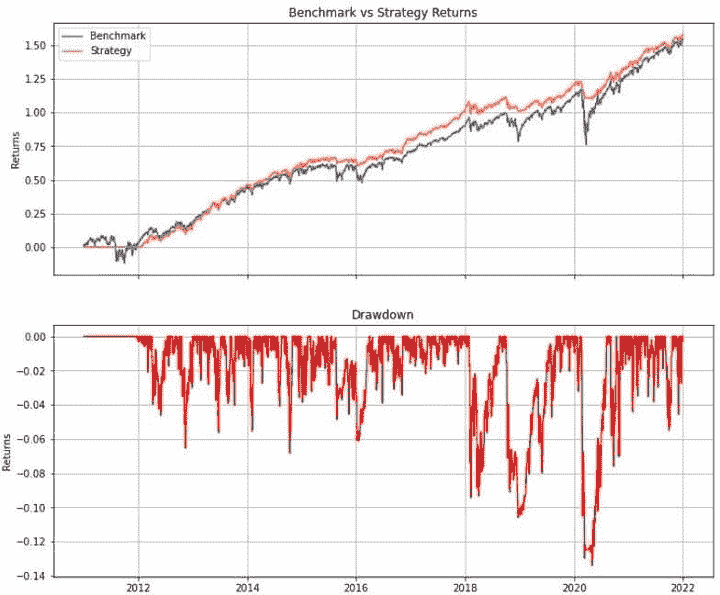
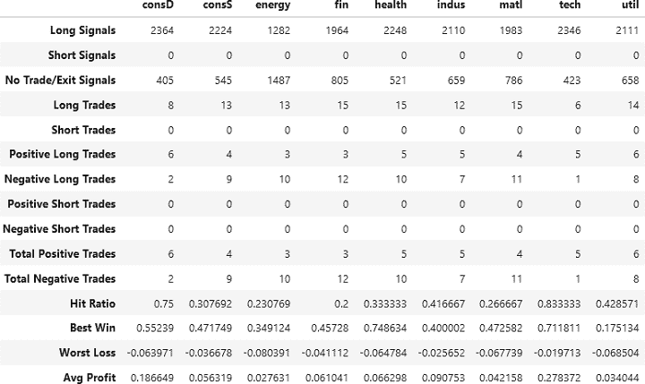
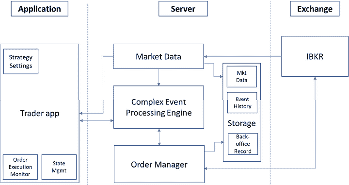

# 多样化的 ETF 投资组合:从回溯测试到实时交易

> 原文：<https://blog.quantinsti.com/diversified-etf-portfolio-project-chee-wai-wan/>

这个项目解释了使用九个部门 ETF 的投资组合的交易策略的创建和回溯测试，以及使用 REST API 将该策略转化为交互式经纪人(IBKR)上的实时交易。这个项目完全编码在 Jupyter 笔记本上。

本文是作者提交的最后一个项目，作为他在 QuantInsti 的算法交易管理课程( [EPAT](https://www.quantinsti.com/epat) )的一部分。请务必查看我们的[项目页面](/tag/epat-trading-projects/)，看看我们的学生正在构建什么。

* * *

## 关于作者

[CW Wan](https://www.linkedin.com/in/cwwan/) 是一名终身学习者，对商业、经济、金融和数据科学有着浓厚的兴趣。他认为算法交易是他所有兴趣汇聚的一个主题。他目前在新加坡的一家工程和技术集团工作。

他拥有 Quantic 商业和技术学院的高级工商管理硕士学位、新加坡国立大学商业分析理学硕士学位(MSBA)以及伦敦玛丽女王大学金融经济学理学硕士学位。

* * *

## 项目摘要

这个 EPAT 的期末专题包括两部分。

第一部分包括使用九只 SPDR 行业 ETF【1】的投资组合创建并回溯测试一个盈利策略。我创建了一个只做多的每日策略，基于短/长均线交叉的进场/出场信号，以及动态的资金分配(每个季度重新平衡)。

使用 2012 年 1 月至 2021 年 12 月的每日数据进行的 10 年回溯测试得出的平均年回报率超过 30%，夏普比率为 1.4，最大下降幅度为-12%。

第二部分包括将上述策略转化为交互式经纪人(IBKR)上的实时交易。使用 IBKR 的客户端 Web API【2】(RESTful API)，并在 Jupyter Notebook【3】上完全编码，我成功地创建了算法上执行上述策略的日常程序所需的所有函数。

项目的这一部分是最累人的，花了将近两个月才完成，但也是最令人满意的。

* * *

## 承认

我要感谢我的项目导师 Rekhit Pachanekar 和 Danish Khajuria 为项目提供的宝贵建议和指导，以及我的课程支持经理 Laxmi Rawat 在 EPAT 课程期间提供的无可挑剔的支持。

* * *

## 项目动机

在我参加 EPAT 课程之前，我问销售顾问，在最终项目中，是否有可能创建一个类似于以下内容的实时算法交易模型/投资组合:

<figure class="kg-card kg-image-card kg-width-full kg-card-hascaption">

<figcaption>Example Retail Investor Fund[4]</figcaption>

</figure>

在我开始 EPAT 之前，我几乎没有现场交易市场的经验，但我有一些基本的数据科学和 Python 编程经验。我也有过一些关于量子乌托邦的经历。但是在我能学到很多算法交易之前，它就被关闭了。

因此，对我来说，如果没有别的事情，我希望从 EPAT 课程中学到建立和管理自己投资组合的能力，这种能力至少要与散户投资者的投资组合一样好。

* * *

## 介绍

本着这个目标，我的项目由两部分组成:

<u>第一部分:回溯测试盈利策略</u>——应用在 Python 交易上学到的经验教训——面向对象编程【6】、基于事件的回溯测试【7】和 ETF 交易【8】——我成功地利用 9 只 SPDR 行业 ETF 的投资组合创建了一个简单但盈利的策略。

使用 2012 年 1 月至 2021 年 12 月的每日数据进行的 10 年回溯测试得出的平均年回报率超过 30%，夏普比率为 1.4，最大下降幅度为-12%。这一策略似乎有可能超越上述零售基金的业绩。

<u>第 2 部分——实时交易盈利策略</u>—应用在 REST API【9】和算法交易系统架构【10】上学到的经验，我设法编写了所有必要的函数，通过算法执行上述策略的日常程序，使用 IBKR 的客户端 Web API 连接到经纪人。我完全是在 Jupyter 笔记本上完成的。

本报告的其余部分结构如下:

*   第 2 节提供了关于回溯测试和结果的更多细节。
*   第 3 节解释了实时交易算法是如何设计的。
*   第 4 节总结。

* * *

## 第 1 部分:回溯测试

### 数据挖掘

为这一策略选择的主要工具是 9 只 SPDR 行业 ETF:

| **股票行情** | **描述** |
| XLY | 非必需消费品 |
| XLP | 消费品 |
| XLE | 活力 |
| XLF | 金融的 |
| XLV | 卫生保健 |
| x 连锁鳞癣 | 产业的 |
| XLB | 材料 |
| XLK | 技术 |
| XLU | 公用事业 |

选择这 9 只 ETF 的理由如下:

*   **简单**——跟踪 9 个行业的整体表现比跟踪 1500 家公司更容易。
*   **交易成本**–只交易 9 种工具比交易 1500 家公司更便宜。
*   **多元化**–每个 ETF 已经是每个领域中最好的公司的多元化投资组合。ETF 投资组合允许进一步分散投资。每季度进行一次的动态资本配置，允许投资组合买入表现更好的行业，“驾驭赢家”。

我们使用雅虎财经【11】(Python yfinance 库)下载了 10 年的每日价格数据，从 2012 年 1 月开始到 2021 年 12 月结束。

我们将 SPY 作为基准。这 9 只 ETF 和 SPY 的价格图表如下:

<figure class="kg-card kg-image-card kg-width-full"></figure>

### 战略描述

**进场/出场信号**:我们采用了只做多的指数移动策略(EMA)交叉策略:如果空头 EMA 穿过 1.01 倍的多头 EMA，我们就进入多头。否则我们退出交易。

交易频率:我们使用每日收盘价来计算信号。因此，该策略将每天执行一次。在实时交易期间，该例行程序将在美国市场每个交易时段的最后 5 分钟内执行。

**动态资本分配**:我们每季度跟踪每个 ETF 的表现，并通过将其季度回报除以所有 ETF 的季度回报之和来计算每个 ETF 的新资本分配。这确保了 ETF 的构成越好，下一季度分配给它的资本就越多。

### 数据分析

使用面向对象编程，我们在 Jupyter Notebook 上使用 Python 执行了基于事件的回测。结果如下:

<figure class="kg-card kg-image-card kg-width-full"></figure>

* * *

### 主要发现

该策略的 10 年累计对数回报率为 1.58(或简单回报率为 385%)，略高于其 SPY 基准(对数回报率为 1.54，简单回报率为 366%)。

最大下降幅度为-0.13，相当于-12%。这发生在 2020 年 COVID19 疫情发作期间。可以看出，当时 SPY 经历的缩减幅度要大得多。

所达到的夏普比率为 1.39。

每个 ETF 的性能统计如下。

*   我们观察到，虽然所有的 ETF 都有正的平均利润，但只有非必需消费品和科技股的命中率超过 0.5。
*   对于其他人来说，积极交易的回报远远超过了消极交易的损失。

<figure class="kg-card kg-image-card kg-width-full"></figure>

* * *

### 限制

上述策略的局限性在于它过于简单，尽管它提供了良好的性能。可以做更多的工作来改进战略或微调战略参数以取得更好的业绩。

然而，在第二部分，我必须将策略转化为现场交易，我认为这更重要。策略改进可以在项目提交后进行。

* * *

## 现场交易

### 实施方法

项目的第二部分是将策略转换成实时算法交易系统。

我已经有了一个交互式经纪人(IBKR)的账户，所以第一步是确定我将使用 EPAT 课程中教授的哪种方法来连接 IBKR。

*   **IBKR TWS API**【12】——这是 IBKR 专有的开源 API。
*   **IBridgePy**【13】——这是一个第三方应用程序，其外观和工作方式与 Quantopian 的平台相似。
*   **IBKR 的 REST API**——这是 IBKR 的行业标准 RESTfulAPI。

下表总结了我对 EPAT 教授的三种方法的尝试:

| **考虑事项** | **TWS API** | 杂交 | **REST API** |
| 内置的交易方法 | 是 | 

*   be
*   All-Trotskyist style

 | 

*   not have
*   You need to create your own methods/functions

 |
| 要安装的文件 | 

*   Tw or IB gateway
*   [TWS API installs 1016.01.msi file]

 | 

*   Tw or IB gateway
*   IBridgePy.zip file (only unzip, no need to install)

 | 

*   [TWS] or IB gateway (optional)
*   Client.gwzip file (only unzip, no need to install)

 |
| 费用 | 自由的 | 

*   The free version needs to manually download a new IBridgePy.zip file every 1+ weeks.
*   IBridgePy 高级版

需要 360 美元的年费 | 自由的 |
| 努力(排名) | 

*   medium-sized
*   Need to learn how to use the built-in methods

 | 

*   Low, if all goes well.
*   Panoramic style

 | 

*   tall
*   You need to create your own methods/functions

 |
| 易于故障排除 | 

*   It may be difficult to check what's wrong [under the hood]

 | 

*   It's hard to check what's wrong [under the hood]
*   Error messages are meaningless.

 | 容易的 |
| Jupyter 笔记本友好？ | 未确定的 | 

*   not have
*   You need to run IBridgePy. Py file, and then run your own code, which must be in a separate. Py file

 | 是 |
| 技能可转移给其他经纪人？ | 不 | 仅限 IBKR、TD Ameritrade 和 Robinhood | 是的，许多经纪人提供 REST API |

归结为 **IBridgePy(简单？)vs. REST API(灵活性)**。

在与 IBridgePy 的故障排除困难(以及过于频繁地更新 zip 文件的恼人需求)斗争了几个星期后，我决定使用 REST API 方法。

虽然构建我自己的方法/函数来连接 IBKR 很费时间，但是使用 Jupyter Notebook 的能力(对初学程序员有用！)，将它们设计成完全按照我想要的方式工作，并且立即排除错误是非常宝贵的。此外，在使用 RESTAPI 中学习的技能可以转移到其他经纪人(如羊驼【14】)和其他非交易目的。

### 交易系统设计

根据 EPAT 关于系统架构的教训，我按照自动交易系统的基本架构设计了我的系统:

<figure class="kg-card kg-image-card kg-card-hascaption">

<figcaption>Basic System Architecture [10]</figcaption>

</figure>

我使用的交易者应用程序是 Jupyter Notebook，这是一个友好但强大的 Python GUI，适合初学者和高级用户。它的结构允许我将代码分解成独立的部分，分别进行测试和故障排除。

它包含标记语言的能力使我更容易记录每一步。我关于这个项目的笔记因此被包括在本报告的附件中。

其余的块由 Python 函数组成。有三种类型的函数:

*   **交易序列函数**–这些核心函数初始化交易环境，确保交易会话与经纪人连接并通过认证，并在交易日的预定时间调用适当的 ALGO 交易函数或 IB REST API 函数。
*   **ALGO 交易功能**–这些功能旨在执行交易操作的特定部分。需要时，这些函数将调用 IB RESTAPI 函数与代理通信，以获取信息或下订单。
*   **IB REST API 函数**–创建这些函数是为了向 IBRK 服务器发送 GET 或 POST 请求，并接收和处理响应。

下表列出并描述了为执行 algo 交易策略而编写的所有三种类型的函数，从交易序列函数开始。

*   第一个列出的是 **algo_daily_schedule()** ，它是主要的时间表控制功能，将在所示的交易日调用其他适当的交易序列功能。
*   其他交易序列函数将根据需要调用适当的 ALGO 交易函数或 IB REST API 函数。
*   ALGO 交易函数将调用 IB REST API 函数来与经纪人通信。

* * *

## 为执行算法交易策略而编写的函数类型

为这个项目编写的各种类型的函数在下面的 pdf 中提到:

[https://d1rwhvwstyk9gu.cloudfront.net/2022/07/Types-of-functions-written-to-execute-the-algo-trading-strategy.pdf](https://d1rwhvwstyk9gu.cloudfront.net/2022/07/Types-of-functions-written-to-execute-the-algo-trading-strategy.pdf)

下载这个 PDF 的链接在这个博客的末尾。

* * *

## 挑战

使用 REST API 为交易系统编码是一件累人的事情。

*   事实上，许多时间都花在编写与代理连接的 IB REST API 函数上。
*   我首先必须得到正确的 get 或 POST 结构。
*   然后，我必须将响应解析成与我的系统兼容的格式。
*   花费了大量精力来处理错误响应或意外响应。
*   项目结束后，可以做更多的工作来改进错误处理。

局限性在于，季度再平衡和动态资本分配没有包括在内。遗漏的原因是我没有 3 个月的时间来测试它。

另一个主要限制是系统中没有内置风险管理模块。这两项限制将在项目结束后完成。

* * *

**参考书目**

1.  https://www.sectorspdr.com/sectorspdr/
2.  https://interactivebrokers.github.io/cpwebapi/
3.  https://jupyter.org/
4.  https://www.syfe.com/equity100
5.  https://en.wikipedia.org/wiki/Quantopian
6.  EPAT 课程:DMP 02 面向对象编程导论
7.  EPAT 课程:DMP-03/04 金融 Python
8.  EPAT 课程:EFS-06 理解交易所交易基金
9.  EPAT 课程:TBP-02 休息 API
10.  EPAT 课程:自动交易系统的 TIO-01 系统结构
11.  https://pypi.org/project/yfinance/
12.  https://interactivebrokers.github.io/tws-api/
13.  https://ibridgepy.com/
14.  https://alpaca.markets/

* * *

## 摘要

我已经完成了这个 EPAT 项目的两个部分。

在第一部分中，我创建并回测了一个盈利策略，使用了 9 只 SPDR 行业 ETF 的投资组合。使用 2012 年 1 月至 2021 年 12 月的每日数据进行的 10 年回溯测试得出:

*   *年平均回报率超过 30%，*
*   *夏普比率为 1.4，以及*
*   最大下降幅度为-12%。

这些结果令人鼓舞，它们似乎胜过了激励这个项目的散户基金。然而，该策略很简单，还可以做更多的工作来提高其性能。

在第二部分中，我使用 REST API 方法并在 Jupyter Notebook 上完全编码，将上述策略转化为交互式经纪人(IBKR)上的实时交易。

项目的这一部分是最累人的，花了将近 2 个月才完成，但也是最令人满意的。将做更多的工作来包括季度再平衡部分，并增加风险管理方面的考虑。

* * *

### 结论

参与这个项目是一次富有成效的经历，我从 EPAT 的许多课程中学到了很多东西。我能够想出一个有利可图的策略，使用 Python 进行回溯测试，并创建一个算法交易系统，在 IBKR 纸上交易账户上实时执行该策略。

> 从我开始课程前在这个领域的初学者到课程结束后能够完成这个(当然是在项目导师的帮助下！)，我相信这证明了 EPAT 的课程是真正优秀的！

如果你想学习算法交易的各个方面，那就去看看这个[算法交易课程](https://www.quantinsti.com/epat/)，它涵盖了统计学&计量经济学、金融计算&技术和算法&量化交易等培训模块。EPAT 教你在算法交易中建立一个有前途的职业所需的技能。立即注册！

* * *

****文件在下载****

*   项目的完整 Python 代码
*   PDF 文档-为执行算法交易策略而编写的函数类型

* * *

免责声明:就我们学生所知，本项目中的信息是真实和完整的。学生或 QuantInsti 不保证提供所有推荐。学生和 QuantInsti 否认与这些信息的使用有关的任何责任。本项目中提供的所有内容仅供参考，我们不保证通过使用该指南您将获得一定的利润。