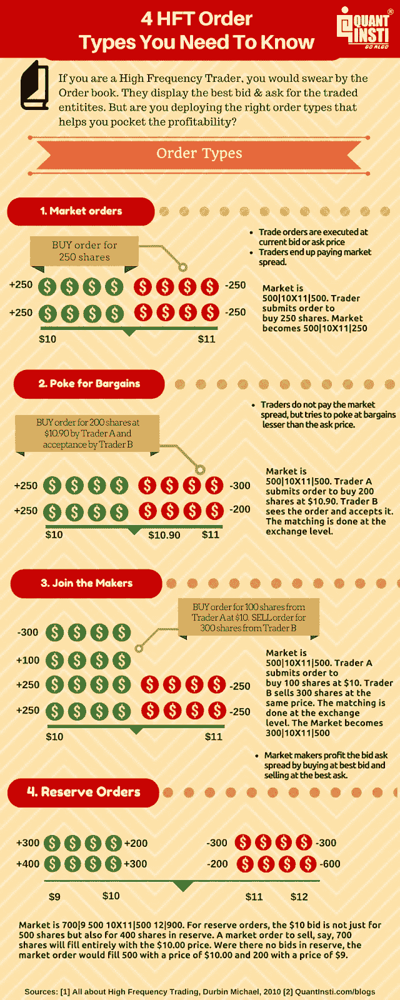
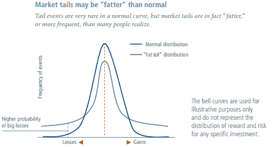
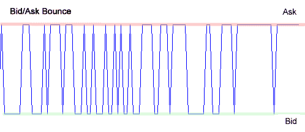

# 高频交易(HFT):历史，基础，事实，特征，等等

> 原文：<https://blog.quantinsti.com/high-frequency-trading/>

由[查尼卡·塔卡](https://www.linkedin.com/in/chainika-bahl-thakar-b32971155/)、[阿努普里亚·古普塔](https://goo.gl/5kA0yu)和[米林德·帕拉德卡](https://www.linkedin.com/in/milind-paradkar-b37292107?authType=NAME_SEARCH&authToken=x7bC&locale=en_US&trk=tyah&trkInfo=clickedVertical%3Amynetwork%2CclickedEntityId%3A451572955%2CauthType%3ANAME_SEARCH%2Cidx%3A1-1-1%2CtarId%3A1482167933077%2Ctas%3Amilind%20paradkar)

高频交易是[算法交易](/algorithmic-trading/)的子集，由高频交易算法执行。HFT 的心脏或核心是以下几个部分的结合:高速计算机系统&实时数据供给(快速跟踪交易和订单)。

在这篇文章的结尾，你将会很好的掌握关于高频交易，高频交易算法等有用的知识。

本文涵盖:

*   [什么是高频交易？](#what-is-high-frequency-trading)
*   [高频交易是如何运作的？](#how-does-high-frequency-trading-work)
*   [高频交易指令](#high-frequency-trading-orders)
*   [高频交易的历史](#history-of-high-frequency-trading)
*   [关于高频交易的事实](#facts-about-high-frequency-trading)
*   [高频数据特征](#features-of-high-frequency-data)
*   [高频交易策略](#high-frequency-trading-strategies)
*   [谁使用高频交易？](#who-uses-high-frequency-trading)
*   [高频交易岗位](#high-frequency-trading-jobs)
*   [印度顶级高频交易公司](#top-high-frequency-trading-firms-in-india)
*   [全球顶级高频交易公司](#top-high-frequency-trading-firms-globally)
*   [设立高频交易台的要求](#requirements-for-setting-up-a-high-frequency-trading-desk)
*   [高频交易的监管要求](#regulatory-requirements-for-high-frequency-trading)
*   [高频交易与长期投资](#high-frequency-trading-vs-long-term-investments)

* * *

## 什么是高频交易？

高频交易是股票市场中的一种[交易行为，以极高的速度下达和执行许多交易指令。从技术上讲，高频交易使用 HFT 算法来分析多个市场，并以最有利可图的方式执行交易指令。](https://quantra.quantinsti.com/course/stock-market-basics)

高频交易者利用先进的技术创新，比市场上任何人都更快地获得信息。有了这些信息，交易者就能够用他的高频交易算法快速执行交易指令。

[协同定位](https://quantra.quantinsti.com/glossary/Colocation)是一种便于快速获取信息并快速执行交易的做法。

毕竟，有了所有的交易策略和强有力的分析，还能剩下什么呢？

答案是高交易频率，因为它考虑了在特定时间间隔内交易次数的[频率](https://quantra.quantinsti.com/glossary/Trading-Frequency)。选择高频是因为它有助于高速交易，也是交易者收益最大化的因素之一。

* * *

## 高频交易是如何运作的？

高频交易主要是一个等待时间的游戏(Tick-To-Trade)，这基本上意味着你的策略对即将到来的市场数据的反应有多快。

这家名为[【Bleeding edge】](https://en.wikipedia.org/wiki/Bleeding_edge_technology)的公司实际上谈论的是一位数微秒甚至亚微秒级的延迟(超高频交易)与更新、更复杂和定制的硬件。

总而言之，在过去的 20 年里，买家希望支付的价格和卖家希望获得的报酬之间的差距已经大幅缩小。其中一个原因是准确性的提高。HFT 还向市场注入了更多流动性，降低了买卖价差。

* * *

## 高频交易订单

高频交易包括四种类型的 HFT 订单，我们已经在下面的信息图中讨论过了。

<figure class="kg-card kg-image-card kg-width-full"></figure>

接下来，让我们看看 HFT 的历史和有趣的事实。

* * *

## 高频交易的历史

有趣的是，“快速信息”传递的现象可以追溯到 17 世纪。

*   17 世纪- 内森·梅尔·罗斯柴尔德利用科技，比伦敦政府更早知道威灵顿公爵在滑铁卢战胜了拿破仑。
*   **19 世纪-** 据说，汤森路透的创始人朱利叶斯·路透(Julius Reuter)在 19 世纪使用了包括电报电缆和一队信鸽在内的技术组合来运行新闻传递系统。通过这种方式，朱利叶斯·路透得到的消息比任何人都要早。
*   **1983 -** [纳斯达克](https://en.wikipedia.org/wiki/Nasdaq)推出了成熟的电子交易，促使以计算机为基础的高频交易逐渐发展到高级阶段。
*   2000 年代-2000 年代初，HFT 在股票订单中所占比例不到 10%，但这一比例已经迅速增长。
*   **2001 -** 到了 2001 年，HFT 已经有了几秒钟的执行时间，而且还在继续提高。
*   **2005 年至 2006 年-** 根据纽约证券交易所的数据，2005 年至 2009 年间，高频交易量增长了 164%。
*   到 2010 年，这一时间缩短到了毫秒，今年晚些时候缩短到了微秒。
*   **2012 -** 随后，每笔交易都在 2012 年的几纳秒内开始执行。

* * *

## 关于高频交易的事实

### 潜伏

速度并不像被低估的等待时间那样重要。延迟意味着数据传输到目的地所需的时间。因此，定价过低的延迟变得比低延迟(或高速)更重要。

### 速度

根据彭博的说法，速度仍然很重要，但这是内在的，而不是外在的。传统的 HFT 意味着订单进入市场和你有能力接受订单之间的时间很短。它主要由外部传输延迟组成，企业很快学会了快速做出内部决策，这对结果来说是无关紧要的。

### 决策

内部决策时间用于决定最佳交易，这样即使是第一个选择交易的人，交易也不会变得毫无价值。因为高频交易在很多方面都是独一无二的，很明显你想知道是什么特征使它如此。

### 证券市场为调整供求或价格而进行的买卖

高频交易公司将其业务描述为“[做市](/automated-market-making-overview/)”。每个做市商都通过显示特定数量证券的买卖报价来发挥作用。一旦收到买家的订单，做市商就从自己的库存中卖出股票并完成订单。因此，这一过程增加了市场的流动性。因此，它被称为[做市策略](/market-making/)。

### 信号

信号(买/卖信号)的准确性是最重要的，因为如果信号传递不正确，收益可能会很快变成损失。所以，HFT 确保每一个信号都足够精确，以如此高的速度触发交易。

### 逐滴答数据

市场数据的变化触发高频交易系统在几百纳秒内产生新的订单。因此，收集的数据可能包含数十亿行数据！

### [协同定位](https://quantra.quantinsti.com/glossary/Colocation)

这意味着将高频交易机构和自营交易员拥有的计算机放在交易所计算机服务器所在的同一场所。因此，协同定位使拥有高性能服务器的 HFT 公司能够更快地进入市场。

### 资产类别

高频交易自营公司交易股票、期货、债券、期权、外汇等。任何时间任何地点的 HFT，因此成为外汇交易的首选。

### 高端系统

仅仅停留在高频率的游戏中就需要持续的维护和升级来满足需求。为了实现这一目标，银行和其他金融机构投入大量资金开发全球超高速计算机硬件和执行引擎。

### 熟练的专业人员

高频交易专业人士的需求越来越大，薪酬也越来越高。金融和计算机科学的理论和实践的坚实基础是成功实施高频环境的共同前提。

太好了！接下来，让我们探索高频数据的特征。

* * *

## 高频数据的特征

随着零延迟竞赛的继续，高频数据作为 HFT 的一个关键组成部分，仍然处于研究人员和市场分析师的扫描之下。

有了高频数据的一些特征，对交易方的理解就好得多了。HFT 中涉及的数据扮演着重要的角色，就像任何类型的交易中涉及的数据一样。

随着对 HFT 数据的深入了解，你将能够理解高频交易的技术层面。本节旨在为我们的读者揭示其中的一些特征，它们是:

### 观察之间不规则的时间间隔

在任何一个交易日，流动性市场都会产生成千上万个分笔成交点，形成高频数据。本质上，该数据在时间上是不规则间隔的，并且与规则间隔的当天结束(EOD)数据相比是海量的。

HFT 包括分析这些数据来制定交易策略，这些策略的执行延迟非常低。因此，数学工具和模型融入高频数据的特征变得非常重要，如不规则的[时间序列](/time-series-analysis/)和其他一些我们将在下面概述的数据，以做出正确的交易决策。

### 非正态资产回报分布(例如，厚尾分布)

高频数据呈现厚尾分布。为了理解厚尾，我们需要先理解正态分布。[正态分布](https://quantra.quantinsti.com/glossary/Normal-Distribution)假设样本中的所有值将在平均值上下均匀分布。

因此，大约 99.7%的所有值都在平均值的三个标准偏差范围内，因此极端事件发生的概率只有 0.3%。

做 HFT 的定量分析师需要模拟尾部风险以避免重大损失，因此尾部风险对冲在高频交易中很重要。

下图显示了相对于正态分布的厚尾分布。

<figure class="kg-card kg-image-card kg-width-wide kg-card-hascaption">

<figcaption>Source: lexicon.ft.com</figcaption>

</figure>

此外，高频数据显示:

*   波动聚类和
*   收益率绝对值的长期相关性(长记忆性)。

**波动聚类**

在金融学中，波动性聚类指的是 Mandelbrot (1963)指出的观察结果，即“大变化往往伴随着大变化，或者符号和小变化往往伴随着小变化。”

**长期依赖(长记忆)**

长程相关性(LRD)，也称为长记忆或长程持续性，是在分析[空间](https://en.wikipedia.org/wiki/Spatial_analysis)或[时间序列](/time-series-analysis/)数据时可能出现的现象。这与两点的[统计相关性](https://en.wikipedia.org/wiki/Statistical_dependence)随时间间隔或两点间空间距离的增加而衰减的速率有关。必须注意的是，如果相关性比[指数衰减](https://en.wikipedia.org/wiki/Exponential_decay)更慢，通常是类似幂的衰减，则通常认为现象具有长程相关性。

### 高计算负载和相关的“大数据”(以及与之相关的问题)

HFT 玩家依赖微秒/纳秒延迟，并且必须处理大量数据。为 HFT 利用大数据会带来一系列问题。

高频交易公司需要拥有最新的最先进的硬件和最新的软件技术来处理大数据。否则，它会增加处理时间，超出可接受的标准。

### 市场微观结构噪音

[市场微观结构](/market-microstructure/)噪声是利用高频数据观察到的现象，与观察到的价格偏离基价有关。噪声的存在使得一些参数(如已实现的波动性)的高频估计非常不稳定。高频数据中的噪声可能由多种因素引起，即:

*   买卖反弹
*   不对称信息
*   价格变化的离散性
*   订单到达延迟

**买卖反弹**

当一只股票的价格不断从买入价变为卖出价时，就会出现这种情况(反之亦然)。股票价格的变动只发生在买卖价差内，这就产生了反弹效应。这种买卖反弹的出现会导致高波动性读数，即使价格保持在买卖窗口内。

<figure class="kg-card kg-image-card kg-width-full"></figure>

**信息不对称**

在信息不一致的情况下，高频交易者很难对股价做出正确的估计。

**价格变化的离散性**

由于价格变化的离散性，没有形成稳定性，因此，根据这种信息进行估计是不可行的。

**订单到达等待时间**

等待时间是指订单到达股票市场或进一步执行所需的时间。在高订单到达延迟的情况下，交易者不能将其订单执行决策建立在交易最有利可图的时候。

另一方面，在订单到达延迟较低的情况下，订单可以在最有利可图的时刻到达市场。

接下来，让我们来看看有趣的高频交易策略。

* * *

## 高频交易策略

HFT 公司使用不同类型的高频交易策略，每种策略的最终目标和基本原理都各不相同。这些策略是基于对市场的分析，因此，决定了你交易的成败。

因此，重要的是只提出最适合你的策略。HFT 战略的一些重要类型是:

### 订单流量预测高频交易策略

订单流预测策略试图通过各种手段提前预测大玩家的订单。然后，他们在他们之前建立交易头寸，并锁定利润，因为这些大型参与者的交易会产生后续价格影响。

### 执行高频交易策略

执行 HFT 策略寻求在不造成重大价格影响的情况下执行各种机构参与者的大订单。其中包括:

*   ****【成交量加权平均价格】策略**——该策略用于以较好的平均价格执行大额订单。它是一段时间内交易价值与交易总量的比率。**
*   ****[【TWAP】](/twap/)(时间加权平均价格)策略**——该策略用于在不影响价格的情况下买入或卖出大宗股票。**

### **流动性准备–做市策略**

**高频交易做市商需要首先建立报价，并不断更新报价以响应其他订单提交或取消。报价的这种连续更新可以基于高频交易做市商所遵循的模型的类型。在此过程中，HFT 做市商往往会为每笔交易提交和取消大量订单。**

### **自动化高频交易套利策略**

**HFT [套利策略](https://quantra.quantinsti.com/course/statistical-arbitrage-trading)当两种类似的工具之间产生差价时，试图获取小额利润。[指数套利](/index-arbitrage-automated-options-trading-strategy/)可以认为是同样的一个例子。标准普尔 500 [期货](https://quantra.quantinsti.com/course/futures-trading)和 SPY(一个追踪标准普尔 500 指数的 ETF)之间的价格变动应该彼此一致。**

**如果价格变动不同，那么指数套利者会立即使用他们的自动 HFT 策略通过套利来获取利润。为了有效地做到这一点，高频交易套利策略需要快速执行，以便在其他参与者加入之前，迅速从错误定价中获得最大收益。**

**除了上面讨论的，还有其他高频交易策略，如:**

*   ****回扣套利策略**寻求赚取交易所提供的回扣。**
*   **基于**低延迟新闻源**的 HFT 策略。**
*   ****冰山和嗅探器**用于检测和应对试图隐藏大宗交易的其他交易者。**

* * *

## **谁用高频交易？**

**属于以下类别的公司使用高频交易:**

*   **独立自营公司(Independent Proprietary companies)——这些公司倾向于对自己的运营保持保密，其中大多数都是做市商。**
*   **经纪-交易商自营柜台 -这些传统的经纪-交易商公司拥有独立的与客户业务无关的高频交易柜台。**
*   **[对冲基金](https://quantra.quantinsti.com/glossary/Hedge-Funds) -由对冲基金组成的公司将重点放在[统计套利](https://quantra.quantinsti.com/course/statistical-arbitrage-trading)上，以利用资产类别&证券中的低效率定价。**

**此外，为了根据您的交易结果随机应变，我们有一个精心设计的课程[“高级算法交易策略”](https://quantra.quantinsti.com/learning-track/algorithmic-trading-for-quants)，如果您正在寻找一些东西来增强您的交易体验，这应该会有所帮助。**

**好了。我们将在前面看看在 HFT 公司的职业方面。**

* * *

## **高频交易工作**

**一旦你成为一名合格的候选人，你可以从全球范围内选择一些重要的职位。我们将在这里讨论的所有角色都是非常重要和有益的。看看下面的列表，包括:**

*   **定量分析师/模型开发人员**
*   **战略制定者**
*   **商人**
*   **网络/系统管理员**

****[量化分析师](/difference-quants-technical-analysts/) /模型开发者****

**如果你对自己构建模型感兴趣，并想申请一个定量分析师/模型开发员的职位，学习定量技能，并掌握使用定量工具的工作知识，如 R、Matlab、Python。**

****战略制定者****

**对于策略开发人员角色，您需要编写策略代码，或者维护和修改现有的策略。最有可能的是，你将与一位开发交易模型的定量分析师一起工作，你将被要求把策略编码到一个执行平台中。**

****交易员****

**对于交易角色，你的金融知识和解决问题的能力都很重要。如果你擅长解谜和解决问题，你会喜欢金融世界的错综复杂。**

****网络/系统管理员****

**涉及维护高频交易平台和编码策略的核心开发工作通常使用 C++或 JAVA。因此，磨练你的 C++或核心开发语言是绝对必要的。**

**有一些 HFT 公司通常专注于套利和量化策略。这类公司的名单很长，但这些公司可以满足你在其中一家公司找一份定量分析师或定量开发员工作的需要。**

**我们在另一个博客中分享了细节，以及你如何探索和学习[高频交易工作](/high-frequency-trading-jobs/)。**

* * *

## **印度顶级高频交易公司**

*   **塔研究(古尔冈)**
*   **高盛(班加罗尔/孟买)**
*   **摩根斯坦利(孟买)**
*   **伊拉克首都(孟买)**
*   **埃斯特顾问公司(古尔冈)**
*   **四眼(古尔冈)**
*   **加速贸易技术公司(班加罗尔)**
*   **多拉特集团(孟买)**
*   **雪绒花(孟买)**
*   **阿普特(古尔冈)**
*   **公开期货(德里)**
*   **LLP 引力研究中心(Gurugram)**
*   **Alphagrep 证券公司(孟买)**

* * *

## **全球顶级高频交易公司**

*   **Citadel 证券公司(美国纽约)**
*   **Flow Traders NV(荷兰阿姆斯特丹)**
*   **GSA 资本合伙公司(英国伦敦)**
*   **IMC Trading BV(荷兰阿姆斯特丹)**
*   **跳跃式交易(美国芝加哥)**
*   **KCG 控股公司(美国汉普顿路)**
*   **虚拟金融公司(美国纽约)**

* * *

****注意:**如果你想在量化交易领域发展事业，EPAT 是最适合你的 [algo 交易课程](https://www.quantinsti.com/epat)。EPAT 提供最全面的课程，由领先的行业从业者和专家授课。一旦完成，你将获得终身职业援助。**

* * *

## **建立高频交易平台的要求**

**这一部分对那些希望建立自己的高频交易平台的交易者来说尤其重要。基本上，你需要一些我们在这里列出的东西，它们是:**

### **注册公司**

**首先，你需要注册你想交易的公司。这可以通过两种方式实现:合伙**或作为个人**。值得注意的是，如果你想和其他投资者一起建立对冲基金，你可能需要监管机构的批准。******

### ****交易和运营资本****

****HFT 公司的资本是进行交易和经营的必要条件。这有助于您安排所需的一切，从路由器/调制解调器和交换机等基本网络设备到系统的[协同定位](https://quantra.quantinsti.com/glossary/Colocation)。****

### ****进入市场****

****如果你不想直接成为交易所的会员，你也可以通过经纪人。这涉及较少的合规规则和监管要求。然而，另一方面是，你将不得不支付经纪费。****

### ****基础设施要求****

****对于基础设施，您将主要需要:****

*   ****[硬件](/pc-hardware-components-simplified/) -意味着执行操作的计算硬件。这只不过是你的计算系统。****
*   ****[网络设备](https://en.wikipedia.org/wiki/Networking_hardware)——暗指你的路由器/调制解调器、交换机、互联网等等。****

### ****审计与合规****

****所有在印度的 HFT 公司都必须接受每半年一次的审计。审计只能由交易所(例如美国的纽约证券交易所)网站上列出的注册审计师进行。对于审计，您需要维护订单日志、交易日志、控制参数等记录。在过去的几年里。****

****接下来，我们将讨论 HFT 的监管要求。****

* * *

## ****高频交易的监管要求****

****在世界各地，已经实施了许多法律来阻止可能对金融市场有害的活动。一些专家一直认为，一些针对 HFT 活动的监管规定对市场无益。****

****他们表示，一方面，我们有高频交易者作为做市商，他们拥有订单流驱动的信息和速度优势。另一方面，我们的交易者对这种延迟并不敏感。****

****总体而言，实证结果表明，这些针对 HFT 的监管措施并不一定会提高市场质量。之所以如此，是因为他们未能提供足够的证据，证明像闪电崩盘这样的市场突然失灵。****

****高频交易中的一些监管变化如下:****

### ****金融交易税****

****FTT 被用来限制 HFT 相关的过度交易。此外，这种做法导致政府收入增加。在适当的水平上，FTT 可以削减高频交易，而不会损害其他类型的交易，包括其他形式的非常快速、高速的交易。****

****让我们举几个与 FTT 有关的国家为例。****

******欧盟 FTT -** 据[欧洲议会](https://www.europarl.europa.eu/legislative-train/theme-deeper-and-fairer-internal-market-with-a-strengthened-industrial-base-taxation/file-financial-transaction-tax)报道，2013 年 2 月 14 日，欧盟委员会提议在 11 个成员国中引入 FTT，但以“加强合作”为手段。****

****但在 2015 年 3 月 25 日，议会意识到并遗憾地表示，成员国没有加强合作。虽然这一问题在委员会中仍未解决，但该国定期得到讨论。****

****最近，重新做出了决定，并于 2019 年 6 月 14 日向理事会通报了进展情况。****

******英国 FTT -** 需要注意的是，征收交易税并不新鲜，例如，**英国**自 1964 年以来一直以印花税的形式征收 FTT，对股票的购买者收取 0.5%的费用。****

****这帮助政府在 1999-2000 年间筹集了大约 50 亿欧元。反对 FTT 的人强烈认为，征税计划不足以打击投机交易活动。****

****由于缺乏令人信服的证据证明金融交易税降低了短期波动性，金融交易税不太可能降低未来的风险。****

******瑞典 FTT-****瑞典** FTT 在 1984 年至 1991 年间被应用，希望能获得额外的税收收入并统治金融市场。但是，众所周知，这是 FTT 实施的一个典型失败。****

****此外，瑞典对股票交易征收近 50 个基点的税，导致超过一半的股票交易量从瑞典转移到伦敦。事实证明，这是一个糟糕的收入来源，也是一个不足以监管股票市场的机制。****

****此外，这篇由 BNY·梅隆撰写的[文章概述了截至 2018 年全球范围内目前已实施和提议的 FTT 法案。](https://www.bnymellon.com/emea/en/_locale-assets/pdf/our-thinking/ftt-globalperspective-brochure-03-2018.pdf)****

### ****关于过量订单提交和取消的规定****

****现在，我们来看另一个监管变化。就是在很短的时间内大量订单的提交和取消，这是 HFT 最突出的特点。****

****值得注意的是，向高订单交易比率的交易商收取费用被认为是为了抑制高频交易公司的有害行为。****

****此外，如果收取较高的[订单交易比](https://quantra.quantinsti.com/glossary/Order-to-Trade-Ratio)或实施税收以阻止操纵活动，速度较慢的交易者可以更积极地交易。这种税应该能够总体上改善流动性。****

****根据 2019 年 8 月 13 日的[商业标准](https://www.business-standard.com/article/markets/sebi-moots-surge-charges-on-members-with-high-order-to-trade-ratio-118031201187_1.html)，监管机构正在研究对订单交易比高的交易员征收“激增费用”的概念。****

### ****回扣结构****

****返利结构是另一个监管变化。当[限价单](https://quantra.quantinsti.com/glossary/Limit-Order)交易者得到回扣补偿时，市价单交易者则被收取费用。因此，当交易者(通常是高频交易者)发送限价单来做市时，向市场提供流动性，这反过来为交易所提供流动性。****

****这对于提交大量限价单的交易者来说肯定是有吸引力的，因为该定价方案为限价单交易者提供了更小的风险。****

****还存在一种与市场接受者定价相反的收费结构，称为交易商定价。它包括向市场订单交易者提供回扣，并收取费用以限制订单交易者，这种做法也在某些市场中使用。****

****这种结构总体上不利于高频交易者，专家们认为，这些市场通常不太透明，这可能对市场不利。****

### ****断路器****

****为了防止极端的市场波动，正在使用断路器。断路器在减少市场崩溃方面是有效的。****

****为了防止类似 1987 年 10 月的市场崩溃事件，纽约证券交易所为交易所引入了熔断机制。当股价跌破某个阈值时，这个熔断机制会暂停整个市场的交易。****

****让我们以当前场景中的真实世界为例，在 3 月份，由于冠状病毒爆发，市场多次遭遇熔断机制。这导致市场因股价暴跌而暂停 15 分钟。****

****2020 年 3 月 15 日，据[美国消费者新闻与商业频道](https://www.cnbc.com/2020/03/15/the-sp-500-futures-hit-limit-down-at-5-percent.html)报道， [S & P 500](https://www.cnbc.com/quotes/?symbol=.SPX) 在开盘后立即暴跌约 8%，触发一级断路器，导致交易暂停 15 分钟。T4 道琼斯工业平均指数开盘暴跌 2250 点。美国东部时间上午 9 点 46 分市场重新开放。****

****美国总统唐纳德·特朗普(Donald Trump)在新闻发布会上表示，冠状病毒最严重的时期可能会持续到 8 月，发达经济体“可能”会陷入衰退，随后股市收盘跌至盘中低点。****

****道琼斯指数暴跌 2997 点，经历了自 1987 年“黑色星期一”市场崩盘以来最糟糕的一天。标准普尔 500 收盘下跌近 12%。****

### ****订单处理中的结构性延迟****

****订单处理过程中的随机延迟(几毫秒)会抵消 HFT 的一些策略，这些策略可能会营造一种技术军备竞赛和赢家通吃的环境。****

****在这里，更快的交易者的优势在随机延迟下显著下降，而他们仍然有提高交易速度的动力。如果提高交易速度的好处会大幅减少，这将阻止高频交易商参与徒劳的军备竞赛。****

****展望未来，我们将看到 HFT 与长期投资有何不同？****

* * *

## ****高频交易与长期投资****

****关于高频交易和长期投资的比较，有很多争论和讨论。这里必须提到的是，市场上长期投资者对 HFT 有各种各样的看法。****

****我们不要去争论什么是好什么是坏，这是一个非常主观的问题，让我们看看 HFT 和长期投资有什么不同。****

******HFT** 在市场中以零头寸开始和结束。这个想法是在很小的利润空间内快速买卖，赚取极小的利润。因此，HFT 部署的阵地相当小。如果一个高频交易者必须使用 5000 万现金进行交易，他/她将持有大量头寸，比如说 5 亿，也就是说，几乎是资本的 10 倍。****

****另一方面，**长期投资者**从大量资本开始，在很长一段时间内赚取高额利润。这需要大量资本，导致交易成本增加，但也带来了更高的利润率和预期的利润一致性。下表总结了这些要点:****

******对比高频交易和长期投资******

| **差异** | **高频交易** | **长期投资** |
| 利润率 | 小的 | 大的 |
| 交易成本 | 小的 | 大的 |
| 资本需求 | 小的 | 大的 |
| 利润的一致性 | 高的 | 低的 |
| 总利润潜力 | 高的 | 大的 |

 *****<small>(免责声明:上表是对高频交易和长期投资的概述，以及对一些公司/机构的分析，可能会因上述变量而有所不同。)</small>*

精彩！这就把我们带到了文章的结尾，当然我们也谈到了高频交易中一些最受欢迎的话题。

* * *

## **结论**

因为我们的目标是让这篇文章内容丰富，能够满足所有读者的需求，所以我们包含了几乎所有与高频交易和 HFT 算法相关的概念。

如果你正在开始你的量化交易之旅，请查看 Quantra 关于[量化交易策略和模型](https://quantra.quantinsti.com/course/quantitative-trading-strategies-models)的课程，该课程教授基本的技术交易策略，如基于趋势的策略和布林线策略，它们也可以在实时市场上交易。立即注册！

* * *

<small>*免责声明:本文提供的所有数据和信息仅供参考。QuantInsti 对本文中任何信息的准确性、完整性、现时性、适用性或有效性不做任何陈述，也不对这些信息中的任何错误、遗漏或延迟或因其显示或使用而导致的任何损失、伤害或损害负责。所有信息均按原样提供。*</small>****