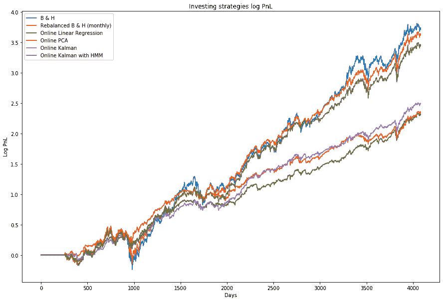

# 利用在线量化模型投资大型科技股

> 原文：<https://blog.quantinsti.com/investing-big-tech-stocks-online-quantitative-models-epat-project-evgeny-tishkin/>

这个项目旨在分享一个关于如何在交易策略开发和改进中使用在线机器学习定量技术的例子。

与随后交叉验证的传统常规模型再培训相比，在线学习允许算法交易的更深入自动化。这是因为这种模型可以在实时交易中实时调整参数。

真正的生产策略远比项目中作为示例使用的策略复杂，包括更深层次的自动化和更广泛的参数。然而，合并的在线模型具有普遍适用性，可以应用于不同种类的交易策略，从被动投资到高频交易(HFT)。

本文是作者提交的最后一个项目，作为他在 QuantInsti 的算法交易管理课程( [EPAT](https://www.quantinsti.com/epat) )的一部分。请务必查看我们的[项目页面](/tag/epat-trading-projects/)，看看我们的学生正在构建什么。

* * *

## 关于作者

<figure class="kg-card kg-image-card"></figure>

Evgeny Tishkin 在算法交易和 HFT 领域拥有超过 10 年的丰富经验，曾在多家自营交易公司和对冲基金担任量化开发人员、首席软件架构师、量化分析师和首席技术官。

对于担任 CTO 的一家算法对冲基金，他从零开始创建了完整的低延迟多交易所算法交易基础设施和高频交易框架。

在 2019 年 XTX 市场全球预测挑战赛中，叶夫根尼在来自全球 100 个国家的 4000 多名定量研究人员中获得第二名。

Evgeny 拥有萨马拉国立航空航天大学的计算机科学硕士学位。此外，他还获得了莫斯科物理技术学院的“机器学习和数据分析”专业学位。

* * *

## 项目理念

这个项目背后的想法是创建一个量化的战略，以改善部门投资。

* * *

## 考虑的股票

我将以大型科技股为例，选择 FANGAM 股票(脸书、苹果、网飞、谷歌、亚马逊、微软)+ QQQ(纳斯达克 100 指数 ETF)

* * *

## 步伐

我执行以下步骤:

*   从 2005 年开始计算等额买入并持有投资。
*   每月计算等额再平衡投资组合。
*   尝试使用基于统计套利思想的智能进场和出场来提高夏普和卡尔曼比率:在线线性回归，在线主成分分析，卡尔曼滤波器。“在线”是指在我们计算预测的当天之前的回望期的一个逐日可再训练的模型。
*   尝试使用隐马尔可夫模型的市场机制过滤来改进前面步骤的结果

我这里省略交易成本，因为在低频交易中可以忽略不计。我从雅虎财经资源获取了 2005 年开始的数据，包括 2008-2009 年的金融危机。

* * *

## 使用的技术

我使用以下技术:

### 每月投资组合再平衡

这种再平衡改善了 Sharpe，但没有改善 Max drawdown 并使 Calmar 降低。在重新平衡时，我每个月都会将资金平均分配到每只股票上。

执行此程序的更有效方法是使用波动率和成对相关信息来衡量整个投资组合的风险值。这是一种基于现代投资组合理论的众所周知的方法，但这超出了本研究的范围。

### 在线回归

在线意味着我们每天都要训练模型，并从数据集中提取数据进行训练。线性回归采用线性方法来模拟目标变量和解释变量之间的关系。

在我们的例子中，我使用线性回归来寻找相关股票之间的统计线性传播的最佳系数。在应用这种方法之前，我确保我们投资组合中的所有股票彼此高度相关，皮尔逊系数超过 0.9。

基于日常训练的结果，我计算了当天目标的残差。使用残差将被进一步解释。它们被用来指示何时买入或卖出股票。

### 在线 PCA(主成分分析)

PCA 是一种基于矩阵的特征值和特征向量提取方差的正交非相关分量的方法。

它用于解决数据分析中的不同问题。我以[本资源](https://github.com/rodler/quantinsti_statarb)中描述的方式使用它进行因子或特征提取。

因此，使用主成分分析提取几个主成分，并用作近似目标价格的特征。

成分是初始投资组合股票价格的线性组合。使用这些提取的特征和在线线性回归来预测目标股票价格。然后我们计算残差。

### 卡尔曼滤波器

卡尔曼滤波器是统计学和控制理论中的一种众所周知的算法，它使用时间序列测量(在我们的例子中是股票价格)来产生对目标变量的更精确的估计。

我使用卡尔曼滤波器来评估解释目标(目标股票价格)变量购买“独立”变量(投资组合中的其他股票价格)的在线回归系数。

Ernie P. Chan 博士的《算法交易:获胜策略及其基本原理》一书中描述了一种类似的方法，但应用于统计套利。它非常类似于在线线性回归方法，并计算统计分布系数，但根本不使用回望期。

代替这个周期，卡尔曼滤波器由影响滤波器的“适应性”的“增量”参数来参数化。

### 隐马尔可夫模型

该模型基于马尔可夫过程或马尔可夫链，并假设存在另一个具有可观察变量(例如股票价格)的过程 Y，该过程依赖于具有隐藏状态(市场“制度”)的当前马尔可夫过程 X。马尔可夫链本身假设下一个状态的概率只取决于当前达到的状态。

期望最大化算法用于[无监督](https://quantra.quantinsti.com/course/unsupervised-learning-trading)提取每个状态的可观察变量(例如股票价格)的高斯分布参数和隐藏状态序列本身。

我认为市场状态(上升趋势、下降趋势、波动市场、拥挤等)是一种隐藏的市场状态，可以用一组参数分布来表征，这些参数分布具有通过优化确定的特定参数。我再次使用培训模型的在线变体。提取的状态可以用于过滤交易进入和退出。

* * *

## 方法学

在这些模型中，我使用股票价格的年度指数移动平均值的百分比差异作为特征和目标。对于回望期，我用了一年(252 个交易日)。

* * *

## 交易方法

我尝试使用基于统计套利技术的主动投资组合管理来降低投资组合的风险。我使用在线每日计算来确定股票相对于行业中其他类似股票的低估/高估状态。

然后我会用计算残差(target _ VALUE-predicted _ target _ VALUE)作为股票相对价值的指标。我会在当地的低点买入股票，在当地的高点卖出剩余的股票。使用上述模型计算残差。

因此，所有模型都显示出夏普比率和最大提款的显著改善，这使得使用它们的交易在所承担的风险方面更具吸引力。但是卡尔曼比降低了。我试图用模型出口过滤来改善它。

我试图通过适应性市场机制检测来增加潜在盈利头寸的时间。当我们处于持有多头头寸的有利状态时，我们会跳过剩余“高估”状态的退出。

作为特征，我们将 QQQ 作为行业的基准指标，并将 VIX 添加到数据集中。QQQ 是纳斯达克 100 ETF，跟踪在纳斯达克证券交易所上市的 100 家最大的非金融公司。VIX 是一个实时市场指数，代表市场对未来 30 天 S&P500 指数(作为市场基准)波动性的预期。

我们将使用它们的增量，并将远期目标(也是未来 30 天价格的价格增量)添加到数据集，允许模型提取考虑目标的状态！这是一个诡计。

在目标变量大于零的在线隐藏状态的情况下，我们跳过退出，继续持有多头头寸，直到状态变得不利。

* * *

## 结果

结果，承担的风险更高，夏普和最大 DD 变得更差，仍然高于买入并持有的基线。重要的是，钙离子比也增加并超过了基线。

你可以看到下面的战略对照表和图表。

<figure class="kg-card kg-image-card kg-width-full"></figure>

<figure class="kg-card kg-image-card kg-width-full"></figure>

* * *

## 摘要

因此，这个项目的主要收获和经验是:

*   股票相对定价可以用于更有效的进入和退出价格点的选择。
*   对于相对价格，我们可以采用其他相关工具价格的价格，例如来自同一行业股票的价格，并将它们作为输入输入到一些定量模型中，以计算具体股票的公允价格。
*   公允价格的残差是股票高估/低估状态的合适度量。
*   在线机器学习有助于建立自动化实时定价模型。

* * *

## 结论

就总利润而言，所采用的方法过于简单，无法战胜市场(买入并持有策略)，因为它只使用股票的收盘价格。

然而，我们通过使用由在线相对定价技术决定的多重进场和出场，成功地克服了买入并持有策略的风险。

如果你想学习算法交易的各个方面，那就去看看算法交易(EPAT) 的[高管课程。该课程包括各种培训模块，让你具备在算法交易中建立一个有前途的职业生涯所需的技能。](https://www.quantinsti.com/epat)

* * *

**文件在下载**

*   data_bigtech - Excel 文件
*   epat _ project _ evgeny _ tish kin-Python 笔记本

* * *

免责声明:就我们学生所知，本项目中的信息是真实和完整的。学生或 QuantInsti 不保证提供所有推荐。学生和 QuantInsti 否认与这些信息的使用有关的任何责任。本项目中提供的所有内容仅供参考，我们不保证通过使用该指南您将获得一定的利润。