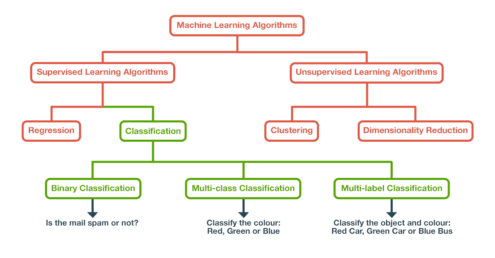

# 机器学习分类算法

> 原文：<https://blog.quantinsti.com/machine-learning-classification/>

由克什蒂杰·马克瓦纳和 T2 主持

让我先问一个非常基本的问题。*什么是机器学习*？[机器学习](/trading-using-machine-learning-python/)是教会计算机系统某些算法的过程，这些算法可以通过经验来改进自己。

一个非常专业的定义是，

> “如果一个计算机程序在 T 上的性能，如 P 所测量的，随着经验的增加而提高，那么就说它从关于某个任务 T 和某个性能测量 P 的经验 E 中学习。”——汤姆·米切尔，1997 年

就像人类一样，该系统将能够执行简单的分类任务和复杂的数学计算，如回归。它包括建立用于分类或[回归](https://quantra.quantinsti.com/course/trading-with-machine-learning-regression)的数学模型。

为了‘训练’这些数学模型，你需要一组训练数据。这是系统在其上构建模型的数据集。本文将涵盖你所有的[机器学习分类](https://quantra.quantinsti.com/course/trading-machine-learning-classification-svm)需求，从最基础的开始。

在这里，我们将谈论:

*   [监督学习](#supervised-learning)
*   [无监督学习](#unsupervised-learning)
*   [监督模型的类型](#types-of-supervised-models)
*   [分类类型](#types-of-classification)
*   [分类器模型](#classifier-models)
*   [超参数调谐](/p/ba83b48f-8762-4119-b7db-a831504eb418/hyperparameter-tuning)
*   [绩效评估](#performance-evaluation)
*   [使用 SVC 交易](#using-svc-for-trading)
*   [学习机器学习的资源](#resources-to-learn-machine-learning)
*   [总结](#summary)

* * *

数学模型根据其训练数据分为两类——**监督和非监督学习模型**。

<figure class="kg-card kg-image-card kg-width-full kg-card-hascaption">

<figcaption>Fig. 1\. Machine Learning Algorithms</figcaption>

</figure>

## 监督学习

在构建监督学习模型时，所使用的训练数据包含所需的答案。这些要求的答案被称为标签。例如，你展示了一张狗的图片，并且也给它贴上了狗的标签。

因此，有了足够多的狗的照片，该算法将能够正确地对狗的图像进行分类。监督学习模型也可以用于预测连续数值，如某家公司的股票价格。这些模型被称为**回归**模型。

在这种情况下，标签将是股票过去的价格。所以算法会遵循这个趋势。一些流行的算法包括

*   线性回归
*   支持向量分类器
*   决策树
*   随机森林

* * *

## 无监督学习

在[无监督学习](https://quantra.quantinsti.com/course/unsupervised-learning-trading)中，顾名思义，用于训练的数据集不包含所需答案。相反，该算法使用诸如**聚类**和**降维**等技术来训练。

无监督学习的一个主要应用是异常检测。这种方法使用聚类算法来找出图形中的主要异常值。这些用于信用卡欺诈检测。

* * *

## 监督模型的类型

监督模型在标记数据集上训练。它可以是连续标签，也可以是分类标签。

### 回归模型

当一个人在处理连续值时使用回归，例如当给定位置、覆盖面积、历史价格等特征时的房价。流行的回归模型有:

*   线性回归
*   套索回归
*   里脊回归

### 分类模型

分类用于将数据分成多个类别，每个类别由一个标签表示。训练数据[必须包含标签，并且必须对每个标签有足够的观察，以便模型的准确性是值得尊敬的。一些流行的分类模型包括:](https://quantra.quantinsti.com/course/introduction-to-data-science)

*   支持向量分类器
*   决策树
*   随机森林分类器

也有各种评估方法来找出这些模型的准确性。我们将更详细地讨论这些模型、评估方法和一种称为**超参数调整**的技术来改进这些模型。

* * *

## 分类类型

根据数据集中存在的类的数量和级别，有三种分类类型。

### 二元分类

这种分类只有两类。通常，它们是布尔值- 1 或 0，真或假，高或低。可以使用这种分类的一些例子是在癌症检测或电子邮件垃圾邮件检测中，其中对于癌症和垃圾邮件，标签是肯定的或否定的，或者对于垃圾邮件检测，标签不是垃圾邮件。

让我们举一个例子。我们使用的是乳腺癌检测数据集，可以从[这里](https://www.kaggle.com/uciml/breast-cancer-wisconsin-data)下载。