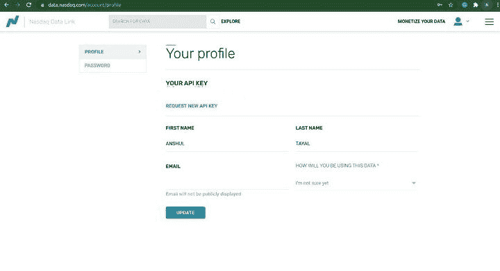
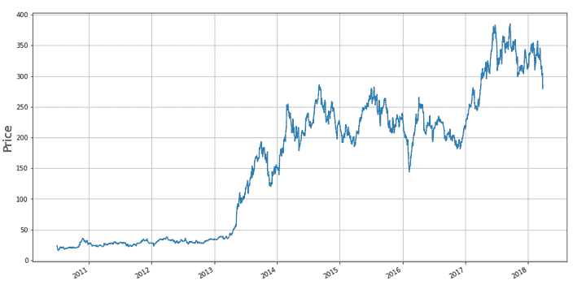
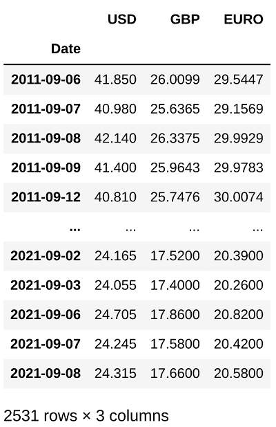
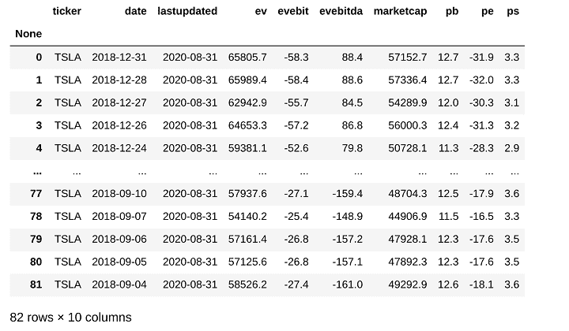

# Nasdaq 数据链接|使用 Python 中的 Quandl API 从即用型数据集获得洞察力

> 原文：<https://blog.quantinsti.com/nasdaq-data-link/>

安舒尔·塔亚尔

如果您以前处理过数据，您就会知道获取原始数据并将其转换为可用格式是多么困难。作为数据分析师，我们一直在寻找现成的数据集，以节省我们收集、清理和标准化数据的时间。

另一个挑战是，从数据中提取信息已经成为大海捞针的问题，因为每天都会生成万亿字节的数据。干草堆一直在变大，所以寻找针变得异常困难。数据驱动决策的一个基本挑战是找到那几根针。

在这种背景下，当谈到传统数据集时，投资/金融世界也在关注不寻常的数据源。我们称之为替代数据集。市场参与者越来越多地使用替代数据来获得对竞争对手的优势。

这篇文章向您介绍了 [Nasdaq Data Link](http://data.nasdaq.com/) ，这是一个收集了大量传统和替代数据源的平台。

本文包含以下几个部分:

*   [什么是 Quandl 和纳斯达克数据链？](#what-is-quandl-and-nasdaq-data-link)
*   [纳斯达克数据链提供的各类数据集有哪些？](#what-are-the-various-types-of-datasets-provided-by-nasdaq-data-link)
*   [如何使用 Quandl API 访问纳斯达克数据链的数据？](#how-to-access-data-from-nasdaq-data-link-using-quandl-api)
    *   什么是 API 调用？
    *   [如何获得免费的 Quandl API 密匙？](#how-to-get-a-free-quandl-api-key)
    *   [如何用 Python 安装 Quandl 包？](#how-to-install-the-quandl-package-in-python)
    *   [如何使用 Python 中的 Quandl API 访问各种类型的数据集](#how-to-access-various-types-of-datasets-using-quandl-api-in-python)
*   [通过 Python 中的 Quandl API 访问任何数据集的步骤](#steps-to-get-access-to-any-dataset-through-quandl-api-in-python)
*   [纳斯达克数据链接免费订阅 vs 纳斯达克数据链接高级订阅](#nasdaq-data-link-free-subscription-vs-nasdaq-data-link-premium-subscription)

* * *

## 什么是 Quandl 和纳斯达克数据链？

Quandl 于 2011 年由在对冲基金行业工作了十多年的量化分析师塔梅尔·卡莱姆(Tameer Kalem)创立。它是作为“数字数据的维基百科”而创建的，旨在从当今可用的海量数据中提取价值。2018 年，纳斯达克收购了 Quandl，以补充其数据和分析业务。

2021 年 9 月，纳斯达克推出了使用 Quandl 基础设施构建的新平台 Nasdaq data link。

纳斯达克数据链允许你访问专有数据([纳斯达克](https://data.nasdaq.com/publishers/NDAQ)、 [Quandl](https://data.nasdaq.com/publishers/QDL) 等。)和通过第三方的数据集(例如[交易经济学](https://data.nasdaq.com/publishers/tradingeconomics)、[智商银行家](https://data.nasdaq.com/publishers/GSCR)等。)

* * *

## 纳斯达克数据链提供的各种类型的数据集是什么？

纳斯达克数据链提供三种类型的数据集:

*   核心财务数据
*   环境、社会和公司治理(ESG)数据
*   替代数据

### 核心财务数据

这些是投资者用来分析和预测股票价格行为的传统金融数据集。它们的范围从债券收益率到股票和外汇衍生品到石油数据库。这里有 223 个数据集。

这些数据集分为以下几类:

*   资产类
*   数据类型
*   地区
*   出版者

让我们更深入地看看这些类别。下表显示了“资产类别”下数据集的分布情况:

| **资产类别** | **免费** | **已付** |
| 股票 | 7 | 114 |
| 货币 | 3 | 16 |
| 利率&固定收益 | 5 | 8 |
| 选项 | 1 | 9 |
| 指标 | 8 | 11 |
| 共同基金&ETF | 1 | 27 |
| 房地产 | 3 | 2 |
| 风险投资&私募股权 | 0 | 1 |
| 经济&社会 | 15 | 4 |
| 能量 | 9 | 4 |
| 农业 | 7 | 7 |
| 金属 | 4 | 8 |
| 期货 | 5 | 13 |
| 其他 | 4 | 14 |
| **总计** | **72** | **238** |

下表显示了“数据类型”下数据集的分布

| **数据类型** | **免费** | **已付** |
| 价格&成交量 | 15 | 87 |
| 估计值 | 1 | 15 |
| 基础知识 | 6 | 37 |
| 公司行动 | 0 | 8 |
| 感悟 | 1 | 7 |
| 衍生指标 | 0 | 16 |
| 国家统计数据 | 15 | 4 |
| 技术分析 | 0 | 3 |
| 其他 | 5 | 16 |
| **总计** | **43** | **193** |

下表显示了“区域”下的数据集分布

| **地区** | **免费** | **已付** |
| 美国 | 24 | 116 |
| 中国 | 8 | 29 |
| 欧洲 | 13 | 45 |
| 非洲 | 8 | 23 |
| 北美 | 24 | 103 |
| 拉美 | 10 | 22 |
| 亚洲 | 12 | 44 |
| 大洋洲 | 9 | 23 |
| 中东 | 1 | 5 |
| 全局 | 11 | 45 |
| 印度 | 8 | 19 |
| **总计** | **128** | **第 474 章** |

关于每个数据集的更多细节，你可以去[这里](https://data.nasdaq.com/search)。

### ESG 数据

这部分包含量化数据的数据集，如公司对环境、健康和社会的影响。它提供了与 GHG 排放、自然灾害洞察、生物多样性报告、性别平等指标、ESG 风险指标等相关的数据集。本部分共有 9 个数据集。

本节中的数据集分为以下几类:

*   影响区域
    *   环境
    *   社会的
    *   公司治理
*   可持续发展目标

关于每个数据集的更多细节，你可以去[这里](https://data.nasdaq.com/search?productType=ESG)。

### 替代数据

本节包含使用各种原始数据集创建的备选数据集。举几个例子:

*   公司的支出和支付，
*   跟踪公司的航空旅行，可以洞察 M&A 的交易和扩张计划，
*   作物产量预报的每日数据，
*   在卫星图像上使用人工智能来生成金属供应的实时全球指数等等。

本节中的数据集基于以下内容进行分类:

*   **资产类别**
    *   商品
    *   货币
    *   股权
    *   固定收入
    *   房地产
*   **数据来源**
    *   商业废气
    *   消费者活动
    *   初级研究
    *   卫星和传感器
    *   情感与互联网
    *   其他人
*   **行业/部门**
    *   汽车
    *   企业对企业
    *   建筑
    *   活力
    *   金融
    *   物流
    *   零售
    *   安全性
    *   技术
*   **投资风格**
    *   基本的
    *   数量的
    *   技术的
    *   其他人

这里有一个目录，详细列出了提供的所有备选数据集:[备选数据目录](https://data.nasdaq.com/resources/catalogs/ndl-alternative-data-catalog)。

然而，替代数据集仅适用于机构客户。如果您希望注册为机构客户以访问数据，您可以点击[这里](https://data.nasdaq.com/search?productType=ADP)。

* * *

## 如何使用 Quandl API 访问纳斯达克数据链的数据？

即使 Quandl 只是 Nasdaq data link 的数据提供者之一，您仍然可以使用 Quandl API(应用程序编程接口)调用来获取 Nasdaq Data Link 提供的所有数据集。我们先来了解一下“API 调用”这个术语。

### 什么是 API 调用？

API 定义了两个系统之间的通信规则。打个比方，你不能去印刷厂为自己打印银行的支票簿。你必须遵循一个程序。

你去银行网站，填好表格，附上你的文件并提交。然后系统在后台处理，当你的账户准备好了，账户明细和支票簿就交给你了。

这正是 API 的工作方式。银行是我们要与之沟通的系统，我们没有接触系统内部的权限；我们只能通过 API 层，即我们填写表格和提交文档的银行网站进行对话。这被称为**端点**。

在获取数据时，您还需要一个 API 密匙让系统记录您的身份，就像您需要银行账号来进行任何交易一样。

API 调用向系统提供输入，以访问我们需要的数据。每个系统都有不同的 API，就像每个银行的网站都有不同的网址。

例如:

*   Quandl API 的端点是[https://www.quandl.com/api/v3/](https://www.quandl.com/api/v3/)
*   新闻 API 的端点是[https://newsapi.org/v2/everything](https://newsapi.org/v2/everything)

一个 API 调用的例子:[https://newsapi.org/v2/everything?q=tesla&from = 2021-07-26&sort by = published at&API KEY = API _ KEY](https://newsapi.org/v2/everything?q=tesla&from=2021-07-26&sortBy=publishedAt&apiKey=API_KEY)

在上面的例子中，

*   终点-https://newsapi.org/v2/everything
*   输入-特斯拉，开始日期，即 2021-07-26，
*   按“已发布”排序，
*   API_KEY -创建帐户时生成的 API 密钥

要搜索 API 端点，你可以去 [Programmable Web](https://www.programmableweb.com/api) ，这是最大的可用 API 目录之一。另外，一个 API 的详细描述可以在[这里找到。](/trading-markets-using-apis/)

现在您已经理解了 API 调用的工作原理，让我们看看如何使用 python 从 Quandl API 访问数据。

### 如何获得免费的 Quandl API 密钥？

使用 Quandl API 获取数据的第一步是通过在 [Nasdaq Data Link](https://data.nasdaq.com/sign-up) 上创建一个帐户来生成一个免费的 API 密匙。成功创建帐户后，您可以在帐户设置部分找到您的 API 密钥。

以下是“帐户设置”部分的外观:

<figure class="kg-card kg-image-card kg-width-full kg-card-hascaption">

<figcaption>Generating a free API key by creating an account on Nasdaq Data Link</figcaption>

</figure>

### 如何用 Python 安装 Quandl 包？

使用以下代码在 Python 中安装 Quandl 包:

```py
## Install the quandl library
!pip install quandl

```

### 如何在 Python 中使用 Quandl API 访问各种类型的数据集？

要使用 Python 中的 Quandl API 访问各种类型的数据集，请使用以下代码:

```py
## Importing library
import quandl

```

**历史股价数据**

```py
# Configuring API key
# We use the get() function to fetch the historical stock price data for Tesla
quandl.ApiConfig.api_key = (YOUR-API-KEY-HERE)
tsla = quandl.get('WIKI/TSLA', start_date = "2010-06-29", end_date = "2018-03-27")

```

数据帧作为输出返回，并存储在变量“tsla”中。你可以用任何股票代号代替“TSLA”来获取任何其他股票的数据。

下面是输出的样子:

<figure class="kg-card kg-image-card kg-width-full kg-card-hascaption">

<figcaption>Output for TSLA stock</figcaption>

</figure>

让我们绘制一个[时间序列](https://quantra.quantinsti.com/course/financial-time-series-analysis-trading)图，看看价格是如何随时间变化的。

```py
## Plotting the close price of Tesla
fig = tsla['Close'].plot(grid=True, figsize=(15,8))
fig.set_xlabel("")
fig.set_ylabel("Price", size=18)

```

下面是输出的样子:

<figure class="kg-card kg-image-card kg-width-full kg-card-hascaption">

<figcaption>graph for the close price of Tesla</figcaption>

</figure>

我们可以将数据按周、月、季等分类。，使用折叠参数。

```py
Tsla_monthly = quandl.get('WIKI/TSLA', start_date = "2010-01-01", end_date = "2021-08-01", collapse = “monthly”)

```

来自伦敦金银市场协会的数据

伦敦金银市场协会是黄金和白银市场的国际贸易协会。这是一个免费数据集。

下面是我们访问数据集的方法:

```py
## Getting the silver data from LBMA
quandl.get('LBMA/SILVER', start_date='2011-09-06', end_date='2021-09-08')

```

下面是输出的样子:

<figure class="kg-card kg-image-card kg-card-hascaption">

<figcaption>Data output for Silver markets from London Bullion Market Association</figcaption>

</figure>

**美国核心基本面数据-高级订阅数据集样本**

以下是如何获得特斯拉的数据(例如)

```py
## Getting fundamental data for Tesla
quandl.get_table('SHARADAR/DAILY', ticker='TSLA')

```

下面是输出的样子:

<figure class="kg-card kg-image-card kg-width-full kg-card-hascaption">

<figcaption>Fundamental data for Tesla stock</figcaption>

</figure>

* * *

## 通过 Python 中的 Quandl API 访问任何数据集的步骤

这些步骤将指导您通过 Python 中的 Quandl API 访问任何数据集。

**第一步**——点击进入纳斯达克数据链目录[。](http://data.nasdaq.com/sources)

**第 2 步**——选择任何你感兴趣的数据集，并阅读描述。

**第 3 步**——转到“用法”部分，选择 python。

**步骤 4** -您将看到使用 Python 中的 Quandl API 下载数据的命令。

完成后，您就可以随意使用数据集了。

* * *

## 纳斯达克数据链接免费订阅与纳斯达克数据链接高级订阅

Quandl 提供了大量的免费数据集。然而，它也有付费订阅的数据集。

以下是详细情况:

*   纳斯达克数据链接提供了 250 多个数据集，其中 40 个可以免费访问。
*   大多数优质数据集也提供免费样本。

免费套餐用户每 10 秒钟最多可拨打 300 个电话，每 10 分钟最多可拨打 2，000 个电话，每天最多可拨打 50，000 个电话。

*   拥有高级套餐的用户每 10 分钟最多可拨打 5，000 次电话，每天最多可拨打 720，000 次电话。
*   其他免费和付费订阅功能包括完整的 API 访问、多种格式的下载、导出和可视化选项等。

* * *

**建议读数**

*   [如何通过 Python API 获取历史市场数据](/historical-market-data-python-api/)
*   [Python 中的股市数据和分析](/stock-market-data-analysis-python/)
*   [使用 Python 将数据转化为见解并构建战略](/data-insights-trading-strategy-python-project-lokesh-kumar/)

* * *

**参考书目**

*   [纳斯达克数据链:出版商](https://data.nasdaq.com/publishers)
*   [数据组织:纳斯达克数据链](https://docs.data.nasdaq.com/docs/data-organization)

* * *

## 结论

本文向您介绍了一个新推出的平台( [Nasdaq Data Link](https://data.nasdaq.com/) )，该平台提供对现成的传统和替代数据集的访问，并演示了使用 python 中的 Quandl API 从各种发布者(在 Nasdaq Data Link 上)获取数据集的过程。

我们研究了由 Nasdaq Data Link 提供的各种类型的数据集及其基于订阅的可访问性。

获取干净的数据对于构建和[回溯测试交易策略](https://quantra.quantinsti.com/course/backtesting-trading-strategies)至关重要，纳斯达克数据链接 Quandl API 将在这一过程中为您提供帮助。如果你想了解更多关于建立交易策略的知识，请查看 Quantra 上的[量化交易策略和模型](https://quantra.quantinsti.com/course/quantitative-trading-strategies-models)课程。

* * *

*<small>免责声明:本文提供的所有数据和信息仅供参考。QuantInsti 对本文中任何信息的准确性、完整性、现时性、适用性或有效性不做任何陈述，也不对这些信息中的任何错误、遗漏或延迟或因其显示或使用而导致的任何损失、伤害或损害负责。所有信息均按原样提供。</small>*