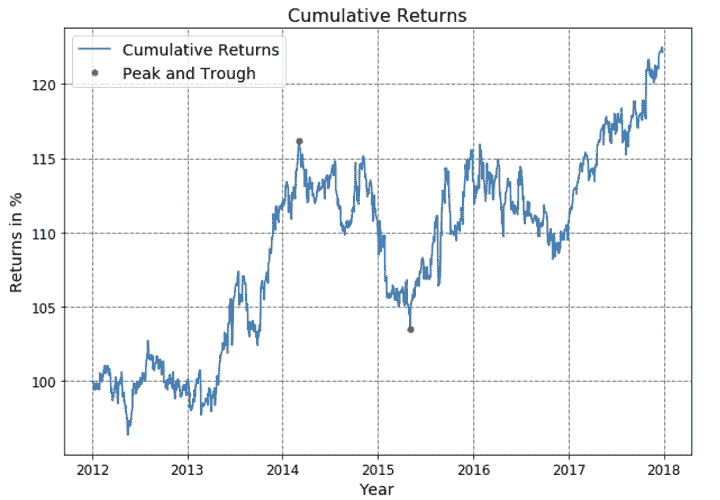
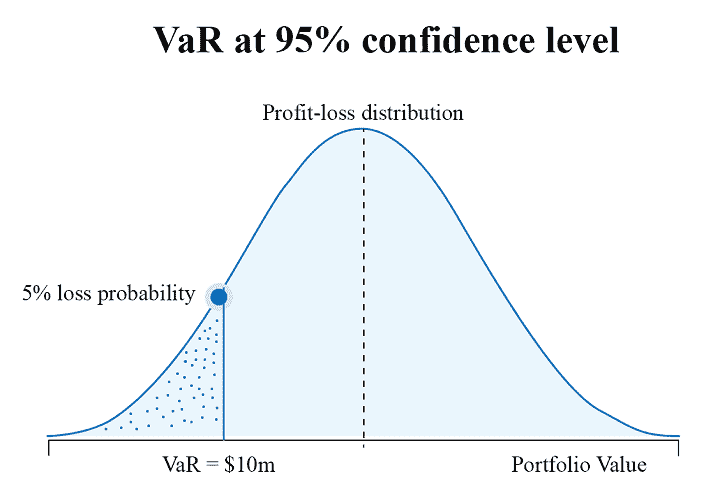
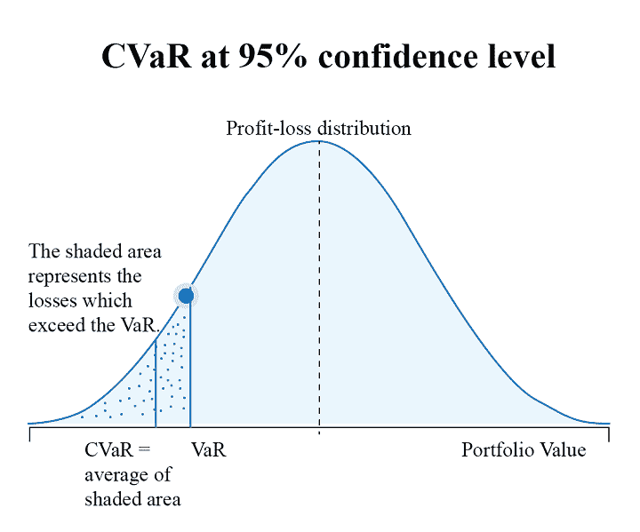

# 绩效指标、风险指标和战略优化:综述

> 原文：<https://blog.quantinsti.com/performance-metrics-risk-metrics-optimization/>

由[拉什达·安萨里](https://www.linkedin.com/in/rushda-ansari-82261214a)和[帕拉克·卡纳](https://www.linkedin.com/in/palak-khanna-b43006165/)

绩效和风险度量被广泛用于评估股票或投资组合的绩效，并形成投资组合管理的主要组成部分。在这篇博客中，我们将尝试触及一些重要的投资组合和风险指标，这些指标可以让你清楚地了解你的投资业绩和风险。

文章的第一部分着眼于这些常用的性能指标，让我们深入了解交易策略的剖析。在文章的第二部分，我们将介绍投资或投资组合中风险管理的一些重要指标。最后一部分用一个简单的例子简单解释了投资组合的策略优化。

*   为什么我们需要投资组合风险管理？
*   什么是绩效和风险指标？
*   [绩效指标的类型及其计算](#types-of-performance-metrics)
    *   [绝对风险调整指标](#absolute-risk-adjusted-measures)
    *   [相对收益指标](#relative-return-measures)
*   [风险度量的类型及其计算](#types-of-risk-metrics)
    *   [绝对风险度量](#absolute-risk-measures)
    *   [相对风险度量](#relative-risk-measures)
    *   [尾部风险度量](#tail-risk-measures)
*   如何衡量投资组合的交易表现？
*   什么是战略优化？
*   [策略优化的一个例子](#an-example-of-strategy-optimisation)

* * *

## 为什么我们需要投资组合风险管理？

资产组合的表现是用一组参数来衡量的。

例如，如果你进行股票交易，那么你的回报将与基准指数进行比较。投资组合回报的一致性也被证明是一个重要因素。

但是仅仅回报并不能衡量一个投资组合的成败。在金融领域，风险和回报被认为是一枚硬币的两面。两者缺一不可。

因此，在评估和优化您的交易策略时，识别和分析您的投资风险是至关重要的一步。

当被问及股票市场将会如何时，本杰明·格拉哈姆说，“它将会波动”。

没有一种全面的方法可以预测市场方向的准确变化。因此，我们在做出投资决策时利用多种风险和绩效指标是非常重要的。

* * *

## 什么是绩效和风险指标？

投资组合风险管理的一个关键教训是，除非我们将回报与承担的风险放在一起，否则回报毫无意义。性能和风险指标就是这样做的。

业绩和风险指标是我们用来分析交易策略的统计数据。它们可以帮助确定:

*   你的交易策略表现如何，
*   它有多健壮，以及
*   如果它能在不同的市场条件下生存下来。

我们使用这些指标来衡量产生投资回报所涉及的风险，从而更好地理解投资回报。

现在让我们来看看一些有用的业绩和风险管理措施，以帮助您评估您的投资组合。

* * *

## 绩效指标的类型

各种类型的性能指标如下:

*   [绝对风险调整指标](#absolute-risk-adjusted-measures)
*   [相对收益指标](#relative-return-measures)

* * *

## 绝对风险调整指标

### 夏普比率

夏普比率衡量每单位波动率或总风险(即标准差)超过无风险率的平均回报。

换句话说，这个比率描述了你因持有风险更高的资产而承受的额外[波动](https://www.investopedia.com/terms/v/volatility.asp)所带来的利润。夏普比率是最受投资者欢迎的衡量投资组合表现的指标之一。

记住，你需要为不持有无风险资产而承担的额外风险得到补偿。

**夏普比率的公式和计算**

$$ Sharpe ~Ratio=\frac{R_p-R_f}{\sigma_p} \\ $$
Where,
\(R_p\) = Return of the portfolio
\(R_f\) = Risk-free rate
\(σ_p\) = Standard deviation of the portfolio’s excess return

夏普比率大于 1 是更可取的，因为这意味着你的回报更大给定的风险。所以一般来说，这个比率越高，你的投资组合的风险回报就越好。

### Sortino 比率

Sortino 比率是 Sharpe 比率的修改版本，它将有害波动性与总体波动性区分开来。它是通过估计相对于其下行偏差(即负资产回报的标准差)的无风险回报的超额投资组合回报来计算的。

除了只关注低于均值的投资组合回报之外，Sortino 比率还被认为能更好地代表风险调整后的表现，因为正波动率是一种优势。像夏普比率一样，Sortino 比率的值越高，表明相对于回报的风险越小。

**排序比的公式和计算**

$$ Sortino ~Ratio=\frac{R_p-R_f}{\sigma_d} $$
Where,
\(R_p\) = Actual or expected return of the portfolio
\(R_f\) = Risk-free rate
\(σ_d\) = Standard deviation of the downside

### 卡尔马尔比率

卡尔马尔比率也称为提取比率，计算方法是将最近 3 年的平均年回报率除以过去 36 个月的最大提取额。

该比率越高，对冲基金或商品交易顾问(CTA)等投资基金在给定的 3 年时间框架内的风险调整后业绩就越好。

**卡尔曼比的公式和计算**

$$ Calmar ~Ratio=\frac{R_p-R_f}{Maximum Drawdown} $$
Where,
\(R_p\) = Return of the portfolio
\(R_f\) = Risk-free rate
\(R_p - R_f\) = Annual rate of return

年度回报率显示了一个基金一年来的表现。最大提款是指在给定的投资期内从高峰到低谷的最大损失。

它是通过从基金的最高值中减去基金的最低值，然后将结果除以基金的峰值来确定的。

* * *

## 相对收益度量

### 上行捕获比

Up capture 比率衡量投资组合相对于基准回报率的回报率。

它用于分析牛市期间(即基准上涨时)投资组合的表现。比率大于 100 表明投资组合的表现优于指数。

**上升捕获比公式**

上涨捕获率的计算方法是将投资组合的回报除以牛市趋势中指数的回报，然后将该因子乘以 100。

$$ Up ~capture ~ratio = \frac{Portfolio ~returns ~during ~bull ~runs}{Benchmark ~returns}~*100 $$

### 向下俘获比

衡量投资组合相对于基准回报率的统计指标。

下跌捕捉率用于分析投资组合在下跌趋势中的表现，即基准下跌时的表现。低于 100 的比率表明基金的表现优于指数。

**下降捕获率公式**

下跌捕获比率的计算方法是，将投资组合的回报除以熊市趋势期间指数的回报，然后将该因子乘以 100。

$$ Down ~capture ~ratio = \frac{Portfolio ~returns ~during ~bear ~runs}{Benchmark ~returns}~*100 $$

### 上升百分比

上涨百分比比较基准上涨时投资组合表现优于基准的周期数。比率越高，投资组合的表现越好。

**上升百分比公式**

$$ {\small Up ~percentage ~ratio = \frac{No. ~of ~periods ~portfolio ~outperformed ~benchmark ~in ~bull ~runs}{No. ~of ~periods ~the ~benchmark ~was ~up}~*100} $$

### 下降百分比

下跌百分比是衡量基准下跌时投资组合表现优于基准的周期数。

然后除以基准下跌的周期数。比率越高，投资组合的表现越好。

**下降百分比公式**

$$ {\small Up ~percentage ~ratio = \frac{No. ~of ~periods ~portfolio ~outperformed ~benchmark ~in ~bear ~runs}{No. ~of ~periods ~the ~benchmark ~was ~down}~*100} $$

* * *

## 风险度量的类型

风险度量的类型分为:

*   [绝对风险度量](#absolute-risk-measures)
*   [相对风险度量](#relative-risk-measures)
*   [尾部风险度量](#tail-risk-measures)

* * *

## 绝对风险度量

### 差异

方差表示回报率偏离预期回报的程度，即它表明资产的波动性，因此被视为风险指标。

因此，投资组合经理可以用它来评估所考虑的资产的行为。较大的方差表明回报率的波动性较大。

**方差公式及计算**

方差计算为平均值的方差的平均值。要计算方差，您只需计算数据集中每个点与其平均值之间的差异。然后，求差值的平方并平均结果。

$$ \sigma^2 = \frac{\sum_{i=1}^n(x_i-x_{mean})^2}{n-1} $$
Where,
\(x_i\) = the ith data point
\(x_{mean}\) = the mean of all data points
n = the number of data points

### 最大水位下降

最大提款是评估投资组合风险的关键措施之一。它表明投资组合在特定时期的下跌风险。

它表示投资组合权益从最高点到最低点的最大损失，用百分比表示。

较低的最高提款权意味着投资价值的轻微波动，因此金融风险程度较低，反之亦然。

下面你可以看到一个投资组合的累积回报图。如图所示，其从峰值到谷值的最大下降由红色点表示。

<figure class="kg-card kg-image-card kg-width-full"></figure>

**最大水位下降的公式和计算**

最大水位降深由最低谷值和谷值前最高峰值之间的差值给出。

当一项资产或一项投资的价值经历了几次繁荣-萧条周期时，它通常是在很长一段时间内计算出来的。计算最大水位降深的公式如下所示:

$$ Maximum ~Drawdown = \frac{Trough ~value- Peak ~value}{Peak ~value} $$

* * *

## 相对风险度量

### 相关系数

相关性的概念其实就是看两个变量是相似还是相反。相关系数告诉你任何两个变量，比如 x 和 y，有多强的相关性。

它只接受-1 和 1 之间的值。相关性为-1 意味着随着 x 的增加，y 将减少。因此，它们将彼此完全相反地运动。而相关性等于 1 意味着随着 x 的增加，y 也将增加。

相关性为 0 意味着 x 和 y 在运动中没有线性关系。在金融市场投资时，两个变量之间的相关性尤其有用。

例如，相关性可以帮助你确定一只股票相对于其基准指数、另一只基金或资产类别的表现。此外，通过在现有投资组合中增加低相关或负相关的资产，你可以获得多样化的好处。

**相关系数的公式和计算**

要计算相关系数，首先要确定两个变量的协方差。接下来，你应该计算每个变量的标准差，也就是方差的平方根。

现在我们可以找到相关系数。它是通过将协方差除以两个变量的标准差的乘积来确定的。现在，让我们看看协方差和相关性的公式。

$$ Cov(x,y) = \frac{\sum(x_i-x_m)(y_i-y_m)}{n-1} \\ \rho_{xy}=\frac{Cov(x,y)}{\sigma_x\sigma_y} $$
Where,
\(⍴_xy\) = correlation coefficient
\(x_i, y_i\) = data values of x and y for i= 1,2…n
\(x_m, y_m\) = the means of x and y, respectively
\(σ_x, σ_y\) = standard deviations of x and y, respectively
\(n\) = the number of data points

### 贝塔

贝塔衡量股票或投资组合相对于市场的波动性。市场的β值总是等于 1。

所以，如果一个投资组合的贝塔系数大于 1，它被认为比市场更不稳定；而β小于 1 意味着波动性较小。β值不像相关值那样有界。

**β的公式和计算**

为了计算资产或投资组合的贝塔系数，我们必须知道投资组合的收益和市场的收益之间的协方差。我们还需要市场收益的方差。

$$ Beta = \frac{Cov(r_i,r_m)}{Var(r_m)} $$
Where,
\(r_i\) = expected returns from your portfolio
\(r_m\) = expected returns from the market

* * *

## 尾部风险度量

### 风险价值

风险价值(VaR)是一种统计方法，用于评估与投资组合相关的风险水平。VaR 以一定的置信度衡量特定时期的最大潜在损失。

<figure class="kg-card kg-image-card kg-width-full"></figure>

例如，如上所述，如果一个投资组合的风险值在 95%的置信水平下为 1000 万，那么这意味着在 5%的情况下损失将超过风险值。

但是，你应该注意到，VaR 并没有说明这 5%以内的损失大小。

**VaR 的公式和计算**

计算 VaR 的方法主要有三种。这些是历史方法，方差-协方差方法和蒙特卡罗模拟方法。[风险值(VaR)计算](/calculating-value-at-risk-in-excel-python/)也可以使用 Excel 或 Python 进行。

#### 条件风险价值

条件风险价值，也称为预期短缺(ES)，是一种量化投资组合尾部风险量的风险评估方法。它是通过对风险值和超过风险值的损失进行加权平均计算得出的。

正如你在下面看到的，CVaR 被看作是 VaR 的延伸，被认为优于 VaR，因为它解释了超过 VaR 的损失。因此，您可以在您的投资组合优化策略中使用 CVaR 来更好地了解极端损失，并有效地管理您的投资组合风险。

<figure class="kg-card kg-image-card kg-width-full"></figure>

* * *

## 如何衡量投资组合的交易表现？

衡量一个投资组合的表现，你首先会看什么？如果你的答案是高回报，那么像大多数投资者一样，你也认为高回报意味着投资组合的优异表现，但这只是部分正确。

虽然回报确实有助于业绩衡量，但评估为实现这些回报而承担的风险也很重要。与普遍看法相反，回报率最高的投资组合并不是最理想的投资组合。

为了确定投资组合的业绩，有必要衡量风险调整后的回报。我们已经在上面讨论了各种绝对风险调整的绩效指标。

然而，理解[投资组合分析的各个方面也是必要的，例如。绩效测量和评估](/portfolio-analysis-performance-measurement-evaluation/)。

* * *

## 什么是战略优化？

假设您已经开发了一个策略，并测量了它的性能和风险度量。

你如何知道这种策略是否能获得最好的结果？
*而如果有改进的余地，难道你不想让自己的战略执行得更好吗？*

这正是战略优化过程得以实施的原因。
所以，你:

*   制定策略，
*   衡量它的表现，
*   优化它，并且
*   在优化的基础上重建。

优化允许战略家通过微调驱动战略的参数和公式来改善他们战略的结果。这可以通过微调单个参数或一组参数来实现期望的目标。

战略优化目标的一个例子是最大化产生的总利润。优化的另一个目标是最小化损耗。

提到了优化的目的，人们还应该意识到优化就像一把双刃剑。

如果在优化期间将多个规则应用于训练数据以实现所需的权益曲线，则会导致数据的过度拟合，并且模型可能会失去对测试和未来数据的预测能力。

投资组合优化模块是战略开发平台的重要组成部分。然而，人们应该注意到不同的平台可以提供不同的策略优化工具和技术。

因此，在订阅任何策略开发平台之前，应该评估可用的优化工具。

* * *

## 战略优化的一个例子

让我们以一个简单策略为例，使用“ [Riskfolio-Lib](https://riskfolio-lib.readthedocs.io/en/latest/portfolio.html) ”库来优化策略性能。

Riskfolio-Lib 是一个 Python 库，专门为投资组合优化和分配而设计。它专注于优化的四个主要目标，包括回报最大化、风险最小化和投资组合效用最大化。

让我们理解基于最大化风险调整回报的目标来执行优化的步骤。

### 步骤 1:安装库

第一步是安装库。为此，您需要运行以下代码: