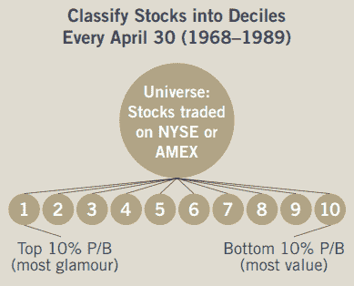
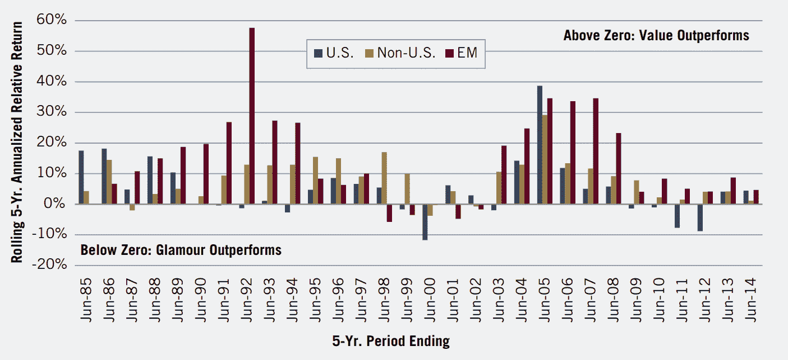

# Python 中的量化价值投资策略

> 原文：<https://blog.quantinsti.com/quantitative-value-investing-strategy-python/>

由[伊山沙阿](https://www.linkedin.com/in/ishan-shah-18393828/)

价值投资的起源可以追溯到本杰明·格拉哈姆所著的《证券分析》和《聪明的投资者》( T2 ),在书中，他提倡对基本面指标进行详细分析，以购买股价低于其内在价值的股票。沃伦·巴菲特，本杰明·格拉哈姆最著名的学生之一，向我们所有人展示了价值投资产生更高回报的力量。

<figure class="kg-card kg-image-card kg-width-full"></figure>

### **投资价值股与成长股**

根据 Brandes 的一项研究，价值投资在很长一段时间内大大超过了市场和成长型股票。

<figure class="kg-card kg-image-card kg-width-full"></figure>

他们使用简单的估值指标，如市盈率、市净率和市盈率来识别价值股和成长股。[【1】](https://www.fidelity.com/learning-center/trading-investing/fundamental-analysis/company-valuation-ratios)

使用的一种方法是按市净率对所有股票进行分类，然后将前 10%的股票归类为成长股，后 10%的股票归类为价值股。他们观察到，在连续 5 年的时间里，价值股的表现要比成长股好得多。

<figure class="kg-card kg-image-card kg-width-full"></figure>

价值在更多的时期和更长的时间里跑赢了增长(魅力)[【2】](https://www.brandes.com/docs/default-source/brandes-institute/value-vs-glamour-worldwide-perspective)

然而，我认为价值投资者进行的许多分析——阅读财务报表和评估相对估值——可以通过自动化流程更快、更有效地完成，而且可以覆盖更广泛的证券类别。量化价值投资[策略](/algorithmic-trading-strategies/)是一种识别最稳健的长期价值型股票的努力。

### **接近**

量化价值投资策略方法可以用以下方式定义:

1.  识别全套股票
2.  筛选价值和质量
3.  坚定投资

从小盘股到大盘股定义了一个完整的股票列表，低流动性和交易限制的股票被排除在外。然后基于各种量化基本面参数进行筛选，形成最便宜的优质股票组合。让我们看看如何在 Python 中实现这一点。

注意:为了演示这个练习，我定义了一个潜在股票的小列表。你也可以使用整个标准普尔 500 列表。

### **导入库**

第一步是导入必要的库，即 pandas，yahoo_fin。