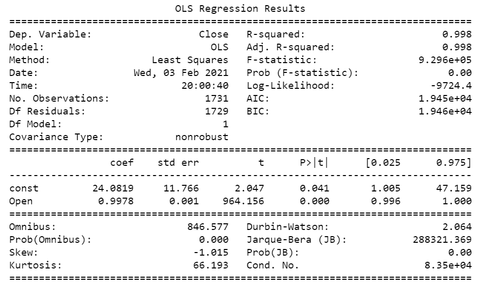
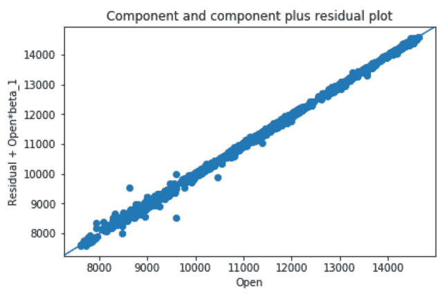
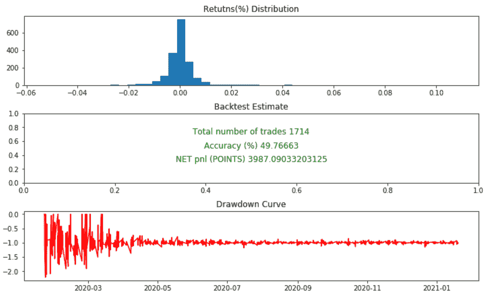

# 使用回归模型建立交易系统

> 原文：<https://blog.quantinsti.com/regression-trading-system/>

由[帕万·杜特](https://www.linkedin.com/in/pavan-dutt-321657172/)

建立交易系统是算法交易中最重要的阶段。这是将我们的想法或知识转化为实际行动的阶段。简单地说，你定义了何时开仓，何时平仓的规则。大多数自动交易系统通过消除交易中的人类情绪和偏见来提供优势。

建立交易系统的理想方法有:

*   确定最合适的交易主题
*   创建战略草案
*   规划你的交易逻辑
*   [回溯测试](/backtesting/)和前向测试
*   优化结果
*   策略验证
*   实时实施
*   验证结果

这篇文章一步一步地展示了如何使用回归模型构建一个简单的交易系统模板。我们将在本博客中讨论以下主题:

*   [确定最合适的交易主题](#identifying-the-most-suitable-trading-theme)
*   [创建战略草案](#creating-a-strategy-draft)
*   [什么是回归分析？](#what-is-regression-analysis)
*   [使用滚动回归的基于预测的交易设置](#prediction-based-trading-setup-using-rolling-regression)

现在让我们进入建立交易系统的第一步。

* * *

## 确定最合适的交易主题

有许多著名的交易方法，包括动量交易、波动交易、[均值回复交易、](https://quantra.quantinsti.com/course/python-mean-reversion-strategies-ernest-chan)、趋势跟踪、行为交易、[统计套利](https://quantra.quantinsti.com/course/statistical-arbitrage-trading)。

每家公司都有其有利的市场条件、风险偏好和回报。比如特斯拉的股价既然在涨，就说是趋势性的。因此，你将在这里尝试一个趋势跟踪策略。

在进行交易系统开发之前，了解你的兴趣领域和风险偏好是很重要的，这样你才能接受系统的缩减。

简而言之，就是在开始之前知道你能承受什么样的损失。

* * *

## 创建战略草案

选择您的交易风格后，我们将计算出最适合您的交易主题的策略方法。

我们有很多方法可以分析股票市场的模式。分析它们的一些流行方法是基于价格行为的分析、情感分析和/或基于机器学习的建模。在 Quantra 课程中详细学习[价格行动交易策略](https://quantra.quantinsti.com/course/price-action-trading-strategies)。

为了本文的目的，我们正在建立一个基于回归模型的趋势跟踪系统。

* * *

## 什么是回归分析？

回归分析是一种受监督的机器学习技术，主要用于预测和趋势预测以及金融市场中两种股票/资产之间的相关性。目标是找到距离所有数据点最近的回归曲线。

### 回归分析中的变量

回归建模通常有两种变量:

*   **独立变量:**这些变量与输出变量无关
*   **因变量:**该变量依赖于自变量

### 回归分析的类型

有不同类型的回归分析；一些常见的类型有:

*   线性回归
*   逻辑回归
*   多项式回归
*   套索回归
*   岭回归。

因为我们想保持策略简单，所以我们将把重点放在线性回归分析上。

### 线性回归分析

线性回归有两种类型:

**简单线性回归**:如果只有一个自变量和一个因变量，线性回归方程就是距离已知因变量最近的直线(线性/直线)。

**多元线性回归**:如果自变量和因变量多于一个，则回归方程由因变量的线性组合得到。

### 编码前的先决条件

在编码之前，请确保您熟悉基本概念和 python 概念，例如:

**Pandas 数据框和 matplotlib**

**统计概念**

*   普通最小二乘法(用于建立回归模型)
*   滚动回归

**财务&绩效指标**

*   理解，ROC(变化率计算)，投资组合模拟
*   理解计算不同指标的逻辑，如胜率、CAGR(复合年增长回报)、提款等。

* * *

## Python 中的回归建模

我们使用 yfinance API 来获取数据。这种分析是使用每小时的数据完成的。

### 了解数据 API

我们正在使用雅虎金融 python 包(一些其他的选择将是 alpha vantage，quandl，pandas datareader)。

主要功能如下:

*   yahoo finance.download (ticker，startdate，enddate):这为我们提供了每日数据
*   yahoo finance.download (ticker，startdate，enddate，period="60m "):这为我们提供了每小时的数据。例如:我们使用 2020 年 1 月 1 日至 2021 年 1 月 20 日的 Nifty 50 数据

### 简单线性回归

我们将使用普通的最小二乘法建立一个回归模型。

<figure class="kg-card kg-image-card kg-width-full kg-card-hascaption">

<figcaption>Regression Summary</figcaption>

</figure>

<figure class="kg-card kg-image-card kg-width-full kg-card-hascaption">

<figcaption>Scatter Plot</figcaption>

</figure>

R 平方是描述线性回归模型有多好的最受欢迎的指标。它通常给出实际数据与回归线有多接近的概念。r 平方值介于 0 到 1 之间，R2 值越大，拟合越健康。

开盘的**系数，表示开盘和收盘强正相关。**

**f 统计量的概率**是零假设，“回归系数不显著”的概率。因为概率是零，这表明我们的自变量对性能是重要的。

到目前为止，我们已经使用了一个简单的线性回归模型使用 OLS。该模型似乎不错，现在我们将期待在构建交易系统时扩展这些概念。

您可以尝试改进系统的方法之一是使用滚动回归的概念。

### 滚动回归

滚动回归是使用前 n 根蜡烛线作为参考，为每根蜡烛线拟合一条回归线。这将让我们发展出一种“向前走”的交易模式。

与移动平均线一样，滚动回归使用前 n 根蜡烛线作为参考来拟合回归模型。

我们将为我们的策略模拟计算滚动线性回归。

* * *

## 使用滚动回归的基于预测的交易设置

这个策略非常简单，计算是为了找到每根蜡烛线的回归拟合度(可以是每天、每周、当天的任何时间框架)。

我们为每根蜡烛线拟合回归线(对于前 n 根蜡烛线，open 作为自变量，close 作为因变量)。

我们通过将当前蜡烛线的开盘价作为输入来预测当前蜡烛线的收盘价。

*   如果预测收盘价>开盘价，则预测价格可能上涨，我们做多。
*   如果预测收盘价

从 2020 年 1 月 1 日到 2020 年 1 月 1 日，用于模拟 Nifty 1 小时图的数据。

<figure class="kg-card kg-image-card kg-width-full kg-card-hascaption">

<figcaption>Performance Summary</figcaption>

</figure>

请注意，滑动不包括在内。

该策略是日内策略，因为它只考虑蜡烛开盘价(当前蜡烛开盘价不变)。

我们看到，该战略在 2020 年 1 月至 2021 年 1 月期间表现不错。你可以点击下面的下载按钮浏览 Python 代码。

* * *

## 结论

我们已经在本文中看到了基于预测的模型。当应用于同一数据集的历史数据时，线性回归的概念称为自回归。

自回归是各种时间序列分析模型的基础。你可以在 Quantra 课程[交易的金融时间序列分析](https://quantra.quantinsti.com/course/financial-time-series-analysis-trading)中了解它们。

* * *

**文件在下载**

基于线性回归的交易系统代码

* * *

*<small>股票市场的所有投资和交易都涉及风险。在金融市场进行交易的任何决定，包括股票或期权或其他金融工具的交易，都是个人决定，只能在彻底研究后做出，包括个人风险和财务评估以及在您认为必要的范围内寻求专业帮助。本文提到的交易策略或相关信息仅供参考。</small>T3】*