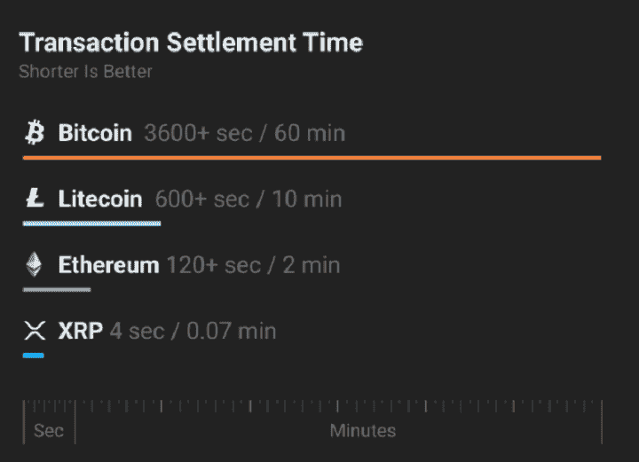
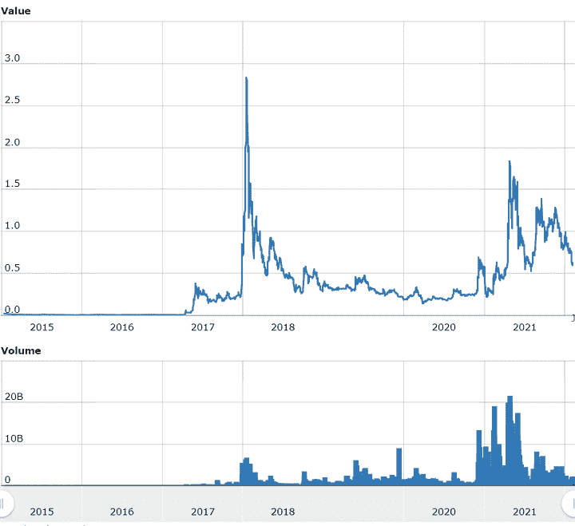
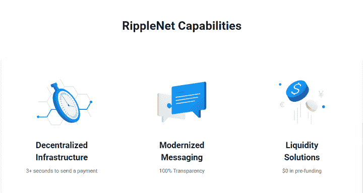
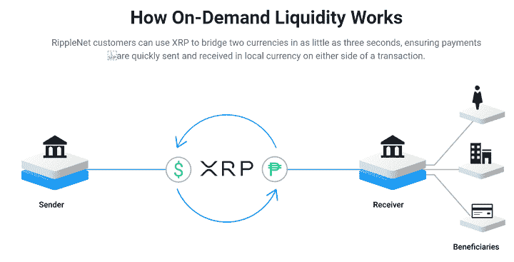
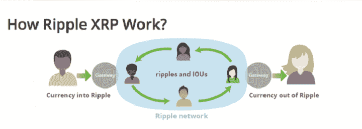
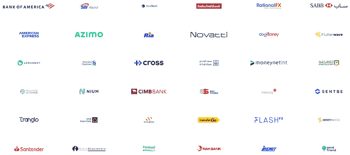

# 探索 Ripple 和 XRP:它是什么，功能和更多

> 原文：<https://blog.quantinsti.com/ripple-xrp/>

今天，我们来看看区块链和加密货币菜单上的一个热门产品——Ripple 和它的加密货币 XRP。它是十大加密货币之一，市值超过 280 亿美元。

加密货币是最近的热门话题。它们具有破坏性，令人兴奋。在本系列的最后几篇博客中，我们探索了区块链的技术。我们仔细研究了两种主要的加密货币，比特币和以太坊，它们导致了加密货币世界的一些重大变化。

在这篇博客中，我们将讨论以下主题:

*   [什么是涟漪？](#what-is-ripple)
*   [历史的涟漪](#history-of-ripple)
*   什么是 XRP？
*   [波纹特征](#features-of-ripple)
    *   [RippleNet](#ripplenet)
    *   [共识和确认](#consensus-and-validation)
    *   [唯一节点列表](#unique-node-list)
    *   [网关](#gateways)
    *   [XRP·莱杰](#xrp-ledger)
    *   [按需流动性](#on-demand-liquidity)
*   [Ripple 是如何工作的？](#how-does-ripple-work)
*   [Ripple 和比特币、以太坊有什么不同？](#how-is-ripple-different-from-bitcoin-and-ethereum)
*   [使用纹波的优势](#advantages-of-using-ripple)
*   [使用纹波的缺点](#disadvantages-of-using-ripple)
*   [新闻中的涟漪](#ripple-in-the-news)

* * *

## 什么是涟漪？

正如我们在之前的博客中了解到的，像比特币和 T2 以太坊这样的加密货币利用了区块链技术的力量。他们通过使用互联网转移价值带来了重大突破。

然而，由于处理交易的时间较长，它们无法与传统的金融交易系统相比，如 [SWIFT](https://statrys.com/blog/swift-payment-what-it-is-and-how-it-works) 。因此，加密货币在交易中缺乏主流接受度。这就是 Ripple 出现的地方！

最初，国际金融体系支离破碎。众多金融机构在不和谐的环境中工作，导致支付过程容易出错和延迟。

Ripple 试图改善现有的银行系统，而不是破坏它。Ripple 的目标是银行和金融机构使用 RippleNet 以低成本进行通信和交易。RippleNet 是一家区块链企业，使用 XRP 分类账和其本地加密货币 XRP 在全球范围内提供更快的支付。

因此，与公开区块链的比特币和以太坊不同，RippleNet 是一个由独立银行和支付提供商组成的去中心化网络，使用标准化协议在全球范围内发送实时、按需、低成本和可跟踪的支付。

* * *

## 涟漪的历史

Ripple 于 2012 年由[杰德·麦卡勒](https://en.wikipedia.org/wiki/Jed_McCaleb)和[克里斯·拉森](https://en.wikipedia.org/wiki/Chris_Larsen)([电子贷款](https://en.wikipedia.org/wiki/E-Loan)的联合创始人)创立。但是齿轮早在 2004 年就开始转动了，比比特币早了四年，当时一位加拿大程序员 Ryan Fugger 开发了 RipplePay。

RipplePay 虽然不是基于区块链，但却是一个金融网络的安全支付系统。2012 年，杰德·麦卡勒和克里斯·拉森创办了 OpenCoin 公司，2013 年更名为 Ripple Labs。

Ripple 以不同的方式处理这个问题。它的目的不是取代银行系统。相反，它的目标是通过提供一种分散的方式，以最低的交易费用进行快速支付，从而为传统系统提供一种替代方案。

Ripple Labs 在 2012 年创建了 Ripple transaction protocol (RTXP ),用于低成本的跨境快速资金转移。该公司开发了两种主要的银行间快速转账产品 xRapid 和 xVia。

xRapid 使用 XRP 进行价值交换，而 xVia 不需要它。这两者过去都是在 xCurrent 上运行的。在 [2019](https://www.fxstreet.com/cryptocurrencies/news/ripple-rebrands-products-removes-xrapid-xvia-and-xcurrent-mentions-from-its-website-201910112358) ，该公司合并了 xCurrent 和 xVia，并将其更名为 RippleNet，而 xRapid 则更名为“按需流动性”

<figure class="kg-card kg-image-card kg-width-full kg-card-hascaption">

<figcaption>[Source](https://motivationniche.com/wp-content/uploads/2019/09/ripple-network.jpg)</figcaption>

</figure>

* * *

## 什么是 XRP？

XRP 是 2013 年 1 月为 Ripple 网络设计的本地加密货币。它的创建主要是为了在参与方之间转移价值，而不是存储价值。

这种加密货币的最小单位是百万分之一 XRP 或一滴。

xrp 没有被开采——这里没有工作证据或利害关系证据。事实上，所有的 xrp，总共 1000 亿个，都是在一开始就被创造出来的，而且大部分都没有在流通。大约 600 亿 xrp 由该公司自己持有，这使得一些投资者对投资该公司持谨慎态度。

为了减轻这些担忧，该公司在 2017 年将 550 亿 xrp 放入加密安全的托管账户。这些资金被锁定在 55 个独立的托管账户中，每个账户 10 亿美元，从 2017 年底开始，每个月的第一天到期。

一旦发布，这些 xrp 就可供公司用于资助业务相关的运营、向投资者销售以及激励客户。任何未使用的 xrp 将被放回托管。

<figure class="kg-card kg-image-card kg-width-full kg-card-hascaption">

<figcaption>[Source](https://ripple.com/xrp)</figcaption>

</figure>

传统上，标准银行和其他金融机构使用美元将一种法定货币兑换成另一种法定货币，这导致了国际交易的延迟。Ripple 使用 XRP 而不是美元进行货币兑换。

所以不需要交换费，从而大大降低了交易成本。此外，交易只需几秒钟即可完成，而不是几小时或几天。

银行使用 XRP 为资金转账即时获取流动性，从而加快交易处理速度。

虽然 XRP 是为 RippleNet 设计的，但它可以脱离公司独立存在。为了澄清关于瑞波和 XRP 的常见神话，请查看福布斯的这篇文章。

<figure class="kg-card kg-image-card kg-width-full kg-card-hascaption">

<figcaption>Price and Volume charts for XRP: [Source](https://www.worldcoinindex.com/coin/ripple)</figcaption>

</figure>

* * *

## 波纹的特征

### RippleNet

RippleNet 是一个支付服务商网络，为全球各种金融机构提供连接。它使交易快速、高效、便宜。RippleNet 提供了一个分散的结构、现代化的双向信息传递和流动性解决方案。

假设你想从日本转一些钱到尼日利亚。如果我们以传统的方式行事，日本的银行不太可能拥有尼日利亚奈拉(NGN)的储备。正如你所想象的，在这个设置中涉及到各种各样的银行和支付提供商，它们都有自己的一套规则。

RippleNet 旨在通过提供一组称为 Ripple Transaction Protocol (RTXP)的规则，为整个互联网的价值转移提供一个框架，该协议为网络的所有参与者建立了共同的规则。

这消除了交易处理中的瓶颈，并使网络参与者更容易彼此密切合作。你可以把它想象成类似于 HTTP，它是一种在互联网上传输信息的通用协议。

<figure class="kg-card kg-image-card kg-width-full kg-card-hascaption">

<figcaption>[Source](https://ripple.com/ripplenet/)</figcaption>

</figure>

* * *

### 共识和验证

独立的验证器节点通过检查 XRP 事务是否遵循 RTXP 来就它们的顺序和有效性达成一致。Ripple 使用 Ripple 协议共识算法(RPCA)在验证器节点之间达成共识。

因为已经选择了验证器，并且所有 xrp 都已经存在，所以这里不涉及挖掘过程。所以没有时间、精力或金钱花在采矿上。

分类账每隔 3-5 秒就未结交易达成共识，分类账更新。

通过运行验证程序，任何人都可以成为验证者。验证者被激励维护分类账，仅仅是为了从使用系统中获益。

网络上有超过 150 个验证器，默认唯一节点列表上有大约 36 个——Ripple 运行其中的 6 个节点。

你可以在白皮书的[中了解更多关于共识协议的信息。](https://arxiv.org/pdf/1802.07242.pdf)

<figure class="kg-card kg-image-card kg-width-full kg-card-hascaption">

<figcaption>Consensus in Ripple: [Source](https://xrpl.org/img/consensus-rounds.svg)</figcaption>

</figure>

* * *

### 唯一节点列表

唯一节点列表(UNL)是网络参与者信任的节点列表。任何人都可以通过运行程序成为验证者。因此，谨慎地向 UNL 添加节点至关重要。

目前，三家出版商(Ripple、XRP 分类帐基金会和 Coil)根据他们过去的表现、经过验证的身份和负责任的 IT 政策发布了推荐验证者的默认列表。这称为默认唯一节点列表(dUNL)。

然而，每个网络参与者可以选择并添加他们自己的一组验证器到 UNL 中。

* * *

### 方法

想要加入 Ripple 网络的个人或实体可以接近网关。网关通常由银行运营。他们为网络之外的人提供了一个传播的入口。

网关在希望完成交易的双方之间的信任链中充当中介。网关帮助客户使用 Ripple 网络转移资金，包括传统货币和加密货币。

* * *

### XRP 分类帐

XRP 货币的分布式分类帐记录了使用 XRP 完成的所有交易，这些交易都经过验证器的确认。它被称为 XRP 纪事报。

XRPL 由网络的独立参与者维护，每隔几秒更新一次。虽然 Ripple 是网络的贡献者，但其权利与其他贡献者的权利相同。付款是不可逆的，也没有退款。

XRP 分类账也适用于 XRP 以外的货币。

* * *

### 按需流动性

传统上，美元在全球金融交易中被用作储备货币。让我们回到以前的例子，从日本转移一些金额到尼日利亚。

如果我们以传统的方式行事，日本的银行不太可能拥有尼日利亚奈拉(NGN)的储备。但是全世界所有的银行都持有美元储备。

因此，首先，必须将日元(JPY)兑换成美元，然后在目的地国家将美元兑换成 NGN，以便进行转账。

XRP 旨在充当 Ripple 网络上不同支付提供商之间的过渡货币。

这些账户必须预先注入资金，以便快速地将资金从一种货币转移到另一种货币。但是，银行使用营运资金进行前期融资是有风险的。

XRP 通过信托额度提供按需流动性(ODL)，类似于有限的信贷额度。按需流动性是仅向合格的机构 RippleNet 客户提供的服务，不面向零售客户。

<figure class="kg-card kg-image-card kg-width-full kg-card-hascaption">

<figcaption>[Source](https://ripple.com/ripplenet/on-demand-liquidity/)</figcaption>

</figure>

## Ripple 是如何工作的？

从设计本身来看，Ripple 的工作方式不同于比特币和以太网等其他区块链加密货币。这个网络更加集中。

在这里，任何人都可以通过下载所需的软件成为账本持有者。然而，有少数可信验证系统批准交易。这些验证者通常为知名银行和机构所有，信任主要建立在他们的声誉上。

只有在大多数验证者同意的情况下，任何交易才会被批准。

每次在网络上进行新的交易时，验证器都会对其进行验证，并在几秒钟内更新分类账。该软件确保分类账一致，如果不一致，交易将暂停，直到差异得到解决。

交易可以在几秒钟内完成，交易费用很低。目前，该网络每秒处理多达 155 笔交易，平均费用为 0.0002 美元。相比之下，比特币网络需要大约 10 分钟来确认交易，费用高达 25 美元。

值得注意的是，整个过程对最终用户是透明的。对最终用户来说，这似乎只是一个简单的实时转账问题。

<figure class="kg-card kg-image-card kg-width-full kg-card-hascaption">

<figcaption>[Source](https://th.bing.com/th/id/R.624cd63f0b5edc4620382b036c0f458b?rik=SeqU9aHWwXp%2f8A&riu=http%3a%2f%2fbitpeep.com%2fwp-content%2fuploads%2f2017%2f09%2fwhat-is-ripple-xrp-and-how-does-it-work.png&ehk=d%2b0nP0UZsFhEVsBoe9I6WcUITcihewwgHIge8PynuJI%3d&risl=&pid=ImgRaw&r=0)</figcaption>

</figure>

在 RippleNet 上，交易主要通过两种媒介进行:通过 XRP 或借据。当一家银行向另一家银行转账时，他们有两种选择:向 XRP 支付货币兑换费或写借据。

如果交易通过 XRP 结算，交易就完成了，因为 XRP 是可交易的资产。

然而，如果银行宁愿保持开放的标签，他们可能会发出借据。借据(我欠你的)类似于债务票据。这不是你拥有的东西，而是你欠的东西。

当然，如果你接受某人的借条，你需要相信他们会还你钱。这就是信任线发挥作用的地方。

在 RippleNet 上，trustline 类似于信用额度，就像是一份在一定额度内信任某人的协议。借据是不可互换的，但是你可以用借据交换几乎任何资产。

与借据不同，XRP 没有交易对手风险。那么为什么会有人想用借条进行交易呢？这是因为，像其他加密货币一样，XRP 也是不稳定的，因此它尚未获得普遍接受。因此，一些机构宁愿远离 XRP。

* * *

## 纹波的优势

Ripple 提供了许多优于传统支付系统的优势。

*   与传统系统相比，Ripple 使全球支付变得快速、高效和透明。XRP 作为一种流动性工具，使得整个过程无缝衔接。
*   涟漪交易比其他加密货币更快。与比特币和以太坊在几分钟内结算交易相比，XRP 交易需要 3-5 秒。
*   Ripple 提供了改进的可扩展性。XRP 每秒 24x7 不间断地处理 1，500 笔交易，并且可以扩展到与 Visa 相同的吞吐量。
*   Ripple 的跨货币支付系统吸引了许多金融机构和银行加入其网络。
*   区块链网络为不同的成员建立了一个无信任的环境，使他们紧密而有效地合作。
*   Ripple 旨在迎合大型银行和金融机构。因此，它的解决方案是根据他们的需求量身定制的，这推动了它在这些公司中的受欢迎程度。
*   许多主要金融机构信任并正在使用 Ripple。这让它更值得信赖。
*   没有通货膨胀是可能的，因为所有的 XRP 都已经被创造出来了。

<figure class="kg-card kg-image-card kg-width-full kg-card-hascaption">

<figcaption>Some of the financial institutions using RippleNet: [Source](https://ripple.com/ripplenet/)</figcaption>

</figure>

* * *

## 波纹的缺点

现在让我们来看看 Ripple 的缺点。

*   Ripple 的设计主要是为了吸引金融市场中的大玩家。因此，对于零售用户来说，它的用途有限。
*   RippleNet 不像公共区块链那样是一个完全分散的网络。
*   大多数 xrp 由 Ripple 公司自己持有。这意味着公司可以控制网络的运作。
*   有人担心，如果该公司想出售 xrp 的库存，可能会导致市场供过于求，导致价格暴跌。联合创始人之一杰德·麦卡勒(Jed McCaleb)于 2014 年离开 Ripple，拥有约 47 亿 XRP。他已经在无数次[事件](https://elevenews.com/2021/05/03/jed-mccaleb-moves-111-million-xrp-in-the-last-week-receives-442-million-from-ripple/)中[抛售](https://www.cryptoglobe.com/latest/2021/01/ripple-co-founder-jed-mccaleb-sells-28-6-million-xrp-after-25-day-pause/)大量此类股票，进一步加剧了这种担忧。

* * *

# Ripple 和比特币、以太坊有什么不同？

| 

### **Ripple**

 | 

### **Bitcoin and Ethereum**

 |
| 它专注于更大的金融机构和支付提供商 | 它专注于个人，并寻求脱离中央金融机构 |
| 这个网络可以用来转移任何商品或货币，而不仅仅是 XRP | 使用本地加密货币进行交易 |
| 迎合快速和廉价的全球交易 | 较高的交易成本和低的交易速度 |
| 可攀登的 | 可扩展性仍然是一个挑战 |
| 半许可的区块链 | 公共区块链 |
| 分散程度较低 | 更加分散化 |
| xrp 没有被开采，所以只有有限的数量在流通 | 它们被开采出来，所以流通中的硬币数量不断增加 |
| 使用 RPCA(波纹协议共识算法)进行共识 | 使用工作证明或利益证明来达成共识 |
| 可忽略的能源消耗 | 巨大的能源消耗 |
| 运行验证程序需要最少的计算机资源 | 成为验证者/挖掘者需要大量的金钱/计算资源 |

* * *

## 新闻中的涟漪

Ripple 因其各种违法行为而不断出现在新闻中。

第一个法律问题发生在 2015 年，当时[公司因在没有适当注册的情况下销售 XRP 代币而违反了](https://www.fincen.gov/news/news-releases/fincen-fines-ripple-labs-inc-first-civil-enforcement-action-against-virtual)[银行保密法](https://en.wikipedia.org/wiki/Bank_Secrecy_Act)，被罚款 70 万美元。此后，Ripple 为未来的 XRP 投资者介绍了《了解你的客户》( KYC)。

2020 年 12 月，美国证券交易委员会(SEC)对 Ripple Labs 首席执行官布拉德·加林豪斯和联合创始人克里斯·拉森提起诉讼。诉讼声称，Ripple 单独控制加密货币的基础设施，因此 XRP 是一种需要在 SEC 注册的证券。

它还声称，Ripple 严重依赖其在 XRP 的销售来为其运营提供资金。Ripple Labs 坚持认为 XRP 是一种加密货币，而不是一种证券。

这场官司影响了 XRP 的价格和接受度。毫无疑问，整个加密社区都在以极大的兴趣关注着它。

* * *

### 结论

在这篇博客中，我们讲述了 Ripple 的历史，探讨了 Ripple 和 XRP 是什么，Ripple 的功能和工作方式，它的优缺点，以及它与两种主要加密货币比特币和以太网的区别。我们也看了为什么 Ripple 最近出现在新闻中。

从区块链到重新定义金融科技的三大加密货币(比特币、以太网和 XRP)，我们在这一系列博客中涉及了很多内容。

我希望这些博客已经帮助您更多地了解了它们背后的技术、主要加密货币的优缺点以及它们的异同。

如果你也想进入 Ripple 和其他加密货币的世界，请查看 Quantra 的这个关于加密交易策略的中级课程。在这里，你将了解加密货币，涉及的风险，如何加密交易，并在 Python 中创建了 3 种不同的当天交易策略-所有这一切只需 2.5 小时！现在就去看看吧！

* * *

*<small>免责声明:本文中关于加密货币的任何信息仅用于传达一般信息。本文不提供投资、法律、税务等。建议。您不应将本文中的任何信息视为就加密货币使用、法律事务、投资、税收、加密货币开采、交易所使用、钱包使用等做出任何特定决定的呼吁。我们强烈建议向您自己的财务、投资、税务或法律顾问寻求建议。QuantInsti 和本文作者均不对因依赖本文发布或链接的信息而导致的任何损失、损害或不便承担责任。</small>*