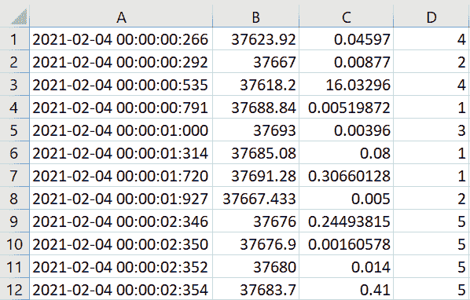

# 熊猫 OHLC:将分笔成交点数据转换为 OHLC 数据

> 原文：<https://blog.quantinsti.com/tick-tick-ohlc-data-pandas-tutorial/>

丹麦 Khajuria

原始形式的交易数据是逐笔成交点数据，其中每笔成交点代表一笔交易。它很有用，但是噪音太大。在这篇博客中，我们使用 Pandas 库的重采样功能将这些点对点(TBT)数据转换成 OHLC(开盘价、最高价、最低价和收盘价)格式。

我们涵盖:

*   [什么是分笔成交点数据？](#what-is-tick-by-tick-data)
*   [什么是 OHLC 数据？](#what-is-ohlc-data)
*   [将节拍数据转换为 OHLC 数据](#converting-tick-by-tick-data-to-ohlc-data)
    *   [步骤 1 -导入熊猫包](#step-1-import-pandas-package)
    *   [步骤 2 -加载数据](#step-2-load-the-data)
    *   [步骤 3 -对数据进行重新采样](#step-3-resample-the-data)

* * *

## 什么是分笔成交点数据？

在我们继续之前，让我们先了解一下什么是分笔成交点数据。买方和卖方之间的单笔交易由一个分笔成交点表示。

换句话说，当一个买方和一个卖方在一个商定的价格上做股票数量的横切时，它用一个分笔成交点来表示。这种类型的多个事务可以在一秒钟内发生，每个事务都用一个分笔成交点来表示。

逐笔数据如下所示。

<figure class="kg-card kg-image-card kg-width-full kg-card-hascaption">

<figcaption>This data was downloaded from [First Rate Data](https://firstratedata.com/)</figcaption>

</figure>

数据的第一列是交易发生的日期和时间。第二列是最后交易价格(LTP ),第三列是在该特定交易中交易的比特币数量，即最后交易数量(LTQ)。

最后一栏是交易代码。对于本教程，我们将使用 2021 年 2 月 4 日的比特币数据。这个数据是从[一级数据](https://firstratedata.com/)下载的。

我们可以添加一些关于数据、预处理等现有博客的推荐读物。

我们也可以在这里添加一段关于熊猫的文字，并链接到我们的博客。

* * *

## 什么是 OHLC 数据？

正如我们现在所知道的，分笔成交点数据是非常高频的数据。*如果我们想快速查看 1 分钟、10 分钟或 1 天内的价格时刻，该怎么办？*

我们将不得不手动检查每一个点，以检查价格时刻。这听起来很麻烦，但如果我们将数据总结为开盘价、最高价、最低价和收盘价，这实际上可以很快完成。

现在，我们将使用 pandas 库中的重采样功能，完成将分笔成交点数据转换为 OHLC 格式的整个过程。

* * *

## 将分笔成交点数据转换为 OHLC 数据

可以使用以下步骤将分笔成交点数据转换为 OHLC 数据:

*   [步骤 1 -导入熊猫包](#step-1-import-pandas-package)
*   [步骤 2 -加载数据](#step-2-load-the-data)
*   [步骤 3 -对数据进行重新采样](#step-3-resample-the-data)

### 步骤 1 -导入熊猫包

Pandas 是一个流行的 Python 包，最广泛地用于处理表格数据。Pandas 用于重要的功能，如数据争论、数据操作、数据分析等。