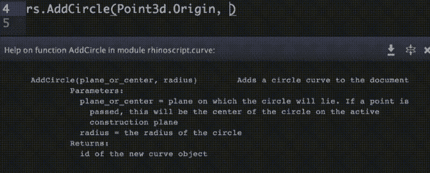
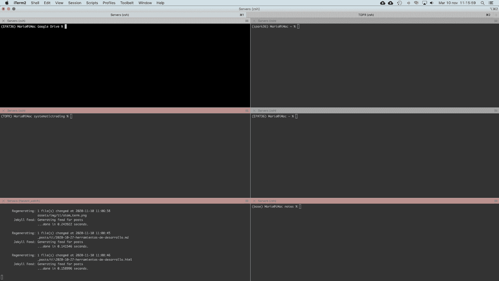
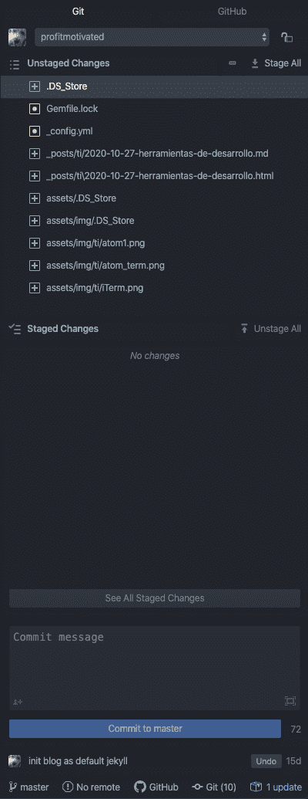
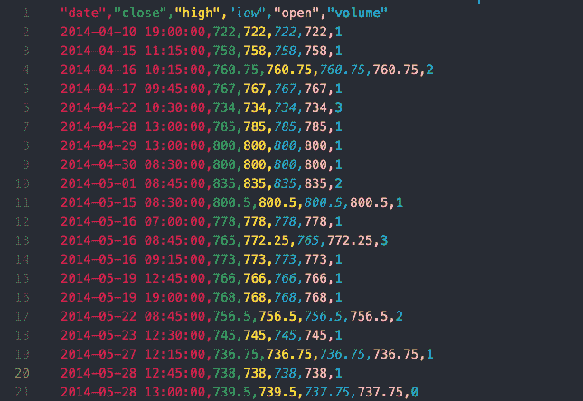
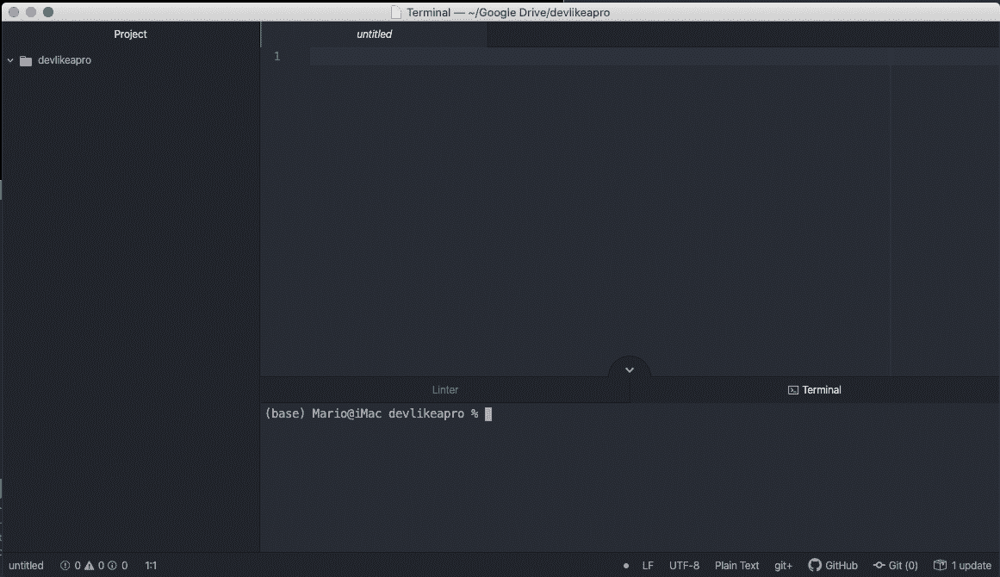
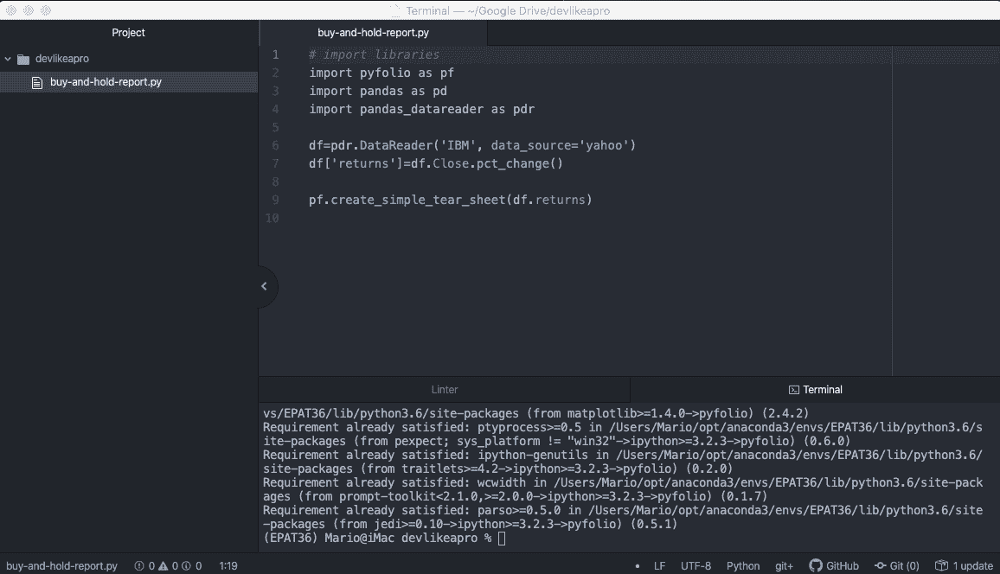
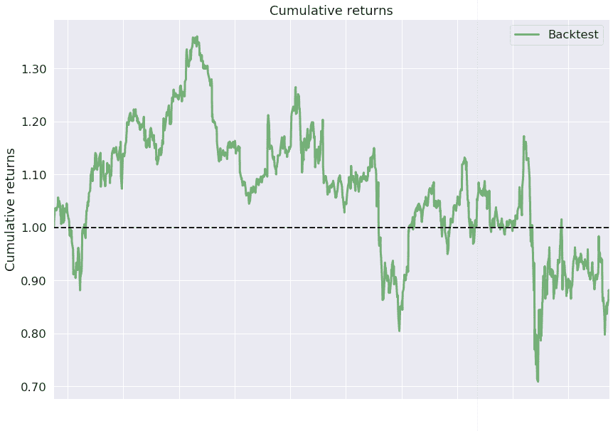
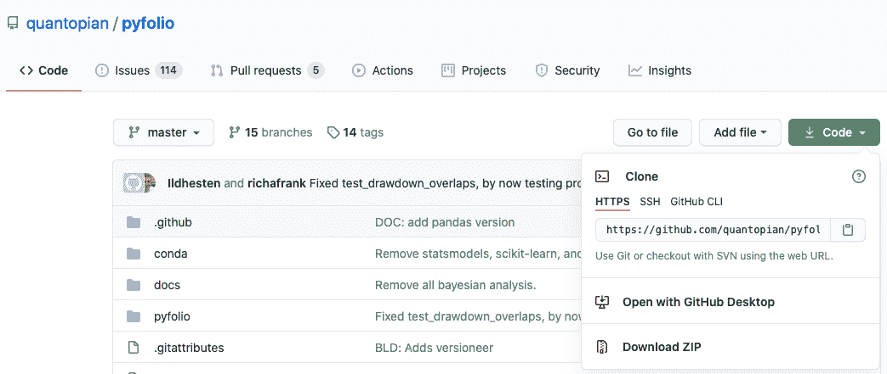

# 建立自己的交易机器，像专业人士一样发展

> 原文：<https://blog.quantinsti.com/trading-machine-setup/>

马里奥·比萨

在本帖中，我们将回顾每个量化开发者工具箱中应该有的基本工具。为此，我们将创建一个小项目来修改自由软件库并发布我们的更改。

本文涵盖:

*   为什么开发自己的交易机器是个好主意！
*   [代码编辑器](#code-editors)
*   [命令行终端](#command-line-terminals)
*   [开发环境](#development-environments)
*   [软件变更和版本控制](#software-changes-version-control)
*   [数据仓库](#data-repositories)
*   [IDEs(集成开发环境)](#ide-integrated-development-environment)
*   [云中的机器](#machines-in-the-cloud)
*   [开发库](#development-libraries)

* * *

## 为什么建造自己的交易机器是个好主意！T3】

有许多工具可以让 quant 程序员在与机器交互时更加轻松。选择合适的工具往往是个人喜好的问题，所以每个程序员都有自己的偏好。

然而，无论我们使用什么样的软件应用，我们都必须考虑能够促进算法和应用开发任务的工具箱，因为我们使用的具体应用并不重要，重要的是它提供的功能。

操作系统(Windows/Mac/Linux)对部署专业开发系统漠不关心。尽管有数不清的付费工具，这里我们将把重点放在所有操作系统都可用的免费软件工具上，或者在必要时特别提及。

这里提到的开发工具是所有编程语言通用的。然而，我想提一下，有些语言有非常特殊的 ide，这可能是最方便的。

无论如何，这里我们将 Python 作为一种示例语言，但坚持认为我们阐述的思想对任何编程语言都是有效的。

最后，这不是这里提到的任何工具的安装或说明手册，因此建议感兴趣的读者访问感兴趣的应用程序的页面。

* * *

## **[代码编辑](#code-editors)**

代码编辑器只不过是一个简单的文本编辑器。为此，我们可以使用 Windows 的记事本、Mac 的 TextEdit 或 Linux 的 Vi。然而，这些工具在功能上非常有限，因为它们缺乏编程帮助。编程辅助工具让我们在工作时变得更有效率。

一个好的代码编辑器必须允许集成小的编程工具、解释器和编译器来帮助我们完成对机器编程的任务。

### Emacs 代码编辑器

Emacs 是卓越的编辑。它是一个拥有 35 年历史的应用程序，来自 Unix/Linux 世界，最新版本可用于 Windows 和 Mac。

它无疑是最灵活的，可以与任何编程语言一起工作，但在处理上有一定的复杂性。尽管最新版本提供了 GUI，但是编辑器的真正威力来自 Emacs 本身的命令行。

### Atom 代码编辑器

另一个为任何编程语言提供巨大通用性的优秀文本编辑器是 [Atom](https://atom.io/) 。它是多平台的(Windows/Mac/Linux ),并允许我们集成许多工具来简化编程任务。Atom 有数以千计的附加包，可以将它变成一个完全为我们的目的定制的完整 IDE。

由于我们将使用 Python 作为编程语言，我们必须做的第一件事是安装一些可用的软件包，以增强我们在 Atom 中使用 Python 的开发体验。

例如，软件包 **hydrogen** 、 **python-ide** 和 **python-tools** 将允许我们在 Atom 中运行 python 代码，并将帮助我们自动完成代码、函数定义等等。

Atom 有许多其他的包可以帮助我们，例如，根据 WBS 风格指南编写代码、重构代码、生成测试代码等等。

<figure class="kg-card kg-image-card kg-width-full"></figure>

正如我在介绍中所说，选择代码编辑器和/或 IDE 是个人喜好的问题，因此任何其他让您感到舒适并有帮助和编程的编辑器都完全有效。

* * *

## **[命令行终端](#command-line-terminals)**

“最初……是命令行”是尼尔·斯蒂芬森的《T1》一书的标题，该书精彩地讲述了机器与人类界面的演变。一本值得一读，了解人机关系如何演变的书。

毫无疑问，当前的操作系统及其 GUI 已经显著改善了我们与机器的交互。我们只要想一想，在穿孔卡片中实现一个简单的均值交叉算法，或者用汇编语言(ASM)开发它，就会感到幸运。

从用鼠标操作机器到用头脑操作机器的设备都是值得称赞的界面，但仅限于开发人员已经实现的独特功能。

为了通过操作系统充分发挥机器的能力，我们需要一个命令行终端。终端，也称为控制台或外壳，打开机器管道的门，并允许我们通过命令进行交互。

### Linux 的命令行终端

对于 Linux 来说，它是经典的界面，尽管下载量最大的发行版是像 Windows 一样的，比如 Ubuntu。有些“纯”发行版是简单的终端，比如 Slackware 发行版。如果你正在使用 GUI，你可以打开**项**应用程序或者按 **Alt+Ctrl+F1** 。

对于 Mac 来说，有一个终端应用程序，命令和 Linux 中的一样，因为 Mac 是建立在 AT & T Unix 上的。

对于 Windows，我们可以打开 MS-DOS**cmd.exe**应用程序，尽管它在我们可以启动的命令集方面非常有限。为了升级我们在 Windows 中的命令行，我们需要安装 [Powershell](https://docs.microsoft.com/en-us/powershell/scripting/overview?view=powershell-7) ，它扩展了命令目录，你也可以在 Windows 中获得 [Linux shell，或者为旧版本 Windows 的用户简单地安装](https://docs.microsoft.com/en-us/windows/wsl/install-win10) [Cygwin](https://www.cygwin.com/) 。

当我们轻松处理命令行时，我们会发现自己有多个打开的终端和繁琐的窗口或应用程序更改，为了方便使用多个终端并为每个终端配置自己的配置文件，我们可以使用 Mac 的 [iTerm](https://www.iterm2.com/) 或 Windows 的 [ConEmu](https://conemu.github.io/) 。

这些应用程序不会取代终端，只是允许我们在应用程序本身中管理多个窗口，并管理每个窗口中的配置文件。

<figure class="kg-card kg-image-card kg-width-full"></figure>

学会很好地使用命令行不是一件容易的事情，但是它只需要耐心、毅力和一本手边的好手册。

最后指出，Atom 允许我们在编辑器本身中集成一个终端，因此我们不必更改窗口来启动命令，我们可以在 Atom 中运行脚本，您可以尝试使用 **terminal-tab** 包，尽管还有其他不同用途的包。

<figure class="kg-card kg-image-card kg-width-full"></figure>

* * *

## **[开发环境](#development-environments)**

当我们处理几个项目时，隔离我们正在使用的库的版本是很方便的，这样一个项目中的变化就不会对另一个项目产生负面影响。

如果一个项目需要 Python 3.5 和 Pandas 0.21，而另一个项目需要 Python 3.7 和 Pandas 1.0.2，则必须使用开发环境管理器。

换句话说，一个开发环境管理人员需要使用我们正在使用的编程语言的不同版本的解释器或编译器，以及项目需要的额外的库。

通过隔离开发环境，我们避免了在安装一个新版本的库时发生的悲剧，这样其他的项目就停止工作了。

大多数编程语言都有这些管理器。一些比较有名的是 ruby 版本管理器 [rvm](https://rvm.io/) 、R 内核的 [RSwitch](https://rud.is/rswitch/) 和 R 包的 [renv](https://rstudio.github.io/renv/articles/renv.html) 。

为了使用不同版本的 Python 和不同版本的库，我们将使用 [Conda](https://docs.conda.io/en/latest/) 。Conda 是 Anaconda 提供的开发环境管理器，尽管高级用户更喜欢安装 [miniconda](https://docs.conda.io/en/latest/miniconda.html) ，以避免安装完整的 Anaconda 套件。

用 conda 管理开发环境非常简单，因为只需要很少的指令或命令，我们就可以管理所有的开发环境。

为了在 Python 3.5 中创建开发环境，我们在终端中启动以下命令:

```py
conda create -n py35 python=3.5
```

这个命令将在 Python 3.5 中创建一个开发环境。要查看并激活新环境，我们可以启动以下命令:

***康达环境列表*** 列出了我们已经创建的环境的集合，名称越有描述性，就越容易记住它包含的内容。

***康达激活 py35*** 用 Python 版本激活我们之前创建的名为 py35 的开发环境。一旦环境被激活，我们就可以使用‘pip’为该开发环境安装特定的库。

安装在一个环境中的库只能在该环境中使用，因此，每个环境都需要自己的库集合。

开发环境的另一个非常有趣的用途是，我们可以导出一组库(环境),将它们导入到另一个项目或另一台机器中。开发环境管理器是一个非常强大的工具，任何开发人员的工具箱中都不应该缺少它。

```py
conda env export py35.yml
```

* * *

## **[软件变更和版本控制](#software-changes-version-control)**

我们可以在任何开发人员的工具箱中找到的另一个最强大的工具是软件变更和版本控制。尽管有不同的工具可以实现这一目的，但这里我们将关注最广泛使用的一种，它被认为是一种标准，即 [Git](https://git-scm.com/) 工具。

Git 在 Linux 上默认是嵌入式的，对于 Mac，你需要用***xcode-select-install***命令安装开发者工具，对于 Windows，你需要[安装](https://git-scm.com/downloads)。

Git 是一个命令行软件，可以让你保存开发的快照，标记它们，并生成代码版本。这对于恢复到代码的先前版本、开始并行开发、恢复文件、参与自由软件项目以及提出改进和/或修复等非常有用。

这可能看起来有点抽象，所以让我们假设我们正在开发一个项目，当我们完成小的功能包时，我们保存代码的快照，当我们完成项目时，我们可以保存另一个快照并用版本号标记它。

虽然这已经很有趣了，但是当项目需要修正、修改、功能扩展或者团队开发的时候，这个工具就成为了我们将在任何项目中使用的工具的基石。

另一方面，使用 Git，你可以访问开源库，或者在 Github 或 T2 bit bucket 上创建你自己的开源或私有库。

我们需要一个特定的帖子来查看 Git 提供给我们的所有命令，所以我们把它留给感兴趣的读者在[官方文档](https://git-scm.com/docs/user-manual.html)中查看。

最后，我们可以在 Atom 代码编辑器中集成一个 Git 客户端，使其更容易与 **git-plus** 包一起使用。

尽管图形界面很常见，但它的功能仅限于最基本的命令，我们必须使用命令行来获得 Git 的全部功能。

<figure class="kg-card kg-image-card kg-width-full"></figure>

* * *

## **[数据仓库](#data-repositories)**

任何开发人员工具箱中的另一个基本实用工具是管理数据存储库的能力。csv 文件和数据库。这是非常通用的，因为我们可以在 [csv](https://en.wikipedia.org/wiki/Comma-separated_values) 、 [excel](https://www.microsoft.com/en/microsoft-365/excel) 、 [hdf5](https://en.wikipedia.org/wiki/Hierarchical_Data_Format) 文件和关系数据库(如 [MySQL](https://www.mysql.com) 或 [PostgreSQL](https://www.postgresql.org/) 或非 SQL(如 [MongoDB](https://www.mongodb.com/) )中找到数据。

作为开发人员，我们只关心通过编程语言连接到这些数据存储库的接口。然而，当我们在开发时，我们通常需要可视化原始状态的数据，以了解我们必须进行的转换，并知道如何攻击我们感兴趣的数据。

通常，我们可以使用窗口应用程序来可视化数据文件或连接到数据库，尽管我们的代码编辑器应该足够灵活，允许我们直接从编辑器本身可视化和修改数据。

在 Atom 中，我们可以找到有助于连接、可视化以及在某些情况下修改数据存储库(无论是文件还是数据库格式)的包。

**rainbow-csv** 为我们提供了可视化 csv 文件的功能，通过将每一列涂上不同的颜色，可以更快地查看数据。寻找其他 Atom 包，甚至可以像查询数据库一样对 csv 文件进行查询。

<figure class="kg-card kg-image-card kg-width-full"></figure>

对于数据库，Atom 中有特定的客户端，您还可以使用通用的**快速查询**在 MySQL 或 PostgreSQL 上启动 SQL 查询。

* * *

## **[【ide(集成开发环境)](#ide-integrated-development-environment)**

ide 拥有最好的代码编辑器和一组工具，理论上，它们可以防止我们在整个开发工作流程中改变应用程序，一般来说，它们都集成了以前见过的工具。

虽然大多数 ide 能够处理几种编程语言，但它们通常面向特定的语言，如 R 的 RStudio、Python 的 Spyder、Java 的 Eclipse、C#的 VisualStudio 和 long 等。

在许多情况下，最好的选择可能是使用 IDE，比如 R、Java 或 C#，但是即使我们最终在 IDE 中使用它们，了解本文中提到的工具仍然是必要的。

在这位作者看来，很多时候 IDE 把你禁锢在一个框架里，限制了通用性。毫无疑问，Atom 是这篇文章订阅者的选择。

但正如我在开始时所说的，没有开发工具这样的东西，最好的工具是使您的工作更容易，使您的生活更舒适的工具，所以最好的事情是不要太关注我，做一个尝试不同工具的人，以决定哪一个是您的最好工具。

* * *

## **[云中的机器](#machines-in-the-cloud)**

开发者目录中不能缺少的最后一个工具是云机器。目前，我们可以以合理的价格获得配置简单的 Windows/Linux 机器或超级计算机配置。

不管我们使用哪种机器进行开发，在生产中部署系统都需要考虑架构、可用性、安全性等方面。

两个最受欢迎的云机器服务提供商是 [Google Cloud](https://cloud.google.com/) 和 [AWS](https://aws.amazon.com/) ，你可以开始免费使用云机器一年，使用简单但足够的配置来学习甚至部署应用程序或简单的算法。没有理由不去尝试！

* * *

## **[开发库](#development-libraries)**

让我们以一个简单的例子来结束如何管理一个开发项目。让我们假设我们想要创建一个神话般的买入并持有策略，并且我们想要生成一个性能报告来展示给我们的客户。

对于报告，我们将使用开源库，我们将修改并发布我们的更改，以便其他开发人员可以使用我们的修改。

### 用 Conda 创建一个 Python 环境

在我们终端的命令行中，我们键入以下命令，用 Conda 创建一个 Python 环境版本 3.6。

```py
conda create -n EPAT36 python=3.6
```

我们将创建一个项目名为 ***devlikeapro*** 的文件夹，

*   通过在终端 ***中键入以下命令 mkdir devlikeapro*** ，
*   用命令 ***移动到项目文件夹***
*   用 ***激活终端中的环境，conda 激活 EPAT36*** 。

这里我们可以执行 ***python - version*** 命令，看看我们确实在使用 Python 3.6。

现在我们可以用‘pip’以通常的方式安装我们将在项目中使用的库。

```py
pip install pandas pandas_datareader pyfolio
```

最后，我们用 atom 命令打开 Atom，并在刚刚创建的文件夹中创建一个新项目。

<figure class="kg-card kg-image-card kg-width-full"></figure>

我们假设已经安装了帖子中提到的所有 Atom 包。请看图片，我们已经在 Atom 中打开了终端，但是我们使用的 python 开发环境是 Conda 的“基础”。

因此，我们必须使用 ***conda 激活 EPAT36*** 来更改我们创建的名为“EPAT36”的环境

<figure class="kg-card kg-image-card kg-width-full"></figure>

我们将在 Atom 代码编辑器中使用我们出色的策略创建一个新的 Python 脚本:

<figure class="kg-card kg-image-card kg-width-full"></figure>

为了在 Atom 中运行报告，我们使用了 Atom **hydrogen** 包，它允许我们逐行运行 Python 脚本。输出为我们提供了一个简单的 pyfolio 报告，其中包含一个统计表和一些有趣的图形。

<figure class="kg-card kg-image-card kg-width-full"></figure>

假设我们想要修改 pyfolio 库，以改进、扩展或纠正库中的任何内容。当我们想要在一个自由软件项目中合作，或者只是想要修改库中的一些小细节时，这是非常有用的。在这个简单的例子中，我们将修改'**累积回报**'图表的一些细节。

在开始之前，我们将回顾一下我们在系统中安装 pyfolio 库的情况。为此，我们执行命令 ***conda list*** ，它提供了我们已经安装在名为“ **EPAT36** 的 conda 环境中的库的列表。

找 pyfolio 我们可以发现我们已经从 pypi 库安装了 0.9.2 版本，也就是说带' pip '的标准安装。

<figure class="kg-card kg-image-card kg-width-full"></figure>

为了修改库，我们需要将库源代码下载到我们的机器上，进行我们需要的更改并重新安装修改后的库的新版本。

### **用 Git 创建变更和版本控制库**

我们将找到对 [pyfolio 库](https://github.com/quantopian/pyfolio)公开可用的代码库，并在绿色的“代码”按钮中复制 URL 地址以克隆该库。

<figure class="kg-card kg-image-card kg-width-full"></figure>

将 URL 复制到剪贴板后，我们在终端中键入 ***git 克隆 https://github.com/quantopian/pyfolio***。这个命令将项目从 Github 克隆(复制)到我们的机器上。现在我们可以用 Atom 打开一个新项目并修改库。

当我们想要修改由***create _ simple _ tear _ sheet***函数创建的报告时，我们将打开***py folio/py folio/tears . py***文件并查找***create _ simple _ tear _ sheet***函数，该函数将位于我们正在处理的版本的第 231 行。

在这个函数中，我们定位我们想要修改的图形，例如“累积回报”,在这种情况下从第 349-354 行开始，我们修改标题使其更具描述性。

<figure class="kg-card kg-image-card kg-width-full"></figure>

最后，我们需要再次安装库，但这一次我们将安装我们机器中的 pyfolio 项目，我们已经修改了它。

为此，我们运行以下命令***python setup . py develop***在我们的机器上安装开发版本。

如果一切顺利，我们没有得到任何错误，我们应该看到我们已经安装了一个带有命令 ***conda list*** 的开发版本。

<figure class="kg-card kg-image-card kg-width-full"></figure>

如果我们返回执行我们的代码来生成报告，我们应该看到我们所做的更改。

为了完成这项工作，我们需要将更改保存在 Git 中，以便进行更改控制。让我们通过运行 ***git 状态命令*** 来看看 git 告诉我们对 pyfolio 所做的更改。

<figure class="kg-card kg-image-card kg-width-full"></figure>

我们看到 **tears.py** 文件被标记为已修改，我们需要使用命令***git add py folio/tears . py***将该更改添加到 git 存储库中，然后我们提交一条消息，说明更改的原因 ***git commit -m '改善累积回报图表标题*** 。

在您将代码修改推送到原始服务器之前，您应该确保您已经做了正确的事情，并且只上传了必要的文件，并且这些更改是有足够的动机的。

另一个选择是用 github 上的 fork 创建自己的资源库，并向全世界发布自己的版本。但这是读者应该了解的另一个故事。

* * *

## **结论**

我们已经回顾了一些基本工具，任何有自尊的量化程序员都应该很好地掌握这些工具，以便自己使用和在团队中工作。我们已经回顾了一些基本工具，这些工具经过适当的配置，可以达到任何专业 IDE 的高度。

在任何情况下，我想强调的是，工具本身的名称并不太重要，但正是它提供的功能和舒适性应该引导我们使用这样或那样的工具。

最后，我们通过一个例子来了解职业发展的工作流程。

<small>*本文提供的所有数据和信息仅供参考。QuantInsti 对本文中任何信息的准确性、完整性、现时性、适用性或有效性不做任何陈述，也不对这些信息中的任何错误、遗漏或延迟或因其显示或使用而导致的任何损失、伤害或损害承担任何责任。所有信息均按原样提供。*T3】</small>