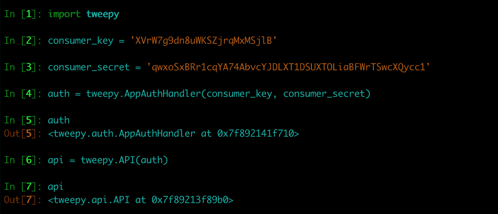
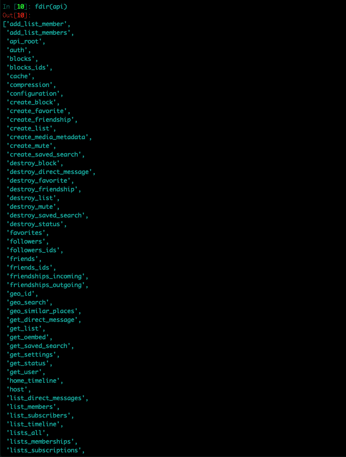
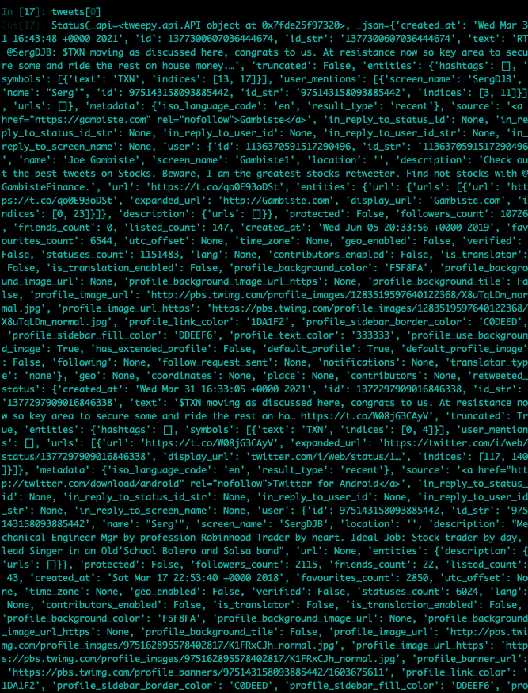
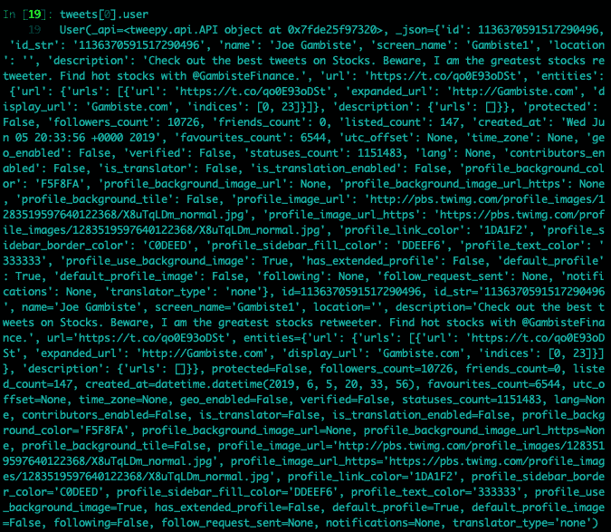
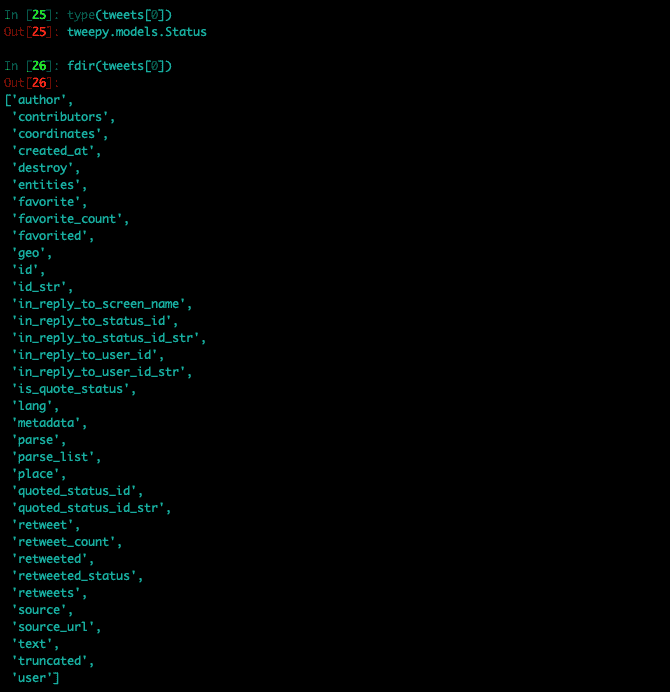
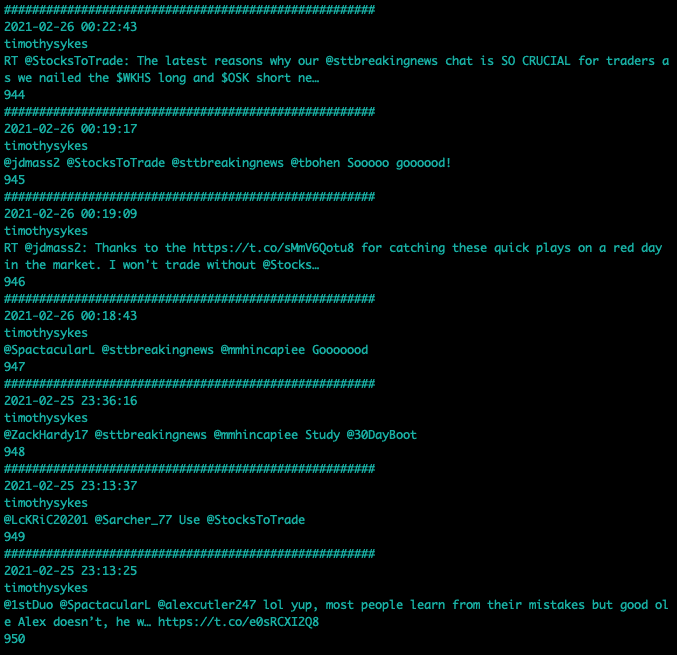

# Tweepy -使用 Python 中的 Twitter API 生成情绪交易指标

> 原文：<https://blog.quantinsti.com/tweepy/>

马里奥·比萨

尤其是社交媒体和 Twitter 是替代数据来源，被广泛用于把握市场情绪的脉搏。

在本帖中，我们将回顾 Tweepy 库从 Twitter 获取实时和历史数据。我们将讨论以下主题:

*   [推特和情感分析](#twitter-and-sentiment-analysis)
*   [社交网络对市场趋势的影响](#the-impact-of-social-networks-on-market-trends)
*   什么是推特？
*   [一个 Python Twitter API，tweepy](#a-python-twitter-api-tweepy)
*   [如何安装设置 Tweepy？](#how-to-install-and-set-up-tweepy)
*   [Twitter API 上的认证](#authentication-on-twitter-api)
*   [如何使用 Tweepy 获取推文](#how-to-use-tweepy-to-get-tweets)
*   [Tweets 用光标分页](#tweets-pagination-with-cursors)
*   [建立一个天真的情绪指标](#building-a-naive-sentiment-indicator)

* * *

## Twitter 和情感分析

尤其是社交网络和 Twitter 是替代数据来源，被广泛用作市场情绪指标。

[新闻和社交网络的情感分析](https://quantra.quantinsti.com/course/trading-twitter-sentiment-analysis)是一个综合性的研究领域，其中自然语言处理对于从非结构化信息源中提取定量信息至关重要。

[https://prezi.com/embed/aj0mccm6n_wi/?bgcolor=ffffff&lock_to_path=0&autoplay=0&autohide_ctrls=0&landing_data=bHVZZmNaNDBIWnNjdEVENDRhZDFNZGNIUE43MHdLNWpsdFJLb2ZHanI0VHpDWDZnc2lGT1czWExUVHM3TXU2eDNnPT0&landing_sign=pY51gqFI2VybVfmw9_HMgzl3EN4vvoseZXOIQL-jRkI](https://prezi.com/embed/aj0mccm6n_wi/?bgcolor=ffffff&lock_to_path=0&autoplay=0&autohide_ctrls=0&landing_data=bHVZZmNaNDBIWnNjdEVENDRhZDFNZGNIUE43MHdLNWpsdFJLb2ZHanI0VHpDWDZnc2lGT1czWExUVHM3TXU2eDNnPT0&landing_sign=pY51gqFI2VybVfmw9_HMgzl3EN4vvoseZXOIQL-jRkI)

我们需要一本书，如果不是一本百科全书，来描述情绪分析的整个过程，并将其整合到我们的交易系统中。

因此，在这篇文章中，我们将从第一步开始，从 Twitter 中提取信息，以供我们的自然语言处理算法使用。

* * *

*建议阅读:*

*   *[博客上的情绪交易](/tag/sentiment-trading/)*
*   *[交易中自然语言处理的逐步指南](/natural-language-processing-trading/)*
*   *[如何通过 Python API 获取历史行情数据](/historical-market-data-python-api/)*
*   [在贸易和商业中结合情感:雨果如何探索机遇](/finance-director-csaf-success-story-hugo-valdivia-carrillo/)

* * *

## 社交网络对市场趋势的影响

社交网络已经成为主流通信媒体，用户可以既是消费者也是信息的创造者。

用户不断地产生数据，或者被动地仅仅作为信息的接收者，我们的兴趣、阅读时间等等。或者通过创造内容，表达我们对另一个内容的兴趣，甚至分享它。

此外，足够有趣或令人震惊的新闻可以传遍世界，成为一种全球趋势。拥有数百万追随者的用户也可以创造特定主题的趋势或影响。

对这类数据的分析是多年来的研究课题，已经产生了大量的学术材料来模拟信息流、其解释以及情绪、趋势和预测的提取。

* * *

## Twitter 是什么？

Twitter 是一个微博社交网络，用户可以通过发布信息、转发分享或通过将信息标记为收藏来表达自己的兴趣。

它还有一个 hashtags (#)机制来标记内容，能够将消息传达给更多的人，而不仅仅是追随者。

根据[互联网实时统计数据](https://www.internetlivestats.com)，Twitter 拥有超过 3.72 亿活跃用户，并且这个数字还在持续增加，每天发布超过 7 亿条推文。

有些拥有数百万粉丝的用户，他们的推文可以对市场产生巨大影响。众所周知，[唐纳德·川普](https://www.researchgate.net/publication/324203948_Using_social_media_analytics_The_effect_of_President_Trump's_tweets_on_companies'_performance)和[埃隆·马斯克](https://www.researchgate.net/publication/349007665_How_Elon_Musk's_Twitter_activity_moves_cryptocurrency_markets)的例子，一条推特就能引起震惊或繁荣。

另一方面，数百名用户可以就一家公司展开激烈的辩论，从而形成投资者情绪的趋势。与数以千计(如果不是数百万的话)被动和主动观众进行辩论。

因此，对于那些认为社交媒体情绪可以增加他们在市场中的优势的分析师来说，Twitter 已经成为替代信息的相关来源。

* * *

## 一个 Python Twitter API，Tweepy

Tweepy 是一个简单易用的 [Python 库](/python-trading-library/)，用于访问 Twitter API，正如其网站所宣称的。它不是一个连接 Twitter API 的独特库，但它是最著名的库之一，并且在 [GitHub](https://github.com/tweepy/tweepy) 上有非常活跃的开发。

从上一段可以很容易地推断出，Tweepy 允许我们连接到 Twitter 信息来提取历史和实时数据。这意味着我们有大量的信息可以通过这个库进行分析。

来自社交网络，尤其是 Twitter 的信息是非结构化数据，使用了大量的行话、俚语、表情符号等。，这使得分析起来特别复杂。

[自然语言处理或 NLP](https://www.nltk.org/) 是一个专门从所有这些非结构化信息中提取定量和定性信息的领域。当它与[经典统计工具或机器学习](https://scikit-learn.org/stable/tutorial/text_analytics/working_with_text_data.html)结合使用时，我们能够对社交网络和一般非结构化数据进行情感分析。

在一篇帖子中，没有足够的空间来完整地覆盖社交网络中的情感分析，所以这里我们将专注于情感分析的第一步，但也是最重要的一步，即提取、转换 Twitter 信息并将其加载到分析算法中。

* * *

## 如何安装设置 Tweepy？

通过 pip 安装程序照常安装 Tweepy Python 库:

`pip install tweepy`

或者从 GitHub 克隆源代码，并作为开发人员安装在您的机器上，如果您计划修改代码并对社区做出自己的贡献。

```py
git clone https://github.com/tweepy/tweepy.git
cd tweepy
python setup.py develop
```

除了在 Python 中安装 Tweepy 库之外，还需要在 Twitter 上创建一个[开发人员帐户，以便获得允许我们连接 Twitter 服务器以提取数据的密钥。](https://developer.twitter.com/en/apply-for-access)

一旦安装了库并获得了开发人员密钥，我们就可以开始处理来自 Twitter 的信息了。

* * *

## Twitter API 上的认证

启动一个终端(如果需要，可以使用 Anaconda 提示符)并使用 ipython 命令启动一个交互式 python 会话，导入 tweepy 库并为键分配变量。

接下来，我们必须创建一个身份验证处理程序对象，最后，用身份验证处理程序对象创建一个 tweepy 对象。

<figure class="kg-card kg-image-card kg-width-full"></figure>

<figure class="kg-card kg-image-card kg-width-full"></figure>

现在我们有了一个名为 api 的对象，它是一个与 Twitter 机器相连的[套接字](https://en.wikipedia.org/wiki/Network_socket)，使我们能够提取特定用户的推文，提取与某个单词或一组单词相关的推文，甚至管理我们自己的 Twitter 帐户。

* * *

## 如何使用 Tweepy 获取推文

我们创建的对象 api 允许我们使用 Twitter API 中的 105 个 RESTful 方法，其中一些只适用于高级 API。

我们可以列出所有可用的方法:

<figure class="kg-card kg-image-card kg-width-full"></figure>

<figure class="kg-card kg-image-card kg-width-full"></figure>

这个列表并不完整，尽管我们已经看到有 105 种方法可用。如果我们看一看，我们会发现我们可以执行比应用程序本身更多的功能，我们可以自动化我们自己的 Twitter 帐户和管理我们的出版物，甚至创建一个完全自主的机器人来管理帐户。

下面是一些最常用的获取数据的方法:

*   **搜索**搜索包含特定单词的推文
*   **user_timeline** 搜索特定用户的推文

### 搜索

让我们通过查找一个词来获得一些推文。我们使用输入参数 q 调用 api 对象的 search 方法进行查询。

<figure class="kg-card kg-image-card kg-width-full"></figure>

检查结果，我们得到一个模型(另一个对象),其中包含请求查询的推文，我们得到 15 条推文，寻找强生$JNJ 的股票

<figure class="kg-card kg-image-card kg-width-full"></figure>

虽然这是默认的数字，但是我们可以使用 count 输入参数将它增加到 100，这是免费 Twitter API 开发人员的最大请求数。

<figure class="kg-card kg-image-card kg-width-full"></figure>

令人难以置信的是，一条 140 个字符的简单推文中包含了大量的元信息，我只包括了结果的第一部分，因为要完整地显示它需要几页。

<figure class="kg-card kg-image-card kg-width-full"></figure>

所以让我们来看看更具体的信息，如推文的日期和时间，用户和发布的内容。

<figure class="kg-card kg-image-card kg-width-full"></figure>

<figure class="kg-card kg-image-card kg-width-full"></figure>

<figure class="kg-card kg-image-card kg-width-full"></figure>

同样，对于用户，它返回大量与用户相关的元数据，如姓名、别名、关注者数量等。

为了查看更多的细节，我们需要再次使用 search 对象中可用的方法。

<figure class="kg-card kg-image-card kg-width-full"></figure>

请记住，Twitter 返回给我们的是一个对象模型，因此，我们有无数的方法来处理这些对象。

每条 tweet 都是 Status 类的一个对象，我们可以在这里看到它的方法。

<figure class="kg-card kg-image-card kg-width-full"></figure>

对于用户模型，我们有 52 种方法可用于处理用户。

<figure class="kg-card kg-image-card kg-width-full"></figure>

请查看[文档](https://docs.tweepy.org/en/latest/api.html#search-methods)以了解可用于搜索的大量参数。

### 用户时间线

Twitter API 的另一个最常用的方法是 user_timeline，它允许我们分析特定用户的所有发布。

埃隆·马斯克的账户炙手可热，他拥有数百万粉丝，他的一些帖子引起了地震般的运动。我们来看看他的一些微博。

<figure class="kg-card kg-image-card kg-width-full"></figure>

我们可以再次看到，我们得到的是一个类 ResultSet 的对象，或者确切地说，是一个对象模型，它为我们提供了处理信息的多种方法。

<figure class="kg-card kg-image-card kg-width-full"></figure>

<figure class="kg-card kg-image-card kg-width-full"></figure>

注意，默认情况下返回的 tweets 的最大数量是 20，尽管我们可以用 count 参数将它扩展到 200。

<figure class="kg-card kg-image-card kg-width-full"></figure>

这里不可能描述 user_timeline 函数的每个参数，所以我们强烈建议您访问 [Tweepy 文档](https://docs.tweepy.org/en/latest/api.html#user-methods)。

* * *

## Tweets 用光标分页

当我们需要大量数据时，我们将不断需要使用游标。游标是一种 API 方法，用于创建可迭代对象和处理信息块。

cursor 对象有两个主要方法，处理信息块或 tweet 的页面和处理单个 tweet 的项目。

<figure class="kg-card kg-image-card kg-width-full"></figure>

游标用一个模型初始化，例如 search 或 user_timeline，它返回一个 iterable 对象。

<figure class="kg-card kg-image-card kg-width-full"></figure>

<figure class="kg-card kg-image-card kg-width-full"></figure>

正如我们所看到的，我们得到了比使用 user_timeline 更多的 tweets，在这种情况下，它被限制为 200 条。在这个例子中，我们使用光标获取了多达 950 条推文，如下所示:

<figure class="kg-card kg-image-card kg-width-full"></figure>

通过日期范围、用户、单词、标签等过滤光标是非常有趣的。

到目前为止，我们所看到的使我们能够处理来自 Twitter 的历史信息。我们现在将了解如何处理实时信息。

* * *

## 实时推文

为了实时检索 Twitter 消息，或者换句话说，或多或少地检索连续的 tweets 流(取决于使用的过滤器)，我们需要创建一个侦听器。

与我们一直在讨论的对象不同，这些对象通过 RESTful 接口为我们提供了一系列发送请求的方法，监听器打开一个套接字，并通过推送技术接收消息。

这听起来可能有点奇怪，但实际上所有困难的工作都是由 Tweepy 库完成的，我们只需要创建适当的对象。

我们唯一要做的就是创建一个从 StreamListener 类继承的类，在这里我们可以覆盖我们感兴趣的方法。再次建议查看官方[文档](https://docs.tweepy.org/en/latest/streaming_how_to.html)以了解可用的方法。

<figure class="kg-card kg-image-card kg-width-full"></figure>

过一会儿，我们将开始看到基于我们定义的过滤器到达的推文流。

<figure class="kg-card kg-image-card kg-width-full"></figure>

图像被截断。除非我们停止执行，否则每当一条新的 tweet 满足过滤标准时， **on_data 方法**就会神奇地执行。

注意，有几种以 on_*开头的方法会根据不同的标准自动执行，例如 on_status、on_error 等。

* * *

## 构建情绪指标

为了利用 Twitter 上的信息流建立一个情绪指标，有必要理解 tweets 中包含的信息。我们可以通过$AMZN 这样的代码进行搜索，但我们需要通过解释积极或消极的单词和句子来找出发布它的人的情绪。

为了帮助我们解释文本，还有其他的自然语言处理库可以帮助我们量化和定性我们正在接收的文本，比如 T2 NLTK T3 或 T4 VADER T5。

事实上，我们需要一系列模型来获得信息内容的量化解释，以便解释推文的情绪。

* * *

***建议写着***

*   *[推特数据分析](/fundamental-sentiment-analysis-data/#twitter-data)*
*   *[使用僵尸工具检测 Twitter 上的僵尸](/detecting-bots-twitter-botometer/)*

* * *

## 结论

我们已经看到 Tweepy 库如何轻松地与 Twitter 建立连接，以便从用户或推文中提取信息。

可以使用 Twitter 提供的 RESTful 方法访问历史信息，从包含特定单词的推文中获取数据，从特定用户、标签等获取推文。

为了从 Twitter 收集实时信息，从 StreamListener 类继承的方法被覆盖，以便可以基于我们拥有的过滤器通过推送技术发送推文。

有了 Tweepy，我们可以从 Twitter 上获得很多信息，但正如我们所看到的，这只是情感分析的第一步。下一步是学习如何处理自然语言处理库。

想要利用替代数据源，使用机器学习技术量化新闻和推文中表达的人类情感吗？查看本课程关于[交易策略的新闻和推文](https://quantra.quantinsti.com/course/trading-twitter-sentiment-analysis)。您可以使用[情绪指标](https://quantra.quantinsti.com/course/trading-using-options-sentiment-indicators)和情绪得分来创建交易策略，并在实时交易中实施。

* * *

**参考文献**

1.  [https://dev.twitter.com/docs](https://dev.twitter.com/docs)
2.  [https://docs.tweepy.org/en/latest/index.html](https://docs.tweepy.org/en/latest/index.html)
3.  [https://quantra . quantin STI . com/course/trading-Twitter-情操-分析](https://quantra.quantinsti.com/course/trading-twitter-sentiment-analysis)

* * *

<small>*免责声明:股票市场的所有投资和交易都涉及风险。在金融市场进行交易的任何决定，包括股票或期权或其他金融工具的交易，都是个人决定，只能在彻底研究后做出，包括个人风险和财务评估以及在您认为必要的范围内寻求专业帮助。本文提到的交易策略或相关信息仅供参考。*T3】</small>