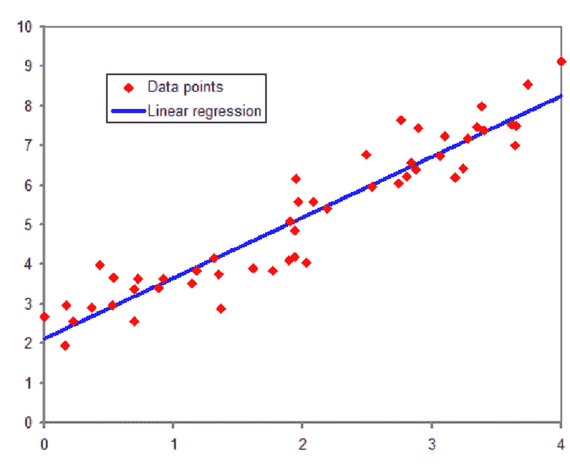
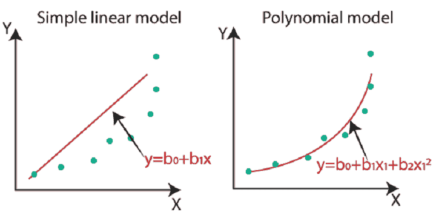
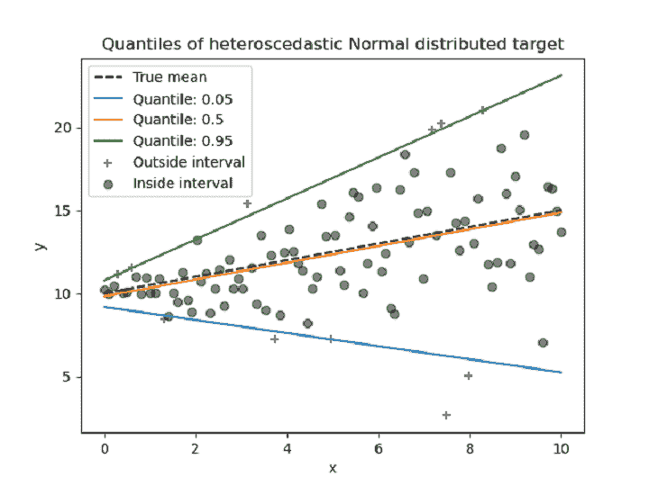
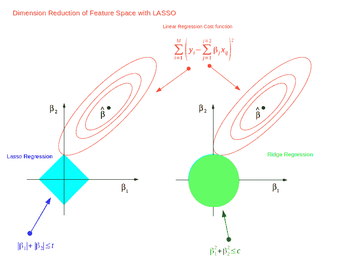
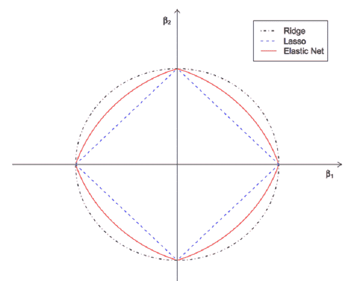
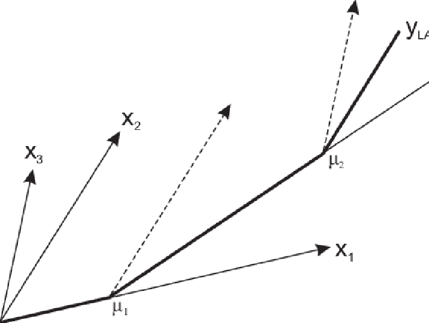
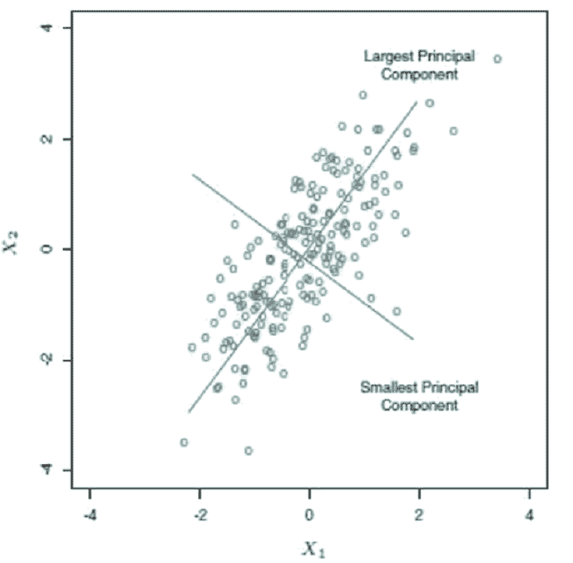
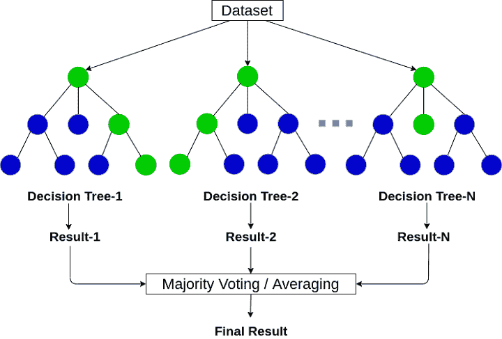
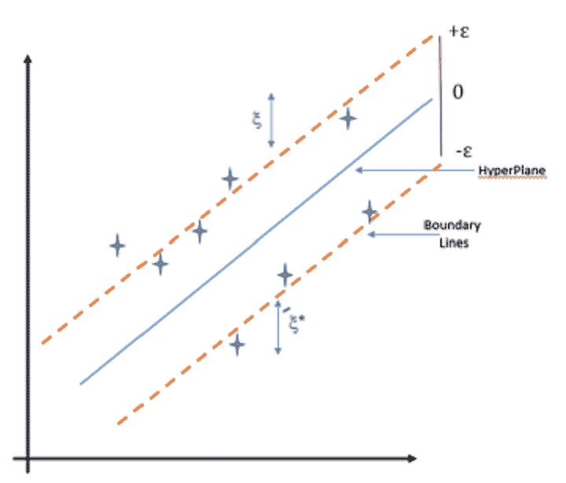

# 金融回归的异国风味——一瞥

> 原文：<https://blog.quantinsti.com/types-regression-finance/>

由 Vivek Krishnamoorthy 和 [Udisha Alok](https://www.linkedin.com/in/udisha-alok)

回归是一种挖掘因变量和自变量之间关系的技术。它通常出现在机器学习中，主要用于预测建模。在本系列的最后一部分，我们将扩展我们的范围，以涵盖其他类型的回归分析及其在金融中的应用。

我们探索:

*   [线性回归](#linear-regression)
*   [简单线性回归](#simple-linear-regression)
*   [多元线性回归](#multiple-linear-regression)
*   [多项式回归](#polynomial-regression)
*   [逻辑回归](#logistic-regression)
*   [分位数回归](#quantile-regression)
*   [岭回归](#ridge-regression)
*   [套索回归](#lasso-regression)
*   [岭回归和套索回归的比较](#comparison-between-ridge-regression-and-lasso-regression)
*   [弹性网回归](#elastic-net-regression)
*   [最小角度回归](#least-angle-regression)
*   [多元线性回归和主成分分析的比较](#comparison-between-multiple-linear-regression-and-pca)
*   [岭回归和主成分分析的比较](#comparison-between-ridge-regression-and-pca)
*   [主成分回归](#principal-components-regression)
*   [决策树回归](#decision-trees-regression)
*   [随机森林回归](#random-forest-regression)
*   [支持向量回归](#support-vector-regression)

* * *

之前我们已经非常详细地介绍了线性回归。我们探索了如何将[线性回归分析用于金融](/linear-regression/)，[将其应用于金融数据](/linear-regression-market-data-python-r/)，并查看其[假设和限制](/linear-regression-assumptions-limitations/)。一定要给他们读一读。

* * *

## 线性回归

我们已经在本系列前面的博客中详细介绍了线性回归。在进入更新的内容之前，我们在这里展示它的一个胶囊版本。如果您之前已经花了足够的时间来学习，可以跳过这一部分。

### 简单线性回归

简单的线性回归允许我们研究两个连续变量之间的关系——一个自变量和一个因变量。

<figure class="kg-card kg-image-card kg-width-full kg-card-hascaption">

<figcaption>Linear regression: [Source](https://upload.wikimedia.org/wikipedia/commons/b/be/Normdist_regression.png)</figcaption>

</figure>

简单线性回归方程的一般形式如下:

\(y_{i} = β_{0} + β_{1}X_{i} + ϵ_{i}\)                           - (1)

其中\(β_{0}\)是截距，\(β_{1}\)是斜率，\(ϵ_{i}\)是误差项。在这个等式中，y 是因变量，X 是自变量。误差项包含除回归变量之外影响因变量的所有其他因素。

### 多元线性回归

我们研究多元线性回归中两个以上变量之间的线性关系。这里不止一个自变量被用来预测因变量。

多元线性回归的方程可以写成:

\(y_{i} = β_{0} + β_{1}X_{i1} + β_{2}X_{i2} + β_{3}X_{i3} + ϵ_{i}\)                                   -(2)

其中，\(β{ 0 } \)、\(β{ 1 } \)、\(β{ 2 } \)和\(β{ 3 } \)是模型参数，\(ϵ_{i}\是误差项。

* * *

## 多项式回归

线性回归适用于建立因变量和自变量之间的线性关系模型。但是如果这种关系是非线性的呢？

在这种情况下，我们可以将多项式项添加到线性回归方程中，使其更好地模拟数据。这被称为多项式回归。由于模型的参数是线性的，严格来说，它仍然是线性回归。

<figure class="kg-card kg-image-card kg-width-full kg-card-hascaption">

<figcaption>Linear vs Polynomial regression: [Source](https://static.javatpoint.com/tutorial/machine-learniimg/machine-learning-polynomial-regression.png)</figcaption>

</figure>

使用多项式回归，我们可以用多项式方程的形式模拟自变量和因变量之间的关系。

\(k 次\)阶多项式的方程可以写成:

我是说，我的意思是，我的意思是，我的意思是，我的意思是，我的意思是，我的意思是，我的意思是，我的意思是，我的意思是，我的意思是，我的意思是，我的意思是，我的意思是，我的意思是，我的意思是，我的意思是，我的意思是，我的意思是，我的意思是，我的意思是，我的意思是，我的意思是，我的意思是，我的意思是-我不知道(三)

选择多项式阶是至关重要的，因为高阶多项式可能会使数据过拟合。因此，我们尽量保持多项式模型的阶数尽可能低。

有两种方法可以选择模型的阶数:

*   **正向选择程序，**我们以递增顺序连续拟合模型，并在每次迭代中测试系数的显著性，直到最高阶项的 t 检验不显著。
*   **反向消除程序，**从最高阶多项式开始，在每次迭代中连续降低阶数，直到最高阶项具有显著的 t 统计量。

最常用的多项式回归模型是一阶和二阶多项式。

当我们有大量的观察值时，多项式回归更适合。然而，它对异常值的存在很敏感。

多项式回归模型可用于预测股票价格等非线性数据。你可以在这里阅读更多关于多项式回归及其在预测股票价格中的应用。

* * *

## 逻辑回归

这也称为 logit 回归。逻辑回归是一种分析方法，根据过去的数据预测某一事件的二元结果。

当因变量是定性的且取二进制值时，称为二分变量。

如果我们使用线性回归来预测这样一个变量，它将产生 0 到 1 范围之外的值。此外，由于二分变量只能取两个值，因此残差不会正态分布在预测线周围。

逻辑回归是一种非线性模型，它生成的逻辑曲线的值限于 0 和 1。

将该概率与阈值 0.5 进行比较，以决定数据的最终分类。因此，如果一个类别的概率大于 0.5，则标记为 1，否则为 0。

逻辑回归在金融学中的一个用例就是可以用来[预测股票](https://ieeexplore.ieee.org/document/8328543)的表现。

你可以在这个[博客](/machine-learning-logistic-regression-python/)上阅读更多关于逻辑回归和 Python 代码如何使用它来预测股票走势的信息。

<figure class="kg-card kg-image-card kg-width-full kg-card-hascaption">

<figcaption>Logistic regression: [Source](https://www.saedsayad.com/logistic_regression.htm)</figcaption>

</figure>

* * *

## 分位数回归

正如我们在[上一篇博客](/linear-regression-assumptions-limitations/)中看到的，线性回归模型在处理金融时间序列数据时有几个局限性，比如在处理偏斜度和异常值时。

1978 年，Koenker 和 Bassett 提出分位数回归作为一种工具，允许我们探索整个数据分布。因此，我们可以在分布的不同部分检查自变量和因变量之间的关系，比如说，第 10 百分位、中间值、第 99 百分位等。

分位数回归估计给定自变量的因变量的条件中位数或条件四分位数。

<figure class="kg-card kg-image-card kg-width-full kg-card-hascaption">

<figcaption>Quantile regression: [Source](https://scikit-learn.org/stable/auto_examples/linear_model/plot_quantile_regression.html)</figcaption>

</figure>

经典的线性回归试图根据自变量的不同值来预测因变量的平均值。独立变量的 OLS 回归系数表示相关预测变量单位变化的变化。类似地，独立变量的分位数回归系数表示相关预测变量单位变化的指定分位数的变化。

分位数和百分位数用于将数据样本分成不同的组。线性回归模型基于误差呈正态分布的假设。

然而，这种方法可能会失败的情况下，我们有重大的离群值，也就是说，如果分布有一个厚尾。分位数回归在本质上比线性回归更稳健，能够有效地捕捉异常值。在这里你会了解到什么是[自协方差和自相关](/autocorrelation-autocovariance/)函数。

在分位数回归中，条件中位数函数由中位数估计量估计，这减少了绝对误差的总和。

分位数回归可以帮助风险管理者更好地管理尾部风险。因此，它被用于风险管理，尤其是在风险值( [VaR](/calculating-value-at-risk-in-excel-python/) )的上下文中，根据定义，风险值是一个条件分位数。

[VaR](http://www.jcic.org.tw/upload/download/7e0d92a1-1d70-48a7-8d21-fee5317e9ce3.pdf) 可以解释为一个投资组合在一段时间内以给定的概率损失的金额。我们还可以根据分位数回归来确定高风险暴露期。

分位数回归可以用来预测回报，也可以用来构建投资组合。

* * *

## 里脊回归

正如我们之前在中讨论的[，线性回归假设数据中没有多重共线性。因此，当预测变量相关时，这是不合适的。多重共线性会导致回归模型系数大幅波动。](/linear-regression-assumptions-limitations/)

岭回归适合在这种情况下使用。当预测变量的数量大于观测值的数量时，以及当每个预测变量都有助于预测因变量时，这种方法特别有用。

岭回归旨在通过限制系数的大小来减少标准误差。

它通过引入一个等价于系数幅度之和的罚项λ(𝜆)来做到这一点。Lambda 惩罚大的回归系数，并且随着 lambda 值的增加，惩罚也增加。因为它正则化系数，它也被称为 L2 正则化。

需要注意的重要一点是，虽然 OLS 估计量是尺度不变的，但岭回归却不是。因此，在应用岭回归之前，我们需要调整变量。

岭回归降低了模型的复杂性，但没有减少变量的数量，因为它可以将系数缩小到接近零，但不会使它们完全为零。因此，它不能用于特征选择。

你可以在这里阅读更多关于岭回归[。](https://online.stat.psu.edu/stat508/lesson/5/5.1)

* * *

## 套索回归

Lasso 代表最小绝对收缩和选择运算符。

它是岭回归的近亲，也用于正则化回归模型中的系数。当我们有大量使模型更复杂的预测变量时，进行正则化是为了避免过度拟合。

套索回归的惩罚项等于系数大小的绝对值。

套索回归也称为 L1 正则化。

顾名思义，[套索回归](https://www.statisticshowto.com/lasso-regression/)可以将一些系数缩小到绝对零。因此，它可用于特征选择。

<figure class="kg-card kg-image-card kg-width-full kg-card-hascaption">

<figcaption>Ridge vs Lasso regression: [Source](https://miro.medium.com/max/1400/1*Jd03Hyt2bpEv1r7UijLlpg.png)</figcaption>

</figure>

* * *

## 岭回归和套索回归的比较

岭回归和套索回归可以比较如下:

*   套索回归可用于特征选择，而岭回归则不能。
*   虽然岭回归和套索回归都能很好地处理数据中的多重共线性，但它们处理多重共线性的方式不同。岭回归缩小了所有相关变量的系数，使它们相似，而拉索回归保留了一个系数较大的相关变量，而其余的趋于零。
*   岭回归适用于有大量重要预测变量的情况。Lasso 回归在有许多预测变量，但只有少数显著变量的情况下是有效的。
*   这两个模型都可以用于股票预测。但是，由于 Lasso 回归执行要素选择，并且只选择非零系数来训练模型，因此在某些情况下它可能是更好的选择。你可以阅读这篇[论文](https://ieeexplore.ieee.org/document/9417935)了解更多关于使用套索回归进行股市分析的知识。

* * *

## 弹性净回归

Lasso 回归的要素选择可能不可靠，因为它依赖于数据。弹性网回归是岭回归和套索回归模型的组合。它结合了这两个模型中的惩罚项，通常表现得更好。

我们首先计算弹性网回归中的岭回归系数，然后使用套索回归缩小这些系数。

弹性网络回归可用于正则化以及特征选择。

阅读这个[博客](/linear-regression-models-scikit-learn/)了解更多关于山脊、套索和弹性网回归以及它们在 Python 中的实现。

<figure class="kg-card kg-image-card kg-width-full kg-card-hascaption">

<figcaption>Penalty terms for Ridge, Lasso, and Elastic net regression: [Source](https://www.oreilly.com/library/view/machine-learning-with/9781787121515/5c5ec380-d139-49a5-99b1-3ce32ae5bd6f.xhtml)</figcaption>

</figure>

* * *

## 最小角度回归

正如我们前面看到的，套索回归通过应用偏差来约束模型的系数，从而避免过度拟合。然而，我们需要为模型提供一个超参数λ(𝛌),它控制函数的惩罚的权重。

最小角度回归( [LARS](https://hastie.su.domains/Papers/LARS/LeastAngle_2002.pdf) )是解决线性回归模型中过度拟合问题的一种替代方法，它可以在不提供超参数的情况下进行调整以执行套索回归。

当我们有高维数据，即具有大量特征的数据时，就使用 LARS。类似于[正向逐步回归](https://www.statisticshowto.com/forward-selection/)。

在 LARS 中，我们从所有系数都等于零开始，找到与响应变量最相关的解释变量。然后，我们在这个解释变量的方向上尽可能迈出最大的一步，直到另一个解释变量与残差具有相似的相关性。

现在，LARS 在这两个解释变量之间以等角方向前进，直到出现第三个解释变量，其与残差具有相同的相关值。

如前所述，我们在这三个解释变量的方向上等角度(角度最小)前进。这样做，直到所有的解释变量都在模型中。

然而，必须指出，LARS 模型对噪声很敏感。

<figure class="kg-card kg-image-card kg-width-full kg-card-hascaption">

<figcaption>Geometric representation of LARS: [Source](https://www.researchgate.net/figure/LARS-algorithm-evolution-for-m-3-covariates_fig1_251670715)</figcaption>

</figure>

* * *

## 主成分回归

主成分分析用于以最少的信息损失简洁地表示数据。PCA 的目的是找到主成分，这些主成分是相互正交且具有最大方差的估计量的线性组合。如果两个主分量的向量的标量积等于零，则称这两个主分量是正交的。

主成分回归包括使用 PCA 对原始数据进行降维，然后对顶部的主成分进行回归并丢弃剩余的主成分。

<figure class="kg-card kg-image-card kg-width-full kg-card-hascaption">

<figcaption>Image representing principal component analysis: [Source](https://docs.tibco.com/pub/sfire-dsc/6.5.0/doc/html/TIB_sfire-dsc_user-guide/GUID-A0351860-D363-4236-BCCE-9B850BF41D8E-display.png)</figcaption>

</figure>

* * *

## 多元线性回归与主成分分析的比较

主成分回归是多元线性回归的替代方法，多元线性回归有一些主要缺点。

MLR 不能处理估计量之间的多重共线性，并且假设估计量被精确测量并且没有噪声。它不能处理丢失的值。

此外，如果我们有大量的估计，这是超过观察的数量，最大似然法不能使用。

PCA 用较少数量的主成分代替大量的估计量，这些主成分捕获估计量所代表的最大方差。它简化了模型的复杂性，同时保留了大部分信息。它还能够处理任何丢失的数据。

* * *

## 岭回归与主成分分析的比较

岭回归和主成分回归是类似的。从概念上讲，岭回归可以想象为将估计量投影到主成分的方向上，然后按照方差的比例缩小估计量。

这将缩小所有的主要组成部分，但不会完全缩小到零。然而，主成分分析有效地将一些主成分收缩到零(其被排除)，并且根本不收缩一些主成分。

* * *

## 决策树回归

[决策树](/use-decision-trees-machine-learning-predict-stock-movements/)在节点处将数据集分割成越来越小的子集，从而创建一个树状结构。根据标准拆分数据的每个节点称为内部/拆分节点，最后的子集称为终端/叶节点。

[决策树](https://quantra.quantinsti.com/course/decision-trees-analysis-trading-ernest-chan)可用于解决分类问题，如预测金融工具的价格会上涨还是下跌。它也可以用来[预测金融工具的价格](/decision-tree/)。

决策树回归是指使用决策树模型来执行回归任务，该任务用于预测连续值而不是离散值。

决策树遵循一种自上而下的贪婪方法，称为递归二进制分裂。这是一种贪婪的方法，因为在每一步，最好的分裂是在特定的节点上进行的，而不是向前看，选择一个可能导致未来更好的树的分裂。

每个节点被分裂以最大化信息增益。信息增益被定义为父节点的杂质和子节点的杂质之和的差。

**对于回归树，杂质的两种流行度量是:**

*   **最小二乘法:**选择每个分裂，使每个节点的观测值和平均值之间的残差平方和(RSS)最小。
*   **最小绝对偏差:**该方法最小化每个节点内与中位数的平均绝对偏差。这种方法对异常值更稳健，但在处理具有大量零值的数据集时可能不敏感。

如果解释变量和响应变量之间存在高度非线性和复杂的关系，决策树可能优于经典方法。

决策树更容易解释，有一个很好的可视化表示，可以很容易地处理定性预测，而不需要创建虚拟变量。

然而，与其他一些回归模型相比，它们不够稳健，预测精度也较差。此外，对于具有许多估计变量的数据集，它们容易过度拟合。

通过使用集成方法，如 bagging、boosting 和随机森林，我们可以提高决策树的预测性能。

* * *

## 随机森林回归

随机森林回归是一种集合回归方法，其性能明显优于单个决策树。这符合运用“群众智慧”的简单逻辑。它采用许多不同的决策树，以“随机”方式构建，然后让它们投票。

多重回归树建立在自举训练样本上，并且每次在树中考虑分裂时，从预测器的总数中选择预测器的随机样本。

这意味着当在随机森林中构建树时，算法甚至不允许考虑整个可用的预测器集。因此，如果我们有一个强预测器和一些中等强度的预测器，随机森林中的一些树将在不考虑强预测器的情况下构建，从而给其他预测器更好的机会。

这实质上就像在树之间引入一些去相关性，从而使结果更加可靠。

如果你想了解更多关于随机森林以及如何在交易中使用它们的信息，请阅读这篇[帖子](/random-forest-algorithm-in-python/)。

<figure class="kg-card kg-image-card kg-width-full kg-card-hascaption">

<figcaption>Image representation of a Random forest regressor: [Source](https://ai-pool.com/a/s/random-forests-understanding)</figcaption>

</figure>

* * *

## 支持向量回归

支持向量回归(SVR)应用[支持向量机](/support-vector-machines-introduction/) (SVM)的原理来预测离散数字。它试图找到包含最大数量数据点的超平面。你可以在这里了解更多关于支持向量机在交易[中的应用。](https://quantra.quantinsti.com/course/trading-machine-learning-classification-svm)

与试图最小化响应变量的预测值和实际值之间的误差的其他回归算法不同，SVR 试图在用于创建一对边界线的容限(ε)内拟合超平面。

SVR 使用不同的数学函数(核)来转换输入数据，这些数据用于在高维空间中寻找超平面。一些核是线性的、非线性的、多项式的等等。要使用的内核类型基于数据集。

SVR 使用对称损失函数来惩罚较高和较低的错误估计。SVR 模型的复杂性使得它很难在大型数据集上使用。因此，如果我们正在处理一个大的数据集，就使用线性核函数。

SVR 对异常值具有鲁棒性，并且具有高预测精度。你可以在这里阅读更多关于使用 SVR、线性和多项式回归模型进行股市预测的信息[。](http://www.lucasnunno.com/assets/docs/ml_paper.pdf)

<figure class="kg-card kg-image-card kg-width-full kg-card-hascaption">

<figcaption>Image representation of Support vector regression: [Source](https://www.educba.com/support-vector-regression/)</figcaption>

</figure>

* * *

### 参考

1.  计量经济学举例-达摩达尔古吉拉特语
2.  金融计量经济学基础——Frank j . fabo zzi，Sergio M. Focardi，Svetlozar T. Rachev，Bala G. Arshanapalli
3.  计量经济学数据科学-弗朗西斯·x·迪堡
4.  统计学习导论

* * *

### 结论

在这篇博客中，我们已经讨论了金融领域中使用的一些重要的回归类型。每一种都有自己的优势，也许还会有一些挑战。

我们希望您喜欢阅读这些内容，并继续尝试其中的一些来实现您的想法。

在行业专家的正确培训和指导下，你可以学习它以及统计学和计量经济学、金融计算和技术、算法和量化交易。这些以及算法交易的各个方面都包含在这个[算法交易课程](https://www.quantinsti.com/epat)中。EPAT 教你在算法交易中建立一个有前途的职业所需的技能。一定要去看看。

下次见！

* * *

*<small>免责声明:股票市场的所有投资和交易都涉及风险。在金融市场进行交易的任何决定，包括股票或期权或其他金融工具的交易，都是个人决定，只能在彻底研究后做出，包括个人风险和财务评估以及在您认为必要的范围内寻求专业帮助。本文提到的交易策略或相关信息仅供参考。</small>T3】*